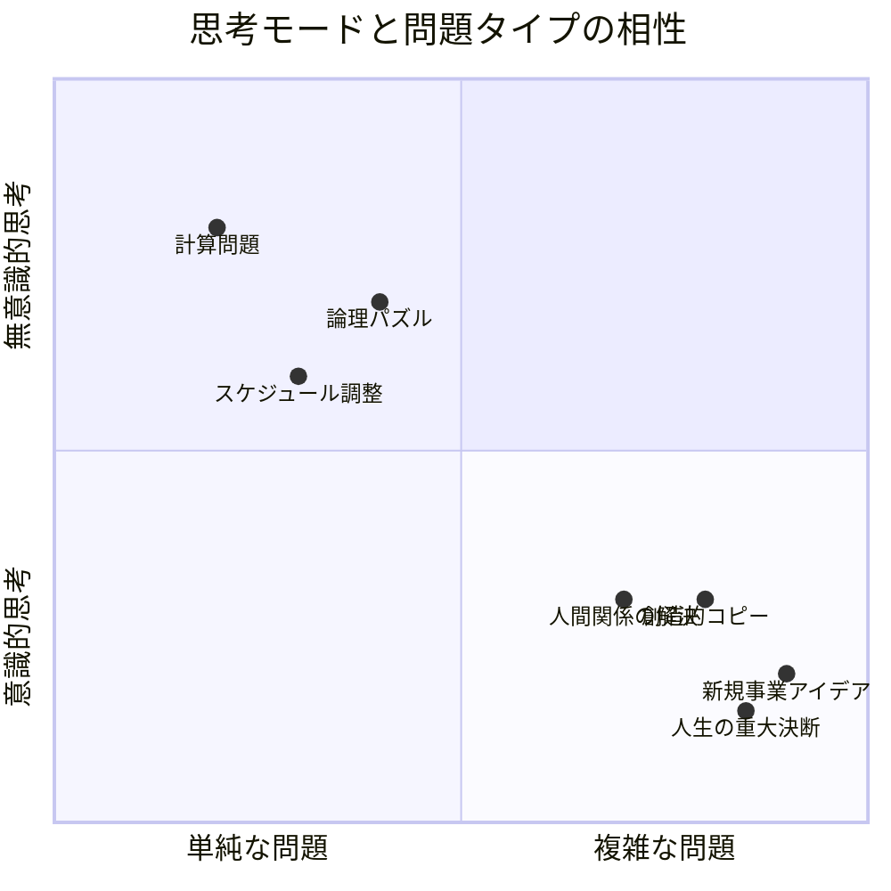
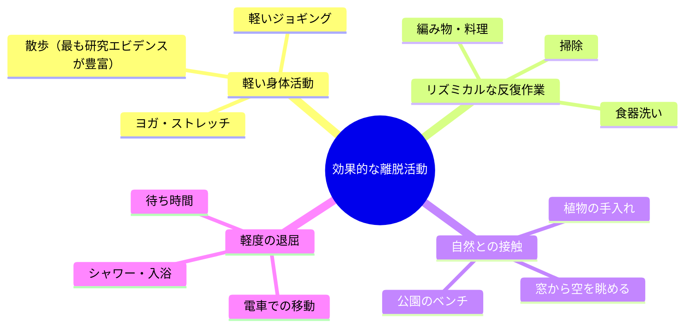

金曜日の夜23時。広告代理店のコピーライター・藤井あかり（33歳）は、オフィスに一人残っていた。月曜朝のプレゼンに向けて、新商品のキャッチコピーを考え続けて8時間。ホワイトボードには127個のボツ案。頭はぼんやりして、目の前の文字がぼやけてくる。「もう一回、あと一回だけ考えよう」と自分に言い聞かせた。翌朝、疲労困憊で散歩に出た。信号待ちの交差点で、ふと目に入った花屋の看板。その瞬間、完璧なコピーが降りてきた。8時間の苦闘で出なかった答えが、考えるのをやめた15分後に現れた。

## 「考えるのをやめる」ことで答えが見つかる科学的理由

なぜ8時間考えて出なかった答えが、離れた瞬間に浮かぶのか。それは脳に「意識的処理」と「無意識的処理」という2つのモードがあるからです。



意識的な思考は**論理的で直線的**ですが、一度に処理できる情報量に限界があります（ワーキングメモリは7±2チャンク）。複雑な問題ほど、この限界にぶつかります。

一方、無意識的な処理は**並列的で連想的**。問題から離れている間も、脳はバックグラウンドで膨大な情報の組み合わせを試しています。これが「インキュベーション効果」です。

### インキュベーション効果の研究データ

- **シアン&ロイのメタ分析（2004年）**: 117件の研究を統合。インキュベーション期間を置いたグループは、休憩なしで取り組み続けたグループに比べて、創造的問題解決のスコアが平均**12%高い**
- **ディクステルハウスの実験（2004年）**: 複雑な選択（車の購入など8つ以上の変数がある判断）において、「意識的に考えたグループ」より「別のタスクで気を逸らされたグループ」の方が**最適な選択をする率が60%高い**
- **ベアードら（2012年）**: インキュベーション中に「退屈な作業」をしていたグループが最もアイデアの質が高く、**創造性スコアが40%向上**

## インキュベーションの4フェーズ

フランスの数学者アンリ・ポアンカレが1908年に提唱し、現在も使われている創造的思考のフェーズモデルです。

```mermaid
timeline
    title インキュベーションの4フェーズ
    section Phase 1: 準備（Preparation）
        問題を定義する: 情報を徹底的に集める
        試行錯誤する: あらゆる角度から考える
        行き詰まる: ここまでが必須
    section Phase 2: 孵化（Incubation）
        意識的に離れる: 別の活動をする
        無意識が働く: 脳がバックグラウンドで処理
    section Phase 3: 閃き（Illumination）
        突然のアハ体験: 散歩中・入浴中・起床時
        答えが浮かぶ: 完成形に近い状態で出現
    section Phase 4: 検証（Verification）
        閃きを検証する: 論理的に整合性を確認
        磨き上げる: 実用レベルに仕上げる
```

重要なのは**Phase 1（準備）を十分にやること**です。「何も考えずに寝かせる」のではなく、「考え尽くしてから寝かせる」。無意識が材料なしにアイデアを生むことはありません。

## ケーススタディ1：コピーライターの「寝かせる技術」

**人物**: 藤井あかり（33歳・コピーライター）

**Before**: 冒頭のエピソードの藤井。締め切りに追われ、デスクに張り付いて考え続けるスタイル。徹夜が月に3〜4回。にもかかわらず、クリエイティブディレクターからは「あかりの案、最近パンチがないな」と言われていた。作業時間は長いのに、アウトプットの質が低下していた。

コーチ:「藤井さん、最高のコピーが浮かんだ瞬間って、いつが多いですか？」
藤井:「...デスクの前じゃないですね。散歩中とか、お風呂とか」
コーチ:「つまり、8時間デスクで考える時間の大半は、実は準備フェーズ。閃きは別の場所で起きてる」
藤井:「え、じゃあ私、8時間ずっと準備してたってこと？」

**実践したこと**:
1. **集中→離脱→キャッチのサイクル化**: 4時間集中的にリサーチ・試行錯誤 → 1時間の散歩（完全に別のことを考える）→ 戻ってきてアイデアを書き出す
2. **「寝かせるリスト」の導入**: 行き詰まった案件を書き出し、「今日は寝かせる」と意識的に決定
3. **メモの携帯**: 防水メモを風呂場に、メモ帳を枕元に常備

**After（3ヶ月後）**:
- 徹夜: 月3〜4回 → 月0〜1回
- コピーの採用率: 23% → 47%（社内コンペ）
- クリエイティブディレクター: 「最近のあかり、切れ味が戻ったな。いや、前より良い」
- 本人: 「頑張る量を減らしたのに、質は上がった。離れる勇気が大事だった」

## ケーススタディ2：経営判断を「寝かせる」CEO

**人物**: 黒田正志（52歳・IT企業CEO、従業員120名）

**Before**: 重要な経営判断をその日のうちに下すスタイル。「スピードが命」が信条。しかし過去1年で、急いで下した判断が3件裏目に出て、合計4,200万円の損失。

コーチ:「黒田さん、その3つの判断、もし24時間待っていたらどうなっていましたか？」
黒田:「...たぶん、違う判断をしていた。焦ってたのは自分だけで、実際は1日2日の遅れは何の問題もなかった」

**実践したこと**:
- **1,000万円ルール**: 影響額が1,000万円を超える判断は、必ず「1晩寝かせる」
- **判断ジャーナル**: 重要な判断を下す前に、根拠と懸念点を書き出す。翌朝、同じ内容を読み返して最終判断
- **散歩ミーティング**: 重要な議題は会議室ではなく、近くの公園を歩きながら議論

**After（6ヶ月後）**:
- 重大な判断ミス: 3件/年 → 0件
- 判断の撤回率: 15% → 3%
- 黒田自身: 「速さよりも、判断の質。1日寝かせるだけで、見えてなかったリスクが見える。これは時間の投資だった」

## ケーススタディ3：エンジニアの「バグが解けない」問題

**人物**: 山田健一（29歳・バックエンドエンジニア）

**Before**: 複雑なバグに遭遇すると、解決するまで帰らないタイプ。最長記録は14時間連続デバッグ。チームからは「根性あるね」と言われていたが、本人は疲弊。しかもバグの平均解決時間はチーム内で最も遅かった。

先輩エンジニア:「山田、もう今日は帰れよ。明日の朝やった方が早く解ける」
山田:「いや、あと少しで分かりそうなんです」
先輩:「その『あと少し』、3時間前から言ってるぞ」

**実践したこと**:
- **90分ルール**: バグに90分取り組んで解決しなければ、問題の状態をメモに書き出して帰宅
- **朝の15分**: 翌朝出社直後の15分間で、昨日のメモを読み返して再挑戦
- **ラバーダック法+寝かせる**: 問題をぬいぐるみに説明してから帰宅。翌朝、説明した内容を振り返る

**After（2ヶ月後）**:
- バグの平均解決時間: 6.2時間 → 2.8時間
- 「翌朝15分で解けた」ケースが全体の42%
- 残業時間: 月平均45時間 → 18時間
- 山田自身: 「一番の学びは、『離れる＝サボり』じゃないってこと。脳は離れてる間も働いてくれてる」

## インキュベーションを最大化する「離脱活動」の選び方

すべての「離れる活動」が等しく効果的なわけではありません。研究によると、以下の特性を持つ活動がインキュベーションに最も効果的です。



**避けるべき活動**: SNS閲覧、動画視聴、別の複雑な問題に取り組むこと。これらは無意識の処理を邪魔し、インキュベーション効果を打ち消します。

## 今日から始められる4つの実践

**実践1: 「寝かせるリスト」を作る**

現在抱えている問題を書き出し、「今すぐ考えるもの」と「寝かせるもの」に分類します。寝かせると決めたものは、意識的に離れます。

**実践2: 「90分→離脱→15分」サイクル**

集中して問題に取り組む（90分） → 完全に別のことをする（30分〜数時間） → 戻ってきて再挑戦（15分）。このサイクルを1日2回まわすだけで、生産性が大きく変わります。

**実践3: 「閃きキャッチキット」を常備**

枕元にメモ帳とペン。風呂場に防水メモ。散歩にはスマホの音声メモ。閃きは予告なくやってくるため、常に「キャッチする準備」をしておくことが重要です。

**実践4: 重要な判断は「1晩ルール」**

影響の大きい判断は、必ず1晩寝かせてから最終決定します。急いでいると感じたときこそ、このルールが効果を発揮します。

## 関連記事

- [ディープワークで集中力を最大化する](/blog/deep-work) ― インキュベーション前の「準備フェーズ」の質を高める方法
- [朝のルーティンで1日を設計する](/blog/morning-routine) ― インキュベーション後の「閃きキャッチ」に最適な朝の使い方
- [決断疲れを防ぐ技術](/blog/decision-fatigue) ― 判断を寝かせるべきタイミングの見極め方

---

## 「考えすぎ」のパターンを一緒に見直しませんか？

「もっと考えなきゃ」と自分を追い込んでいませんか？実は、離れる勇気を持つことが、最も効率的な問題解決法かもしれません。

**体験セッション（無料）**では、あなたの仕事や日常の中で「寝かせるべき問題」と「今すぐ考えるべき問題」を一緒に仕分けします。藤井さんのように「頑張る量を減らしたのに質が上がった」という体験を、ぜひ味わってみてください。

[→ 体験セッションに申し込む](/sessions)
