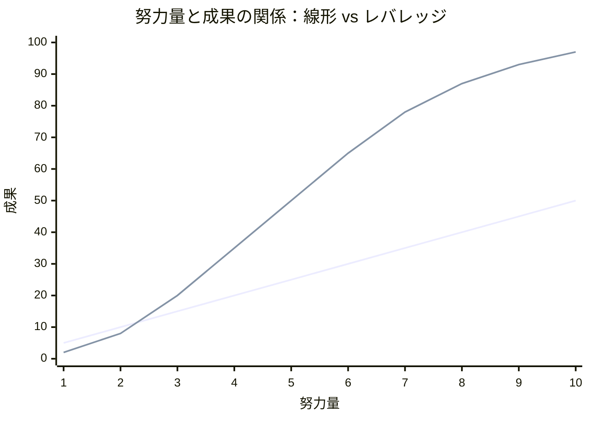
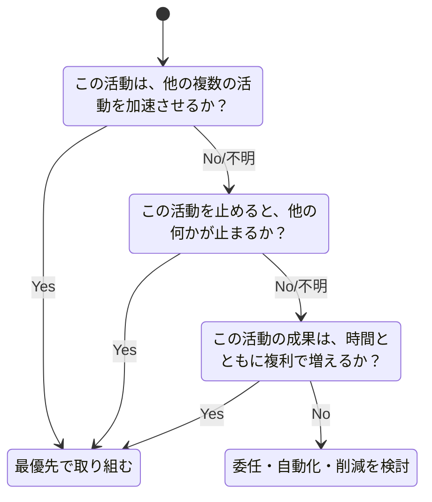
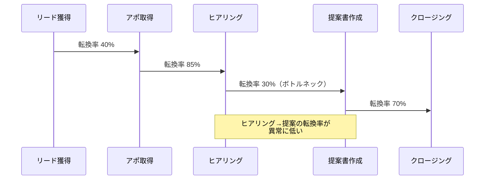
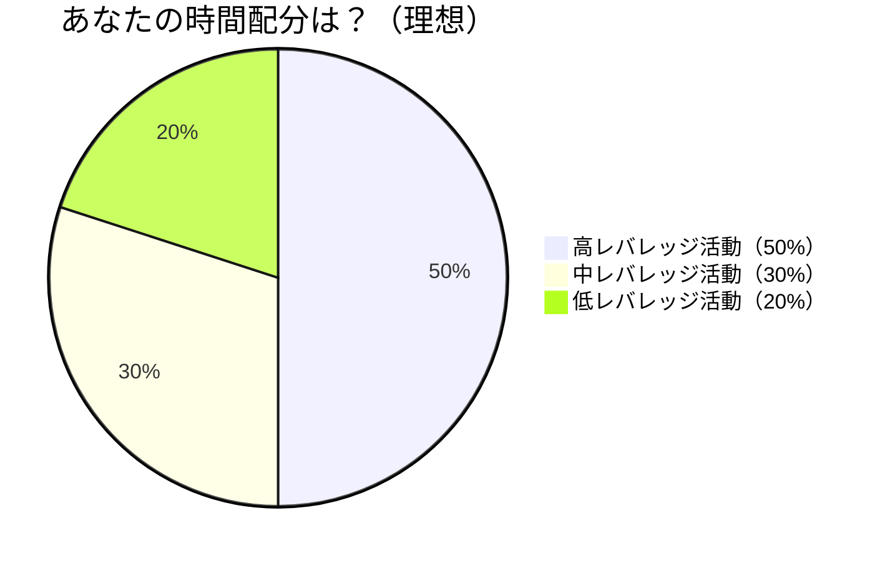

毎日12時間働き、休日もメール対応。それなのに部長から「成果が見えない」と言われ続ける――伊藤裕也（38歳・事業企画部）は限界だった。ある日、隣の部署の後藤さん（34歳）が定時で帰るのを見かけた。しかも後藤さんの部署は全社で成果トップ。「後藤さん、いつも定時で帰ってますよね。忙しくないんですか？」と聞くと、彼女は笑ってこう言った。「忙しいですよ。でも、10の仕事のうち8つはやらないと決めてるんです。」

## 「もっと頑張る」が最悪の戦略である理由

多くの人は成果が出ないとき、「もっと頑張ろう」と考えます。しかし、レバレッジ思考の観点からは、これは最悪の戦略です。

「もっと頑張る」は努力と成果が線形の関係です。2倍頑張れば2倍の成果。しかし時間は有限なので、すぐに限界に達します。

一方、レバレッジ思考は**力を入れる場所を厳選する**ことで、少ない努力で大きな成果を生み出します。これがパレートの法則（80/20の法則）の本質です。

### パレートの法則の実例

- セールス: 顧客の**20%**が売上の**80%**を生んでいる
- ソフトウェア: ユーザーの**80%**は機能の**20%**しか使っていない
- 時間管理: 1日の作業の**20%**が成果の**80%**に貢献している
- 人間関係: **20%**の深い関係が幸福感の**80%**を支えている

## レバレッジポイントを見つける3つの問い

高レバレッジな活動を特定するための3つの問いを紹介します。

**問い1: 他の複数の活動を加速させるか？**
例: チームメンバーのスキルを育成する → そのメンバーが担当する全プロジェクトが加速する

**問い2: 止めると他が止まるか（ボトルネック）？**
例: 承認プロセスが遅い → 後続の5つのタスクが全て止まっている

**問い3: 時間とともに複利で増えるか？**
例: 業務マニュアルを整備する → 新人が来るたびに効果が発揮される。10人に教えるのが1回の労力で済む

## ケーススタディ1：12時間労働から定時退社へ

**人物**: 伊藤裕也（38歳・事業企画部）

**Before**: 毎日12時間勤務。業務内容を書き出してもらうと以下の通り。

| 活動 | 時間/週 | 成果への貢献度 |
|------|---------|-------------|
| メール対応 | 15時間 | 5% |
| 定例会議への参加 | 12時間 | 8% |
| 資料作成（既存フォーマット）| 10時間 | 7% |
| 上層部への戦略提案 | 3時間 | 45% |
| 他部署との連携設計 | 2時間 | 25% |
| その他 | 18時間 | 10% |

コーチ:「伊藤さん、成果の70%を生んでいる活動に、週何時間使っていますか？」
伊藤:「...5時間です。60時間のうちの5時間」
コーチ:「残りの55時間は？」
伊藤:「成果の30%のために55時間...ですね」

**実践したこと**:
1. **メール対応**: 1日3回の一括処理に変更（15時間→5時間/週）
2. **定例会議**: 出席必須のものだけ参加、残りは議事録で確認（12時間→4時間/週）
3. **資料作成**: テンプレート化し、一部を後輩に委任（10時間→3時間/週）
4. **戦略提案**: 空いた時間を全てここに投入（3時間→15時間/週）
5. **他部署連携**: キーパーソンとの1on1ランチを週2回に増加（2時間→5時間/週）

**After（3ヶ月後）**:
- 労働時間: 60時間/週 → 42時間/週
- 戦略提案の採用数: 年2件 → 四半期3件
- 部長からの評価: 「成果が見えない」→「最近の伊藤は違う。視座が上がった」
- 本人: 「頑張り方を変えただけ。やることを減らして、やるべきことに集中した」

## ケーススタディ2：売上が伸びない営業チームの「ボトルネック解消」

**人物**: 佐野恵子（40歳・営業部マネージャー、チーム8名）

**Before**: チームの売上が3四半期連続で目標未達。佐野は「もっと訪問件数を増やせ」と指示していた。しかし訪問件数は増えているのに、成約率は下がり続けていた。

コーチ:「佐野さん、チームの営業プロセスを流れ図にしてみましょう」

コーチ:「訪問件数を2倍にするより、ヒアリングから提案への転換率を30%→60%にする方が、最終成約数は2倍になりませんか？」
佐野:「...確かに。しかもそのほうが、訪問件数を増やすより現実的ですね」

**実践したこと**:
- ボトルネック分析: ヒアリング→提案の転換率が低い原因は「ヒアリングの質」だった
- 「3つの質問テンプレート」を開発: ヒアリングで必ず聞く質問を標準化
- ロールプレイ研修: 週1回30分、ヒアリングスキルの練習

**After（2四半期後）**:
- ヒアリング→提案の転換率: 30% → 58%
- チーム売上: 目標比92% → 目標比127%
- 訪問件数: 実は10%減少（移動時間をヒアリング準備に充てた）
- 佐野: 「『もっとやれ』じゃなくて『どこを直すか』。たった1つのボトルネックを直しただけで、チーム全体が変わった」

## ケーススタディ3：個人の成長にレバレッジをかける

**人物**: 川島翔平（26歳・Webエンジニア）

**Before**: 技術力を上げるために毎日2時間、技術書を読んでいた。しかし半年経っても、仕事での評価は変わらない。

コーチ:「翔平さん、読んだ本の内容を、仕事で使った割合はどのくらいですか？」
川島:「うーん...10%もないかも」
コーチ:「では、仕事で一番困っていることは何ですか？」
川島:「コードレビューで指摘されることが多くて...設計の考え方が弱いみたいです」

**分析**: 川島の読書は「興味のある技術」に偏っており、「今の仕事で最も成果に直結するスキル」には向かっていなかった。

**実践したこと**:
- 読書時間の再配分: 興味ベース（2時間）→ 課題ベース（1時間、設計パターンに集中）+ 興味ベース（30分）
- 学んだことの即実践: 週1回、学んだ設計パターンを実際のコードに適用してプルリクエスト
- メンターの活用: 月2回、シニアエンジニアに設計レビューを依頼

**After（4ヶ月後）**:
- コードレビューの指摘数: 平均8件/PR → 2件/PR
- 設計力の評価: チーム内5段階で2 → 4
- 学習時間: 2時間/日 → 1.5時間/日（減少しているのに成長が加速）
- 川島: 「同じ勉強時間でも、『何を学ぶか』で成長速度がこんなに変わるとは思わなかった」

## レバレッジ診断：あなたの活動を仕分ける

今週の活動を以下のフレームワークで仕分けてみましょう。

### 仕分けの基準

**高レバレッジ（時間の50%を目標に）**:
- 戦略立案、重要な意思決定
- 人材育成、メンタリング
- システム・仕組みの構築
- キーパーソンとの関係構築
- 自分の最も価値あるスキルを使う仕事

**中レバレッジ（30%）**:
- チーム内コミュニケーション
- 顧客対応（重要度中）
- 学習・スキルアップ
- プロジェクト管理

**低レバレッジ（20%以下に抑制）**:
- 定型的な事務作業
- 形式的な会議への参加
- すぐに返答が必要でないメール対応
- 自分以外でもできる作業

## 今日から始められる4つの実践

**実践1: 活動棚卸し（15分）**

今週の活動を全て書き出し、「高・中・低」レバレッジに分類。高レバレッジに何%の時間を使っているか計算する。多くの人は20%以下という衝撃的な結果になります。

**実践2: 「やらないリスト」を作る**

低レバレッジ活動の中から、今週「やらない」「委任する」「自動化する」ものを3つ決める。[「Not To Doリスト」の作り方](/blog/not-to-do-list)も参考にしてください。

**実践3: 朝の「ゴールデンタイム」を守る**

1日の最初の90分を、最も高レバレッジな活動に充てる。メール確認は後回し。[ディープワーク](/blog/deep-work)の時間として確保します。

**実践4: 週1回の「レバレッジレビュー」**

毎週金曜日の退勤前に5分間、「今週、最もレバレッジが高かった活動は何か？来週、その時間を増やすには？」と自問する。

## 関連記事

- [Not To Doリスト：やらないことを決める力](/blog/not-to-do-list) ― 低レバレッジ活動を特定して手放す具体的な方法
- [ディープワークで集中力を最大化する](/blog/deep-work) ― 高レバレッジ活動に没入するための環境設計
- [第一原理思考で本質を見抜く](/blog/first-principles-thinking) ― そもそも何がレバレッジポイントなのかを見極める思考法

---

## あなたの「レバレッジポイント」を一緒に見つけませんか？

「忙しいのに成果が出ない」は、努力が足りないのではなく、力を入れる場所がズレているサインです。伊藤さんのように、週60時間が42時間になりながら成果が倍増するという変化は、レバレッジポイントを見つければ誰にでも起こりえます。

**体験セッション（無料）**では、あなたの現在の活動を一緒に棚卸しし、「最も少ない変更で最大の成果を生むポイント」を特定します。同じ時間を使うなら、10倍の成果を生む使い方を一緒に設計しましょう。

[→ 体験セッションに申し込む](/sessions)
