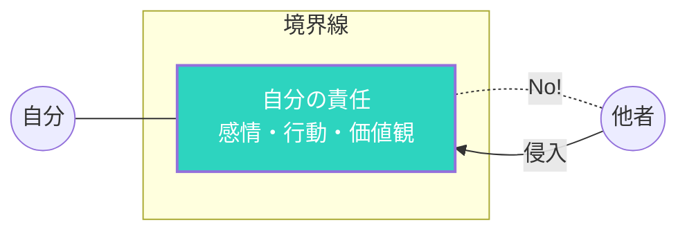

## 境界線がないとどうなるか

人からの頼みを断れない。
他人の問題を自分の問題として抱え込む。
自分の時間がなくなる。

境界線がないと、自分が消耗します。

## 境界線とは

自分と他者の間に引く、見えない線。
ここまでは責任を持つ、ここからは持たない、という区切り。

### 健全な境界線

## 境界線の種類

### 時間の境界線

仕事は何時まで、週末は働かない、など。

### 感情の境界線

他人の感情に巻き込まれすぎない。心理的な距離を保つ。

### 物理的な境界線

パーソナルスペース。自分の持ち物。

### 精神的な境界線

自分の価値観、信念を守る。他人の意見に流されすぎない。

## 境界線を引けない理由

### 1. 嫌われたくない

断ると嫌われる、という恐れ。

### 2. 罪悪感

他人を助けないのは悪いこと、と感じる。

### 3. 自己価値が低い

自分のニーズより他人のニーズを優先する癖。

### 4. 習慣

子どもの頃から境界線を引くことを教わらなかった。

## 健全な境界線の引き方

### 1. 自分のニーズを知る

何が自分にとって大切か、何が負担かを認識する。

### 2. 小さく始める

いきなり大きな境界線は難しい。
小さな「NO」から始める。

### 3. 明確に伝える

曖昧にせず、はっきり伝える。
「今日は無理です」「それは私の責任ではありません」

### 4. 一貫性を保つ

決めた境界線を守る。
例外を作りすぎると、境界線が意味をなさなくなる。

### 5. 罪悪感を受け入れる

最初は罪悪感を感じるかもしれない。
それでも、長期的には健全。

## 境界線は愛の表現

健全な境界線があるからこそ、本当の意味で人を助けられます。
自分を守ることは、周囲との良好な関係を維持することにもつながります。

今週、一つだけ「NO」と言ってみてください。
