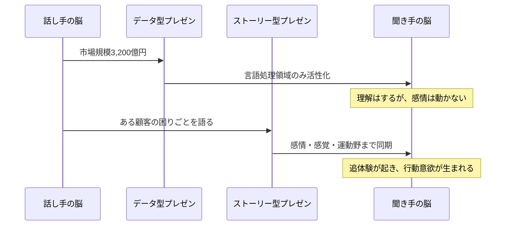
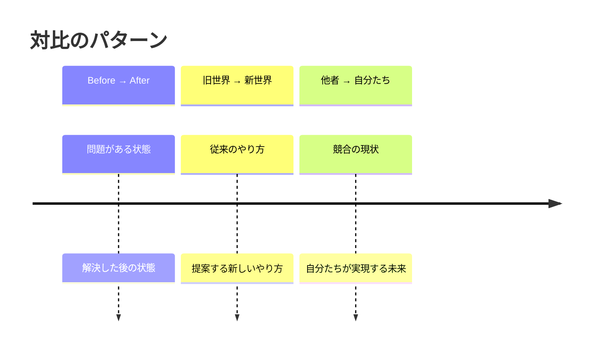

「データは完璧です。市場規模3,200億円。年成長率12%。競合分析も済み。ROIは18ヶ月で回収。」中西隆（37歳・新規事業開発部）は、50ページの資料で経営会議に臨んだ。プレゼン後、役員たちの反応は薄かった。社長がひとこと。「中西くん、数字はわかった。で、なんでこれをウチがやるの？」――中西のプレゼンに欠けていたのは、データでも論理でもなく、「物語」だった。

## なぜデータだけでは人が動かないのか

プリンストン大学のウリ・ハッソンの研究（2010年）によると、データや事実の羅列を聞いているとき、聴衆の脳では「言語処理領域」だけが活性化します。しかし物語を聞いているとき、聴衆の脳は語り手の脳と**同期（ニューラルカップリング）**を起こし、感情、運動野、感覚野まで広範に活性化します。



### 数字で見るストーリーの力

- スタンフォード大学の実験: プレゼン後の記憶定着率は、データのみだと**5〜10%**、ストーリー付きだと**65〜70%**
- チャリティの寄付実験: 「マラリアで毎年300万人が死亡」という統計より、「7歳のロキアという少女の話」の方が寄付額が**2.1倍**
- 企業のプレゼン調査: ストーリーを含むプレゼンは、データのみのプレゼンに比べて意思決定者の承認率が**35%高い**

## ストーリーの基本構造「SCRS」

効果的なストーリーには普遍的な構造があります。ビジネスの文脈で使いやすくカスタマイズしたのが「SCRS」フレームワークです。

```mermaid
journey
    title SCRSフレームワーク
    section S: Situation（現状）
        聞き手が共感できる状況を描写する: 3
    section C: Complication（葛藤）
        なぜ今のままではダメなのかを示す: 1
    section R: Resolution（解決）
        どうすれば乗り越えられるかを提示: 4
    section S: Success（成功の姿）
        実現した未来の具体的な絵を見せる: 5
```

**S（Situation）**: 聞き手が「あるある」と感じる現状の描写。「私たちの部署では...」「お客様は今...」

**C（Complication）**: 現状の何が問題なのか。このままだとどうなるか。**感情を動かすのはここ**。

**R（Resolution）**: 解決策の提示。ここでデータと論理が初めて活きる。ストーリーの文脈の中にデータを位置づける。

**S（Success）**: 解決した後の具体的な姿。誰が、どこで、どんな表情をしているか。未来のシーンを鮮明に描く。

## ケーススタディ1：データ完璧なのに予算が通らない

**人物**: 中西隆（37歳・新規事業開発部）

**Before**: 冒頭のエピソードの中西。50ページのデータ資料で3回連続、新規事業の予算申請が却下。「なぜ通らないのか分からない。数字は正しいのに」

コーチ:「中西さん、前回のプレゼン、最初の1分間で何を話しましたか？」
中西:「市場規模と成長率です」
コーチ:「聞いている役員は、その数字を聞いて何を感じたと思いますか？」
中西:「...わからないです。正直、興味なさそうでした」
コーチ:「では質問を変えます。この事業をやりたいと思ったきっかけは何ですか？」
中西:「実は去年、既存のお客さんで...小さな飲食店の店主の佐々木さんなんですけど、うちのサービスじゃ対応できない課題を抱えてて。力になれなくて悔しかったんです」
コーチ:「そこからプレゼンを始めてください」

**書き換えたプレゼンの冒頭**:

> 「去年の9月、既存顧客の佐々木さんという飲食店のオーナーから、こんな電話をいただきました。『御社のサービスで、予約管理と在庫管理を一緒にできませんか？2つのシステムを行き来するのが限界で、先月ミスが続いて常連さんに迷惑をかけてしまった。』
>
> 佐々木さんだけの問題かと思いましたが、調べてみると同じ悩みを持つ中小飲食店が全国に42万店舗ありました。この人たちの問題を解決する――それが今日ご提案する事業です。」

**After**: 4回目の申請で予算が通った。

役員の反応: 「前の3回は何を言いたいのか分からなかった。今回は、なぜウチがやるべきかが一発で分かった」

中西:「データは同じ。変えたのは、最初の1分だけ。佐々木さんの話をしただけで、役員の目の色が変わった」

## ケーススタディ2：チームのモチベーションが上がらないマネージャー

**人物**: 長谷川由美（44歳・カスタマーサポート部マネージャー、チーム15名）

**Before**: チームの離職率が高く、満足度調査でも「仕事にやりがいを感じない」が67%。長谷川は月次ミーティングで「KPI達成率」「対応件数」「平均対応時間」の数字を共有していた。チームの反応は「また数字の話か」。

コーチ:「長谷川さん、チームメンバーに『なぜこの仕事をしているか』聞いたことはありますか？」
長谷川:「...ないですね。KPIが仕事だと思ってたので」

**実践したこと**: 月次ミーティングの冒頭5分を「カスタマーストーリータイム」に変更。

毎月、1人の顧客の「Before → After」のストーリーを紹介する。

> 「今月の主人公は、70歳の田口さんです。初めてパソコンを買って、設定が分からず3回お電話をくださいました。3回目のとき、対応してくれたのは鈴木さん。1時間かけて丁寧に設定を案内しました。その後、田口さんからお手紙が届きました。『孫とビデオ通話ができるようになりました。鈴木さんのおかげで、遠くにいる孫の顔が毎日見られます。ありがとう。』」

**After（6ヶ月後）**:
- 「やりがいを感じない」の回答: 67% → 23%
- チーム離職率: 年40% → 年12%
- 顧客満足度スコア: 3.8 → 4.5（5段階）
- 鈴木さん（電話対応者）: 「自分の仕事の意味が初めて分かった。数字では見えなかったものが見えた」

## ケーススタディ3：面接で自分を語れないエンジニア

**人物**: 西田慎吾（30歳・バックエンドエンジニア、転職活動中）

**Before**: 技術力は高いが、面接で落ち続けている。3社連続で「技術は問題ないが、なぜうちに来たいのかが伝わらなかった」とフィードバック。

面接での自己紹介:
> 「Java歴5年、Python歴3年、AWS認定資格を持っています。直近のプロジェクトでは、マイクロサービスアーキテクチャへの移行を担当しました。」

コーチ:「西田さん、なぜエンジニアになったんですか？」
西田:「高校のとき、田舎の祖母がスマホの使い方が分からなくて。ガラケーに戻そうとしてたんです。それで僕が週末に帰省するたびに教えてたんですけど、もっと簡単に使える仕組みがあればいいのにって思って。テクノロジーで人の不便をなくしたいと思ったのがきっかけです」
コーチ:「それ、面接で話してください」

**書き換えた自己紹介**:

> 「エンジニアになったきっかけは、田舎の祖母がスマホを諦めそうになったことです。テクノロジーは進歩しているのに、本当に必要な人に届いていない。その課題を解決したくてこの道に進みました。直近では、レガシーシステムをマイクロサービスに移行するプロジェクトで、エンドユーザーのレスポンス時間を3秒から0.4秒に短縮しました。御社の『テクノロジーを全ての人に』というミッションは、私がエンジニアを志したときの原点と同じです。」

**After**: 次の面接で内定。面接官からは「技術だけじゃなく、なぜエンジニアをやっているかが伝わった。一緒に働きたいと思った」とフィードバック。

## ストーリーの力を引き出す4つの技法

### 技法1: 「一人の人物」から始める

「42万店舗の飲食店」ではなく「佐々木さんという飲食店オーナー」から始める。一人の具体的な人物に焦点を当てることで、聞き手の共感回路が起動します。

### 技法2: 「対比」で変化を際立たせる

Before → Afterの対比が、変化の価値を際立たせます。



### 技法3: 「具体的なディテール」を入れる

「顧客が喜んだ」ではなく「70歳の田口さんから手書きの手紙が届いた」。具体的なディテールが、聞き手の脳に鮮明なイメージを作り出します。

### 技法4: 「感情の谷」を作る

ストーリーに「困難」や「失敗」を含めることで、解決の喜びが際立ちます。成功だけのストーリーは退屈です。葛藤があるからこそ、人の心が動きます。

## 今日から始められる4つの実践

**実践1: 「なぜ」をストーリーで答える**

「なぜこのプロジェクトを？」と聞かれたとき、データではなく「きっかけとなったエピソード」を1つ語る。具体的な人物名（仮名でOK）を入れる。

**実践2: プレゼンは「人物」から始める**

次のプレゼンで、最初のスライドを「データ」から「顧客や現場のエピソード」に変えてみる。データは2枚目以降に置く。

**実践3: 週1回「ストーリータイム」**

チームミーティングの冒頭5分で、今週の「良かったストーリー」を1つ共有する時間を作る。顧客の声、現場のエピソード、メンバーの成長など。

**実践4: 自分のキャリアストーリーを書く**

「なぜ今の仕事をしているか」を、経歴書ではなく「物語」として500字で書いてみる。転機、葛藤、決断を含める。面接だけでなく、自己紹介や自己理解にも使えます。

## 関連記事

- [AI時代に価値が高まる「問う力」](/blog/ai-era-question-power) ― ストーリーの起点となる「良い問い」の作り方
- [成長マインドセットの本質](/blog/growth-mindset) ― 自分の成長ストーリーを語れるようになるための土台
- [レジリエンスを鍛える](/blog/resilience) ― ストーリーに不可欠な「困難からの回復」を実体験から学ぶ

---

## あなたの「物語」を一緒に紡ぎませんか？

データと論理は大切です。しかしそれだけでは、人の心は動きません。あなたのビジョンを「物語」として語れるようになったとき、提案は通り、チームは動き、キャリアの扉が開きます。

**体験セッション（無料）**では、あなたのキャリアや現在の仕事の中に眠っている「ストーリー」を一緒に発掘し、伝わる形に仕上げます。中西さんのように「最初の1分を変えるだけ」で、結果が劇的に変わる体験をしてみませんか？

[→ 体験セッションに申し込む](/sessions)
