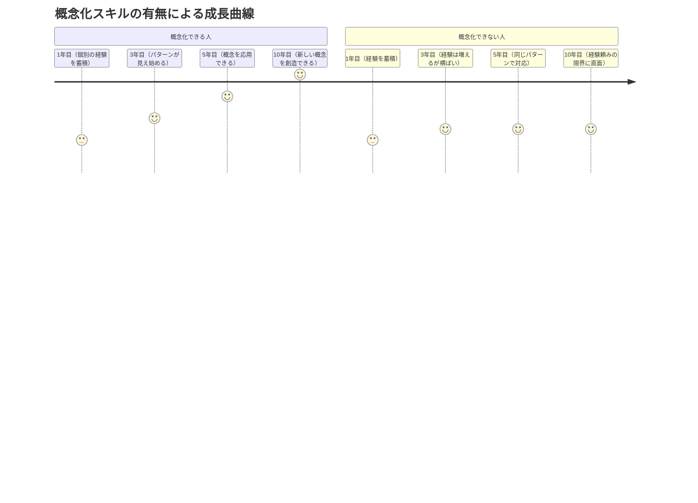
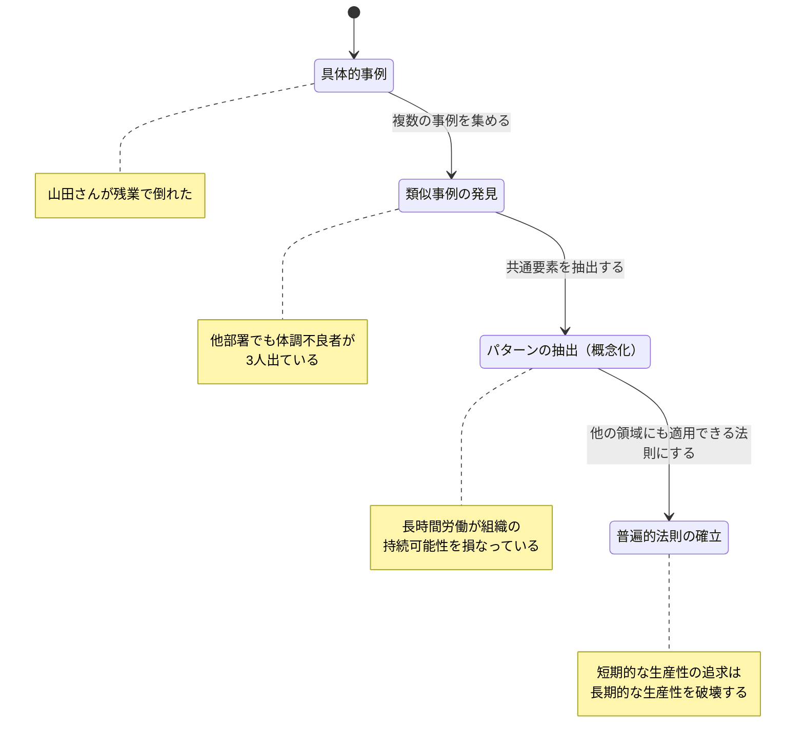

「なんで森山さんって、初めての問題でもすぐに対処法が分かるんですか？」新人の質問に、森山拓也（48歳・経営企画部長）は少し考えてからこう答えた。「うーん、初めての問題じゃないんだよ。形は違っても、構造は同じ問題に何度も出会ってる。『ああ、これは要するにリソース配分の問題だな』って分かれば、過去の解決策が使えるんだ。」――この「要するに」ができる力こそが、概念化（コンセプチュアル）スキルだ。

## 「10年の経験」と「1年の経験を10回繰り返しただけ」の違い

同じ10年でも、経験から「概念（パターン）」を抽出できる人と、個別の事例として処理し続ける人では、成長曲線が全く異なります。



**概念化とは**: 個別の具体的な事象から共通するパターンを見出し、「つまり、これは〇〇ということだ」と抽象的な法則として言語化する能力。

例えば:
- 「部下Aが報告を忘れる」「部下Bが締め切りを守らない」「部下Cが確認せず進める」→ 概念化: **「チーム内の期待値の不一致」**
- 「顧客Xが解約」「顧客Yが不満を表明」「顧客Zが値引きを要求」→ 概念化: **「提供価値と顧客期待のギャップ」**

個別に対処するか、構造的に対処するか。その分岐点が概念化スキルです。

## 概念化の4段階モデル

具体的な事象を概念に昇華するプロセスは、以下の4段階で進みます。



### なぜ概念化が重要か

| 概念化なし | 概念化あり |
|-----------|-----------|
| 事例の羅列しかできない | パターンとして認識できる |
| 過去の経験に依存 | 新しい状況にも応用できる |
| 他者に伝えにくい | 共通言語として共有できる |
| 再現性がない | 仕組みとして再現できる |
| 問題が起きてから対応 | 問題を予防できる |

## ケーススタディ1：「なぜか上手くいく」を言語化できないトップ営業

**人物**: 竹内亮太（43歳・営業部のエース、20年連続トップセールス）

**Before**: 竹内は「感覚でやっている」のひとことで自分の営業を説明していた。後輩から教えを請われても「場数を踏め」「お客さんの顔を見ろ」としか言えない。部下3人の成績は低迷。マネージャー昇進の話が出ても「竹内さんは教えるのが苦手」と見送られていた。

コーチ:「竹内さん、先週の大型契約、最初に何をしましたか？」
竹内:「いや、普通に会いに行って...」
コーチ:「もう少し具体的に。アポを取る前に何かしましたか？」
竹内:「ああ、その会社のIR資料と業界ニュースを読みました。あと、前任者のメモを見て、担当者の趣味がゴルフだと知ったので、ゴルフの話題を準備して...」
コーチ:「それ、毎回やっていますか？」
竹内:「はい、もう無意識ですけど」
コーチ:「その『無意識』を言語化しましょう。竹内さんは商談前に必ず『相手の世界を事前に理解する』というステップを踏んでいるんですね」

**概念化の結果**: 竹内の営業プロセスが「竹内式3フェーズ商談」として体系化された。

```mermaid
timeline
    title 竹内式3フェーズ商談（概念化後）
    section Phase 1: 事前理解
        IR・業界ニュースを読む: 担当者の個人情報を収集
        仮説を立てる: 相手が今何に悩んでいるか
    section Phase 2: 共感的ヒアリング
        相手の言葉で課題を確認: 自社の提案は最後
        質問80%・説明20%: 相手に語らせる
    section Phase 3: 課題解決提案
        相手の言葉を使って提案: データは補強材料
        決断のハードルを下げる: スモールスタートの選択肢
```

**After（6ヶ月後）**:
- 部下3人の成績: チーム平均を下回る → 全員がチーム上位50%に
- 竹内自身: マネージャーに昇進。「教えるのが苦手」→「チーム全体の底上げができる人」
- 竹内:「20年やってきたことに名前がついたら、人に教えられるようになった。概念化って、自分のためだけじゃなく、チームのためのスキルなんですね」

## ケーススタディ2：問題の本質が見えないプロジェクトリーダー

**人物**: 安藤美穂（35歳・システム開発プロジェクトリーダー）

**Before**: プロジェクトでトラブルが多発。安藤は毎回「モグラ叩き」で対処していた。

- 1月: テスト工程の遅延 → 「テスト人員を増やす」
- 3月: 要件変更によるリワーク → 「変更管理シートを作る」
- 5月: メンバーの離脱 → 「採用活動を強化する」
- 7月: 品質問題で炎上 → 「レビュー回数を増やす」

コーチ:「安藤さん、この4つの問題、共通点はありませんか？」
安藤:「うーん...全部違う問題に見えますけど...」
コーチ:「もう少し抽象的に。4つとも『何が足りなくて起きた』問題ですか？」
安藤:「...あ。全部、上流工程の設計が甘いから起きてる。テスト遅延も、要件変更も、品質問題も、上流の定義が不十分だから下流にしわ寄せが来てる」
コーチ:「その通り。4つの個別の問題ではなく、1つの構造的な問題だったんです」

**概念化**: 「下流で起きる問題の80%は、上流の定義不足に起因する」

**実践したこと**:
- プロジェクト開始時に「上流品質チェックリスト」を導入
- 要件定義フェーズの時間を従来の1.5倍に拡大
- 上流レビューの基準を明文化

**After（1年後）**:
- プロジェクトのトラブル発生件数: 月平均4.2件 → 0.8件
- 納期遵守率: 60% → 92%
- 安藤:「4つの別々の問題だと思っていたものが、実は1つの問題だった。概念化できた瞬間、打つ手が明確になった」

## ケーススタディ3：会議をまとめられないリーダー

**人物**: 小田切誠（39歳・事業戦略チームリーダー）

**Before**: チームの議論が毎回散らかり、結論が出ない。2時間の会議が3時間に延びることも。メンバーからは「小田切さんの会議は長い」と不評。

ある会議で:
メンバーA:「顧客からクレームが増えてます」
メンバーB:「営業の提案が的外れだって声もある」
メンバーC:「そもそも製品のUIが使いにくい」
メンバーD:「サポートの対応が遅いのも問題です」
小田切:「...全部対応しないとダメだよな」

コーチ:「小田切さん、今の4つの発言を一言でまとめるとしたら？」
小田切:「...うーん...」
コーチ:「4つとも、何と何のズレから起きていますか？」
小田切:「あ。全部、『顧客が期待しているもの』と『自分たちが提供しているもの』のギャップですね」
コーチ:「それが概念化です。4つの個別イシューではなく、『顧客期待と提供価値のギャップ』という1つのテーマとして議論できる」

**実践したこと**:
- 会議中に「つまり」を意識的に使う: 「つまり、今の議論は〇〇ということですよね」
- ホワイトボードにリアルタイムで概念マップを書く
- 議論が散らかったら「一段階抽象化して、何の話をしているか確認する」ルール

**After（3ヶ月後）**:
- 会議時間: 平均2.5時間 → 平均1.2時間
- 会議での意思決定率: 40%（結論が出ない会議が多い）→ 85%
- メンバーの評価: 「小田切さんの会議が一番生産的」
- 小田切:「概念化は、頭の良さじゃなくて技術。練習で誰でもできるようになる」

## 概念化スキルを鍛える4つのトレーニング

### トレーニング1: 「つまりノート」（毎日5分）

毎日の経験から1つ選び、「つまり、これは〇〇ということだ」と一言で概念化します。

```
■ 今日の出来事: クライアントとの打ち合わせで、準備した資料が的外れだった
■ なぜ？: クライアントの最近の課題を確認せずに、前回の続きで準備した
■ つまり: 「前提のアップデートなしに解決策を提示しても的外れになる」
■ 名前: 「前提アップデートの法則」
```

### トレーニング2: 読書の「概念抽出」

本を読むとき、著者の主張を「概念」として3つ抜き出します。そしてその概念が、自分の仕事のどこに適用できるかを考えます。

### トレーニング3: 「パターンハンティング」

1ヶ月間、仕事で起きた出来事を記録し、月末に「共通パターン」を探します。3回以上同じパターンが出たら、それは偶然ではなく構造的な問題です。

### トレーニング4: 会議での「つまりまとめ」

議論が散らかったとき、「つまり、今の話を整理すると〇〇ということですよね」と概念化してみます。最初は的外れでも構いません。回数を重ねるうちに精度が上がります。

## 概念化の「落とし穴」に注意する

概念化には強力な力がありますが、注意すべき落とし穴もあります。

**過度の単純化**: 複雑な問題を無理やり一言にまとめると、重要なニュアンスが失われる。概念化は「単純化」ではなく「本質の抽出」。

**概念への執着**: 一度作った概念に固執し、新しい情報を無視してしまう。概念は常にアップデートすべきもの。

**抽象に逃げる**: 具体的な行動に落とし込まず、抽象論で終わってしまう。概念化は「抽象→具体」の往復運動。上がるだけでなく、降りてこなければ意味がない。

## 関連記事

- [第一原理思考で本質を見抜く](/blog/first-principles-thinking) ― 概念化と相性の良い、物事の本質に迫る思考法
- [成長マインドセットの本質](/blog/growth-mindset) ― 「概念化スキルは鍛えられる」という前提がトレーニングを支える
- [内省（リフレクション）の質が経験を成長に変える](/blog/quality-reflection-growth) ― 経験を概念に変える「振り返り」の具体的な方法

---

## あなたの経験を「再現可能な知恵」に変えませんか？

竹内さんのように、20年の経験を「名前のある手法」に変えることができたら。安藤さんのように、バラバラに見えた問題が「1つの構造」として見えるようになったら。あなたの仕事の質とスピードは劇的に変わります。

**体験セッション（無料）**では、あなたの仕事の中に隠れている「パターン」を一緒に発見し、概念として言語化します。経験は、言葉になった瞬間に「知恵」になります。あなたの経験には、まだ言語化されていない貴重な知恵が眠っています。

[→ 体験セッションに申し込む](/sessions)
