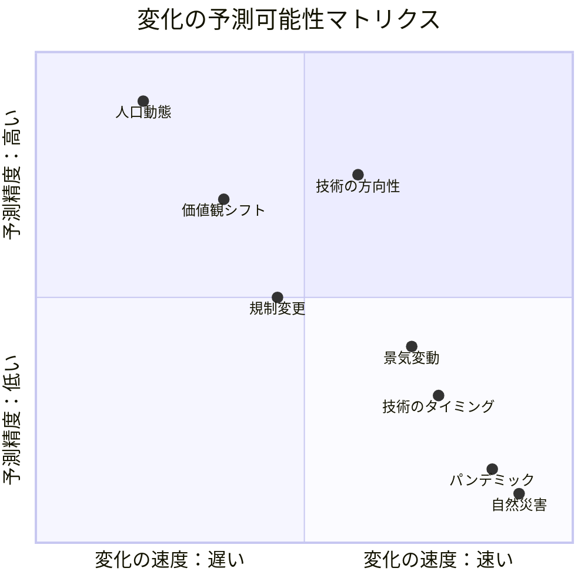
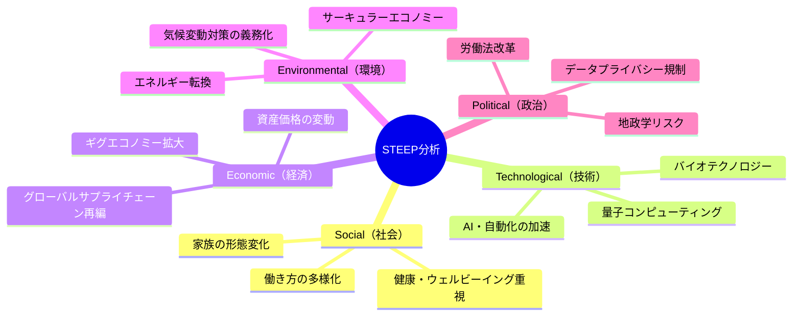
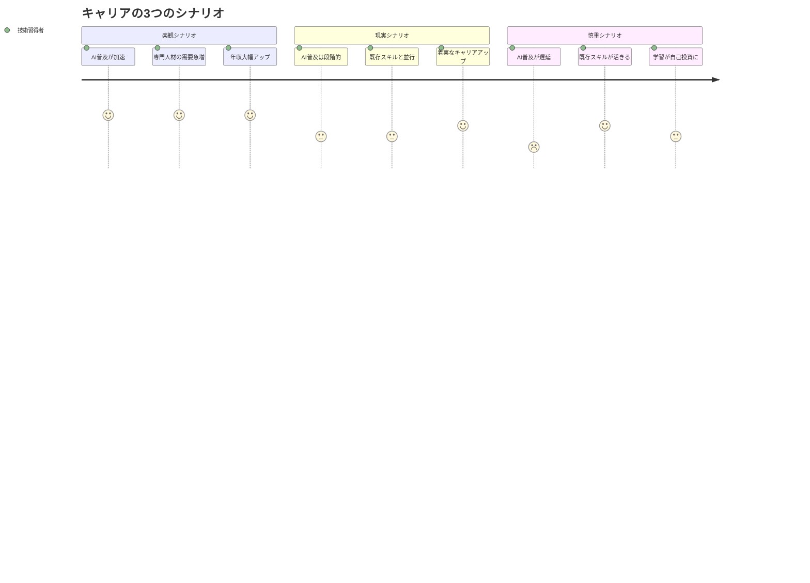
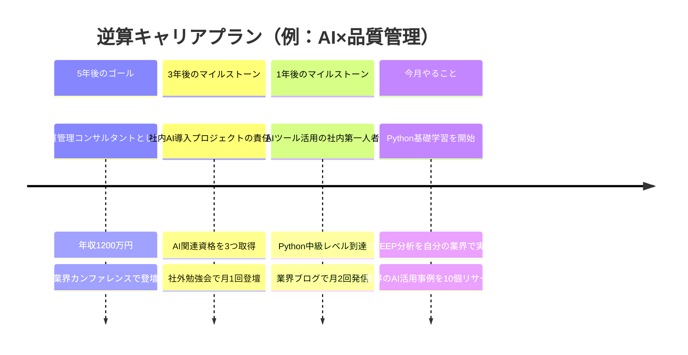

「このまま今の仕事を続けて、5年後も食べていけるのかな......」

金曜の夜、居酒屋のカウンターで、製造業の品質管理を担当する村上拓也さん（34歳）がビールのグラスを傾けながら呟いた。同期が先月、AI関連のスタートアップに転職したと聞いて、焦りが止まらない。「自分だけ取り残されてる気がする」——そんな言葉が、最近セッションでもよく聞こえてくる。

でも、焦る必要はない。未来は「不確実」と言われるけれど、**確実に来る変化**は実はかなりの精度で読める。問題は「予測できない」ことじゃなく、「予測しようとしていない」ことだ。

この記事では、プロの戦略コンサルタントが使う未来予測のフレームワークを、個人のキャリアに応用する方法を解説する。

---

## 未来には「予測できる部分」と「できない部分」がある

多くの人が「未来は誰にもわからない」と思考停止してしまう。確かにブラックスワン（黒鳥）的な予測不能イベントはある。しかし、技術の進化、人口動態、価値観のシフトといった**構造的な変化**は、方向性としては高い精度で予測できる。

ポイントは明快だ。**「何が起きるか」は予測できても、「いつ起きるか」の精度は低い**。だからこそ、方向性を押さえて早めに準備を始めることが、最も合理的な戦略になる。

### 予測可能な変化の3つの柱

未来予測において信頼性が高いのは、次の3つの構造的ドライバーだ。

**1. 技術の進化曲線**
AIの普及、自動化の拡大、リモートワーク技術の進化。これらは「起きるかどうか」ではなく「どこまで進むか」の問題。

**2. 人口動態**
少子高齢化、労働人口の減少、多文化社会の到来。出生率の推移から20年先まで高精度で読める。

**3. 価値観のシフト**
Z世代の台頭、ウェルビーイング重視、多様性の標準化。世代交代に伴い、不可逆的に進行する。

---

## STEEP分析：未来の「ドライバー」を構造化する

プロの未来予測で最も使われるフレームワークが**STEEP分析**だ。5つの領域からマクロトレンドを網羅的に把握する。

### STEEP分析の使い方

単に5領域を埋めるだけでは意味がない。重要なのは**交差点を見つける**ことだ。

例えば、「AI（技術）」と「働き方の多様化（社会）」の交差点には、「AIを活用したリモートワークの高度化」という具体的なトレンドが浮かび上がる。「データプライバシー規制（政治）」と「AI（技術）」の交差点には、「AI倫理の専門家」という新しい職種の誕生が見える。

こうした交差点こそが、**あなたが5年後にポジションを取るべき場所**だ。

---

## ケーススタディ1：村上拓也さん（34歳・品質管理）の未来予測

冒頭の村上さんに戻ろう。セッションで一緒にSTEEP分析をやってみた。

**Before：** 「AIで品質管理の仕事がなくなるかも」と漠然とした不安だけを抱えていた

**分析プロセス：**
村上さんの業界（製造業）に絞ってSTEEPの各領域を書き出した。技術面ではAIによる外観検査の自動化、社会面では人手不足による省人化ニーズ、経済面ではコスト削減圧力。

すると見えてきたのは、「品質管理の仕事がなくなる」のではなく、**「AIを使いこなせる品質管理のプロ」が圧倒的に不足する未来**だった。

**After：** 「AI×品質管理」の交差点にポジションを取ると決意。週末にPythonの基礎学習を開始し、3ヶ月後には社内のAI検査導入プロジェクトのリーダーに抜擢された。

「漠然とした不安が、具体的な行動計画に変わった瞬間でした」と村上さん。年収は前年比で120万円アップ。転職せずに、同じ会社の中でポジションが激変した。

---

## シナリオプランニング：3つの未来を同時に準備する

STEEP分析で方向性がわかったら、次はシナリオプランニングだ。**1つの未来に賭けるのではなく、3つのシナリオを同時に準備する**。

3つのシナリオのいずれでも損をしない行動を選ぶのがポイントだ。村上さんの場合、「Pythonを学ぶ」はどのシナリオでもプラスになる。AI普及が加速すれば即戦力、遅れても論理的思考力が鍛えられる。これが**ロバスト（頑健）な戦略**だ。

### シナリオプランニングの3ステップ

**ステップ1：不確実性の軸を2つ選ぶ**
自分のキャリアに最も影響を与える不確実な要因を2つ特定する。例：「AIの普及速度」と「リモートワークの定着度」。

**ステップ2：4象限でシナリオを描く**
2軸を掛け合わせて4つの未来像を作る。それぞれに名前をつけると具体性が増す。

**ステップ3：全シナリオに共通する行動を抽出**
4つのシナリオすべてで有効な行動こそが、あなたが今すぐ着手すべきことだ。

---

## ケーススタディ2：佐々木美咲さん（28歳・マーケター）の逆算設計

デジタルマーケティングの会社で働く佐々木さんは、「このままでは30代後半で市場価値が下がる」と危機感を覚えていた。

**Before：** 「マーケターとしてスキルアップしなきゃ」と思いつつ、何を学べばいいかわからず、手当たり次第にセミナーに参加。年間で30万円使ったが、キャリアの方向性は見えないままだった。

**シナリオプランニング実施：**
不確実性の軸を「AI広告の自動化レベル」と「消費者のプライバシー意識」に設定。4つのシナリオを描いたところ、すべてのシナリオで共通して価値が高いスキルが浮かび上がった——**「データを読み解いてストーリーを語る力」**だ。

AI広告が高度化すればデータ解釈力が必要。プライバシー規制が強まればファーストパーティデータの分析力が必要。どちらに転んでも、「データ×ストーリーテリング」は武器になる。

**After：** 統計学のオンライン講座と、ライティングスクールに同時に通い始めた。6ヶ月後、データドリブンなコンテンツ戦略の提案が評価され、チームリーダーに昇格。年収は80万円アップし、社外からのオファーも3件届いた。

「未来を予測したというより、未来のどこに立っても強い自分を設計できた感覚です」と佐々木さんは振り返る。

---

## 逆算キャリアプランニング：未来から今日を設計する

シナリオが描けたら、**バックキャスティング（逆算）**で具体的なアクションに落とし込む。

逆算の鍵は、**5年後の姿を「具体的な数字」で描く**こと。「なんとなく成長したい」では行動に落ちない。「年収○万円」「○○のポジション」「○○ができる状態」と明確に言語化することで、初めて「今月やること」が見えてくる。

---

## ケーススタディ3：田中修平さん（41歳・営業部長）の業界シフト

大手印刷会社の営業部長として20年。田中さんは部門の売上が毎年5%ずつ減少する現実に向き合っていた。

**Before：** 「印刷業界はもう終わりだ」と悲観しつつも、転職する勇気も、何を準備すべきかもわからなかった。部下には「大丈夫だ」と言いながら、夜中に求人サイトを見る日々。

**未来予測ワーク：**
STEEP分析をしてみると、印刷業界が「終わる」のではなく、**「形を変えて存続する」**ことが見えてきた。デジタルとフィジカルの融合（AR技術×印刷物）、パーソナライズ印刷の需要増加、サステナブル素材へのシフト。

田中さんの強みは「20年の業界人脈」と「法人営業力」。これは新領域でもそのまま活きる。

**After：** 社内で「デジタル×印刷」の新規事業チームを立ち上げ、AR名刺やパーソナライズDMのサービスを開発。初年度で売上3億円を達成し、社内MVPを受賞。

「業界が変わるんじゃなくて、業界の中で自分の立ち位置を変えればよかったんですね」——この言葉は、未来予測の本質を突いている。

---

## 未来予測力を鍛える4つの日常習慣

### 習慣1：「未来ニュース」を書く

ノートに「2029年の新聞記事」を自分で書いてみる。見出し、リード文、具体的な数字を含めて書く。例えば「2029年、AI品質管理ツール市場が5兆円規模に——導入企業の離職率が40%低下」のように。荒唐無稽でもいい。書くことで思考が鮮明になる。

### 習慣2：異業種の変化を観察する

自分の業界だけ見ていると視野が狭くなる。**隣の業界で起きている変化は、3年後にあなたの業界でも起きる**可能性が高い。小売業のDX事例が、製造業の営業改革のヒントになることは珍しくない。週に1本、異業種の事例記事を読む習慣をつけよう。

### 習慣3：年に1回の「トレンドレビュー」

毎年1月に、自分の業界の「確実に来る変化」を5つリストアップする。去年の5つと比較して、何が加速し、何が減速したかを振り返る。この蓄積が、3年後には驚くほど精度の高い予測力になる。

### 習慣4：「逆張り」を1つ試す

みんなが「AIに仕事を奪われる」と恐れているなら、「AIを味方につける方法」を考える。みんなが「リモートは終わり」と言っているなら、「ハイブリッドの最適解」を探る。[ファーストプリンシプル思考](/blog/first-principles-thinking)で常識を疑い、本質を見抜く力が未来予測の精度を高める。

---

## 未来予測と「意思決定」の関係

未来予測は、それ自体が目的ではない。**より良い意思決定をするためのツール**だ。[決断疲れ](/blog/decision-fatigue)の記事でも触れたように、人は不確実性が高いほど決断を先送りにする。未来予測によって不確実性を構造化すれば、決断のハードルが劇的に下がる。

また、未来予測で「自分が向かうべき方向」が明確になれば、日々の選択で迷うことが減る。「この勉強会に参加すべきか？」「この転職オファーを受けるべきか？」——すべてが、自分の未来シナリオに照らして判断できるようになる。

[レジリエンス](/blog/resilience)の観点からも、未来予測は心の安定をもたらす。「先が見えない不安」の多くは、「先を見ようとしていないことへの不安」だ。見通しを持つだけで、人は驚くほど冷静になれる。

---

## よくある落とし穴と対策

### 落とし穴1：予測に固執しすぎる
予測はあくまで仮説。新しい情報が入ったら柔軟にアップデートすること。3ヶ月に1回は見直しのタイミングを設けよう。

### 落とし穴2：情報収集だけで満足する
トレンドレポートを100本読んでも、行動しなければ意味がない。「今月やること」を1つだけ決めて、必ず実行する。

### 落とし穴3：悲観バイアスに引きずられる
人は本能的にネガティブな未来に注意が向く。STEEP分析では、意識的にポジティブな変化（チャンス）もリストに含めること。

---

## まとめ：未来は予測するものではなく、設計するもの

未来予測の真の価値は、**「当てること」ではなく「備えること」**にある。

STEEP分析で方向性を掴み、シナリオプランニングで複数の未来に備え、逆算設計で今日の行動に落とし込む。この3ステップを実践するだけで、漠然とした不安は「具体的なアクションプラン」に変わる。

村上さん、佐々木さん、田中さんに共通しているのは、**未来を恐れるのをやめて、未来を設計し始めた**ということだ。

あなたの5年後は、今日の選択で決まる。

---

## あなたの「未来シナリオ」を一緒に描きませんか？

一人でSTEEP分析やシナリオプランニングをやろうとすると、どうしても自分のバイアスに引きずられる。「こうなってほしい未来」と「確実に来る未来」を混同してしまうのだ。

コーチングセッションでは、あなたの業界・専門性に特化した未来予測ワークを一緒に行い、ロバストなキャリア戦略を設計する。

- あなたの業界のSTEEP分析を一緒に実施
- 3つのシナリオで「どこに転んでも強い戦略」を設計
- 逆算キャリアプランで「今月やること」まで具体化

**未来を待つのではなく、未来を迎えに行こう。**

[無料体験セッションに申し込む](/sessions)
