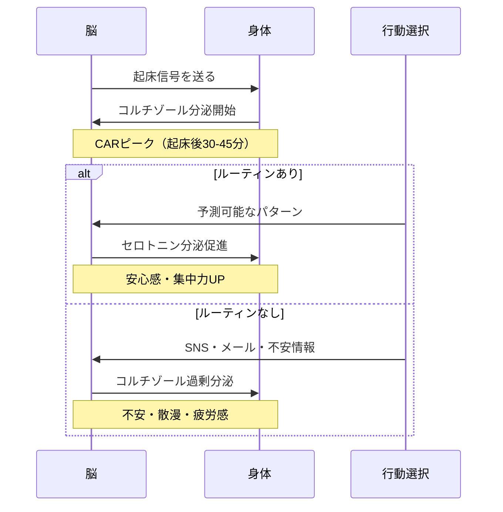
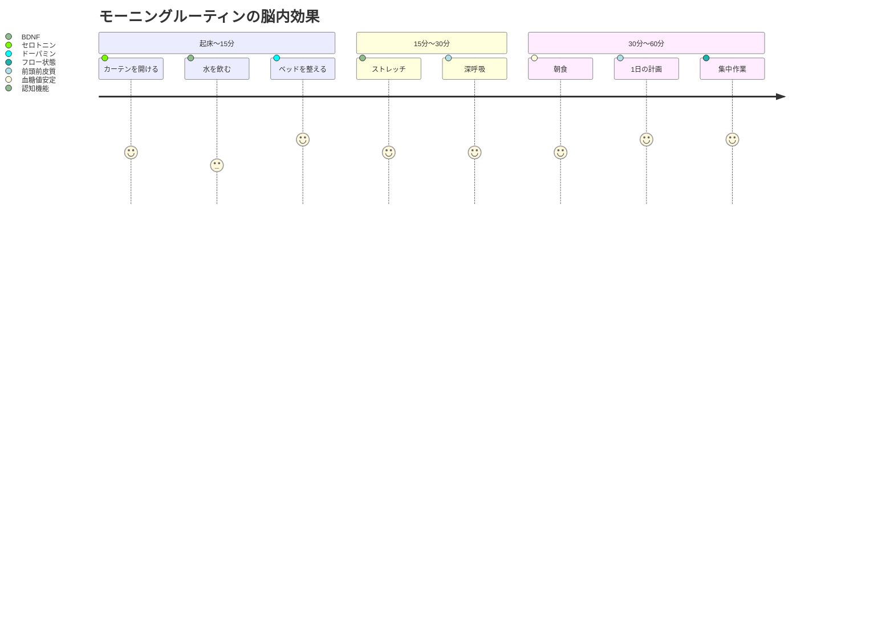
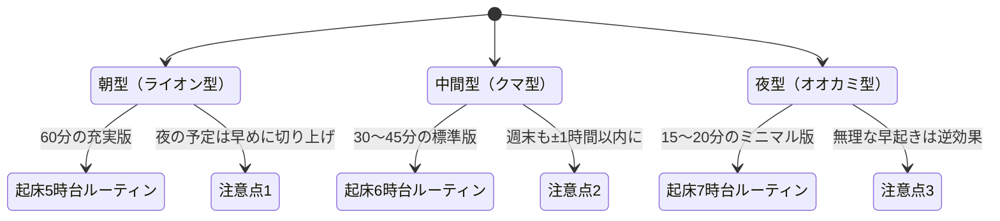

「最近、朝起きた瞬間からもう疲れてるんです」

IT企業でプロジェクトマネージャーを務める長谷川彩香さん（31歳）が、セッションの冒頭でそう言った。目覚まし時計を3回止めて、ベッドの中でSNSを30分スクロール。気づけば出社ギリギリの時間で、朝食を抜いてコンビニコーヒーを片手に駅へ走る。「毎日、1日の始まりからすでに負けてる感じがするんです」——この言葉に、思い当たる人は少なくないだろう。

実は、この「朝の過ごし方」が、1日のメンタル状態を科学的に決定づけている。脳内ホルモンの分泌パターン、自律神経の切り替え、意思決定リソースの配分——すべてが朝の最初の60分で方向づけられるのだ。

---

## なぜ朝の1時間がメンタルを支配するのか

### コルチゾール覚醒反応（CAR）の仕組み

人間の脳は、起床後30〜45分でコルチゾール（ストレスホルモン）の分泌がピークに達する。これは**コルチゾール覚醒反応（Cortisol Awakening Response: CAR）**と呼ばれ、体を「活動モード」に切り替えるための自然なメカニズムだ。

問題は、このCARのタイミングで**何をしているか**だ。

CARのピーク時にSNSやニュースで不安をインプットすると、コルチゾールが過剰分泌され、**1日中「なんとなく不安」な状態**が続く。逆に、予測可能なルーティンを実行すると、脳は安心感を得てセロトニンの分泌を促す。

これが「朝の習慣でメンタルが決まる」の科学的根拠だ。

### 意思決定リソースの節約

[決断疲れ](/blog/decision-fatigue)の記事で詳しく解説したが、人間の意思決定能力は有限のリソースだ。朝から「何を着よう」「何を食べよう」「今日は何から始めよう」と考えるたびに、このリソースが消耗される。

モーニングルーティンは、**朝の意思決定をゼロに近づける仕組み**だ。スティーブ・ジョブズが毎日同じ服を着たのも、マーク・ザッカーバーグがグレーのTシャツを選び続けるのも、この原理に基づいている。

---

## 科学的に効果が実証された朝の5要素

### 要素1：光の浴び方（サーカディアンリズム）

起床後15〜30分以内に自然光（2,500ルクス以上）を浴びると、体内時計がリセットされ、セロトニンの分泌が活性化する。曇りの日でも屋外光は約10,000ルクスあり、室内照明（300〜500ルクス）の20倍以上だ。

**実践法：** カーテンを開けて窓際で5分過ごす。可能なら朝の散歩を10分。

### 要素2：水分補給（脳の再起動）

睡眠中に体は約500mlの水分を失う。脳の75%は水分で構成されており、わずか2%の脱水で認知機能が20%低下するという研究結果がある（Armstrong et al., 2012）。

**実践法：** 起床直後にコップ1杯（200〜300ml）の常温水を飲む。

### 要素3：軽い運動（BDNF分泌）

朝の軽い運動（10〜20分）は、BDNF（脳由来神経栄養因子）の分泌を促進する。BDNFは「脳の肥料」とも呼ばれ、記憶力・集中力・メンタルの安定に直結する。

**実践法：** ストレッチ10分、またはウォーキング15分。激しい運動は不要。

### 要素4：マインドフルネス（前頭前皮質の活性化）

5〜10分の瞑想や深呼吸で、前頭前皮質（理性的判断を担う脳の部位）が活性化する。Harvard大学の研究では、8週間のマインドフルネス実践で扁桃体（不安を感じる部位）が5%縮小したと報告されている。

**実践法：** 椅子に座って3分間、呼吸に意識を集中する。

### 要素5：達成感のトリガー（ドーパミンループ）

小さなタスクを1つ完了させることで、ドーパミンが分泌され、**ポジティブな行動連鎖**が始まる。これが「ベッドメイキング効果」と呼ばれるもので、海軍大将ウィリアム・マクレイヴンが卒業スピーチで語ったことで有名になった。

**実践法：** 起床直後にベッドを整える。たった30秒で1日が変わる。

---

## ケーススタディ1：長谷川彩香さん（31歳・PM）の朝革命

冒頭の長谷川さんのケースに戻ろう。

**Before：**
- 6:50 目覚まし3回スヌーズ
- 7:20 ベッドでSNS（30分）
- 7:50 慌てて身支度
- 8:10 朝食なしで出社
- メンタル状態：朝から「負けてる感」。午前中の生産性が低く、午後にしわ寄せ

**ルーティン設計：**
長谷川さんのライフスタイルに合わせて、「30分で完了するミニマルルーティン」を設計した。

- 6:30 起床→カーテン開ける→水を飲む（2分）
- 6:32 ベッドメイキング（1分）
- 6:33 ストレッチ（7分）
- 6:40 シャワー（10分）
- 6:50 朝食（バナナとヨーグルト）＋今日のタスク3つを書く（10分）
- 7:00 出社準備

**After（3ヶ月後）：**
- 午前中の集中力が「体感で2倍になった」
- 不安感が激減し、夜の睡眠も改善
- チームメンバーから「最近、朝から元気ですね」と言われるように
- 残業時間が月平均15時間減少（午前中の生産性UPで前倒しできるように）

「たった30分の朝の変化で、1日24時間の質が変わるなんて信じられませんでした」

---

## ケーススタディ2：山本健太さん（45歳・部長）の再起動

管理職として毎日12時間以上働く山本さん。メンタルクリニックで「軽度の適応障害」と診断され、主治医から生活習慣の改善を勧められてセッションに来た。

**Before：**
- 23:30 就寝（スマホで仕事メールをチェックしながら）
- 6:00 起床→すぐにメール確認
- 6:15 シャワーを浴びながら今日の会議を脳内シミュレーション
- 6:30 朝食なしで出社
- 「朝から頭がフル回転で、帰宅する頃にはもう何も考えられない状態でした」

**ルーティン設計：**
山本さんの場合、「朝にスマホを触らない」がカギだった。

- 5:30 起床（就寝を22:30に前倒し）
- 5:35 水を飲む→ベランダで5分間外の空気を吸う
- 5:40 ウォーキング20分（近所の公園を1周）
- 6:00 シャワー→朝食
- 6:30 瞑想アプリで5分間の呼吸法
- 6:35 手帳に「今日最も大事なこと1つ」を書く
- 6:40 出社準備（ここで初めてスマホを確認）

**After（6ヶ月後）：**
- 適応障害のスコアが「正常範囲」に改善
- 「朝の1時間が、1日で唯一"自分だけの時間"になった」
- 部下にもルーティンを勧め、チーム全体の雰囲気が改善
- 睡眠の質スコア（スマートウォッチ計測）が62点→81点に向上

「朝を変えたら、仕事への向き合い方が根本的に変わりました。以前は"仕事に追われている"感覚だったのが、今は"自分から仕事に向かっている"感覚です」

---

## クロノタイプ別：自分に合ったルーティン設計

重要なのは、**全員が朝5時に起きる必要はない**ということだ。人にはクロノタイプ（体内時計の個人差）があり、無理に朝型を強制するとかえってストレスになる。

**朝型（ライオン型・人口の約15%）：** 5時〜6時起床が自然。60分の充実版ルーティンが可能。

**中間型（クマ型・人口の約55%）：** 6時〜7時起床が自然。30〜45分の標準版ルーティンが最適。

**夜型（オオカミ型・人口の約15%）：** 7時〜8時起床が自然。15〜20分のミニマル版でOK。無理に早起きするより、起きた後の行動パターンを安定させることが重要。

### ライフステージ別の調整

**子育て中：** 子どもの起床前の15分を確保する。「5分の深呼吸＋水を飲む＋今日の1つだけ決める」のウルトラミニマル版でも効果がある。

**リモートワーク：** 通勤時間がない分、ルーティンを充実させるチャンス。「通勤の代わりに15分散歩」を入れると、脳が「仕事モード」に切り替わる。

**シフト勤務：** 起床時間が変わっても、「起きてからの順番」を固定する。時間ではなく順序がルーティンの本質だ。

---

## ルーティン定着の科学：66日ルール

ロンドン大学のフィリッパ・ラリー博士の研究によると、新しい習慣が「自動化」されるまでに平均66日かかる。最初の2週間が最もきつく、3週目から徐々に楽になり、9週目以降はほぼ無意識で実行できるようになる。

### 定着させる3つのコツ

**コツ1：最初は「2分ルール」で始める**
「朝10分瞑想」ではなく「朝1分深呼吸」から始める。ハードルを極限まで下げて、「やらない日がない」状態を作る。

**コツ2：トリガーを固定する**
「カーテンを開けたら水を飲む」「水を飲んだらストレッチ」のように、前の行動が次の行動のトリガーになるチェーンを作る。[ポモドーロ・テクニック](/blog/pomodoro-technique)と同じ原理で、行動を「考えなくてもできる連鎖」にする。

**コツ3：崩れた日を想定しておく**
完璧主義は習慣化の最大の敵だ。「寝坊した日は3分版だけやる」というプランBを事前に作っておく。[Done is Betterの精神](/blog/done-is-better)で、0か100かではなく、1でもやった自分を認める。

---

## スマホとの付き合い方：朝の30分ルール

スタンフォード大学の研究では、起床後すぐにスマホを見る習慣がある人は、そうでない人と比べて**不安スコアが23%高い**という結果が出ている。

理由は明快だ。SNSやニュースは脳を「反応モード」にする。自分のペースで1日を始めるのではなく、他人の投稿やニュースに振り回される状態から1日がスタートしてしまう。

**推奨：起床後30分はスマホを触らない。**

具体的には、スマホを寝室の外に置くか、アラーム専用の時計を使う。「朝スマホ断ち」は多くのクライアントが「最も効果を実感した習慣」として挙げる改善策だ。

---

## よくある質問と解決策

### Q：「朝が弱くて、ルーティンどころじゃない」
A：まず睡眠の質を改善することが先。就寝の1時間前にスマホを手放し、寝室を暗くするだけで起床時の目覚めが劇的に変わる。ルーティンは「起きられるようになってから」でも遅くない。

### Q：「何度も挫折している」
A：目標が高すぎる。「朝5時起きで瞑想30分＋運動1時間」ではなく、「今より10分早く起きて水を飲む」だけでいい。[セルフトーク](/blog/self-talk)を変えて、「また挫折した」ではなく「また始められた」と捉え直そう。

### Q：「休日はどうすればいい？」
A：平日と完全に同じにする必要はないが、起床時間の差は±1時間以内に収める。体内時計のリセットには一貫性が重要だ。「週末に2時間遅く起きる」のは、月曜に時差ボケを起こすのと同じ。

---

## まとめ：朝の1時間は、人生のコントローラー

モーニングルーティンは、単なる「意識高い系の習慣」ではない。脳科学・内分泌学・行動心理学が裏づける、**メンタル安定のための最も効率的な投資**だ。

長谷川さんは30分のルーティンで午前の生産性を倍増させた。山本さんは1時間の朝習慣で適応障害から回復した。2人に共通するのは、**完璧を目指さず、自分に合った形で続けた**こと。

朝の1時間を変えることは、24時間を変えることだ。そして24時間を変えることは、人生を変えることだ。

---

## あなただけのモーニングルーティンを設計しませんか？

「自分に合ったルーティンがわからない」「何度も挫折してしまう」——そんな方こそ、セッションを活用してほしい。

クロノタイプ診断、ライフスタイル分析、行動科学に基づく習慣設計を通じて、あなただけの「黄金の朝時間」を一緒に作り上げる。

- クロノタイプ診断で最適な起床時間を特定
- 現在の朝の行動パターンを分析・改善
- 66日間の定着プランを設計

**明日の朝から、人生が変わる。**

[無料体験セッションに申し込む](/sessions)
