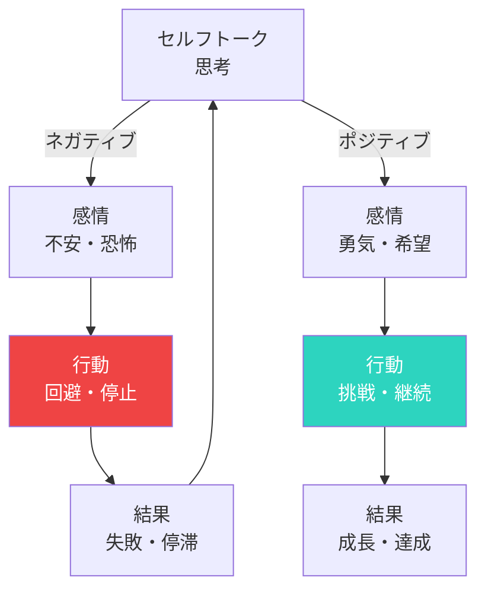

## 頭の中の声

「また失敗した」
「自分には無理だ」
「どうせうまくいかない」

頭の中で、こんな声が聞こえていませんか？

これがセルフトーク（自己対話）です。

## セルフトークの影響

研究によると、人は1日に約6万回の思考をしています。
そのうち約80%がネガティブな内容。

そして、この内なる声が：

- 感情を左右する
- 行動を決める
- 結果に影響する

### 思考-感情-行動のループ

## ネガティブなセルフトークのパターン

### 1. 全か無か思考

「完璧じゃなければ意味がない」
「少しでもミスしたらダメだ」

### 2. 過度の一般化

「いつもこうなる」
「絶対にうまくいかない」

### 3. マインドリーディング

「あの人は私のことを嫌いに違いない」
「みんなが私を批判している」

### 4. 自己否定

「自分は価値がない」
「自分なんかダメだ」

## セルフトークを変える方法

### 1. 気づく

まず、自分が何を言っているか気づく。
書き出してみると、客観視できます。

### 2. 疑問を持つ

「本当にそう？」「証拠は？」
ネガティブな思考を検証する。

### 3. 言い換える

「失敗した」→「学びを得た」
「無理だ」→「まだ方法を見つけていない」

### 4. 名前で呼ぶ

「私は...」ではなく「〇〇（自分の名前）は...」
距離を置くことで、客観的になれます。

### 5. 友人に言うように

親友が同じ状況だったら、何と声をかける？
その言葉を、自分にもかけてあげる。

## ポジティブなセルフトークの例

- 「できる、やれる、大丈夫」
- 「一歩ずつ進めばいい」
- 「失敗しても死ぬわけじゃない」
- 「今の自分にベストを尽くそう」

## 毎日の習慣にする

朝起きたとき、鏡の前で自分にポジティブな言葉をかける。
最初は気恥ずかしくても、続けると効果が出ます。

今日から、内なる声に耳を傾けてみてください。
