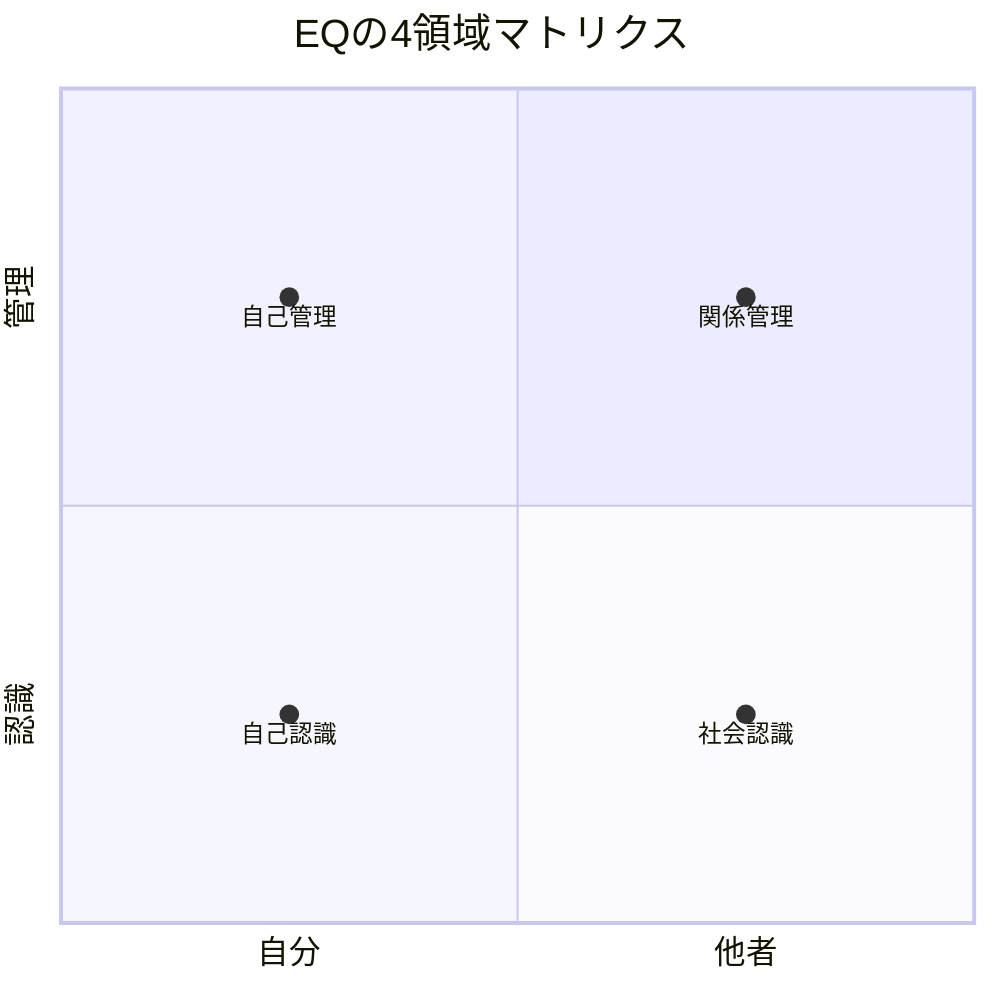
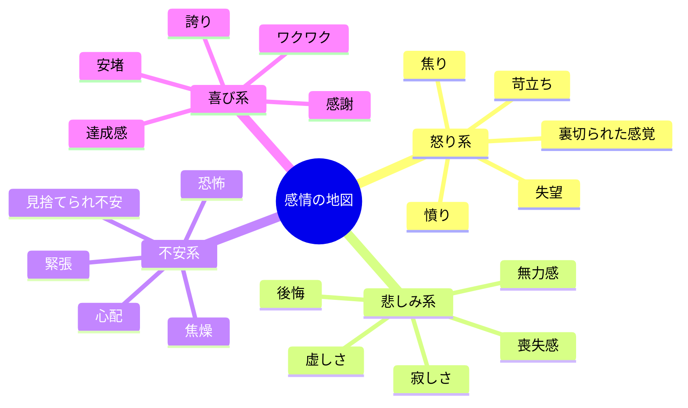
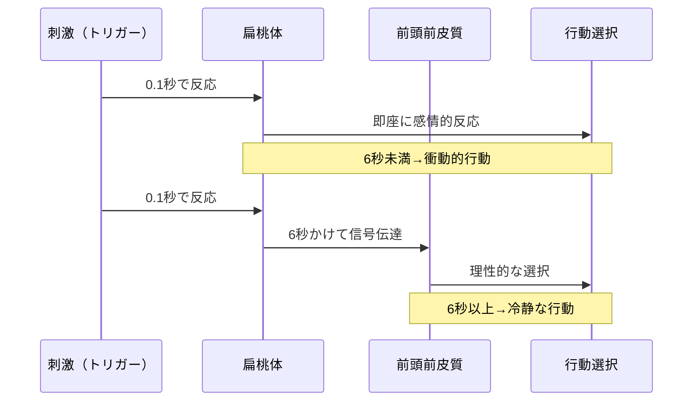

「部長、さっきの言い方はちょっと......」

会議室を出た後、部下の鈴木から小声でそう言われて、広告代理店の営業部長・中村大輔さん（38歳）は凍りついた。クライアントからの無理な要求に苛立ち、「そんなスケジュール、物理的に無理ですよ」と語気を強めてしまった。クライアントの顔がこわばったのは見えていた。でも止められなかった。

帰りの電車で、中村さんはこう呟いた。「俺、仕事はできるのに、感情で全部台無しにしてる気がする」

これは決して珍しいケースではない。IQ（知能指数）は高いのに、感情のコントロールができずにキャリアや人間関係で壁にぶつかる人は多い。実際、心理学者ダニエル・ゴールマンの研究では、**仕事の成果の58%はEQ（感情知能）によって説明できる**とされている。

---

## EQとは何か：4つの領域を理解する

EQ（Emotional Quotient / Emotional Intelligence）は、感情を「抑える」能力ではない。感情を「理解し、情報として活用する」能力だ。

ゴールマンのモデルでは、EQは4つの領域に分類される。

**自己認識（Self-Awareness）：** 自分が今何を感じているかを正確に把握する力。「なんかイライラする」ではなく「クライアントの態度に対する失望を感じている」と解像度高く認識する。

**自己管理（Self-Management）：** 認識した感情を適切にコントロールする力。感情を抑え込むのではなく、感情に振り回されず行動を選択する。

**社会認識（Social Awareness）：** 相手が今何を感じているかを察する力。言葉だけでなく、表情・声のトーン・沈黙から相手の感情を読み取る。

**関係管理（Relationship Management）：** 自分と相手の感情を踏まえた上で、最適なコミュニケーションを取る力。対立を解消し、信頼関係を構築する。

### IQとEQの決定的な違い

IQは20代前半でほぼ固定されるが、**EQは何歳からでもトレーニングで向上する**。これがEQを学ぶ最大の理由だ。

Googleの「プロジェクト・アリストテレス」では、最も生産性の高いチームの特徴は「メンバーのIQの高さ」ではなく「心理的安全性」——つまりチーム全体のEQの高さだった。

---

## 領域1：自己認識——「感情のラベリング」技術

### なぜラベリングが効くのか

UCLA の研究（Lieberman et al., 2007）によると、感情に名前をつける行為だけで、扁桃体（感情の暴走を引き起こす脳の部位）の活動が最大50%低下する。「なんかイライラする」を「失望している」と言語化するだけで、脳は冷静さを取り戻し始める。

### 感情の解像度を上げる

「怒り」の裏には、実は「失望」や「裏切られた感覚」が隠れていることが多い。「悲しみ」の裏には「無力感」や「後悔」が。感情の語彙を増やすことが、自己認識の精度を飛躍的に高める。

### 実践：感情ジャーナリング

毎日3回（朝・昼・夜）、30秒で以下を記録する。

1. **今の感情は？**（できるだけ具体的に）
2. **何がトリガーだった？**（出来事・人・状況）
3. **体のどこに感じる？**（胸の締めつけ、肩の緊張、胃の重さなど）

2週間続けると、自分の感情パターンが見えてくる。「月曜朝の会議後にいつも焦燥感がある」「上司のある言い方に特に反応する」といったパターンだ。

---

## ケーススタディ1：中村大輔さん（38歳・営業部長）のEQ改革

冒頭の中村さんのセッションを詳しく見てみよう。

**Before：**
- 会議中に感情的になり、月に2〜3回は「言いすぎた」と後悔
- 部下の離職率がチーム内で最も高い（年間25%）
- クライアントからの評価は「仕事は速いが付き合いづらい」
- 360度評価のEQスコアが部長職平均を30%下回る

**取り組み：**

**ステップ1：感情ジャーナリングの開始（1〜2週目）**
中村さんのジャーナリングから見えてきたパターンは、「自分の仕事の質を否定された」と感じた瞬間に怒りが爆発するというものだった。クライアントの無理な要求を「自分の提案が悪いと言われている」と解釈していた。

**ステップ2：6秒ルールの導入（3〜4週目）**
感情が高ぶったら、物理的に6秒待つ。この6秒は、前頭前皮質（理性的判断を担う部位）が扁桃体（感情の暴走を起こす部位）をコントロールするのに必要な最低時間だ。中村さんは「怒りを感じたら、水を一口飲む」というトリガーを設定した。

**ステップ3：リフレーミングの実践（5〜8週目）**
「クライアントが無理な要求をしている」→「クライアントもプレッシャーを受けていて、助けを求めている」。同じ状況でも、解釈を変えると感情が変わる。

**After（6ヶ月後）：**
- 「言いすぎた」と後悔する回数がゼロに
- 部下の離職率が25%→5%に改善
- クライアントから「中村さんは信頼できる」と言われるように
- 360度評価のEQスコアが40%向上し、部長職トップに

「感情を抑え込んでいたんじゃなく、感情を理解していなかった。理解したら、コントロールする必要すらなくなりました」

---

## 領域2：自己管理——6秒ルールとリフレーミング

### 6秒ルールの科学

扁桃体は外部刺激を0.1秒で処理し、即座に「闘争・逃走反応」を起こす。一方、前頭前皮質が扁桃体のシグナルを受け取り、理性的な判断に変換するまでに約6秒かかる。

この6秒を確保するための具体的な方法：

- **水を一口飲む**（物理的な動作で時間を稼ぐ）
- **「面白いな」と心の中で呟く**（評価を中立化する）
- **指を1本ずつ数える**（注意を身体に向ける）

### リフレーミング（認知的再評価）

感情の原因は「出来事」ではなく「解釈」にある。同じ出来事でも、解釈を変えれば感情は変わる。

| 出来事 | ネガティブ解釈 | リフレーミング |
|--------|---------------|---------------|
| 上司に指摘された | 「能力を否定された」 | 「成長のヒントをもらった」 |
| プレゼンで質問攻め | 「攻撃されている」 | 「関心を持たれている」 |
| 後輩が先に昇進 | 「自分は劣っている」 | 「自分の強みは別のところにある」 |
| 提案が却下された | 「認められていない」 | 「改善の方向性が見えた」 |

[セルフトーク](/blog/self-talk)の技術と組み合わせると、リフレーミングの効果はさらに高まる。

---

## 領域3：社会認識——相手の感情を読む力

### 非言語コミュニケーションの重要性

心理学者アルバート・メラビアンの研究によると、対面コミュニケーションにおいて感情の伝達は、言語内容7%、声のトーン38%、表情・身振り55%で構成される。つまり、**感情を読むには言葉以外の93%に注目する必要がある**。

### 観察すべき4つのサイン

**1. 表情の微変化：** 本音と異なる言葉を発しているとき、一瞬だけ本当の表情が漏れる（微表情）。特に目の周りと口角に注目。

**2. 声のトーン変化：** 声が高くなる（緊張・興奮）、声が小さくなる（自信のなさ・不安）、スピードが上がる（焦り・イライラ）。

**3. 身体の開き具合：** 腕を組む・足を組む（防御・拒否）、前傾姿勢（関心・同意）、後ろに反る（距離を置きたい）。

**4. 沈黙の質：** 考えている沈黙（目が動く）、怒りの沈黙（表情が固い）、同意の沈黙（頷きを伴う）。

---

## ケーススタディ2：小林真由美さん（29歳・人事）のチーム再建

人事部で採用担当をしている小林さんは、面接でのミスマッチが多いことに悩んでいた。

**Before：**
- 採用した人材の1年以内離職率が35%（業界平均15%）
- 「面接では良い人だと思ったのに、入社後に合わなかった」が口癖
- 面接では候補者の「言葉」だけを評価していた

**EQトレーニング：**

小林さんは社会認識のトレーニングとして、「面接中に候補者の感情状態を観察する」練習を始めた。

「前職を辞めた理由は？」と聞いたとき、言葉では「キャリアアップのため」と答えていても、声が小さくなり目線が下がる候補者がいた。深掘りすると、実は人間関係のトラブルが本当の理由だった。

「5年後のビジョンは？」と聞いたとき、目が輝いて前傾姿勢になる候補者と、暗記した答えを機械的に話す候補者の違いが見分けられるようになった。

**After（1年後）：**
- 採用人材の1年以内離職率が35%→8%に激減
- 「小林さんが面接した人はハズレがない」と社内で評判に
- 面接のフレームワークを社内研修として展開
- 人事部のMVPを受賞

「言葉の裏にある感情を読めるようになって、採用の精度が根本的に変わりました。EQは人事の最強スキルだと実感しています」

---

## 領域4：関係管理——対立を信頼に変える技術

関係管理は、自己認識・自己管理・社会認識の3つが土台になる。自分の感情を理解し、コントロールし、相手の感情を読んだ上で、初めて効果的なコミュニケーションが取れる。

### 対立をチャンスに変える3ステップ

**ステップ1：相手の感情を「声に出して認める」**
「それは大変でしたね」「イライラしますよね」——相手の感情を言語化して返すだけで、相手の防御姿勢が緩む。これはカール・ロジャーズの「積極的傾聴」の核心だ。

**ステップ2：「でも」ではなく「そして」で続ける**
「おっしゃることはわかります。でも——」は、せっかくの共感を打ち消す。「おっしゃることはわかります。そして、こういう方法もあるかもしれません」と続けるだけで、対話の質が変わる。

**ステップ3：一緒に答えを探す姿勢を示す**
「私はこう思います」ではなく「一緒に考えてみませんか」。[Win-Win交渉](/blog/negotiation-win-win-agreement)の原則と同じで、対立構造を協力構造に転換する。

---

## ケーススタディ3：藤田一郎さん（52歳・役員）の組織変革

メーカーの取締役として、大規模なリストラを指揮することになった藤田さん。社員の反発が強く、労働組合との交渉は膠着状態だった。

**Before：**
- 労組との交渉は毎回、怒号が飛び交う状態
- 「経営者は冷血だ」と社員に思われていた
- 交渉は6ヶ月間進展なし

**EQを活用したアプローチ：**

藤田さんは交渉の冒頭で、こう切り出した。「皆さんが不安を感じているのは当然のことです。私自身も、この決断に苦しんでいます。ただ、会社を存続させ、できるだけ多くの雇用を守りたい。その思いは同じはずです」

自分の感情を正直に開示し（自己認識）、相手の感情を認め（社会認識）、共通の目標を示した（関係管理）。

**After：**
- 交渉開始から2週間で基本合意に到達
- 希望退職者への支援パッケージは業界最高水準に
- 社員アンケートで「経営陣を信頼する」が42%→71%に向上
- 残った社員のエンゲージメントスコアがリストラ前を上回る

「感情を見せることは弱さだと思っていました。でも、感情を適切に表現することが、最も強力なリーダーシップだと気づきました」

---

## EQを鍛える4つの日常トレーニング

### トレーニング1：感情ジャーナリング（自己認識）

1日3回、「今の感情」「トリガー」「体の感覚」を30秒で記録する。スマホのメモ帳でいい。2週間で自分の感情パターンが見える化される。

### トレーニング2：6秒チャレンジ（自己管理）

1日に1回、感情が動いた場面で6秒待つ練習をする。最初は難しいので、「水を飲む」という物理的なアクションをトリガーにする。

### トレーニング3：「観察モード」の10分間（社会認識）

カフェや電車で、周囲の人の表情・姿勢・声のトーンを10分間観察する。「あの人は楽しそう」「あの人は緊張している」と推測してみる。

### トレーニング4：「でも」を「そして」に置き換える（関係管理）

1週間、会話の中で「でも」を使わず「そして」に置き換えてみる。「そうですね。でも——」を「そうですね。そして——」に。驚くほど会話の質が変わる。

[フィードバックマインドセット](/blog/feedback-mindset)の記事で解説した「受け取る力」も、EQの関係管理に直結する。感情的にならずにフィードバックを受け取れるようになると、成長のスピードが加速する。

---

## まとめ：EQは「頭の良さ」を超える最強のスキル

EQは生まれつきの才能ではなく、トレーニングで確実に高められるスキルだ。

中村さんは感情ジャーナリングと6秒ルールで、チームの離職率を25%→5%に改善した。小林さんは社会認識のトレーニングで、採用のミスマッチを激減させた。藤田さんはEQを活用したコミュニケーションで、膠着した交渉を2週間で動かした。

3人に共通するのは、**感情を「抑え込む」のではなく「理解する」ことにフォーカスした**ということだ。

感情はあなたの敵ではない。正しく理解し、活用すれば、キャリアと人間関係を劇的に改善する最強の味方になる。

---

## あなたのEQを一緒に高めませんか？

EQのトレーニングは、一人で取り組むと「自分の感情パターン」の盲点に気づきにくい。コーチングセッションでは、客観的なフィードバックを通じて、あなたのEQを効率的に高めていく。

- 感情パターンの分析と盲点の発見
- あなた固有のトリガーの特定と対処法の設計
- 職場・家庭での実践プランの作成

**感情を味方につけて、もっと自由に生きよう。**

[無料体験セッションに申し込む](/sessions)
