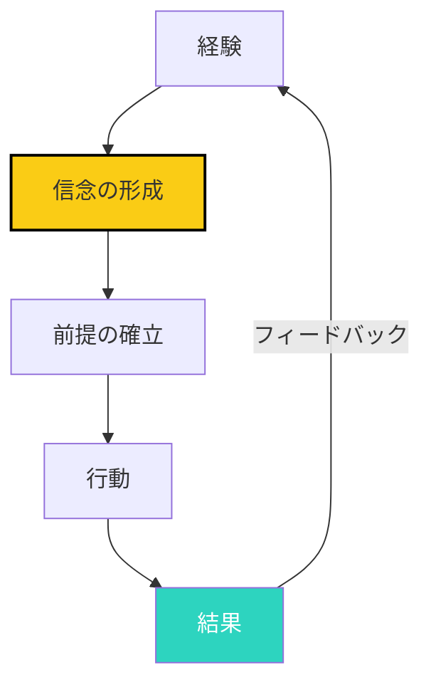
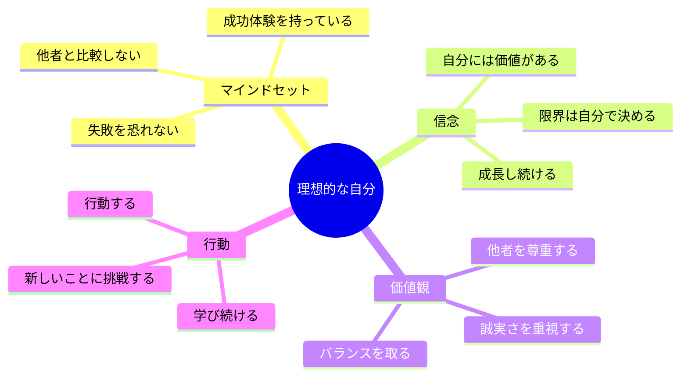

## マインドセットをプログラムする

「自分は〜だ」「〜できない」という言葉。

あなたも口にしているのではないでしょうか？

これらは、長年の経験や環境から形成されたマインドセット、いわば「心のプログラム」です。

## マインドセットとは何か

### 定義

マインドセットとは、自分自身、他人、世界に対する基本的な信念や価値観の集合体です。

**3つの特徴**:

1. **自働的**: 意識せずに思考や行動を導く
2. **頑強**: 一度形成されると、変えるのが難しい
3. **無自覚**: 自分で気づいていないことも多い

### マインドセットの形成プロセス

**例**: 「失敗は恥ずかしい」というマインドセット

1. 経験: 小学生の時に失敗して笑われた
2. 信念: 「失敗すると笑われる」
3. 前提: 「失敗を避けるべき」
4. 行動: 新しいことに挑戦しない
5. 結果: 成長の機会を逃す
6. フィードバック: 「成長できていない」

## マインドセットの更新プログラミング

### 3つのステップ

### ステップ1: 更新すべきマインドセットを識別

**自分の言葉に注意を払う**:

- 「自分は〜だ」という言葉
- 「〜できない」という制限的な言葉
- 「〜すべき」という義務的な言葉

**マインドセットチェックリスト**:

- [ ] 自分について「〜だ」と言うことがある
- [ ] 新しいことに挑戦するのを避ける
- [ ] 失敗を恐れる
- [ ] 他者と比較して落ち込む
- [ ] 完璧主義的である

### ステップ2: エビデンス収集

**反証例を探す**:

自分のマインドセットに反する事例を収集します。

**例**: 「自分は話すのが苦手」というマインドセット

**反証例**:
- 過去に1度は話すのがうまくいった経験
- 緊張している時でも話せている
- 信頼している友人との会話では苦ではない

**エビデンス収集の方法**:

1. **過去の成功例**: 過去の成功体験を振り返る
2. **他者の事例**: 同じ状況の人の成功事例を見る
3. **専門家の意見**: 専門家のアドバイスや本を参考にする
4. **科学的な証拠**: 研究結果や統計を確認する

### ステップ3: アファメーション

**アファメーションの作り方**:

現在のマインドセットを否定せず、新しいマインドセットを肯定する言葉を作ります。

**古いマインドセット**: 「自分は話すのが苦手」

**新しいアファメーション**:
- 「私は、準備すれば話すことができる」
- 「私には、独自の視点がある」
- 「私の声には、価値がある」

**アファメーションの3つの原則**:

1. **現在形**: 「〜する」ではなく「〜している」と現在形で
2. **肯定的**: 否定ではなく肯定で
3. **具体的**: 曖昧ではなく具体的に

## 繰り返しによるマインドセットの書き換え

### 神経可塑性の活用

脳は、繰り返しによって構造を変えることができます。

**神経可塑性**:
- 新しいパスを作るには、繰り返しが必要
- 個人的な感覚を感じる回数が重要
- 感情を伴う方が強化される

### 毎日の実践

**朝のルーチン**:

1. アファメーションを10回声に出して言う
2. その言葉を感じる
3. 一日を意識的に過ごす

**夜のルーチン**:

1. 今日成功したことを3つ書き出す
2. 新しいマインドセットに沿った行動を振り返る
3. 明日のアファメーションを決める

## 自分史を客観的に見る方法

### 自分史の影響

自分史（子供の頃の経験、教育、環境）が、現在のマインドセットに大きな影響を与えています。

**自分史の影響**:

| 自分史の出来事 | 影響を受けるマインドセット |
|---------------|----------------------|
| 「失敗すると怒られた」 | 「失敗は悪いこと」 |
| 「比較して褒められた」 | 「他人より優れているべき」 |
| 「女の子は〜」 | 「女性は〜」 |

### 自分史の客観的な見方

**自分史の分析**:

1. **影響を受けた出来事をリストアップ**:
   - 親から言われた言葉
   - 先生の評価
   - 友人との関係
   - 社会的な経験

2. **それぞれがどのようなマインドセットを形成したか分析**:
   - どのような信念が形成されたか
   - どのような価値観が植え付けられたか

3. **今、そのマインドセットが必要かどうか判断**:
   - 今の状況に役立っているか
   - 制約になっているか
   - 変える必要があるか

**自分史の再解釈**:

- 過去の出来事を、今の視点から再解釈する
- 親の言葉は「当時のベスト」だったと理解する
- 自分を責めず、環境を客観的に見る

## 新しい自己イメージの構築

### 理想的な自分のイメージ

新しいマインドセットを支える、理想的な自分のイメージを構築します。

**自己イメージの5つの質問**:

1. **5年後の自分はどうなっていたいか？**
   - キャリア
   - 人間関係
   - ライフスタイル

2. **その自分は、どのようなことを考えているか？**
   - マインドセット
   - 信念
   - 価値観

3. **その自分は、どのように行動しているか？**
   - 仕事の進め方
   - 人との関わり方
   - 挑戦の仕方

4. **その自分は、どのような感情を感じているか？**
   - 自信
   - 充実感
   - 安心感

5. **その自分に必要な変化は何か？**
   - 今から始められること
   - 中期的に取り組むこと
   - 長期的な目標

### 視覚的なイメージング

**イメージングの実践**:

1. 理想的な自分の姿を具体的にイメージする
2. その自分が感じている感情を感じる
3. その自分がしている行動を想像する
4. 毎朝、5分間イメージングを行う

## 今日から始めるアクション

### アクション1: 自分のマインドセットをリストアップ

自分について「〜だ」と言っていることを5つ書き出しましょう。

### アクション2: 反証例を収集する

そのマインドセットに反する事例を3つ探しましょう。

### アクション3: 新しいアファメーションを作る

古いマインドセットを新しいアファメーションで置き換えましょう。

### アクション4: 21日間の実践

新しいアファメーションを毎朝、10回声に出して言いましょう。

## まとめ

マインドセットは、変えることができます。

古いマインドセットに縛られるのではなく、新しいマインドセットを意識的に構築しましょう。

アファメーション、エビデンス収集、新しい自己イメージ。これらを意識的に実践することで、マインドセットは書き換わります。

今日から、小さく始めましょう。

1つのマインドセットから。1つのアファメーションから。

21日間の実践を終えた時、あなたは新しい自分に気づいているはずです。
