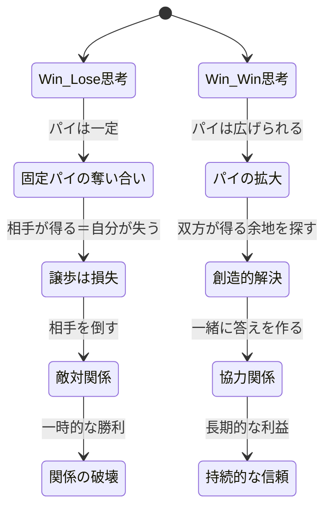
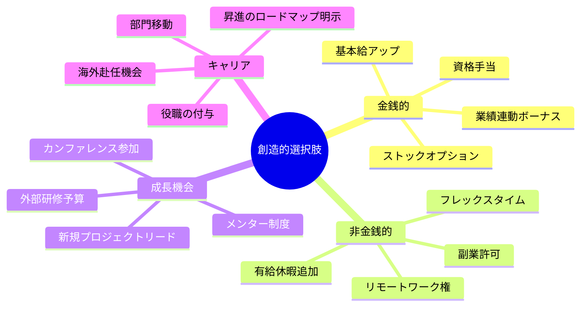
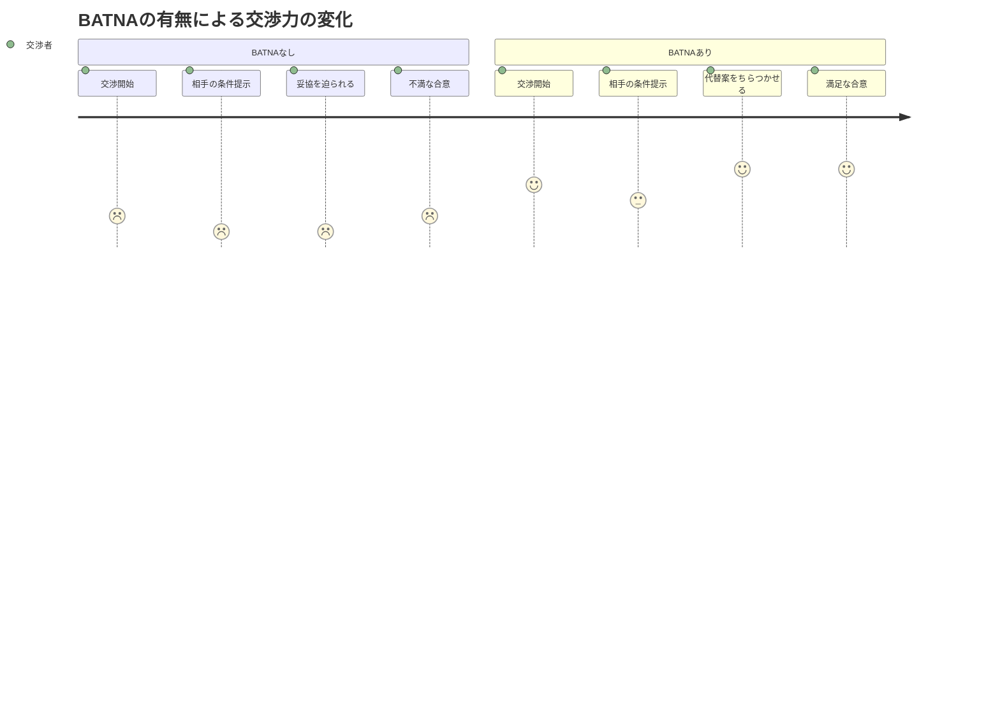

「年収を上げてほしいんですが......」

人事評価面談の席で、Webエンジニアの高橋直樹さん（32歳）は、自分でも驚くほど小さな声でそう切り出した。上司は腕を組んで「うーん、今期は業績が厳しいからね」と返す。高橋さんの頭の中には「もうダメだ」「やっぱり言わなきゃよかった」という言葉がぐるぐる回っている。結局、何も変わらないまま面談は終了。帰りの電車で転職サイトを開いた。

実はこれ、「交渉」が始まってすらいない。高橋さんがやったのは「お願い」であって、交渉ではなかった。

交渉とは、**異なる利害を持つ者同士が、双方にとって最善の合意を創り出すプロセス**だ。「勝つか負けるか」ではなく、「一緒に答えを作る」行為。この思考の転換だけで、年収交渉も、社内の予算折衝も、家族との話し合いも、結果が劇的に変わる。

---

## Win-LoseからWin-Winへ：パラダイムの転換

多くの人が「交渉＝戦い」だと思い込んでいる。しかし、ハーバード大学交渉学研究所のロジャー・フィッシャーとウィリアム・ユーリーが開発した**「原則立脚型交渉（Principled Negotiation）」**は、この常識を覆した。

Win-Loseの世界では、パイ（利益の総量）は固定されている。あなたが1切れ多く取れば、相手は1切れ少なくなる。だから交渉は「奪い合い」になる。

Win-Winの世界では、パイそのものを大きくする。あなたも相手も、今より多くを手に入れる方法を一緒に探す。これは「甘い理想論」ではない。**長期的に見れば最も合理的で、最もリターンの大きい戦略**だ。

---

## ハーバード流交渉術の4原則

### 原則1：人と問題を分離する

交渉が感情的になる最大の原因は、「人」と「問題」を混同することだ。

「あなたの要求は不当だ」→相手を攻撃している
「この条件は双方にとって不利益が大きい」→問題に焦点を当てている

同じことを伝えているのに、受け手の印象は全く違う。

### 原則2：立場ではなく利害に焦点を当てる

高橋さんの例で考えてみよう。

- **高橋さんの立場：** 「年収を50万円上げてほしい」
- **会社の立場：** 「今期はコスト削減が必要」

立場同士をぶつけると、平行線になる。しかし、**利害**に目を向けるとどうか。

- **高橋さんの利害：** 市場価値に見合った評価がほしい。成長を認めてほしい。将来の不安を解消したい。
- **会社の利害：** 優秀なエンジニアを流出させたくない。人件費の急増は避けたい。チームの士気を維持したい。

利害を見れば、「年収50万アップ」以外にも解決策が見えてくる。ストックオプション、リモートワーク手当、スキルアップ予算、役職の付与——**立場は対立していても、利害は共存できる**。

### 原則3：双方の利益を満たす選択肢を創造する

選択肢は「二者択一」ではなく「複数案の同時提示」が原則だ。「A案とB案、どちらが御社にとって良いですか？」と聞くだけで、交渉は「Yes/No」の戦いから「How」の協働に変わる。

### 原則4：客観的基準を使う

主観的な議論は平行線になる。「高すぎる」「安すぎる」の水掛け論を避けるために、**第三者的な基準**を持ち込む。

- 市場相場のデータ
- 業界の給与調査レポート
- 同規模企業の条件比較
- 専門家の評価

「転職サイトのデータでは、同等スキルのエンジニアの平均年収は○○万円です」——これだけで、交渉の土台が「感情」から「事実」に変わる。

---

## ケーススタディ1：高橋直樹さん（32歳・エンジニア）の年収交渉リベンジ

冒頭の高橋さんは、3ヶ月後にリベンジの場を設けた。

**Before（1回目の失敗）：**
- 準備なしで「上げてほしい」とお願い
- 上司の「業績が厳しい」で撤退
- 結果：変化なし。転職を検討

**セッションでの準備：**

**1. 利害の整理：**
高橋さんは自分の利害を「市場価値に見合った評価」「成長の実感」「将来の安心」と整理した。会社の利害は「エンジニアの流出防止」「コスト管理」「チーム士気」と予測した。

**2. BATNAの構築：**
BATNA（Best Alternative To a Negotiated Agreement）＝交渉が決裂した場合の最善策。高橋さんは実際に2社から内定を獲得し、具体的な条件を手元に持った。BATNAがあると、「ダメなら辞めます」ではなく「他の選択肢もある中で、この会社にいたいと思っている」と伝えられる。

**3. 複数案の準備：**
- A案：年収40万円アップ＋現行条件
- B案：年収20万円アップ＋リモートワーク週3日＋外部研修年間50万円の予算
- C案：年収据え置き＋新規プロジェクトリード権＋6ヶ月後の再評価約束

**2回目の交渉：**
「私は御社で長く活躍したいと思っています。そのために、今後の条件について一緒に考えていただけませんか」——この切り出しで、上司の姿勢が明らかに変わった。

3つの案を提示し、「どれが会社にとって実現しやすいですか？」と聞いた。上司は「B案なら人事と掛け合えるかもしれない」と前向きな回答。

**After：** B案がほぼそのまま承認。年収20万円アップに加え、週3日リモートワークと年間研修予算50万円を獲得。金銭換算すると年収50万円以上の価値向上。

「1回目は"お願い"だった。2回目は"提案"だった。この違いがすべてでした」

---

## BATNA：交渉の最重要コンセプト

Win-Win交渉において、BATNA（交渉決裂時の最善策）は**交渉力の源泉**だ。

BATNAが弱いと、どんな条件でも受け入れざるを得なくなる。BATNAが強いと、冷静に「この条件でなければ、別の道を選びます」と言える。

### BATNAを強化する3つの方法

**1. 実際に代替案を作る：** 転職交渉なら他社の内定を取る。取引交渉なら他のサプライヤーに見積もりを取る。

**2. BATNAを改善し続ける：** スキルアップして市場価値を高めることは、将来の全ての交渉のBATNAを強化する。

**3. 相手のBATNAも分析する：** 相手にとって「あなたとの交渉が決裂した場合の最善策」は何か？　相手のBATNAが弱ければ、あなたの交渉力は相対的に高まる。

---

## ケーススタディ2：岡田恵子さん（44歳・フリーランス）の契約交渉

デザイナーとしてフリーランスで活動する岡田さんは、大手クライアントから「予算が厳しいので、通常の70%の単価でお願いできませんか」と打診された。

**Before：**
- 「大手との取引実績が欲しい」という理由で、過去に何度も値引きを受け入れてきた
- 結果、月の稼働時間が200時間を超え、心身ともに限界
- 「値段の安い人」というブランドイメージが定着しつつあった

**交渉準備：**

**利害の分析：**
- 岡田さんの利害：適正な対価、持続可能な労働時間、良質な実績
- クライアントの利害：コスト削減、デザインの質の担保、長期的な関係

**BATNA：** 他に2件の案件オファーがあり、通常単価で受注可能。

**3つの提案：**
- A案：通常単価で全スコープを担当
- B案：70%の単価で、スコープを絞り込み（ページ数・修正回数を限定）
- C案：通常単価で、半年間のリテイナー契約（月額固定で安定収入をクライアントも確保）

**交渉の場で：**
「御社のプロジェクトには大変魅力を感じています。長期的に良い関係を築きたいと思っているからこそ、お互いにとってベストな形を一緒に考えたいんです」

そしてB案とC案を提示。クライアントは「月額固定なら予算が組みやすい」とC案を選択。

**After：**
- 年間契約額が前年比で40%増加
- 月の稼働時間が200時間→160時間に減少
- クライアントの満足度も向上（安定したデザインリソースの確保）
- 「岡田さんは値段以上の価値がある」という評判に変化

「"安くします"は交渉じゃなくて降伏だった。"一緒にベストを考えましょう"に変えただけで、全部変わりました」

---

## 感情をコントロールする：交渉中のEQスキル

交渉で最も危険なのは、**感情に飲まれること**だ。相手の攻撃的な言葉、予想外の条件提示、沈黙のプレッシャー——これらに対して感情的に反応すると、交渉は一気にWin-Loseの泥沼にはまる。

### 交渉中の感情管理テクニック

**テクニック1：「バルコニーに立つ」**
ハーバードのウィリアム・ユーリーが提唱した比喩。交渉のテーブルを離れて、バルコニーから自分と相手を俯瞰する想像をする。「今、何が起きているか」を客観視するだけで、感情の暴走が止まる。

**テクニック2：「6秒ルール」の応用**
相手から攻撃的な言葉を受けたら、水を一口飲む時間を確保する。[EQの記事](/blog/eq-emotional-intelligence-mastery)で解説した通り、前頭前皮質が扁桃体をコントロールするのに6秒かかる。

**テクニック3：「なぜ？」と問い直す**
相手の無理な要求に「ふざけるな」と思ったら、「なぜこの人はこの要求をしているのか？」に思考を切り替える。相手の利害が見えてくれば、感情は収まり、創造的な解決策が浮かぶ。

---

## ケーススタディ3：松本健一さん（48歳・部門長）の社内交渉

メーカーの製品開発部門長の松本さんは、来期の予算を20%カットされそうになっていた。経営企画部との交渉で最初は感情的になり、「それでは製品の質を保証できません」と声を荒らげてしまった。

**Before：**
- 「予算カットは現場を理解していない」と不満をぶつけるだけ
- 経営企画部との関係は悪化し、追加予算の要望はすべて却下
- チームの士気も低下

**セッションでの準備：**

**利害の分析：**
- 松本さんの利害：製品の競争力維持、チームのモチベーション、自部門の存在価値
- 経営企画部の利害：全社コスト最適化、株主への説明責任、他部門とのバランス

**客観的基準の準備：**
- 競合他社のR&D投資比率
- 過去3年間の製品投資と売上の相関データ
- 業界レポートの投資効率ベンチマーク

**3つの提案：**
- A案：予算10%カットで、低優先度プロジェクト2件を凍結
- B案：予算20%カットで、外部パートナーとのコスト分担モデルに移行
- C案：予算15%カットで、四半期ごとのROIレビューを導入し、成果に応じて追加投資

**交渉の場で：**
「会社全体のコスト管理が重要なのは理解しています。その上で、製品開発への投資が長期的にどういうリターンを生むか、データに基づいて一緒に考えたいんです」

競合他社の投資比率データと自社の売上相関データを提示。「単なるコスト」ではなく「投資対効果」というフレームに転換した。

**After：**
- C案が採用され、予算カットは15%に圧縮
- 四半期レビューの結果が良好で、翌期は5%の追加投資を獲得
- 経営企画部との関係が「対立」から「パートナーシップ」に変化
- 他部門からも「松本さんの交渉の仕方を教えてほしい」と依頼

「データと提案を持っていくだけで、こんなに結果が変わるとは。感情をぶつけていた自分が恥ずかしいです」

---

## 日常で交渉力を鍛える4つの習慣

### 習慣1：すべての会話で「利害」を探る

「この人は何を求めているのか？」を日常会話の中で意識する。パートナーが「今日は外食がいい」と言ったとき、立場は「外食」だが、利害は「料理をしたくない」「気分転換したい」「特別な時間を過ごしたい」かもしれない。利害がわかれば、自宅でデリバリーを取るという創造的解決策も浮かぶ。

### 習慣2：「3つの案」を常に用意する

何かを提案するとき、必ず3つの選択肢を用意する癖をつける。上司への報告も「A案がベストだと思いますが、B案とC案もあります」と伝えるだけで、「決めつけている」印象が消え、建設的な議論になる。

### 習慣3：客観的データを調べる習慣

「高い」「安い」「多い」「少ない」と感じたら、必ずデータで裏を取る。[ファーストプリンシプル思考](/blog/first-principles-thinking)で、思い込みを事実に置き換える習慣が、交渉の土台を強固にする。

### 習慣4：小さな交渉から練習する

いきなり年収交渉は難しい。まずは「飲み会の場所を決める」「家事の分担を見直す」といった日常の小さな交渉で練習する。[コンフォートゾーンの拡大](/blog/expand-comfort-zone)と同じで、小さな成功体験の積み重ねが自信を作る。

---

## まとめ：交渉は「戦い」ではなく「共創」だ

Win-Winの交渉術は、甘い理想論ではない。ハーバード大学が数十年かけて研究・実証してきた、**最も効果的で持続可能な交渉アプローチ**だ。

高橋さんは利害の分析と複数案の提示で、年収交渉をリベンジ成功させた。岡田さんは「値引き」を「パッケージ提案」に変えて年収40%アップを実現した。松本さんは客観的データを持ち込むことで、社内交渉を協力関係に転換した。

3人に共通するのは、**「お願い」を「提案」に変えた**ということだ。

交渉の本質は、相手を倒すことではなく、一緒に答えを作ること。その技術は、年収交渉だけでなく、人生のあらゆる場面であなたを助けてくれる。

---

## あなたの「交渉力」を一緒に磨きませんか？

年収交渉、社内の予算折衝、クライアントとの条件交渉、家族との話し合い——コーチングセッションでは、あなたのリアルな交渉シーンに合わせた準備と練習を行う。

- あなたの利害とBATNAの明確化ワーク
- 実際の交渉シーンを想定したロールプレイ
- 感情管理のトレーニング

**交渉を「戦い」から「共創」に変える。その第一歩を、一緒に踏み出そう。**

[無料体験セッションに申し込む](/sessions)
