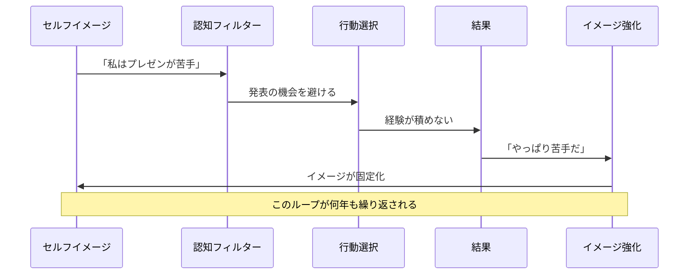
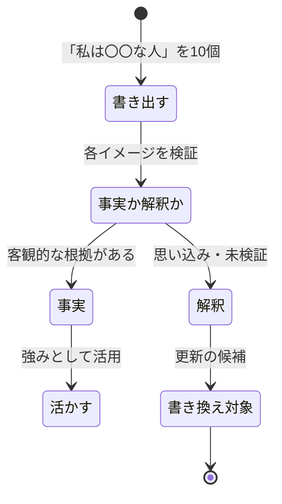

「私なんかが起業なんて、無理に決まってる」

IT企業のバックオフィスで8年間働く安藤美咲さん（33歳）は、友人の独立報告を聞いて、思わず自分に言い聞かせた。経理のスキルには自信がある。中小企業の財務支援をフリーランスでやりたいという夢もある。でも、「私はリスクが取れないタイプだから」「私は表に出る仕事は向いていないから」——その一言が、毎回すべてを止めてしまう。

この「私は〇〇なタイプ」という自己定義。実はこれこそが、あなたの現実を設計している**セルフイメージ**だ。

セルフイメージは「性格」ではない。長年の経験と解釈によって形成された**思い込み**であり、意識的に書き換えることができる。そして書き換えた瞬間から、行動が変わり、結果が変わり、現実が変わり始める。

---

## セルフイメージが現実を作る科学的メカニズム

### 自己成就予言（Self-Fulfilling Prophecy）

セルフイメージが現実化するメカニズムは、科学的に実証されている。

**「私はプレゼンが苦手」**というセルフイメージを持つと、脳は無意識に発表の機会を避ける行動を選択する。発表しないから経験が積めず、結果として本当に苦手なままになる。そして「やっぱり苦手だ」とイメージが強化される。

これは「性格」ではなく**ループ**だ。ループを変えれば結果も変わる。

### ピグマリオン効果

ハーバード大学の心理学者ロバート・ローゼンタールが1968年に行った有名な実験がある。教師に「この生徒たちは知能テストで伸びる可能性が高い」と伝えた（実際にはランダムに選ばれた生徒）。8ヶ月後、その生徒たちのIQは実際に有意に向上した。

**期待が現実を作る**——これがピグマリオン効果だ。他者からの期待だけでなく、**自分自身への期待（セルフイメージ）**も同じメカニズムで現実を形作る。

### RAS（網様体賦活系）フィルター

脳には毎秒約1,100万ビットの情報が入ってくるが、意識的に処理できるのはわずか50ビットだ。何を「重要な情報」として拾い上げるかを決めているのが、脳幹にあるRAS（Reticular Activating System）だ。

セルフイメージは、このRASの**フィルター設定**を決める。

- 「私は運が悪い」→不運な出来事ばかりが目に入る
- 「私はチャンスに恵まれている」→チャンスの兆候に気づきやすくなる

同じ現実を生きていても、セルフイメージによって**見えている世界が違う**のだ。

---

## ケーススタディ1：安藤美咲さん（33歳・経理）の「起業できない自分」の書き換え

冒頭の安藤さんのケースを詳しく見てみよう。

**Before：**
- セルフイメージ：「私はリスクが取れない堅実なタイプ」「私は裏方向きで表に出る仕事は無理」
- 行動：独立を5年間検討し続けるが、一歩も踏み出せない
- 結果：「やっぱり私には無理だ」と毎年同じ結論に到達
- 年収420万円。副業収入ゼロ。

**セッションでの気づき：**

まず、現在のセルフイメージを棚卸しした。「私は〇〇な人」を10個書き出してもらった。

1. 私はリスクが取れない人
2. 私は裏方が向いている人
3. 私は数字に強い人
4. 私は人前で話すのが苦手な人
5. 私は慎重すぎる人
6. 私は責任感がある人
7. 私は地味な人
8. 私は信頼できる人
9. 私は起業に向いていない人
10. 私は変化が苦手な人

ここで問いかけた。「この10個のうち、**事実**はどれですか？　**解釈**はどれですか？」

安藤さんは驚いた顔をした。「数字に強い」「責任感がある」「信頼できる」は8年間の実績で裏づけられる事実。しかし「リスクが取れない」「起業に向いていない」は——やったことがないのだから、**検証すらされていない解釈**だった。

**新しいセルフイメージの設定：**
「私は慎重に計画を立て、着実に実行できる人」——これは既存の強み（慎重さ、計画性）を肯定しつつ、行動の方向性を変えるイメージだ。

**ステップバイステップの実践：**
1. **月1：** クラウドソーシングで小規模な経理代行を1件受注（リスクほぼゼロ）
2. **月2〜3：** 個人事業主として開業届を提出。月に2件の案件を並行
3. **月4〜6：** LinkedInで専門知識を発信。問い合わせが来始める
4. **月7〜12：** 副業月収が15万円を安定的に超える

**After（1年後）：**
- 副業月収28万円（年間336万円）
- 本業と合わせて年収756万円（Before比80%増）
- 「リスクが取れない」→「リスクを計算して最小限に抑えられる」にイメージが更新
- 来年の独立を具体的に計画中

「私は変わったんじゃない。もともとの自分に、間違ったラベルを貼っていただけだった」——安藤さんのこの言葉は、セルフイメージ書き換えの本質を突いている。

---

## セルフイメージを書き換える4ステップメソッド

### ステップ1：現在のイメージを棚卸しする

ノートに「私は〇〇な人」を10〜15個書き出す。ポジティブなものもネガティブなものも、すべて含める。

次に、それぞれについて問いかける。

**ポイント：** ネガティブなイメージほど「解釈」であることが多い。「私は人付き合いが苦手」は、実は「過去に1〜2回の嫌な経験」から形成されていることがある。

### ステップ2：望むイメージを言語化する

書き換え対象を特定したら、**新しいイメージを具体的に言語化する**。

悪い例：「ポジティブになりたい」（抽象的すぎる）
良い例：「私はどんな状況でも学びを見つけられる人だ」（具体的で行動につながる）

**設定のコツ：** 今の自分から「一歩先」のイメージにする。「私はカリスマ経営者だ」は飛躍しすぎて脳が拒否する。「私は小さなチャレンジを楽しめる人だ」なら、信じられる範囲で行動を変えられる。

### ステップ3：エビデンスを日々収集する

新しいイメージの「証拠」を毎日集める。これが最も重要なステップだ。

例：新イメージが「私は行動力がある人」なら
- 「今日は朝10分早起きしてストレッチした」
- 「気になっていたセミナーに申し込んだ」
- 「後回しにしていたメールに返信した」

小さな事実の蓄積が、新しいイメージを**「信じたいこと」から「知っていること」に変える**。

[グロースマインドセット](/blog/growth-mindset)の記事で解説した通り、「まだ」の力を使うことがポイントだ。「私は行動力がない」ではなく「私は行動力を伸ばしている途中だ」と捉える。

### ステップ4：環境とアイデンティティを同期させる

新しいイメージを**周囲に宣言する**。「最近、朝活を始めたんだ」「副業で経理の仕事を始めた」と伝えることで、周囲もあなたをそのように扱い始める。外部からのフィードバックが、イメージの安定を加速させる。

---

## ケーススタディ2：木村翔太さん（26歳・営業）の「コミュ障」からの脱却

入社4年目の営業職。木村さんは「自分はコミュニケーションが下手」というセルフイメージに縛られ、新規開拓の成績が部署最下位だった。

**Before：**
- セルフイメージ：「私はコミュ障」「営業に向いていない」
- 行動：電話をかけるのが怖く、1日の架電数がチーム平均の半分以下
- 結果：新規獲得ゼロの月が3ヶ月続き、上司から面談を受ける
- 「転職したほうがいい」と毎日考えていた

**セルフイメージの棚卸し：**

「コミュ障」を深掘りすると、実は「初対面の人との雑談」が苦手なだけで、技術的な説明や提案プレゼンは得意だった。営業の中でも「関係構築」のフェーズだけが苦手で、「提案・クロージング」のフェーズは問題なかった。

つまり、「コミュ障」は**過度に一般化された解釈**だった。

**新しいセルフイメージ：**
「私は専門知識で信頼を勝ち取れる人」

**行動の変化：**
雑談で場を温めようとするのをやめ、最初から「御社の課題に対して、こんなデータがあります」と専門知識で切り込むスタイルに変えた。

**After（6ヶ月後）：**
- 新規獲得数がチーム平均を超える
- 「木村さんは知識が深くて信頼できる」とクライアントから評価
- 営業成績が部署3位に浮上
- 年間表彰の候補にノミネート

「"コミュ障"を直そうとしてた時は苦しかった。でも"専門家"になると決めたら、コミュニケーションの問題はほとんど消えました」

---

## ケーススタディ3：渡辺裕子さん（39歳・管理職）の「完璧主義」の書き換え

メーカーの品質保証部門のマネージャー。渡辺さんは「完璧主義は自分の強み」と長年信じてきたが、部下の離職率の高さとワークライフバランスの崩壊が限界に達していた。

**Before：**
- セルフイメージ：「私は完璧を追求する人」「妥協は許されない」
- 行動：部下の成果物をすべてチェックし、微修正を繰り返す。自分も深夜まで作業
- 結果：部下が「何を出しても修正される」と感じ、3年間で6人が退職。渡辺さん自身も慢性的な睡眠不足
- チームの生産性は部門最下位

**セルフイメージの検証：**

「完璧を追求する」の裏にある利害を探った。渡辺さんが本当に恐れていたのは、「ミスが出たとき、自分が責任を問われること」だった。「完璧主義」は、実は「失敗への恐怖」を隠すための鎧だった。

**新しいセルフイメージ：**
「私はチームの力を引き出して、高い品質を実現する人」

**行動の変化：**
- 部下の成果物チェックを「80%OKなら通す」に基準を変更
- 重要度の低い書類は部下に最終承認権を委譲
- 週1回のレビュー会議で「良かった点」から先にフィードバック

[Done is Betterの精神](/blog/done-is-better)を取り入れ、「完璧より完了」を部門のスローガンにした。

**After（1年後）：**
- 部下の離職率がゼロに
- チームの生産性が部門1位に浮上（完璧を求めすぎて遅延していたプロジェクトが期日内に完了するように）
- 渡辺さんの平均退社時間が22時→19時に
- 部門長から「渡辺さんのチームマネジメントを他のチームにも展開してほしい」と依頼

「完璧主義は"強み"だと思っていたけど、実は"恐怖の裏返し"だった。手放したら、もっと大きなものが手に入りました」

---

## セルフイメージ書き換えの「壁」と乗り越え方

### 壁1：認知的不協和

新しいイメージと古いイメージが矛盾するとき、脳は不快感（認知的不協和）を感じる。「私は行動力がある人」と唱えながら、実際にはソファで動画を見ている——この矛盾に脳は耐えられず、楽な方（古いイメージ）に戻ろうとする。

**対策：** 行動を小さく始めて、不協和を最小限にする。「1時間の運動」ではなく「5分のストレッチ」。小さな一致が、大きな書き換えの土台になる。

### 壁2：周囲の抵抗

あなたが変わると、周囲の人は不安を感じる。「急にどうしたの？」「無理してない？」——善意の心配が、イメージ書き換えの障害になることがある。

**対策：** 変化を押しつけず、自然に見せる。「最近ちょっと試してみてるんだ」程度の軽い表現で伝える。結果が出始めれば、周囲も自然に受け入れる。

### 壁3：リバウンド

ストレスが高まると、古いセルフイメージに戻りやすい。これは「デフォルト回帰」と呼ばれる現象で、脳が安全な既知のパターンに逃げようとする。

**対策：** 「リバウンドは正常なプロセスだ」と事前に理解しておく。[レジリエンス](/blog/resilience)の記事で解説した通り、「後退しない」のではなく「後退しても戻れる」ことが本当の強さだ。

---

## 今日から始める3つの実践

### 実践1：朝のイメージ宣言（30秒）

毎朝、鏡を見ながら新しいセルフイメージを声に出す。「私は小さなチャレンジを楽しめる人だ」「私は専門知識で価値を届ける人だ」。声に出すことで、脳はそれを「指令」として受け取る。

### 実践2：エビデンスノート（毎晩3行）

スマホのメモに、新しいイメージに合致した行動を3つ記録する。どんなに小さなことでもいい。「朝5分早起きした」「気になるセミナーをブックマークした」「上司に質問した」。

### 実践3：「もし新しい自分だったら？」の問いかけ

迷ったときに、「今の自分ならどうするか」ではなく**「新しいセルフイメージの自分ならどうするか」**と問いかける。この問いが、古い行動パターンから新しい行動パターンへの架け橋になる。

---

## まとめ：セルフイメージは「発見」するものではなく「設計」するもの

セルフイメージは性格診断の結果ではない。あなたが長年かけて**作り上げた設計図**だ。そして設計図は、いつでも描き直せる。

安藤さんは「リスクが取れない人」から「慎重に実行できる人」へ。木村さんは「コミュ障」から「専門知識で勝負する人」へ。渡辺さんは「完璧主義者」から「チームの力を引き出す人」へ。

3人とも、根本的な性格が変わったわけではない。**自分に貼っていたラベルを貼り替えただけ**だ。そしてラベルが変わった瞬間から、行動が変わり、結果が変わり、現実が変わった。

あなたは今、自分にどんなラベルを貼っているだろうか。そのラベルは「事実」だろうか、それとも「解釈」だろうか。

---

## セルフイメージの書き換えを、プロと一緒に

一人でセルフイメージを書き換えようとすると、「古いイメージの中にいる自分」が判断するため、客観性を保つのが難しい。コーチングセッションでは、あなたの盲点を映し出す鏡の役割を果たす。

- 現在のセルフイメージの棚卸しと「事実vs解釈」の仕分け
- あなたの強みを活かした新しいイメージの設計
- 66日間の書き換えプランの策定とフォローアップ

**あなたが「なりたい自分」は、すでにあなたの中にいる。**

[無料体験セッションに申し込む](/sessions)
