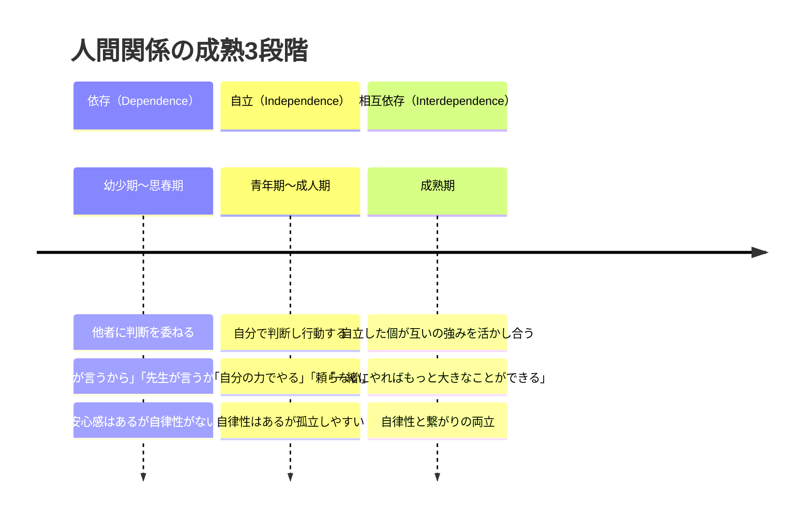
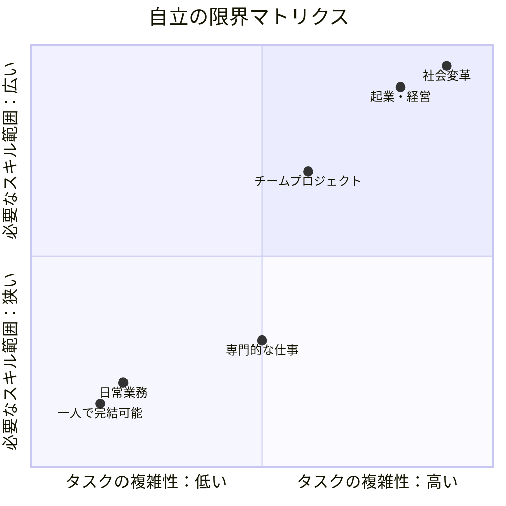
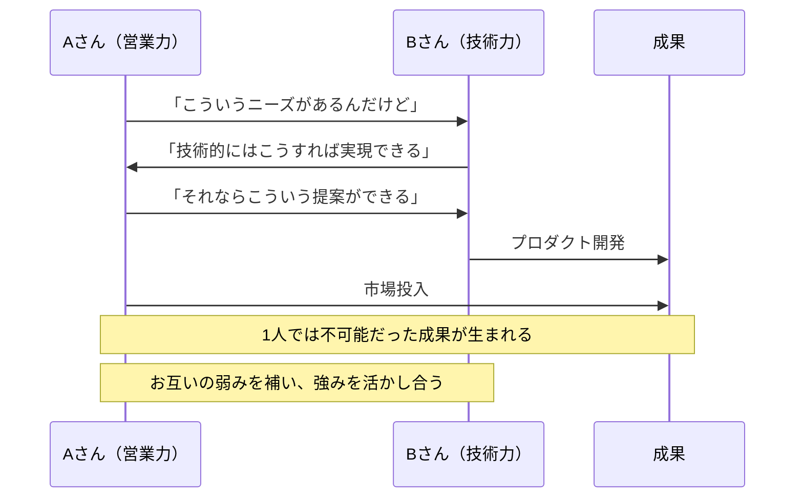
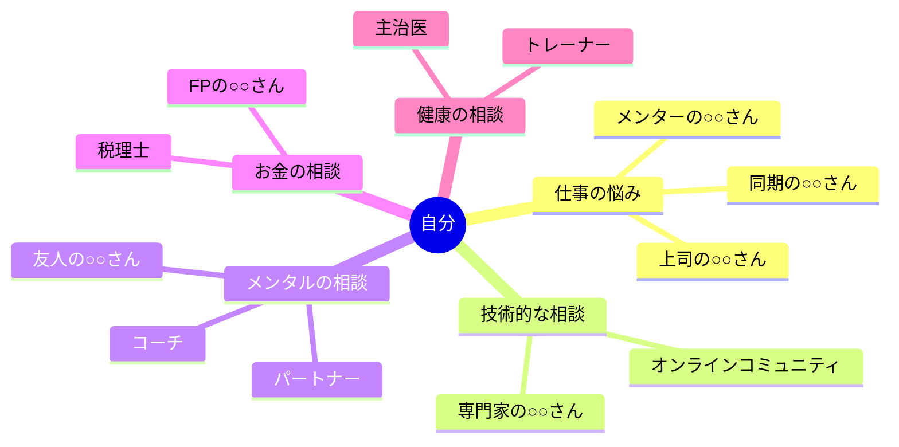

「助けてって言えなくて、気づいたら全部壊れてました」

Web制作会社を一人で経営する川島陽介さん（36歳）が、セッションの初回でそう話した。3年前にフリーランスから法人化。営業、制作、経理、請求書発行、サーバー管理——全部一人でやっていた。月商は200万円を超えたが、1日の労働時間は16時間。体重は10kg減り、パートナーとの関係も悪化。そしてある朝、起き上がれなくなった。

診断は「中等度のうつ病」。

「自立した大人になりたかったんです。誰にも頼らず、全部自分の力でやりたかった。でも、それが自分を壊した」

川島さんの話は極端に聞こえるかもしれない。でも、程度の差はあれ、**「頼ることは弱さだ」と思い込んでいる人**は驚くほど多い。

この記事では、人間関係の成熟には「依存→自立→相互依存」の3つの段階があること、そして**本当の強さは「相互依存」にある**ことを、科学とケーススタディで解説する。

---

## 人間関係の3段階：依存・自立・相互依存

スティーブン・コヴィーの『7つの習慣』で有名になった概念だ。

重要なのは、**相互依存は「依存に戻る」ことではない**という点だ。自立を経た上で、意識的に他者と協力することを選ぶ。「頼るしかないから頼る」と「頼ったほうが良いから頼る」は、まったく別のものだ。

---

## 依存の段階：必要だが、長く留まると危険

依存は人間の発達において自然な段階だ。問題は、**依存が長期化すること**だ。

### 依存の3つの兆候

1. **判断を他者に委ねる：** 「○○さんがいいって言ったから」が口癖
2. **承認なしに動けない：** 上司の「いいよ」がないと一歩も進めない
3. **責任を外部に帰属させる：** 「環境が悪い」「上司が悪い」「時代が悪い」

### 依存から抜け出せない理由

依存状態は「楽」だ。自分で決めなくていい、責任を取らなくていい。この**心理的安全地帯**が、依存を長引かせる。

しかし代償は大きい。自己決定感の欠如は、セリグマンの「学習性無力感」を引き起こし、メンタルヘルスに深刻なダメージを与える。「自分で選んだ」という感覚がないと、人はどんなに恵まれた環境にいても幸福を感じられない。

---

## 自立の段階：強いが、限界がある

多くの人が「自立」をゴールだと考えている。「誰にも頼らず、自分の力で生きていける人」が理想の大人像——この信仰は、日本文化において特に根強い。

しかし、自立には**構造的な限界**がある。

タスクの複雑性と必要なスキル範囲が増すほど、一人でこなすのは不可能になる。「すべてを一人でやる」という美学は、一定のレベルまでは機能するが、**スケールしない**。

### 自立の3つの落とし穴

**落とし穴1：燃え尽き**
すべてを自分で背負うと、物理的にリソースが足りなくなる。川島さんのように、体調を崩してから初めて限界に気づくケースは多い。

**落とし穴2：視野の狭窄**
一人で考え続けると、同じ思考パターンの中でぐるぐる回る。[ファーストプリンシプル思考](/blog/first-principles-thinking)でさえ、他者の視点がないと盲点が見えない。

**落とし穴3：孤独**
社会心理学の研究では、社会的孤立は1日15本の喫煙と同等の健康リスクがあるとされている（Holt-Lunstad et al., 2010）。自立を「孤立」と混同すると、キャリアだけでなく健康までが危険にさらされる。

---

## ケーススタディ1：川島陽介さん（36歳・経営者）の再起

冒頭の川島さんの続きだ。うつ病の診断後、3ヶ月の休養を経てセッションを開始した。

**Before：**
- 月商200万円だが、全業務を一人で担当
- 1日16時間労働、休日なし
- 「誰にも頼らない」が信条
- うつ病と診断。パートナーとの関係も危機的

**セッションの転機：**

川島さんに聞いた。「あなたのクライアントが、"全部自分でやります、誰の助けもいりません"と言ったら、どう思いますか？」

川島さんは苦笑した。「それは無理でしょう、って言いますね」

「でも、あなた自身はそれをやっている」

この瞬間、川島さんの目に涙が浮かんだ。「......確かにそうですね」

**相互依存への移行：**

1. **経理を税理士に委託**（月3万円）→月20時間の作業から解放
2. **制作の一部をフリーランスに外注**（案件の40%）→品質を維持しつつ自分の時間を確保
3. **営業を紹介制に切り替え**→既存クライアントからの紹介で十分な案件数を確保
4. **週1回、経営者仲間との勉強会に参加**→孤独感の解消と新しい視点の獲得

**After（1年後）：**
- 月商が280万円に増加（40%増）
- 労働時間が16時間→8時間に半減
- うつ病の症状が寛解。主治医から「完全に回復」と言われる
- パートナーとの関係が修復。「週末は必ず一緒に過ごす」ルールを設定

「月3万円の税理士費用を"もったいない"と思っていた自分が恥ずかしい。あの3万円が、月80時間の自由と健康を買ってくれた」

---

## 相互依存のメカニズム：1+1が10になる理由

相互依存が「依存」と本質的に異なるのは、**自立した個人同士が、意識的に強みを組み合わせる**点だ。

歴史に残る成果のほとんどは、自立した個人が互いの強みを活かし合った**相互依存のネットワーク**から生まれている。ジョブズとウォズニアック、レノンとマッカートニーのように。

### 相互依存が生む4つの価値

**1. シナジー効果：** 1人では思いつかないアイデアが生まれる
**2. レジリエンス：** 誰かが倒れても、ネットワークが支える
**3. スケーラビリティ：** 1人の限界を超えた規模の成果が可能になる
**4. ウェルビーイング：** 社会的つながりが心身の健康を支える

---

## ケーススタディ2：小野寺真理さん（28歳・デザイナー）の「頼る練習」

広告代理店でグラフィックデザイナーとして働く小野寺さん。仕事はできるが、「人に頼るのが苦手」で、いつも一人で案件を抱え込んでいた。

**Before：**
- 残業時間が月平均80時間（チーム平均の2倍）
- 「自分でやったほうが速い」が口癖
- チームメンバーとの関係は表面的で、困っていても相談しない
- ストレスチェックで「高リスク」と判定

**なぜ頼れないのか：**

掘り下げると、小野寺さんの「頼れない」には2つの理由があった。

1. **完璧主義：** 人に任せると自分の基準を満たさないのが怖い
2. **迷惑をかける恐怖：** 「頼む＝相手の時間を奪う」という思い込み

ここで、ある問いかけをした。「あなたが後輩から"困ってるんです、助けてください"と言われたら、迷惑ですか？」

小野寺さんは即答した。「全然。むしろ嬉しい。頼ってくれたんだって思う」

「じゃあ、あなたが誰かに頼ることも、相手にとっては嬉しいことかもしれませんね」

この視点の転換が、小野寺さんの大きなきっかけになった。

**相互依存への移行：**

**ステップ1：「小さな頼みごと」から始める（1〜2週目）**
「この写真のトリミング、お願いできる？」「このフォントの組み合わせ、どう思う？」——5分で終わるレベルの頼みごとから始めた。

**ステップ2：「得意分野で頼る」仕組みを作る（3〜4週目）**
チームメンバーの得意分野をリストアップし、「この作業はAさんのほうが得意」と認識して任せるようにした。

**ステップ3：「頼った結果」を記録する（5週目以降）**
頼んだことで生まれた時間、品質の変化、相手の反応を記録。「頼む＝迷惑」の思い込みが、データで崩れていった。

**After（6ヶ月後）：**
- 残業時間が月平均80時間→35時間に半減
- チームの雰囲気が活性化。「小野寺さん、最近めっちゃ頼りやすい」と後輩から好評
- ストレスチェックが「低リスク」に改善
- 制作物の品質が上がる（自分の得意な作業に集中できるようになったため）

「"自分でやったほうが速い"は事実だった。でも"自分でやったほうが良い"は嘘だった。チームでやったほうが、ずっと良いものができる」

---

## ケーススタディ3：藤原健太郎さん（50歳・部長）の「頼られる側」の変革

製薬会社の営業部長として30年のキャリア。藤原さんは「頼られる人」としてのセルフイメージが強すぎた。

**Before：**
- 部下からの相談に全て応じ、自分の仕事が後回しに
- 「藤原さんに聞けばなんでも解決する」という部署の文化
- 結果、部下が自分で考える力が育たず、藤原さんなしでは部署が回らない
- 藤原さん自身は毎日23時退社、健康診断でC判定が3つ

**問題の本質：**

藤原さんのケースは「相互依存」ではなく「部下の依存を助長している」状態だった。「頼られること」が自分の存在価値になっていて、部下の自立を無意識に妨げていた。

これは心理学で「共依存」と呼ばれるパターンだ。頼る側だけでなく、**頼られる側にも依存構造がある**。

**相互依存への移行：**

**1. 「教える」から「問いかける」へ**
部下が相談に来たとき、即座に答えを出すのをやめた。「どう思う？」「何が選択肢にある？」と問いかけるコーチングスタイルに転換。

**2. 権限委譲のロードマップ作成**
「この判断は部下に任せる」「この判断は自分が行う」の線引きを明確にし、段階的に権限を委譲。

**3. 自分の「得意」に集中**
部下が自立的に動けるようになった分、自分は「新規開拓」と「経営層への提案」という、自分にしかできない仕事に集中。

**After（1年後）：**
- 部署の売上が前年比120%に（部下が自律的に動けるようになった）
- 藤原さんの退社時間が23時→19時に
- 健康診断がオールA
- 部下の満足度調査が「部長がいなくても回る安心感がある」と高評価
- 藤原さん自身の評価は「次期執行役員候補」に

「部下に"答え"を与えていた自分は、実は部下の成長を奪っていた。問いかけに変えたら、部下も自分も楽になりました」

---

## 「頼る力」を高める5つの実践法

### 実践1：サポートネットワークマップを作る

「困ったとき誰に相談するか」を事前に決めておく。リストがあるだけで、SOSを出すハードルが劇的に下がる。

### 実践2：週に1回「頼む時間」を設ける

忙しいときほど「自分でやったほうが速い」と思いがちだが、頼むことは**時間の投資**だ。最初は時間がかかっても、2回目以降は自分の手が空く。カレンダーに「誰かに頼む/相談する」時間を30分入れておく。

### 実践3：感謝を具体的に伝える

「ありがとう」だけでなく、**何に対して、どう助かったかを具体的に伝える**。「あのデータを出してくれたおかげで、プレゼンが通りました」——この具体性が、相手の「頼られて嬉しい」を最大化する。

### 実践4：自分が頼られたときの感覚を思い出す

[セルフトーク](/blog/self-talk)として、「頼む＝迷惑をかける」を「頼む＝信頼を示す」に書き換える。自分が頼られたとき嬉しかった経験を思い出せば、この書き換えは自然に起きる。

### 実践5：「弱みを見せる」練習をする

「実はちょっと困ってまして......」と正直に言える力は、[インポスター症候群](/blog/imposter-syndrome)の克服にもつながる。完璧な自分を演じることをやめたとき、人間関係の質は飛躍的に向上する。

---

## あなたは今どの段階にいる？

**依存の兆候：** 「どうすればいいですか？」が口癖。自分で決めたことに自信が持てない。

**自立の兆候：** 「一人でやったほうが速い」が口癖。助けを求めることに抵抗がある。

**相互依存の兆候：** 「この部分は○○さんのほうが得意」と自然に言える。チームの成果に喜びを感じる。

[グロースマインドセット](/blog/growth-mindset)の観点から言えば、どの段階にいても「まだ成長の途中」だ。大事なのは、**今の段階を自覚し、次の段階に意識的に移行すること**。

---

## まとめ：「頼れる人」が最も強い

依存は自然なスタート地点。自立は必要なステップ。そして相互依存は、成熟した人間関係のゴールだ。

川島さんは「全部自分でやる」をやめて、月商40%増と健康を同時に手に入れた。小野寺さんは「小さな頼みごと」から始めて、残業時間を半減させた。藤原さんは「頼られすぎ」を手放して、チームの自律性と自分の評価を同時に高めた。

3人に共通するのは、**「頼ること」を弱さではなく戦略として捉え直した**ことだ。

一人でできることには限界がある。でも、信頼できる人と力を合わせれば、その限界は何倍にも広がる。

「頼る」ことは、相手への信頼の表明だ。そして信頼のネットワークこそが、不確実な時代における最大のセーフティネットであり、最強の成長エンジンだ。

---

## 「頼る力」を一緒に育てませんか？

「頼りたいのに頼れない」「いつも一人で抱え込んでしまう」——その癖を変えるのは、一人では難しい。なぜなら、「一人で解決しようとすること」自体がその癖だからだ。

コーチングセッションは、あなたの「相互依存のパートナー」だ。

- 「頼れない」の根本原因を一緒に探る
- サポートネットワークマップの作成
- 「小さな頼みごと」の実践プランの設計

**頼り合いながら、強くなろう。**

[無料体験セッションに申し込む](/sessions)
