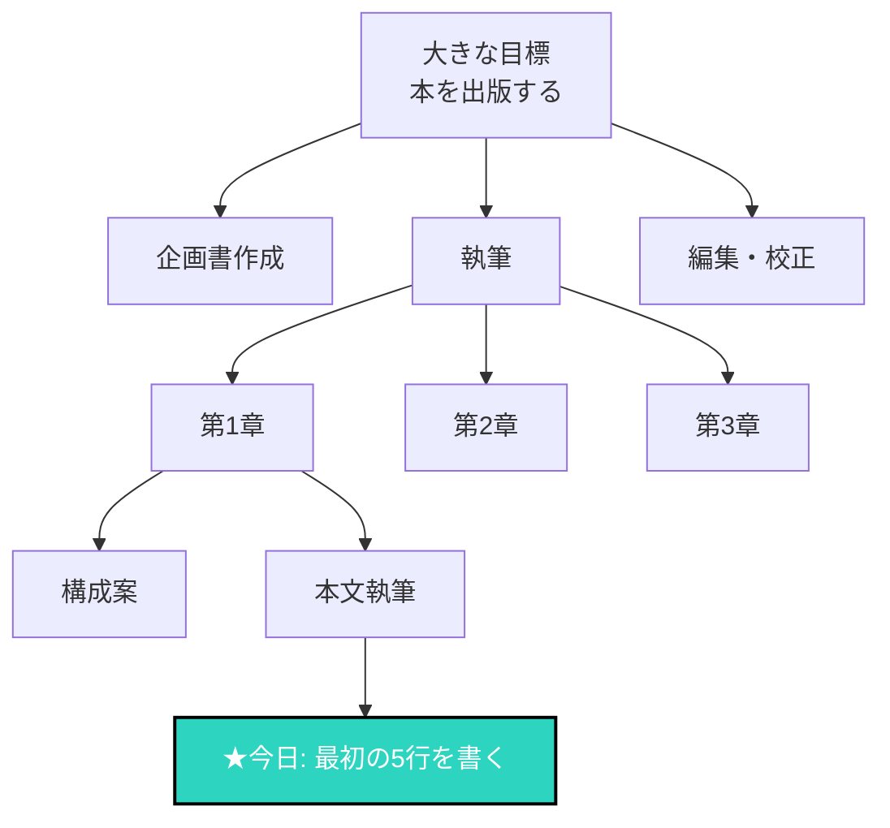

## 大きな目標に圧倒される

「本を書きたい」
「起業したい」
「資格を取りたい」

大きな目標を持つことは素晴らしい。
でも、大きすぎて何から始めればいいかわからない。

## チャンクダウンとは

大きな固まり（チャンク）を、小さな固まりに分解すること。

一口サイズにすることで、管理可能になり、行動しやすくなります。

### チャンクダウンのイメージ

## なぜチャンクダウンが効果的か

### 1. 行動しやすくなる

「本を書く」→「今日は1ページだけ書く」
小さければ、今すぐ始められます。

### 2. 進捗が見える

小さなタスクを完了すると、達成感が得られる。
モチベーションが維持できます。

### 3. 問題を特定しやすい

どこで詰まっているか、明確になります。

### 4. 見積もりが正確になる

大きなタスクの所要時間は見誤りやすい。
小さく分解すると、予測精度が上がります。

## チャンクダウンの方法

### Step 1: ゴールを明確にする

「何が達成された状態か」を具体的に定義。

### Step 2: マイルストーンを設定

ゴールまでの中間地点を設定。
3〜5つ程度が管理しやすい。

### Step 3: タスクに分解

各マイルストーンを、具体的なタスクに分解。
1つのタスクは2時間以内で完了できるサイズに。

### Step 4: 最初の一歩を決める

「今日」できる、最小のアクションを特定。

## 例：本を書く場合

**ゴール**: 200ページの本を出版する

**マイルストーン**:
1. 企画を固める
2. アウトラインを完成させる
3. 初稿を書く
4. 推敲する
5. 出版する

**「初稿を書く」のタスク分解**:
- 第1章を書く
- 第2章を書く
- ...

**「第1章を書く」のさらなる分解**:
- 導入部分を書く（今日）
- 事例を書く（明日）
- まとめを書く（明後日）

## 最初の一歩が最も重要

どんなに大きな目標も、最初の一歩から始まります。

今日、一つだけ「やれそうな小さなこと」を見つけて、やってみてください。
