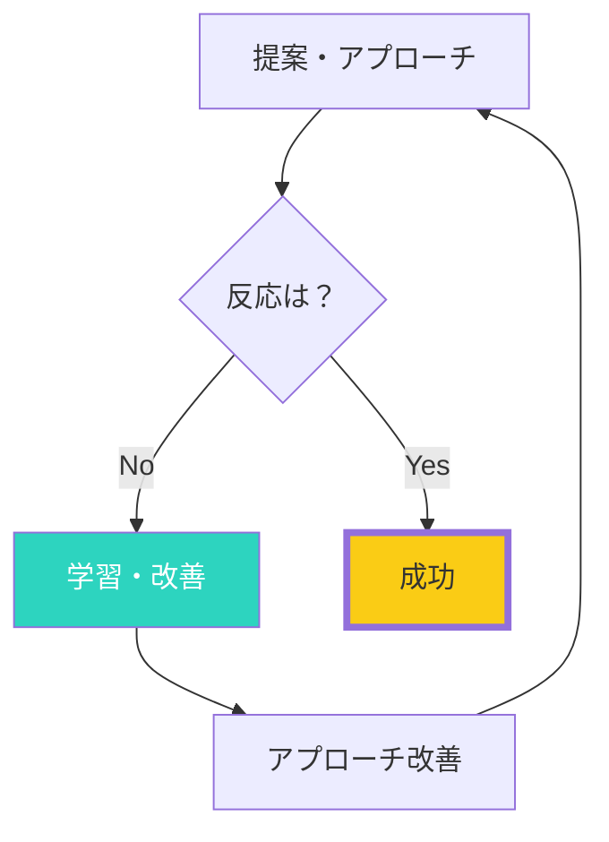

## 「No」が怖くて動けない

提案するのが怖い。
断られたらどうしよう。
恥ずかしい思いをしたくない。

多くの人が、拒絶を恐れて行動できずにいます。

## なぜ「No」を恐れるのか

進化的に、拒絶は危険のサイン。
群れから排除されることは、かつて死を意味しました。

だから脳は、拒絶を避けようとします。

### Noは成功への通過点

## 「No」への新しい見方

### 1. Noはフィードバック

「今のやり方では響かなかった」という情報がもらえた。
次に活かすデータです。

### 2. Noは選別

全員にYesと言われることはない。
Noと言う人がいるからこそ、Yesと言う人を見つけられます。

### 3. Noの数が成功を決める

多くの成功者は、人一倍多くのNoを経験しています。
Noの数と成功は、正の相関があります。

### 4. Noはまだ交渉の途中

「今すぐはNo」かもしれない。
「この条件ではNo」かもしれない。
聞いてみれば、条件次第でYesになることも。

## 拒絶への耐性を高める方法

### 1. 拒絶に慣れる

意図的に「No」をもらう練習をする。
カフェで値引き交渉をしてみる、など。

### 2. 数字で考える

「10回中1回成功すればいい」と割り切る。
確率のゲームと捉える。

### 3. 自己と提案を分離する

「私」が拒絶されたのではなく、「この提案」が合わなかっただけ。
自尊心と切り離す。

### 4. 学びに変える

「なぜNoだったか」を分析する。
次の提案に活かす。

### 5. 成功体験を思い出す

過去に「No」を乗り越えて成功した経験を振り返る。

## 最後まで立っていた者が勝つ

成功するのは、最も才能がある人ではありません。
諦めずに続けた人です。

今日、何か一つ「断られるかもしれないこと」を試してみてください。
