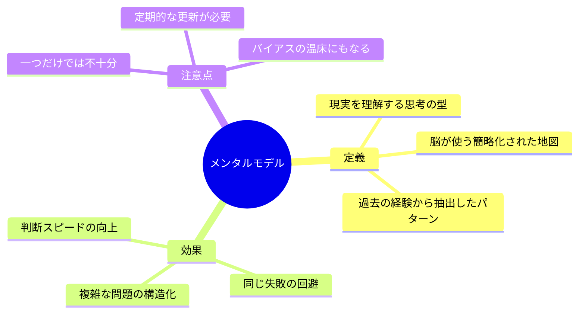
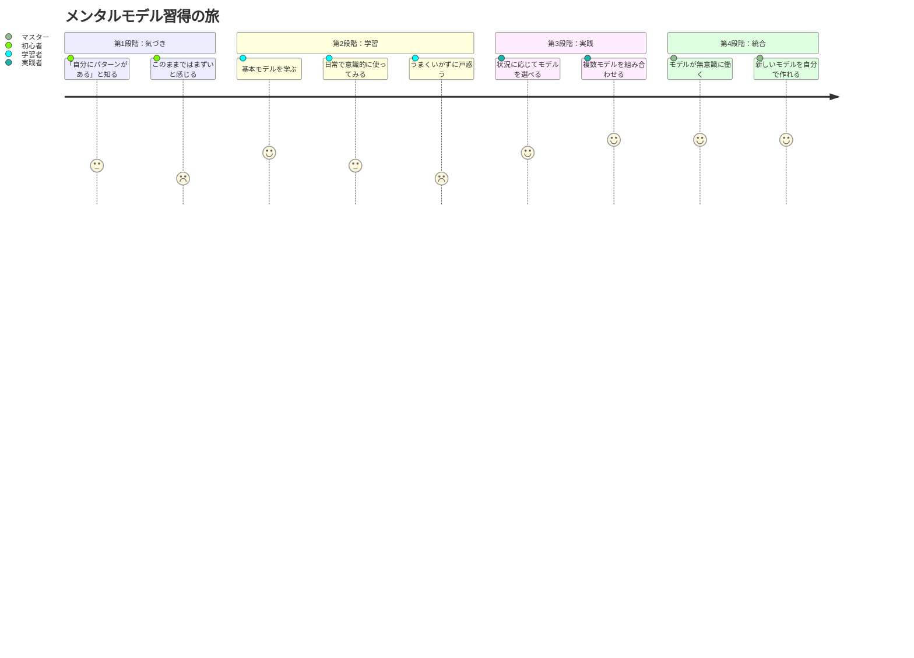
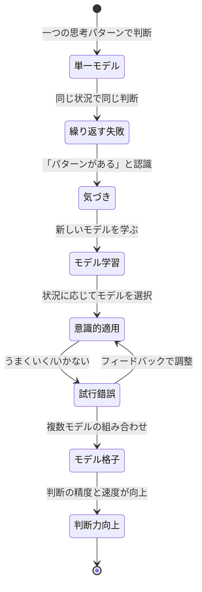

## 「なんで私、いつも同じところでつまずくんだろう」

木曜日の夜9時。コンサルティング会社で働く中村真紀さん（28歳）は、ファミレスのドリンクバーの前で溜息をついていた。

「また同じパターンだ」

3ヶ月前、チームリーダーに抜擢され、全部自分でやろうとして体を壊した。1年前も同じだった。大型プロジェクトで仕事を抱え込み、クレームが入った。大学時代のサークル運営でも、まったく同じことをやっていた。

「パターンが見えているのに、なぜ変えられないんだろう」

向かいに座った大学時代の先輩、藤井さん（32歳・事業会社の経営企画）がコーヒーを一口飲んでから、静かに言った。

「真紀、それは意志の弱さじゃないよ。**世界を見るレンズ**が一つしかないからだ」

「レンズ？」

「メンタルモデルっていうんだけど、要は**自分が無意識に使っている思考の型**のこと。真紀の場合、『責任は自分が全部負うべき』っていうモデルが強すぎるんだよ。そのモデルを持ったまま別の状況に入ると、毎回同じ判断をして、同じ結果になる」

この会話が、中村さんの人生を変える転機になりました。

## メンタルモデルとは何か

メンタルモデルとは、**現実を理解し、判断を下すために脳が使う「簡略化された世界の地図」**のことです。

世界はあまりにも複雑で、毎回ゼロから状況を分析して判断するのは不可能。だから人間は過去の経験から「パターン」を抽出し、テンプレートとして使い回しています。これがメンタルモデルです。

投資家のチャーリー・マンガーは、一つのモデルだけでは世界を理解できないとし、複数のモデルを組み合わせた「格子構造」を持つことの重要性を説きました。

重要なのは、メンタルモデルは「正しいか正しくないか」ではなく、**「今の状況に合っているかいないか」**で評価すべきだということ。かつて有効だったモデルが、環境の変化によって逆効果になることは珍しくありません。

## 7つの基本メンタルモデル

ここからは、日常生活やビジネスですぐに使える7つの基本モデルを紹介します。すべてを一度に覚える必要はありません。まずは1つか2つ、「これは自分に必要だ」と感じたものから試してみてください。

### モデル1：逆転の思考（インバージョン）

**問いを逆転させることで、解決策を見つけるモデル。**

「どうすれば成功するか」ではなく、「どうすれば確実に失敗するか」を考える。数学者カール・ヤコビが愛用した手法です。

転職を考えるとき、「どうすれば転職で確実に失敗するか」を先に考える。業界研究をしない、スキルの棚卸しをしない、条件面だけで判断する——このリストを作るだけで、「やるべきこと」が自動的に浮かび上がります。

### モデル2：第一原理思考（ファースト・プリンシプルズ）

**前提を疑い、物事を最も基本的な要素まで分解して再構築するモデル。**

「みんながそうしているから」ではなく、「なぜそうなのか」を根本から問い直す。イーロン・マスクが「バッテリーは高い」という常識を分解し、原材料コストから再設計してコストを劇的に下げた例が有名です。ポイントは「なぜ？」を最低5回繰り返すこと。[詳しい実践方法](/blog/first-principles-thinking)は別記事で解説しています。

### モデル3：80/20の法則（パレートの法則）

**結果の80%は、原因の20%から生まれるというモデル。**

イタリアの経済学者ヴィルフレド・パレートが発見した法則で、驚くほど多くの場面に当てはまります。

- 売上の80%は、顧客の20%から生まれる
- バグの80%は、コードの20%に集中する
- 成果の80%は、働いた時間の20%で生み出される

このモデルの本質は、**「すべてに等しく力を注ぐのは非効率だ」**ということ。最もインパクトのある20%を見極め、そこにリソースを集中させるのが合理的です。

[決断疲れ](/blog/decision-fatigue)の記事で紹介した「判断の格付け」も、実はパレートの法則の応用です。すべての判断を等しく扱うのではなく、影響の大きい20%の判断にエネルギーを集中させる。

### モデル4：二次効果（セカンド・オーダー・シンキング）

**ある行動の「直接的な結果」だけでなく、「その結果が引き起こす次の結果」まで考えるモデル。**

ほとんどの人は一次効果で思考を止めます。しかし、優れた判断をする人は、二次効果、三次効果まで先を読みます。

**具体例：**
- 一次効果：残業を増やして売上を上げる
- 二次効果：疲労が蓄積し、判断力が低下する
- 三次効果：ミスが増え、クレーム対応でさらに残業が増える

一次効果だけを見ると「残業=売上アップ」は正しい。しかし二次・三次効果を考えると、中長期的には逆効果であることが見える。

### モデル5：機会コスト

**「何かを選ぶことは、他の何かを捨てること」を認識するモデル。**

時間もお金もエネルギーも有限です。Aに投資するということは、その分のリソースをBには使えないということ。しかし人間は、「選んだもの」の価値は見えても、「選ばなかったもの」の価値は見えにくい。

毎晩3時間テレビを見ている場合、表面上のコストはゼロです。しかし機会コストとして、その3時間で「読めたはずの本」「学べたはずのスキル」「始められたはずの副業」が失われています。

[サンクコストの誤謬](/blog/sunk-cost-fallacy)と機会コストは表裏一体の関係にあります。過去に投じたコスト（サンクコスト）に引きずられると、未来の最適な選択肢（機会コスト）を見失います。

### モデル6：確証バイアスの認識

**自分の既存の信念を支持する情報ばかり集め、矛盾する情報を無視する傾向を意識するモデル。**

転職先を「ここにしよう」と決めかけたとき、ポジティブな口コミばかり目に入り、ネガティブなレビューは無視していませんか。対策は、**意図的に反対意見を探すこと**。「自分の判断が間違っている証拠は何か」と問いかける習慣だけで、判断の精度は大きく変わります。

### モデル7：地図は領土ではない

**自分が持っている「世界の理解」は、世界そのものではないことを認識するモデル。**

アルフレッド・コージブスキーが提唱した概念。地図はどれだけ精密でも、地形のすべてを再現できない。同じように、私たちの理解は現実のすべてを捉えてはいない。このモデルが教えてくれるのは**謙虚さ**——「自分の理解が完全ではない」と認識することで、新しい情報を受け入れ、モデルを更新し続けられます。

## ケーススタディ1：中村真紀さんの「レンズの追加」

冒頭の中村さんのケースに戻りましょう。

中村さんの元々のモデルは「リーダーは全責任を負うべき」。個人プレーヤー時代には有効でしたが、10人以上のチームを率いる場面では逆効果でした。藤井さんとの会話をきっかけに、3つのモデルを追加しました。

**追加モデル1：80/20の法則**

「自分がやるべき仕事は、全体の20%だけ。残りの80%は、メンバーに任せた方がチーム全体の成果は上がる」

この考え方を取り入れた初日、中村さんはこう言います。

「怖かったです。でもタスクリストを作って、本当に自分しかできないことに印をつけたら、30個中6個しかなかった。残りの24個は、メンバーの方がうまくやれるものばかりでした」

**追加モデル2：二次効果**

「自分がすべてやる」の一次効果は「品質が保たれる」。しかし二次効果は「メンバーが成長しない」「自分が倒れたらチームが機能停止する」。三次効果は「メンバーのモチベーションが下がり、離職率が上がる」。

「二次効果を紙に書き出したとき、背筋が凍りました。私が『チームのためにがんばっている』と思っていたことが、実はチームを弱体化させていたんです」

**追加モデル3：地図は領土ではない**

「『リーダーはこうあるべき』というのは、私が作った地図であって、現実ではない」と認識すること。

**3ヶ月後の変化：**
- 残業時間：月80時間 → 月30時間
- チームの月間売上：前年同期比120%（メンバーの自主性が向上）
- 中村さん自身のストレススコア（PSS-10）：32点 → 18点
- メンバーの満足度アンケート：平均3.2 → 4.1（5段階）

## ケーススタディ2：田中誠也さんの「副業の迷い」

田中誠也さん（30歳）は、IT企業のインフラエンジニア。年収は500万円。副業を始めたいが、何を選べばいいのかわからず、半年以上迷い続けていました。

「プログラミングの受託もいいし、技術ブログで発信もしたいし、エンジニア向けのオンラインスクールの講師にも興味がある。でもどれを選んでも、他を捨てることになると思うと決められなくて」

田中さんは3つのメンタルモデルを適用しました。

**インバージョン**で「副業で確実に失敗するパターン」をリストアップ。本業に支障が出る、初期コストが大きすぎる、自分のスキルと無関係——これでスクール運営が消え、初期コストゼロの選択肢に絞れた。

**機会コスト**で3つの選択肢の「失うもの」を比較。

| 選択肢 | 得られるもの | 失うもの（機会コスト） |
|--------|------------|---------------------|
| プログラミング受託 | 即収入 | 発信力、長期的な資産 |
| 技術ブログ | 発信力、資産性 | 即収入、短期リターン |
| スクール講師 | 教える力、人脈 | 初期投資の時間が膨大 |

**80/20の法則**で「市場価値が最も高い20%のスキル」を特定。田中さんの場合、AWS×セキュリティが上位20%に入る専門性だった。

**結論：** AWS×セキュリティの技術ブログからスタート。記事が溜まったら受託にスケール。

「3つのモデルを組み合わせたら、半年迷っていたことが2時間で決まりました。構造的に導き出した答えだから、後から揺れないんです」

**6ヶ月後の結果：**
- 技術ブログ：月間PV 15,000達成
- ブログ経由の受託案件：月2件（月10万円の副収入）
- 本業への悪影響：ゼロ（むしろ技術力向上で評価アップ）

## ケーススタディ3：佐藤礼子さんの「人間関係のリセット」

佐藤礼子さん（35歳）は、メーカーの人事部で10年間勤務。職場の人間関係に慢性的な疲れを感じていました。

「全方位に気を使い続けて、金曜日の夜にはぐったりです」

佐藤さんの根底にあったモデルは「全員に好かれなければならない」。インバージョンで「人間関係で確実に消耗するパターン」を書き出し、確証バイアスの認識で「断ると嫌われる」という信念の反証を探しました。

すると、断っても普通に接してくれた人の方が圧倒的に多く、議論の後に感謝されたケースもあった。

「反証を探した瞬間、世界の見え方が変わりました。私が恐れていたことは、ほとんど実際には起きていなかったんです」

**6ヶ月後の変化：**
- 残業（他人の仕事の引き受け分）：週8時間 → 週2時間
- 「自分の意見を言えた」と感じた週の回数：1回 → 4回
- 上司からの評価が上がった（「佐藤さんは最近、自分の意見を持つようになった」）

## メンタルモデルを「使いこなす」ための3つの原則

### 原則1：一度に一つずつ

7つのモデルを同時に使おうとすると混乱します。まずは1つだけ選んで、1週間集中的に使ってみてください。たとえば今週は「インバージョン」だけを意識して、すべての判断で「逆に考えたらどうなるか」を問いかける。

### 原則2：書き出す

メンタルモデルは「頭の中」だけで使おうとすると、既存の思考パターンに引き戻されます。必ず紙やノートに書き出す。[ディープワーク](/blog/deep-work)の環境で静かに書き出す時間を持つことを強くお勧めします。

### 原則3：定期的にメンテナンスする

メンタルモデルは一度学んだら終わりではありません。環境が変われば、有効なモデルも変わります。月に一度、「今の自分に合わなくなったモデルはないか」を振り返る時間を設けましょう。[思考の定期メンテナンス](/blog/thinking-maintenance)で、具体的な振り返りの方法を詳しく解説しています。

## 「武器庫」を持つということ

メンタルモデルは、文字通り「思考の武器」です。

武器が一つしかなければ、すべての敵にハンマーで立ち向かうことになる。でも武器庫に剣も盾も弓も槍もあれば、状況に応じて最適な武器を選べる。

中村さん、田中さん、佐藤さんの3人に共通しているのは、**新しいメンタルモデルを手に入れたことで、見える世界が変わった**ということです。問題そのものは同じでも、見るレンズが変わると、解決策が変わる。

今日紹介した7つのモデルは、あなたの武器庫の最初のアイテムにすぎません。この「思考の武器庫」シリーズでは、[意思決定フレームワーク](/blog/decision-frameworks)、[認知バイアスとの付き合い方](/blog/cognitive-bias-allies)、そして[思考の定期メンテナンス](/blog/thinking-maintenance)と、さらに実践的なモデルと活用法を深掘りしていきます。

まずは一つ。今日の帰り道に、一つだけ試してみてください。

「今、自分はどのメンタルモデルを使って判断しているだろう？」

その問いかけ自体が、すでに最初の武器になっています。

---

**「何度も同じパターンでつまずく」自分を変えたいあなたへ**

ライフコーチングでは、あなたが無意識に使っているメンタルモデルを一緒に言語化し、状況に合った新しいモデルを実装するプロセスをサポートします。

[無料セッションで思考のクセを発見する →](/sessions)
