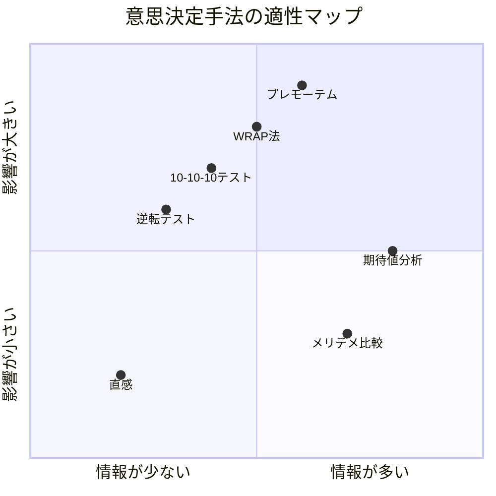
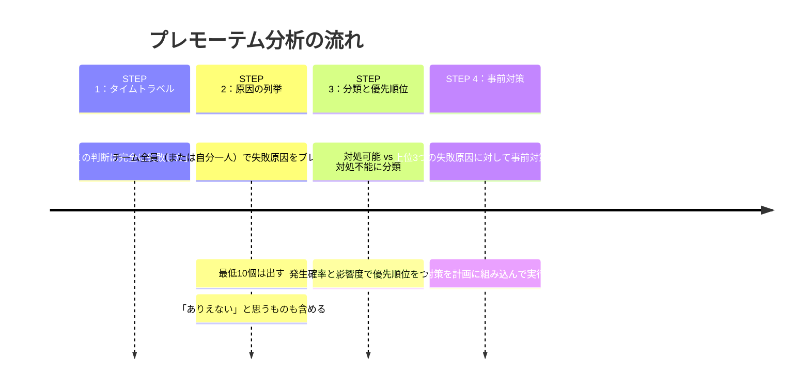
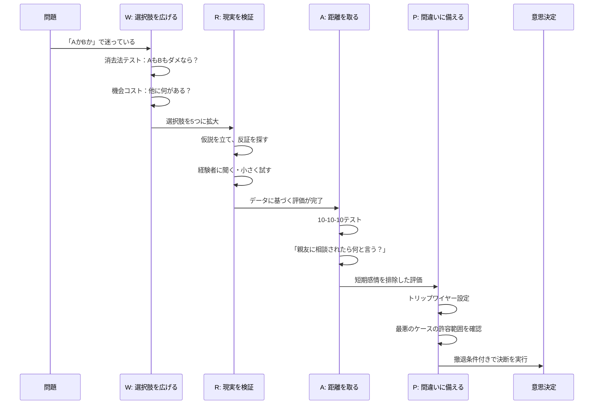

## 「どっちを選んでも後悔しそうで、もう3ヶ月動けません」

土曜日の午前11時。カフェの窓際席で、松本健一さん（31歳・SaaS企業の営業マネージャー）は、両手で頭を抱えていた。

テーブルの上には、ノートに書き殴った2つのリストがある。

**選択肢A：現職に残る**
- 年収650万、来年は昇格の可能性
- チームメンバーとの関係は良好
- ただし、経営方針に疑問がある
- 成長が頭打ちになっている実感

**選択肢B：スタートアップに転職**
- 年収550万（100万ダウン）、ストックオプションあり
- 事業領域に強い興味
- ただし、安定性は皆無
- 妻は第一子を妊娠中

「どっちにもメリットとデメリットがあるんです。頭ではわかってる。でも決められない。決めたら後悔しそうで怖いんです」

松本さんの対面に座っていたのは、コーチングを受けている相手の鈴木さん（38歳・元外資コンサル、現在独立）だった。

鈴木さんはノートを一瞥して、こう聞いた。

「健一くん、そのリストを3ヶ月前にも見せてくれたよね。中身、ほとんど変わってないよ」

「……はい」

「メリット・デメリットを並べて答えが出ないとき、それは**ツールが間違っている**んだ。包丁でネジは回せない。判断の種類に合ったフレームワークを使わないと、永遠に迷い続ける」

この会話が、松本さんに「意思決定フレームワーク」という武器を手渡すきっかけになりました。

## なぜメリデメ比較では決められないのか

「メリットとデメリットを書き出して比較する」——これは最も広く使われている意思決定の方法です。しかし、この方法には構造的な限界があります。

メリデメ比較が有効なのは、**情報が十分にあり、影響が比較的小さい判断**です。しかしキャリアの転換や起業といった**不可逆性が高く、情報が不完全な判断**には向いていません。

**理由1：項目の重みが反映されない。**「年収100万ダウン」と「成長機会」を同じ1行で書くと等価に見えるが、実際の重みはまったく異なる。

**理由2：感情が数値化できない。**「妻の不安」「自分のワクワク感」は箇条書きにできても、比較するスケールがない。

**理由3：未来の不確実性が考慮されない。**メリデメリストは「今」のスナップショットであり、3年後、5年後の変化が含まれていない。

だからこそ、判断の種類に応じた専用のフレームワークが必要なのです。

## フレームワーク1：10-10-10テスト

**「時間軸を変えることで、感情のバイアスを外す」フレームワーク。**

作家のスージー・ウェルチが提唱した手法で、3つの問いを投げかけます。

1. この決断について、**10分後**の自分はどう感じるか
2. この決断について、**10ヶ月後**の自分はどう感じるか
3. この決断について、**10年後**の自分はどう感じるか

松本さんのケースに適用してみましょう。

**「スタートアップに転職する」を選んだ場合：**
- 10分後：不安で胃が痛い。「本当に大丈夫か」と何度も考える
- 10ヶ月後：新しい環境に慣れ、やりがいを感じている可能性が高い。年収ダウンにも適応しているだろう
- 10年後：スタートアップの成長に貢献した経験は、どの道に進んでもキャリアの大きな資産になっている

**「現職に残る」を選んだ場合：**
- 10分後：ホッとする。安心感
- 10ヶ月後：昇格しているかもしれないが、「あのとき転職していたら」と考えている可能性が高い
- 10年後：41歳。転職のハードルはさらに上がっている。「あのとき動くべきだった」と後悔しているかもしれない

「10分後の感情」と「10年後の感情」が矛盾するとき、**10年後を優先するのが、後悔しない判断の原則**です。10分後の不安は一時的ですが、10年後の後悔は積み重なった機会損失。[サンクコストの誤謬](/blog/sunk-cost-fallacy)で解説した構造と同じです。

## フレームワーク2：逆転テスト（リバーサル・テスト）

**「もし今すでにBの状態だったら、Aに戻りたいか」を問うフレームワーク。**

哲学者ニック・ボストロムが提唱した思考実験で、現状維持バイアスを打破するのに極めて有効です。

**松本さんのケースに適用：**

「もし今すでにスタートアップで働いていたとしたら、100万円の年収アップのために現職（大企業SaaS）に戻りたいと思うか？」

松本さんの答えは明確でした。

「……戻りたくない。たぶん、絶対に戻りたくないと思います」

「じゃあ、なぜ今の状態から動けないの？」

「……現状維持が楽だから、ですね」

逆転テストが強力なのは、**「選択」の問題を「維持」の問題に変換する**からです。人間は「何かを選ぶ」ことには強い抵抗を感じますが、「今あるものを手放す」ことには明確に判断できます。

この考え方は、[第一原理思考](/blog/first-principles-thinking)にも通じます。「みんながこうしているから」「今までこうだったから」という前提を外して、ゼロベースで考える力。

## フレームワーク3：プレモーテム分析

**「すでに失敗した前提で、その原因を分析する」フレームワーク。**

心理学者ゲイリー・クラインが考案した手法です。通常の「ポストモーテム（事後検証）」を事前に行うことで、計画の盲点を発見します。

**手順：**

1. 意思決定を「実行した1年後」に時間を飛ばす
2. 「完全に失敗した」と想定する
3. 「なぜ失敗したのか」を、できるだけ多くリストアップする
4. そのリストを見て、事前に対処可能なものを特定する

**松本さんのスタートアップ転職にプレモーテムを適用：**

「1年後、スタートアップへの転職は完全に失敗だった。なぜか？」

列挙された失敗原因：
1. 資金調達に失敗し、半年で会社が傾いた
2. 創業メンバーとの価値観が合わなかった
3. 年収ダウンが家計を圧迫し、夫婦関係が悪化した
4. 営業のやり方が大企業と全く違い、成果が出なかった
5. ストックオプションが紙切れになった
6. 自分のスキルが通用しなかった

**対処可能なもの：**
- 3（家計） → 転職前に6ヶ月分の生活防衛資金を確保する。妻と家計シミュレーションを共有する
- 2（価値観） → 入社前にCEOと複数回の1on1を設定。退職した元社員にも話を聞く
- 4（営業スタイル） → 入社前にスタートアップ営業の経験者3人にヒアリングする

**対処不能だが許容判断が必要なもの：**
- 1（資金調達） → 最悪のケースで半年後に転職活動を再開する覚悟があるか
- 5（ストックオプション） → あくまでボーナスとして扱い、期待しない

「プレモーテムをやった後、不思議と不安が減りました。漠然とした恐怖が、具体的なリスクリストに変わったからです。具体的なリスクには、具体的な対策が打てる。怖いのは『何が起きるかわからない』ことであって、『何が起きうるか』がわかれば対処できる」

## フレームワーク4：WRAP法

**チップ・ハースとダン・ハースが著書『決定力！』で体系化した、意思決定の4ステップ。**

WRAPは、人間が陥りやすい4つの意思決定の罠に対応する、構造化されたプロセスです。

| ステップ | 意味 | 対処する罠 |
|---------|------|-----------|
| **W**iden your options | 選択肢を広げる | 「AかBか」の二項対立に陥る罠 |
| **R**eality-test | 現実を検証する | 確証バイアスの罠 |
| **A**ttain distance | 距離を取る | 短期的な感情に流される罠 |
| **P**repare to be wrong | 間違いに備える | 過信の罠 |

### ケーススタディ：大野香織さんのWRAP実践

大野香織さん（33歳・広告代理店のプランナー）は、結婚を控えていました。問題は「住む場所」。

夫の勤務先は横浜、香織さんの勤務先は渋谷。「横浜に住むか、渋谷近辺に住むか」で3ヶ月揉めていました。

**W（選択肢を広げる）：**

「横浜か渋谷か」という二択を疑いました。

「本当にこの2つしか選択肢がないのか？」

結果、5つの選択肢が出てきた。
1. 横浜（夫の通勤優先）
2. 渋谷近辺（香織さんの通勤優先）
3. 武蔵小杉（中間地点、通勤30分ずつ）
4. リモートワーク前提で郊外
5. まず賃貸で試して、1年後に判断を延期

「二択で揉んでいたのが嘘みたいに、選択肢3と5が出た瞬間、視界が開けました」

**R（現実を検証する）：**

各選択肢について「自分の仮説」と「実際のデータ」を突き合わせました。

「渋谷近辺は家賃が高すぎる」と思い込んでいたが、実際に調べると渋谷から2駅離れるだけで家賃が3割下がるエリアがあった。「武蔵小杉は混む」と聞いていたが、時差出勤なら問題ないことがわかった。

**A（距離を取る）：**

10-10-10テストを適用。

- 10分後：武蔵小杉は馴染みがなくて不安
- 10ヶ月後：通勤ストレスが減り、二人とも余裕がある
- 10年後：子供ができたとき、教育環境も良い

**P（間違いに備える）：**

「賃貸で武蔵小杉に住んでみて、合わなければ1年後に引っ越す」というトリップワイヤー（撤退条件）を設定。

**結果：** 武蔵小杉の賃貸に引っ越し。半年後、二人とも「この判断は正解だった」と回答。通勤時間はそれぞれ片道28分と32分で、以前（夫：60分、香織さん：15分 or 逆）より二人の合計が改善。

## フレームワーク5：期待値×後悔最小化

**ジェフ・ベゾスが Amazon 創業時に使った「後悔最小化フレームワーク」と、期待値計算を組み合わせた手法。**

ベゾスは1994年、安定した金融業界の仕事を辞めてAmazonを創業するかどうか迷いました。そのとき彼が使ったのが「80歳の自分」の視点です。

「80歳になった自分が振り返ったとき、挑戦しなかったことを後悔するだろうか？」

答えはYesでした。だから辞めた。

このフレームワークを、より構造的に使う方法を紹介します。

**ステップ1：各選択肢の期待値を概算する**

完璧な計算は不要です。「うまくいった場合」と「うまくいかなかった場合」のシナリオと確率を、ざっくり見積もるだけで十分。

**ステップ2：80歳の自分に聞く**

「80歳の自分が振り返ったとき、どちらの選択を後悔するか」を問う。

**ステップ3：期待値と後悔を統合する**

期待値が高く、かつ後悔が小さい選択肢が最適解。

### 松本さんの最終判断

松本さんは、5つのフレームワークを順番に適用した結果、こう振り返ります。

「面白いことに、5つのフレームワークすべてが同じ方向を指していました。10-10-10テストでは10年後の後悔、逆転テストでは『戻りたくない』、プレモーテムでは対処可能なリスク、WRAP法では選択肢の拡大（実は『転職しつつ副業で現職クライアントと関係維持』という第三の道があった）、後悔最小化では80歳の視点」

「でも最も決め手になったのは、プレモーテムでした。漠然とした不安が、具体的な対策リストに変わった瞬間、『これなら行ける』と腹落ちしたんです」

**松本さんの最終判断：** スタートアップへ転職。生活防衛資金6ヶ月分を確保、妻と月1回の家計レビューを約束、入社前にCEOと複数回の1on1を実施、半年後にトリップワイヤーを設定。

**1年後の結果：**
- スタートアップのARRが転職時の3倍に成長、松本さんは営業部長に昇格
- 年収はストックオプション込みで前職を超えた
- 妻のコメント：「転職してから、夫の目が輝いている。それが一番嬉しい」

## 5つのフレームワークの使い分け

すべてのフレームワークをすべての判断に使う必要はありません。判断の種類に応じて、最適なツールを選びましょう。

| 判断の特徴 | 最適なフレームワーク | 理由 |
|-----------|-------------------|------|
| 感情に流されそう | 10-10-10テスト | 時間軸で感情を客観視 |
| 現状維持バイアスがある | 逆転テスト | 現状を「選択」に変換 |
| リスクが見えない | プレモーテム | 失敗シナリオを事前に可視化 |
| 選択肢が少なすぎる | WRAP法 | 構造的に選択肢を拡大 |
| 人生の大きな分岐 | 後悔最小化 | 長期視点で最適解を導出 |

フレームワークは**「答え」を出すツールではなく、「考え方」を整理するツール**です。[決断疲れ](/blog/decision-fatigue)の記事で解説した通り、判断力は有限のリソース。フレームワークで判断プロセスを構造化することは、その有限なリソースを最大限に活用することでもあります。

## 明日から使える「判断の型」

最後に、日常で最も手軽に使える「判断の型」を紹介します。

**「不可逆か、可逆か」の仕分け**

ジェフ・ベゾスは意思決定を「一方通行のドア（不可逆）」と「両方向のドア（可逆）」に分類しています。一方通行のドア（結婚、退職、大きな投資）は慎重にフレームワークを使う。両方向のドア（ランチ、メール、日程）は速く決める。

[朝時間の設計](/blog/morning-routine)で紹介した服選びの自動化も同じ原理。多くの人は、この使い分けが**逆転**しています。それを正すだけで、判断の質と速度は劇的に改善します。

あなたが今悩んでいるその判断——一方通行のドアですか、両方向のドアですか？

---

**「決められない自分」を卒業したいあなたへ**

ライフコーチングでは、あなたが今抱えている「決められない問題」に、最適な意思決定フレームワークを一緒に適用するワークを行います。頭の中のモヤモヤを構造化し、「これなら行ける」という確信に変えるプロセスです。

[無料セッションで判断の突破口を見つける →](/sessions)
