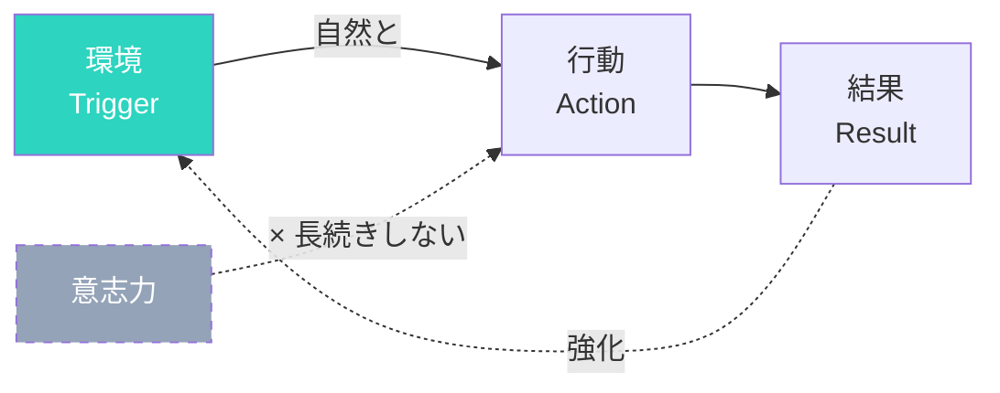

## 意志力では続かない

「明日から毎日運動する」
「お菓子はもう食べない」
「SNSを見る時間を減らす」

決意だけでは、長続きしない。
なぜなら、意志力には限界があるからです。

## 環境が行動を決める

研究によると、人の行動の多くは環境によって左右されます。

お菓子が目に見える場所にあると、つい手が伸びる。
ジムが近いと、運動頻度が上がる。

### 行動変容のメカニズム

## 環境デザインの原則

### 原則1: 摩擦を減らす（良い習慣）

やりたいことは、できるだけ簡単に始められるようにする。

- 運動したい → 運動着を玄関に置く
- 本を読みたい → ベッドサイドに本を置く
- 水を飲みたい → デスクに水筒を置く

### 原則2: 摩擦を増やす（悪い習慣）

やめたいことは、できるだけ面倒にする。

- SNSを見すぎる → アプリを削除、ログアウトする
- お菓子を食べすぎる → 買わない、見えない場所に置く
- 夜更かしする → スマホをリビングに置いて寝室へ

### 原則3: きっかけを可視化する

行動のトリガーを目に見える形で設置する。

- 薬を飲み忘れる → 朝食のテーブルに置く
- 瞑想を忘れる → クッションを目立つ場所に
- ストレッチを忘れる → ヨガマットを敷きっぱなしに

## 環境デザインの例

### 仕事環境

- スマホを引き出しに入れる（集中したいとき）
- 必要なツールだけデスクに置く
- 雑音をブロックするヘッドホン

### 自宅環境

- テレビのリモコンを遠くに置く
- 健康的な食べ物を手前に、不健康なものを奥に
- 運動器具をリビングに置く

## 一度設定すれば、自動で動く

環境デザインの良いところは、一度設定すれば継続的に効果があること。

毎回意志力を使う必要がなくなります。

今日、一つだけ環境を変えてみてください。
それが新しい習慣のきっかけになります。
