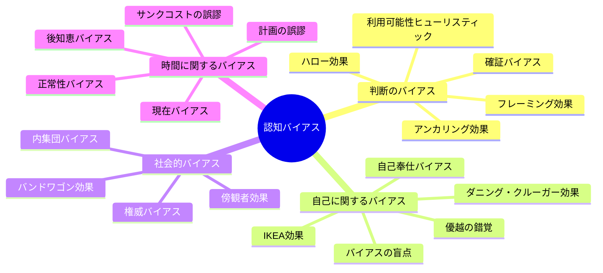
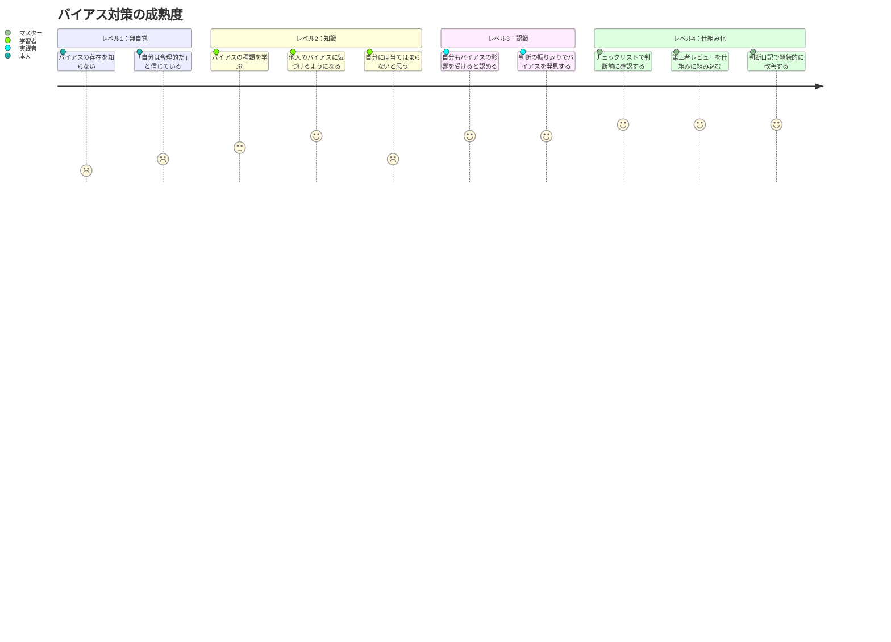

## 「自分は冷静に判断できている」と思った瞬間、あなたはすでに罠にはまっている

火曜日の夜7時。大手メーカーの商品企画部で働く河野あかりさん（29歳）は、チームの会議室で声を荒げていた。

「このデザイン案Aが絶対にいいんです。消費者調査でも支持率が高い。なぜBに変える必要があるんですか」

上司の伊藤部長（45歳）が穏やかに答えた。

「河野さん、調査データをもう一度見てみて。支持率はA案52%、B案48%。統計的にはほぼ差がない。でもB案の方が『購入意向』が15ポイント高い。河野さんがA案を推すのは、A案を自分が企画したからじゃないか？」

沈黙。

「……そうかもしれません」

河野さんが経験したのは、**IKEA効果**（自分が作ったものを過大評価するバイアス）と**確証バイアス**（自分の信念を支持する情報だけを集めるバイアス）のダブルパンチでした。

そして伊藤部長の指摘がなければ、河野さんは自分がバイアスに支配されていることに気づかなかったでしょう。これが認知バイアスの最も厄介な性質です——**バイアスの中にいる人間は、自分がバイアスの中にいることに気づけない**。

## 認知バイアスの全体像

認知バイアスとは、脳が効率的に判断するために使う「近道（ヒューリスティック）」が引き起こす、体系的な判断の歪みです。

サバンナで茂みが揺れたとき、「とりあえず逃げる」と即断する個体が生き残った。この「速い判断」は生存には有効でしたが、現代のキャリアや投資判断では体系的なエラーを引き起こします。心理学者ダニエル・カーネマンが「システム1（速い思考）」と呼んだもの——その副作用が認知バイアスです。



ここからは、日常生活で最も影響の大きい認知バイアスを4つのカテゴリに分けて解説します。すべてを一度に覚える必要はありません。まずは「自分に刺さるもの」を3つほど見つけてください。

## カテゴリ1：判断を歪めるバイアス

### 確証バイアス（Confirmation Bias）

**自分の既存の信念を支持する情報を優先的に集め、矛盾する情報を無視する傾向。**

「バイアスの王」と呼ばれる最も強力なバイアスです。冒頭の河野さんのケースが典型——A案に有利なデータだけが目に入り、不利なデータは無意識に割り引いていた。

転職先を決めかけたときにポジティブな口コミだけ読む、投資した株が下がったとき「まだ大丈夫」という情報ばかり探す、パートナーとの問題で「相手が悪い」証拠を集める。すべて確証バイアスです。

**対策：** 意図的に反対の立場に立って反論を組み立てる「デビルズ・アドボケイト」。信頼できる人に「この判断の穴を見つけてほしい」とお願いするのも有効です。

### アンカリング効果（Anchoring Effect）

**最初に提示された数字や情報が、その後の判断の基準（アンカー）になってしまう傾向。**

不動産屋が最初に予算オーバーの物件を見せるのは、アンカリング効果を利用しています。5,000万円の物件を見た後に3,500万円の物件を見ると、「お手頃だ」と感じる。しかし最初に3,000万円の物件を見ていたら、3,500万円は「高い」と感じるはず。

**ケーススタディ：岡田俊介さん（27歳）の年収交渉**

「最初のオファーが450万円。前職420万円だったので『30万円アップ』と喜びそうになった。でも冷静に考えると、適正かどうかは前職ではなく市場相場で判断すべき」

市場相場の中央値500万円を把握した上で交渉し、年収480万円で合意。「アンカリングを知っていたことの価値は、10年で300万円でした」

### フレーミング効果（Framing Effect）

**同じ情報でも、提示の仕方（フレーム）によって判断が変わる傾向。**

「手術の成功率90%」と「手術の失敗率10%」は数学的に同じですが、前者を聞いた人の方が手術に同意する確率が高い。

自分の提案を通す場面でも使えます。「20%の失敗リスクがある」より「成功確率80%で業界平均60%を大きく上回る」の方が受け入れられやすい。[フィードバックの受け取り方](/blog/feedback-mindset)でも触れていますが、情報の「枠組み」を変えるだけで対話の質が変わります。

## カテゴリ2：自己を歪めるバイアス

### ダニング・クルーガー効果（Dunning-Kruger Effect）

**能力の低い人ほど自分を過大評価し、能力の高い人ほど自分を過小評価する傾向。**

```mermaid
xychart-beta
    title ダニング・クルーガー効果
    x-axis "実際の能力" ["初心者", "中級者", "上級者", "エキスパート"]
    y-axis "自信のレベル" 0 --> 100
    line "自信" [85, 30, 55, 75]
    line "実際の能力" [15, 45, 70, 95]
```

プログラミング1ヶ月の人は「もうかなりできる」、3年の人は「まだまだダメだ」、10年の人は「わからないことの方が多い」と穏やかに言う。[インポスター症候群](/blog/imposter-syndrome)と裏表の関係です。

**対策：** 定期的にテスト、フィードバック、ベンチマークで自分の立ち位置を客観的に確認する。

### IKEA効果

**自分が労力をかけて作ったものを、不当に高く評価する傾向。**

自分が書いた企画書は客観的にはイマイチでも「良くできている」と感じる。冒頭の河野さんのケースそのものです。

**対策：** 「もし自分が作ったものでなくても、同じ評価をするか」と問いかける。

### バイアスの盲点（Bias Blind Spot）

**「自分はバイアスに影響されにくい」と思うバイアス。**

最もたちの悪いバイアスです。スタンフォード大学の研究では、バイアスについて教育を受けた学生でさえ、自分の判断でバイアスの影響を認識する能力は向上しなかった。知識だけでは不十分なのです。

**対策：** 「自分にはバイアスがある」を前提に、チェックリスト、第三者レビュー、判断日記など、**仕組み**で対抗する。

## カテゴリ3：社会的バイアス

### バンドワゴン効果（Bandwagon Effect）

**「みんながやっているから」という理由で、同じ行動をとる傾向。**

**ケーススタディ：高橋ゆりさん（32歳・看護師）の投資判断**

NISA拡充時に「周りがやっているから」と、内容を理解しないまま全世界株式インデックスファンドの積立を開始。ファンド自体は合理的でしたが、「なぜそれを選んだのか」を理解していなかった。

最初の下落局面でパニックに。「下がったときに『なぜ続けるべきか』の根拠がなかった。SNSで『暴落だ、売れ』という声が増え、また別のバンドワゴンに乗りそうになった」

書籍を読んで学び直した高橋さんの結論：「**なぜその列車に乗っているのかを自分で説明できること**が大切。理由がわかっていれば、周りが降りても動じない」

### 権威バイアス（Authority Bias）

**権威ある人の意見を無批判に受け入れる傾向。**

ミルグラムの服従実験では、被験者の65%が「実験者」の指示に従って他者に致死レベルの電気ショックを与えた。「おかしい」と感じても、権威の前では判断力が鈍る。

**対策：** 「誰が言ったか」ではなく「何を言ったか」で判断する。[成長マインドセット](/blog/growth-mindset)で触れた「質問する力」が最大の防御策です。

## カテゴリ4：時間に関するバイアス

### 現在バイアス（Present Bias）

**将来の大きな利益より、目の前の小さな利益を優先する傾向。**

「来月から毎日運動する」が「今日は疲れているから明日から」になる。行動経済学では「双曲割引」と呼ばれ、ほぼすべての人間に共通しています。

**対策：** 仕組みで対抗する。給料日に自動積立、ジムの会費を年払い、[朝のルーティン](/blog/morning-routine)の自動化。判断を介在させないのがポイントです。

### 計画の誤謬（Planning Fallacy）

**タスクに必要な時間・コスト・リスクを過小評価する傾向。**

「この資料、1時間で終わります」が3時間かかる。カーネマンの研究では、プロジェクト完了時間の予測は平均して**実際の半分以下**でした。

**ケーススタディ：村上拓也さん（34歳）のフリーランス計画**

当初の計画は「準備3ヶ月、初期費用30万円、6ヶ月で黒字化」。実際は「準備7ヶ月、初期費用65万円、14ヶ月で黒字化」。すべてが2倍以上にずれた。

「今では、すべての見積もりに1.5倍から2倍の係数をかけています」

**対策：** 自分の楽観的な見積もりではなく、「同じようなことをした人たちの実績データ」を基準にする「参照クラス予測」を使う。



## バイアスを「味方」につける

ここまで読むと、認知バイアスは「敵」のように見えるかもしれません。しかし視点を変えれば、バイアスを味方につけることもできます。

### 味方にする方法1：損失回避バイアスで行動力を上げる

「このまま何もしないと、3年後にXを失う」というフレーミングで、自分の行動を促す。[行動できない心理](/blog/cant-take-action-psychology)で解説した「機会損失の可視化」がこれに当たります。

### 味方にする方法2：バンドワゴン効果で習慣を定着させる

運動習慣をつけたいなら、運動している人のコミュニティに参加する。「みんながやっている」という社会的圧力を、意図的に味方につける。

### 味方にする方法3：アンカリング効果で交渉を有利にする

交渉の場では、自分から先に高めのアンカーを提示する。年収交渉で「希望年収は600万円です」と先に言えば、相手の頭の中に600万円がアンカーとして刻まれます。

### 味方にする方法4：IKEA効果でモチベーションを維持する

新しい習慣やプロジェクトに「自分で手をかける」要素を組み込む。テンプレートをそのまま使うより、少しカスタマイズした方が愛着が湧き、継続しやすい。[ポモドーロ・テクニック](/blog/pomodoro-technique)を自分流にアレンジするのも、IKEA効果の活用です。

## ケーススタディ：河野あかりさんの「バイアス対策マニュアル」

冒頭の河野さんは、伊藤部長の指摘をきっかけに、自分専用の「バイアス対策マニュアル」を作成しました。

**河野さんの判断前チェックリスト（抜粋）：**

| チェック項目 | 対応するバイアス |
|------------|----------------|
| この案は自分が作ったものか？ → Yes なら第三者評価を必須にする | IKEA効果 |
| この判断を支持する証拠だけ集めていないか？ → 反証を3つ探す | 確証バイアス |
| 「みんなそう言っている」が根拠になっていないか？ | バンドワゴン効果 |
| 最初に見た数字に引きずられていないか？ | アンカリング効果 |
| 「偉い人が言った」が理由になっていないか？ | 権威バイアス |

**チェックリスト導入6ヶ月後の変化：**
- 企画の承認率：40% → 65%
- 上司からのフィードバック：「河野さんの提案は、以前よりバランスが取れるようになった」
- 自分自身の実感：「判断に自信が持てるようになった。以前は『正しいはず！』と力んでいたけど、今は『ここまで検証したから、大丈夫』と落ち着いて判断できる」

ポイントは、**バイアスを「意志の力」ではなく「仕組み」で対策した**こと。[決断疲れ](/blog/decision-fatigue)の記事の通り、判断力は有限のリソースだからです。

## 完璧な判断は存在しない

認知バイアスを完全に排除することは不可能です。バイアスは脳のOSに組み込まれた仕様であり、アンインストールはできません。

目指すべきは**「バイアスがあることを前提とした判断プロセス」**。パイロットは自分の判断力を信じないからチェックリストを使い、外科医はプロトコルに従う。判断の質が命に関わるプロフェッショナルほど、バイアスを前提とした仕組みを持っています。

[レジリエンス](/blog/resilience)の記事で書いた通り、完璧を目指すのではなく、失敗から学び修正し続けることが大切。認知バイアスとの付き合い方も同じです。知って、気づいて、仕組みで対処する。そのサイクルが、判断力を磨き続けるということなのです。

今日からできることは一つ。次の重要な判断で5秒だけ立ち止まって聞いてみてください。「今、どのバイアスが自分に影響しているだろうか？」

---

**「いつも同じパターンで判断ミスをしてしまう」あなたへ**

ライフコーチングでは、あなた固有の「判断のクセ」を一緒に特定し、パーソナライズされたバイアス対策チェックリストを構築します。自分一人では見えない盲点を、対話の中で可視化するプロセスです。

[無料セッションで判断のクセを可視化する →](/sessions)
