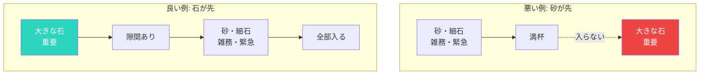

## 大きな石の法則

有名なたとえ話があります。

瓶に大きな石、小さな石、砂を入れる順番の話。

もし砂を先に入れると、大きな石が入らなくなる。
でも、大きな石を先に入れれば、隙間に小さな石と砂も入る。

人生も同じです。

## 大きな石とは

本当に大切なこと。

- 家族との時間
- 健康
- 長期的な目標
- 自己成長
- 大切な人間関係

これらは「緊急」ではないことが多い。
だから後回しにされがち。

## 砂と小さな石とは

日常の雑務、緊急だけど重要でないこと。

- メールの返信
- SNSのチェック
- ダラダラとしたテレビ
- 他人の都合に合わせた予定

これらは「緊急」に見えるので、先に対応してしまう。

### 優先順位の入れ方

## 大きな石を先に入れる

### Step 1: 自分の「大きな石」を特定する

何が本当に大切か？
3〜5つ書き出してみてください。

### Step 2: 先にカレンダーに入れる

「空いた時間にやる」ではなく、先に予約する。
週の始めに、大きな石の時間をブロック。

### Step 3: 砂を減らす

本当にやる必要があることか？
やめる、減らす、任せる、を検討。

### Step 4: 境界線を引く

大きな石の時間は、他のことで侵食しない。
「予定があります」と言える勇気を持つ。

## 優先順位は行動でわかる

「家族が大切」と言いながら、仕事で毎日遅くまで働いている。
「健康が大切」と言いながら、運動する時間を作っていない。

本当の優先順位は、行動に表れます。

## 週の始めに問う

毎週、自分に問いかけてください。

「今週、大きな石に時間を使えているか？」
「何に時間を使った結果、1週間が過ぎたのか？」

人生は有限です。
大切なことから先に、時間を使いましょう。
