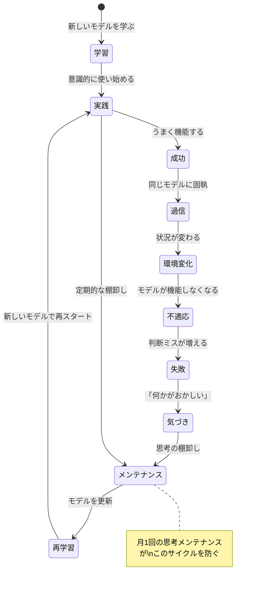
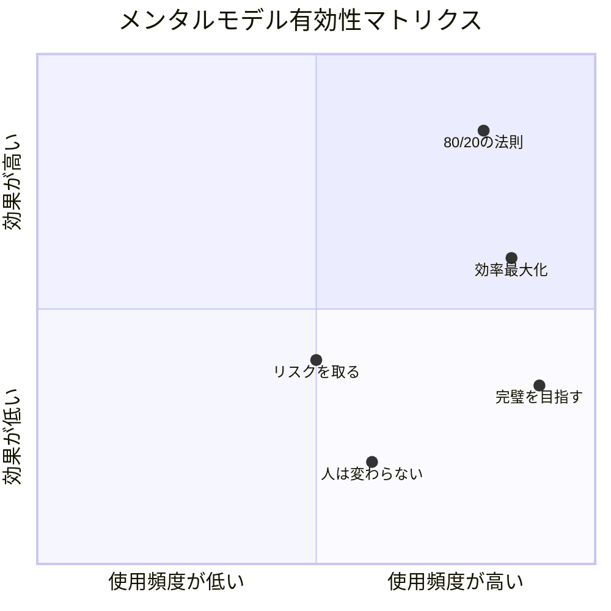
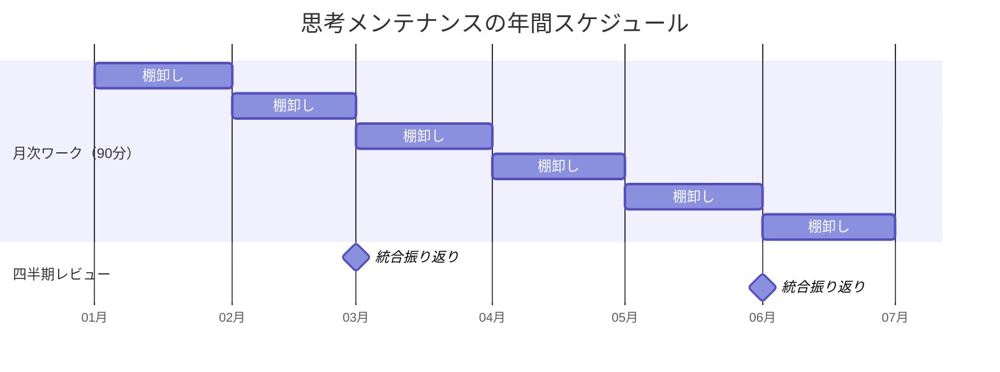

## 「半年前に学んだことが、もう使えなくなっていた」

日曜日の午後2時。コワーキングスペースで、コンサルタントの山崎陽一さん（36歳）は自分のノートを見返しながら呆然としていた。

半年前に受けた認知バイアスのセミナー。確証バイアス、アンカリング効果、サンクコストの誤謬。学んだ直後は判断の質が向上した。しかし今、ノートの内容の半分以上を「忘れていた」。そして忘れていた期間に、**まさにそのバイアスに引っかかっていた**。

「3ヶ月前、後輩の企画を『データが弱い』と却下した。でも本当は、自分が似た企画で過去に失敗しているから無意識に潰したんだと思う。学んだはずのことを、学んだこと自体を忘れていた」

知人の水野さん（40歳・人事コンサルタント）が聞いた。

「歯の定期検診は行ってる？ 歯磨きは毎日してるのになぜ行く？」

「日々の歯磨きだけでは取りきれない汚れがあるから——」

「**思考も同じ**。定期的に棚卸ししないと、気づかないうちに判断力が劣化していく」

## なぜ思考は「放置すると劣化する」のか

思考の質が時間とともに劣化する。これは直感に反するかもしれません。「経験を積めば判断力は上がるはず」と多くの人は信じています。しかし研究は、それが必ずしも正しくないことを示しています。

### 劣化メカニズム1：忘却曲線

エビングハウスの研究によると、新しく学んだ知識の約80%は1ヶ月後に失われます。山崎さんのセミナー知識も、復習なしでは半年後に大部分が消えていた。

### 劣化メカニズム2：環境変化への不適応

「リスクを取るべきだ」は独身時代には有効でも、家族を持った後は再調整が必要。「完璧を目指す」は個人プレーヤー時代には有効でも、マネージャーになったら「70%で任せる」に切り替えるべき。環境が変わればモデルの有効性も変わります。

### 劣化メカニズム3：成功体験の罠

判断がうまくいくと、そのモデルを過度に信頼し、異なる状況でも適用し続けてしまう。心理学で「能力の罠（Competency Trap）」と呼ばれる現象です。

定期メンテナンスの目的は、**失敗してから気づくのではなく、失敗する前にモデルを更新すること**です。

## 月1回の「思考棚卸しワーク」完全ガイド

ここからは、山崎さんが水野さんのアドバイスを受けて構築した、月1回の思考棚卸しワークを紹介します。所要時間は90分。毎月最後の日曜日に実施することを推奨します。

### Phase 1：先月の判断の棚卸し（30分）

**ステップ1：重要な判断を5つリストアップする**

先月行った判断の中で、影響の大きかったもの（仕事・プライベート問わず）を5つ書き出します。

山崎さんの2月の例：
1. 後輩の企画を却下した
2. 新規クライアントのオファーを受けた
3. 週末の副業にかける時間を増やした
4. パートナーとの旅行を仕事を理由にキャンセルした
5. 資格取得の勉強を中断した

**ステップ2：各判断に「バイアスチェック」を行う**

5つの判断それぞれに対して、以下の3つの問いを投げかけます。

| 問い | チェックするバイアス |
|------|-------------------|
| この判断の根拠に「自分に都合の良い情報」だけが含まれていなかったか？ | 確証バイアス |
| この判断に「過去の投資」が影響していなかったか？ | サンクコスト |
| この判断で「短期的な楽さ」を優先していなかったか？ | 現在バイアス |

山崎さんが発見したもの：

判断1（後輩の企画却下）→ 確証バイアス + IKEA効果。自分が過去に失敗した似た企画だったため、データ以前に「うまくいかない」と決めつけていた。

判断4（旅行キャンセル）→ 現在バイアス。目の前の仕事を優先し、パートナーとの関係という長期的な価値を軽視していた。

「5つの判断のうち2つにバイアスが見つかった。40%のエラー率です。これを発見できたのは、振り返りを構造化したからです。振り返らなければ、どちらも『正しい判断だった』と思い込んだまま次の月を迎えていた」

### Phase 2：メンタルモデルの有効性チェック（30分）

**ステップ3：現在使っているメンタルモデルを書き出す**

自分が意識的・無意識的に使っているメンタルモデルを、できるだけ多くリストアップします。[メンタルモデル入門](/blog/mental-model-intro)で紹介した7つの基本モデルだけでなく、自分なりの信念やルールも含めます。

山崎さんのリスト（抜粋）：
- 「80/20の法則」 → 仕事の優先順位づけに使用
- 「リスクを取るべき」 → キャリア判断に使用
- 「完璧を目指す」 → クライアントへのアウトプットに使用
- 「人は変わらない」 → 人間関係に使用
- 「効率を最大化すべき」 → 時間管理に使用

**ステップ4：各モデルを「有効性マトリクス」で評価する**

**右上（高頻度×高効果）：** 維持・強化する → 80/20の法則

**右下（高頻度×低効果）：** 要修正。頻繁に使っているが成果に繋がっていない → 「完璧を目指す」

**左下（低頻度×低効果）：** 手放すか、大幅に修正する → 「人は変わらない」

**左上（低頻度×高効果）：** もっと使う → 該当なし（見つかればラッキー）

山崎さんの発見：

「『完璧を目指す』は、ほぼ毎日使っていたのに効果が低い。クライアントへのアウトプットには有効だけど、それ以外の場面（メール返信、社内資料、日常のコミュニケーション）にまで適用していて、時間を浪費していた。適用範囲を限定する必要があった」

「『人は変わらない』は、後輩の成長を阻害していた。このモデルがあったから、後輩の企画を最初から低く見積もっていたんだと気づいた。修正して『人は適切な環境と支援があれば変わる』に更新した」

### Phase 3：来月のアクションプラン（30分）

**ステップ5：修正すべきモデルを特定し、新しいバージョンを定義する**

| 旧モデル | 問題点 | 新モデル |
|---------|--------|---------|
| 完璧を目指す | 全場面に適用して時間浪費 | クライアント向けは95%、それ以外は70%で十分 |
| 人は変わらない | 他者の成長を阻害 | 適切な環境と支援があれば人は変わる |
| リスクを取るべき | 家族がいる今、無条件には取れない | リスクの種類と大きさを見極めて取る |

**ステップ6：来月の「意識フォーカス」を1つ決める**

すべてを同時に改善しようとすると、どれも中途半端になります。来月重点的に意識するバイアスまたはモデルを1つだけ選びます。

山崎さんの3月のフォーカス：**確証バイアスへの警戒**

具体的なアクション：重要な判断をするとき、必ず「この判断と反対の立場に立つ情報を3つ挙げる」をルール化。

**ステップ7：トリガーアクションを設定する**

[ポモドーロ・テクニック](/blog/pomodoro-technique)のように、「特定のトリガー」に思考チェックを紐づけます。

山崎さんの設定：
- トリガー：会議で誰かの提案にNoと言いたくなったとき
- アクション：「この提案が正しい可能性を3つ考える」を実行してから発言する

## ケーススタディ1：山崎陽一さんの6ヶ月後

思考棚卸しワークを6ヶ月間（月1回×6回）実施した山崎さんの変化を追います。

| 月 | フォーカス | アクション | 結果 |
|---|-----------|-----------|------|
| 1 | 確証バイアス | 後輩の企画に「まず良い点3つ」ルール | 企画採用率が2倍に |
| 2 | 完璧主義の適用範囲 | 社内メールは3分、資料は80%で共有 | 可処分時間が1日45分増加 |
| 3 | 現在バイアス | 金曜日に「短期の楽さ優先」を振り返り | パートナーとの時間を確保 |
| 4 | 「人は変わる」モデル | 後輩に月1回メンタリング | 自主的な新規提案が増加 |
| 5 | サンクコスト | 2年続けた不毛な副業を中止 | 月20時間の自由時間が出現 |
| 6 | 統合振り返り | 5ヶ月分のパターンを分析 | 判断の精度と速度が向上 |

「6ヶ月やって一番驚いたのは、**毎月違うバイアスが顔を出すこと**。だから定期メンテナンスが必要なんです。1回学んだら終わりじゃない」

**6ヶ月間の総合結果：**
- 判断に要する時間：42%短縮
- 後悔する判断：月5回以上 → 月1回以下
- クライアント満足度：4.1 → 4.6（5段階）

## ケーススタディ2：伊藤美咲さんの「家庭版メンテナンス」

伊藤美咲さん（38歳）は、小学3年生と5歳の子供を持つワーキングマザー。メーカー経理部門の管理職です。

「夫婦で『中学受験はさせる』と決めて2年。でも長男が塾を嫌がるようになった。本人は友達と遊びたいと言っている。でも私の中で『80万円払った。もったいない』というモデルが固着していた」

思考棚卸しワークで3つの問いをチェックすると——

- **確証バイアス：** 「受験した方が有利」という情報ばかり集め、公立から名門高校に進んだケースは無視
- **サンクコスト：** 80万円の塾代が判断に影響。しかし続けても辞めても80万円は戻らない
- **現在バイアス：** 「今がんばれば将来楽になる」。しかし「今の子供の幸福感」を犠牲にしている

「3つ全部に引っかかっていた。これは**判断ではなく執着**でした」

Phase 2でモデルを検証すると、「一度決めたことは最後までやる」が仕事では有効だが子育てには合っていないと判明。長男と話し合い塾を休止、代わりにプログラミング教室へ。

**3ヶ月後の変化：**
- 長男の表情が明るくなり、プログラミング教室で自主的に予習するほど熱中
- 学校の成績への影響：変化なし
- 伊藤さん：「思考の棚卸しがなければ、80万円のサンクコストとバンドワゴン効果に支配されたまま、嫌がる子供を塾に通わせ続けていた」

## 棚卸しワークを継続するための仕組み

### 仕組み1：カレンダーに固定する

「時間があるときにやろう」では絶対に続きません。毎月最終日曜日の14:00-15:30をカレンダーにブロックする。[朝のルーティン](/blog/morning-routine)と同じで、**「やるかどうか」を判断しない仕組み**にすることが継続の鍵です。

### 仕組み2：テンプレートを用意する

毎回「何をすればいいんだっけ」と考えるのは判断力の浪費。以下をNotionなどに常備しておきましょう。

- Phase 1：先月の重要な判断5つ + 各判断のバイアスチェック（確証/サンクコスト/現在バイアス）
- Phase 2：使用中のモデル一覧 + 有効性マトリクス評価 + 修正すべきモデル
- Phase 3：修正モデルの新バージョン + 来月の意識フォーカス1つ + トリガーアクション

### 仕組み3：パートナーを持つ

月1回、30分のオンラインで「棚卸し結果を共有する」だけで継続率が格段に上がります。[フィードバックマインドセット](/blog/feedback-mindset)の通り、他者の視点はバイアスの盲点を浮かび上がらせます。

### 仕組み4：小さく始める

最初は「先月の判断を3つ書き出してバイアスチェック」だけでOK。15分で終わります。[ディープワーク](/blog/deep-work)の通り、習慣は「小さく始めて徐々に拡大する」のが王道です。

## 四半期レビューと年次レビュー

月次の棚卸しに加えて、3ヶ月ごとの「四半期レビュー」と、年末の「年次レビュー」を設けることで、思考メンテナンスの効果は飛躍的に高まります。

### 四半期レビュー（60分）

3ヶ月分の月次ワークを見返し、パターンを発見する。「3ヶ月連続で確証バイアスが出ている」なら構造的な対策が必要。モデルの進化を記録し、次の四半期の重点テーマを設定します。

### 年次レビュー（120分）

1年間の総まとめ。どの判断パターンが変わったか、最も大きなバイアスの発見は何か、来年の重点領域はどこか。

山崎さんの年次レビュー：「1年前は『自分は合理的だ』と思い込んでいた。今は『自分は常にバイアスの影響を受けている。だから仕組みで補正する』と知っている。この違いは判断の質において天と地の差がある」

## 思考メンテナンスが「人生のOSアップデート」になる

スマートフォンのOSは定期的にアップデートされます。しかし多くの人は、自分の「思考のOS」を一度もアップデートしていません。20代で形成された思考パターンを、30代、40代でもそのまま使い続けている。

[認知バイアスとの付き合い方](/blog/cognitive-bias-allies)で解説した通り、バイアスはアンインストールできない。しかし定期メンテナンスで影響を最小化できます。

月に90分。年間で18時間。この投資で残りの8,742時間の判断の質が向上するなら、これほどROIの高い習慣はありません。[成長マインドセット](/blog/growth-mindset)が説く通り、思考力もメンテナンスで磨き続けられる。

来月の最終日曜日をカレンダーに入れてください。90分で、あなたの判断力の「定期検診」を始めましょう。

---

**「自分の判断パターンを客観的に見てみたい」あなたへ**

ライフコーチングのセッションでは、あなたの過去の判断を構造的に分析し、無意識に繰り返しているパターンを一緒に発見します。一人では見えないバイアスの盲点を、対話のプロと一緒に可視化する90分です。

[無料セッションで思考の定期検診を始める →](/sessions)
