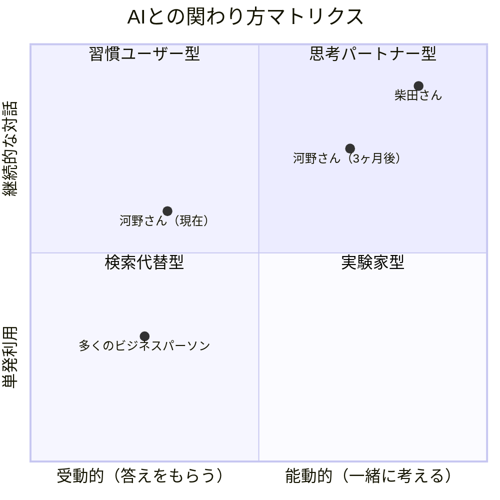
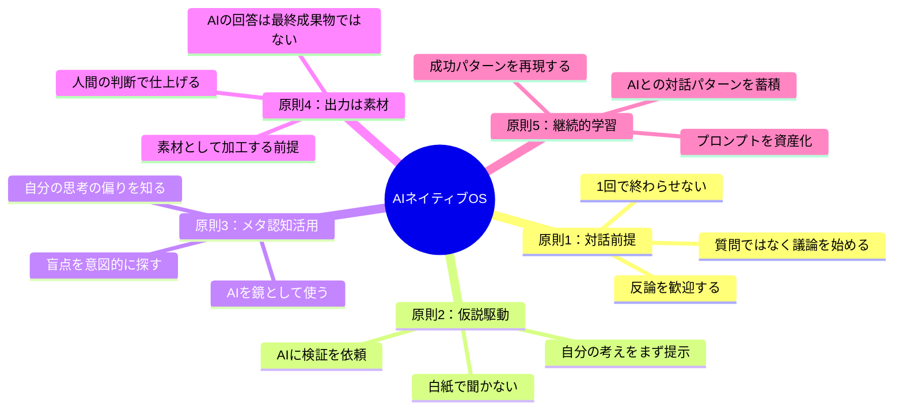
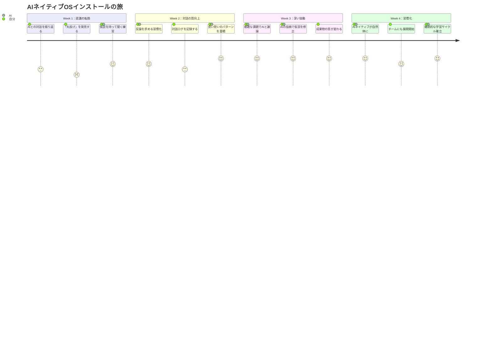

「ChatGPT、使ってますか？」

私がそう聞くと、ほとんどの人が「はい、使ってます」と答える。しかし、その次の質問で反応が分かれる。

「AIと、最後にいつ"議論"しましたか？」

沈黙。

先日セッションに来た河野さん（29歳・広告代理店プランナー）は、こう言った。「ChatGPTは毎日使ってます。リサーチとか、メールの下書きとか。でも"議論"って......AIと議論するって、どういうことですか？」

一方、同じ業界で働く柴田さん（31歳・マーケティングマネージャー）は、AIとの対話ログを見せてくれた。そこには、新規キャンペーンのコンセプトについてAIと5往復にわたって議論し、自分の仮説を3回修正し、最終的にクライアントから「今までで最高の提案」と言われた企画書の原型があった。

河野さんと柴田さんの違いは、AIのスキルではない。**AIに対する「考え方」の違い**だ。この考え方の違いを、私は「AIネイティブOS」と呼んでいる。

## 「便利ツール」と「思考パートナー」の決定的な差

多くの人がAIを「高性能な検索エンジン」や「文章自動生成機」として使っている。聞けば答えが返ってくる。便利だ。しかし、それはAIの能力の10%しか使っていない状態だ。

AIネイティブの考え方では、AIを**対話を通じて思考を進化させるパートナー**として位置づける。この違いは、表面的なテクニックの問題ではなく、もっと根本的な「思考の構え方」の問題だ。

右上の「思考パートナー型」に到達した人は、AIとの対話を通じて**自分一人では到達できなかった思考の高み**に至る。これは、AIの回答をそのまま使うのとは根本的に異なる体験だ。

## AIネイティブOSの5つの原則

では、AIネイティブの考え方とは具体的に何か。5つの原則にまとめた。

### 原則1：対話前提 -- 「質問」ではなく「議論」を始める

AIネイティブは、AIに「教えて」とは言わない。「私はこう考えているが、どう思うか」と議論を始める。

河野さんの典型的な使い方はこうだった。

> 「Z世代向けのSNSキャンペーン案を5つ出して」

柴田さんの使い方はこうだ。

> 「Z世代の消費行動について、私は"体験の共有可能性"が最大の購買動機だと仮説を立てている。根拠は、過去3つのキャンペーンで"映える体験"を訴求したものが最も高いCVRを記録したこと。この仮説に対して、反証となるデータや、見落としている視点を指摘してほしい」

同じ「Z世代のキャンペーン」というテーマでも、出発点がまったく違う。柴田さんは自分の仮説をぶつけ、AIに**壁打ち相手**を求めている。このアプローチは[問いを立てる力](/blog/ai-era-question-power)にも通じる重要な姿勢だ。

### 原則2：仮説駆動 -- 白紙で聞かない

AIに白紙の状態で「何かいい案ない？」と聞くのは、AIネイティブのやり方ではない。まず自分で60%まで考え、残りの40%をAIとの対話で磨く。

**なぜか？** 人間が仮説を持たずにAIに聞くと、AIは「一般的に正しいが、あなたの状況には最適でない回答」を返す。仮説を持って聞くと、AIは「あなたの仮説に対する具体的なフィードバック」を返す。後者の方が圧倒的に価値が高い。

### 原則3：メタ認知活用 -- AIを「思考の鏡」にする

人間には認知バイアスがある。確証バイアス、正常性バイアス、サンクコスト効果......これらは自分では気づきにくい。AIネイティブは、AIを自分の思考の偏りを映し出す鏡として使う。

具体的には、こんなプロンプトだ。

> 「私の計画書を読んで、私が無意識に避けている論点、楽観的すぎる前提、見落としているリスクを5つ指摘してください」

### 原則4：出力は素材 -- AIの回答をそのまま使わない

AIネイティブは、AIの出力を「最終成果物」とは考えない。あくまで「素材」だ。料理で言えば、AIが提供するのは食材であり、盛り付けと味の最終調整は人間がやる。

### 原則5：継続的学習 -- AIとの対話を「資産」にする

良いプロンプト、効果的だった対話パターン、AIが苦手だった領域。これらを記録し、蓄積し、再利用する。AIネイティブは、AIとの対話そのものを学習資産として扱う。

## ケース1：「便利ツール思考」から抜け出した河野さんの転換

河野さん（29歳・広告代理店プランナー）が変わったきっかけは、一つの失敗だった。

大手飲料メーカーの新商品キャンペーンのコンペ。河野さんはChatGPTに「20代女性向けの炭酸飲料のSNSキャンペーン案を10個出して」と指示し、返ってきた案を少し手直ししてプレゼンに使った。

結果は、コンペ落選。クライアントからのフィードバックは「どこかで見たような案ばかりで、御社ならではの視点がなかった」。

「AIに任せれば効率的だと思ったのに、逆に自分の首を絞めた」と河野さんは振り返る。

セッションで、私は河野さんに「AIネイティブOS」の5原則を伝え、次のコンペで実践してもらった。

**Before（従来の使い方）：**
- 「キャンペーン案を出して」と丸投げ
- AIの出力を手直しして提出
- 思考時間：2時間 / 企画の独自性：低い
- 結果：コンペ落選

**After（AIネイティブOSインストール後）：**
- まず自分で仮説を3つ立てる（2時間）
- AIに仮説を壁打ちし、反論と改善点を議論（1.5時間）
- AIの指摘を元に仮説を修正し、再度議論（1時間）
- 最終的に人間の直感と判断で企画を磨く（1.5時間）
- 思考時間：6時間（3倍） / 企画の独自性：極めて高い
- 結果：コンペ勝利、クライアントから「この視点は他社にはなかった」と評価

「時間は3倍かかったけど、成果は10倍になった」と河野さんは言う。「AIを"効率化ツール"として使っていた時は、自分の思考を省略していた。"思考パートナー"として使い始めたら、自分の思考が深くなった」

ここで重要なのは、AIネイティブOSは「AIに時間を使わない」考え方ではないということだ。むしろ、**AIとの対話に意図的に時間を投資する**考え方だ。ただし、その投資のリターンは圧倒的に大きい。

## ケース2：チーム全体のOSをアップデートした藤原さん

藤原さん（36歳・IT企業の部長）は、チームの15人全員にAIツールのライセンスを付与した。半年後、結果を分析して愕然とした。

「15人中、AIを"本当の意味で"使いこなしている人はたったの2人でした。残りの13人は、メールの下書きと議事録の要約にしか使っていなかった」

藤原さんは自分自身がまず「AIネイティブOS」を身につけ、その後チームに展開するという戦略をとった。

まず、週に1回の「AI壁打ちセッション」をチーム内に導入した。各メンバーが自分のプロジェクトの課題をAIに壁打ちし、その対話ログをチームで共有する。

**3ヶ月後の変化：**

| 指標 | Before | After | 変化率 |
|------|--------|-------|--------|
| 企画書の質（上長評価） | 平均3.2点/5 | 平均4.1点/5 | +28% |
| 企画書作成時間 | 平均12時間 | 平均8時間 | -33% |
| AIを「議論」に使う人数 | 2/15人 | 11/15人 | +450% |
| 月間のAI対話回数 | 平均23回 | 平均87回 | +278% |

「ツールを渡すだけじゃダメだった」と藤原さんは言う。「考え方を変えないと、どんなに優秀なAIも"高機能な検索エンジン"で終わってしまう」

藤原さんのチームが最も変わったポイントは、**AIに反論を求める文化**ができたことだ。以前は「AIが言うんだから正しいだろう」と鵜呑みにしていたのが、「AIに自分のアイデアを批判させてから企画会議に持ってくる」という習慣が定着した。

## ケース3：40代管理職・山下さんの「遅れてきたAIネイティブ」

「正直に言うと、AIには抵抗がありました」

山下さん（43歳・メーカーの課長）は、セッション初回でそう打ち明けた。20年のキャリアで培った経験と判断力に自信がある。部下がAIの出力をそのまま報告書に貼り付けているのを見て、「自分の頭で考えろ」と叱ったこともある。

「でも、最近気づいたんです。部下の報告書の質が、以前より明らかに上がっている。AIを使っているはずなのに」

山下さんが見たのは、AIネイティブOSを身につけた部下の仕事ぶりだった。AIの出力をそのまま使うのではなく、AIとの対話を通じて自分の分析を深め、人間にしかできない現場の肌感覚と組み合わせて報告書を仕上げている。

「彼らは"AIに頼っている"のではなく、"AIと協力している"んだと気づいた。それは、私が若手の頃に先輩と議論しながら企画を練ったのと本質的に同じだった」

山下さんは3ヶ月かけて、自分なりのAIネイティブOSを構築した。

**山下さんのAI活用3原則：**

1. **経験をデータに変える**：「20年の勘」を言語化し、AIに伝えることで、経験とデータの融合分析ができるようになった
2. **反論を歓迎する**：AIに「この判断の問題点を指摘して」と聞くことで、経験に基づくバイアスに気づけるようになった
3. **若手に教える前にAIと壁打ちする**：フィードバックの質が上がり、部下からの信頼も厚くなった

「AIは、20年のキャリアを否定するものじゃなかった。20年のキャリアを、さらに活かすための相棒だった」

これは[成長マインドセット](/blog/growth-mindset)の考え方とも深く結びついている。年齢やキャリアに関係なく、新しい考え方をインストールできるかどうかが、AI時代の分かれ道になる。

## AIネイティブOSのインストール手順

ここまでの話を、実践可能な手順に落とし込む。

**Week 1**では、過去1週間のAI対話履歴を振り返る。「教えて系プロンプト」の割合、追加質問の回数、自分の考えが変わった回数をチェックする。多くの人は「丸投げ9割、追加質問ゼロ」という現実に気づく。

**Week 2**では、毎日1つ「仮説を持ってAIに壁打ちする」練習をする。以下のテンプレートが効果的だ。

> 「[テーマ]について、私は[自分の仮説]と考えています。根拠は[理由を2-3個]です。この仮説に対して、反証となるデータ、見落としている視点、仮説を強化する方法を提案してください」

[プロンプトの技術](/blog/ai-prompt-engineering)をさらに深めたい方は関連記事も参考にしてほしい。

**Week 3**では、実際の仕事の課題でAIと「議論」する。ポイントは**最低5往復以上続ける**こと。1回で終わるのは「検索」であり「議論」ではない。

**Week 4**で習慣化し、藤原さんのようにチームにも展開する。

## 「人間の価値」はどこにあるのか

AIネイティブOSをインストールすると、根本的な問いに向き合うことになる。人間の価値は以下の4つに集約される。

1. **問いを立てる力**：「何を問うべきか」を決めるのは人間だ
2. **文脈を読む力**：現場の空気、顧客の表情の変化、チームの暗黙の不満を読み取るのは人間にしかできない
3. **責任を取る力**：最終的な意思決定とその結果に責任を負えるのは人間だけだ
4. **意味を与える力**：データから「だから何なのか」を引き出すのは人間の仕事だ

AIネイティブOSは、これらの人間固有の力を**増幅**するための基盤だ。[AI時代に人間にしかできない仕事](/blog/human-only-work-ai-era)でも解説しているが、AIの発展は人間の仕事の質を変えていく。[朝の習慣](/blog/morning-routine)にAI壁打ちを組み込み、[ポモドーロ・テクニック](/blog/pomodoro-technique)で25分ブロックを確保するだけでも、変化は始まる。

## 明日からの第一歩

AIネイティブOSのインストールは、特別な準備も高額なツールも必要ない。必要なのは、AIに対する「考え方」を変えることだけだ。

**今日から始める3つのアクション：**

1. **今日中に**：過去1週間のAI対話履歴を見返し、「丸投げプロンプト」の割合を数える
2. **明日から**：仕事の課題を1つ選び、仮説を立ててからAIに壁打ちする
3. **1週間後**：AIとの対話で「自分の考えが変わった」経験を1つ作る

河野さんは言った。「AIが賢くなったんじゃない。AIとの向き合い方を変えたら、自分が賢くなった」

この言葉が、AIネイティブOSの本質を最もよく表している。AIは、あなたの思考を映し、増幅し、進化させるパートナーだ。そのパートナーとの関係を、今日から変えてみよう。

---

## あなただけの「AIネイティブOS」を設計しませんか？

AIとの付き合い方は、職種・経験・思考スタイルによって最適解が異なります。**体験セッション（無料）**では、あなたの仕事の課題を題材に、AIネイティブOSの5原則を実際に体験していただきます。セッション後、AIとの対話が「作業」から「協働」に変わったことを実感できるはずです。

[→ 体験セッションに申し込む](/sessions)
