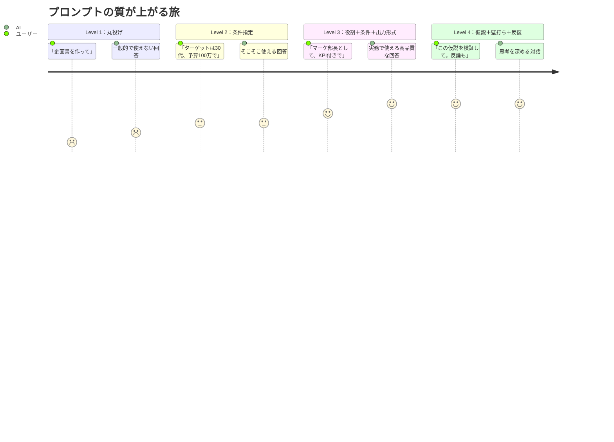
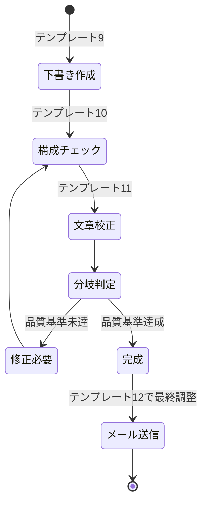
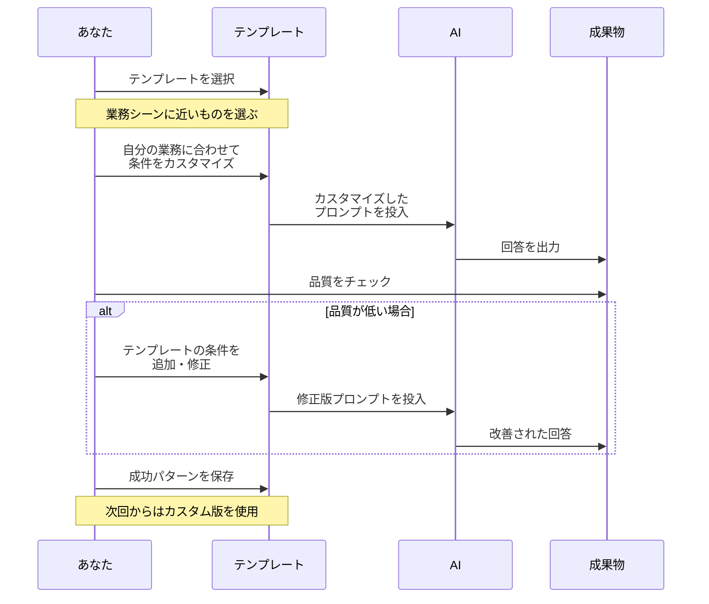

「プロンプトの書き方の本を3冊読みました。でも、実際の仕事で使おうとすると、何をどう聞けばいいか分からなくて......」

水曜日の夜、セッションに現れた野田さん（27歳・人事部アシスタント）は困り顔だった。ChatGPT Plusに半年課金して、使っているのは「メールの下書き」と「議事録の要約」だけ。

一方、同じ部署の先輩・三上さん（34歳・人事マネージャー）は、AIで採用戦略分析から面接質問設計、研修プログラム構築までこなしている。秘密は、**業務シーン別のプロンプトテンプレート集**を自作して毎日使い回していたことだった。

この記事では、明日からすぐに使える20のプロンプトテンプレートを5カテゴリに分けて紹介する。

## プロンプト設計の3原則

テンプレートの前に、すべてのプロンプトに共通する3つの原則を押さえておこう。



**原則1：役割を指定する。** 「あなたは[専門家の役割]です」と伝えるだけで、回答の精度が飛躍的に上がる。**原則2：条件と制約を明示する。** ターゲット、予算、期間、文字数などの制約が多いほど出力精度は上がる。**原則3：出力フォーマットを指定する。** 「箇条書きで」「表形式で」と明示すると、AIが構造化して回答してくれる。

この3原則は[プロンプトエンジニアリングの基本](/blog/ai-prompt-engineering)で詳しく解説している。

## カテゴリ1：企画・戦略（テンプレート1-4）

### テンプレート1：新規企画のアイデア出し

```
あなたは[業界]で15年の経験を持つ事業開発コンサルタントです。

以下の条件で新規事業/企画のアイデアを提案してください。

【背景】
- 自社の強み：[具体的に記述]
- 現在の課題：[具体的に記述]
- ターゲット市場：[具体的に記述]

【制約条件】
- 初期投資：[金額]以内
- 実現までの期間：[期間]以内
- 活用可能なリソース：[人員、設備など]

【出力形式】
各アイデアについて以下を含めてください：
1. コンセプト（1文）
2. ターゲット顧客像
3. 収益モデル
4. 競合との差別化ポイント
5. 最初の3ヶ月のアクションプラン
6. 想定リスクと対策

5つのアイデアを提案し、それぞれの実現可能性を★5段階で評価してください。
```

### テンプレート2：SWOT分析の壁打ち

```
あなたは戦略コンサルタントです。
以下の事業について、SWOT分析を行い、
クロスSWOT戦略を導出してください。

【事業概要】
[事業内容を200字程度で記述]

【出力形式】
1. SWOT（4象限を表形式で）
2. クロスSWOT戦略（SO/WO/ST/WT各2つ以上）
3. 最優先で取り組むべき戦略TOP3とその理由
4. 私が見落としている可能性のある脅威や弱み
```

### テンプレート3：企画書の骨格作成

ポイントは**決裁者の関心事を明示する**こと。「[役職]向けのプレゼン専門家として、決裁者が[関心事]を重視する前提で、企画書の骨格を作って」と指定する。出力にはスライド構成、各スライドの要点、決裁者の懸念TOP5と回答案を含めるよう依頼する。

### テンプレート4：競合分析レポート

自社と競合2-3社の概要を提示し、「ポジショニングマップ（2軸を提案）」「強み弱み比較表」「差別化ポイント3つ」「競合の今後の戦略予測」を出力させる。「分析根拠が不明確な点は"推定"と明記して」の一文を入れるだけで、出力の信頼性が大幅に上がる。

## カテゴリ2：データ分析・リサーチ（テンプレート5-8）

### テンプレート5：データの傾向分析

```
あなたはデータアナリストです。
以下のデータを分析し、ビジネス上の示唆を導いてください。

【データ】
[表データまたはCSVを貼り付け]

【分析してほしいこと】
1. 主要な傾向とパターン
2. 異常値とその考えられる原因
3. ビジネス上のアクションに繋がるインサイト3つ
4. 追加で収集すべきデータの提案

【出力形式】
- エグゼクティブサマリー（3行）
- 詳細分析（見出し付き）
- アクション提案（優先度順）
```

### テンプレート6：市場調査の設計

「マーケットリサーチャーとして、[テーマ]の市場調査を設計して」と依頼し、調査目的・対象市場・予算・期間を条件として与える。出力には調査設計書、アンケート質問案（15問以内）、インタビューガイド、分析フレームワークを含めさせる。

### テンプレート7：業界トレンドの整理

「[業界]の専門アナリストとして、直近のトレンドTOP5を整理し、各トレンドが自社に与える影響（機会/脅威）と今後3年の見通しを分析して」と依頼する。「情報のソースが不明な場合は"推定"と明記して」を添えるのがコツだ。

### テンプレート8：アンケート結果の深掘り

自由回答データを貼り付け、「カテゴリ分類（感情・テーマ・要望別）」「頻出キーワードとその文脈」「表面的な回答の裏にある深層ニーズ」を分析させる。「ポジティブ・ネガティブの両面をバランスよく」と指定するだけで、偏りのない分析が得られる。

## カテゴリ3：文章・コミュニケーション（テンプレート9-12）



### テンプレート9：ビジネス文書の下書き

「ビジネスライティングの専門家として[文書の種類]を作成して」と依頼。条件として「読み手」「目的（読み手にどうなってほしいか）」「トーン」「文字数」「含めるべき情報」「NG表現」を指定する。条件が具体的なほど、手直し不要な文書が出てくる。

### テンプレート10：文章の構成改善

文章を貼り付け、「論理構成（主張→根拠→結論の流れ）」「段落の分け方」「冗長な表現の削除」「最初の30秒で要点が掴めるか」の4点を改善させる。「改善版と変更箇所の解説（理由付き）」を出力させると、自分のライティング力の向上にもつながる。

### テンプレート11：文章の校正・推敲

校正は具体的なチェック項目を列挙するのがコツ。「誤字脱字」「表記ゆれ（"事"と"こと"等）」「主語と述語の対応」「二重否定」「60字以上の長文」の5項目を指定し、「修正箇所リスト（元→修正後→理由）」を出力させる。

### テンプレート12：メール返信の作成

受信メールを貼り付け、「伝えたいこと」「トーン」「200字以内」「次のアクション明示」を条件に、「積極的/中立的/慎重」の3パターンを作成させる。3パターンから選ぶだけで、メール返信に悩む時間は劇的に減る。[AIメール返信術](/blog/ai-email-reply)でもメール特化の活用法を詳しく紹介している。

## カテゴリ4：会議・プレゼン（テンプレート13-16）

### テンプレート13：会議アジェンダの設計

「ファシリテーション専門家として、会議アジェンダを設計して」と依頼し、会議の目的・参加者・時間・前回の課題を条件に指定する。「タイムライン付きアジェンダ」「各パートのファシリテーションのコツ」「事前共有資料リスト」「ネクストアクション設計」の4点を出力させる。

### テンプレート14：プレゼン構成の設計

テーマ、聴衆（関心事・知識レベル）、持ち時間、ゴール（聴衆にとってほしい行動）を条件に指定。スライド構成だけでなく、「最初の30秒で惹きつけるフック」「想定質問TOP5と回答案」「行動を促すクロージング」まで一度に作らせるのがポイントだ。

### テンプレート15：議事録の構造化

会議メモを貼り付け、「決定事項」「議論のポイント（要約と結論）」「宿題（担当者・期限付き）」「次回アジェンダ案」の4項目に構造化させる。「発言者の意図を損なわないよう客観的に」の一文を入れると精度が上がる。

### テンプレート16：プレゼンのQ&A想定

「[聴衆の立場]として質問を想定して」と役割を指定し、プレゼン概要を渡す。「好意的な質問5つ」「批判的な質問5つ」「想定外の質問3つ」と回答案を出力させる。各回答は30秒以内の分量に制限すると実用的だ。

## カテゴリ5：業務改善・自己成長（テンプレート17-20）

### テンプレート17：業務プロセスの改善提案

「業務改善コンサルタントとして改善案を提案して」と依頼し、現状のプロセス（ステップ別）、課題（時間・ミス・属人化）、制約条件（予算・期間・ツール）を条件に指定する。「改善後のプロセス」「インパクト（時間削減率・コスト削減額）」「実行ロードマップ」を出力させる。

### テンプレート18：週次振り返りの壁打ち

「パーソナルコーチとして週次振り返りを行って」と依頼し、「今週やったこと」「うまくいったこと」「うまくいかなかったこと」「来週の目標」を伝える。「成果の評価」「5Whysでの原因分析」「目標のSMART化」「見落としている改善点」をフィードバックさせる。

この週次振り返りの習慣は[フィードバック・マインドセット](/blog/feedback-mindset)の実践としても非常に効果的だ。

### テンプレート19：スキル習得プランの設計

「ラーニングデザイナーとして学習プランを設計して」と依頼し、現在のレベル、目標レベル、週の学習時間、期間、学習スタイルの好みを条件に指定。「フェーズ別ロードマップ」「教材推薦」「マイルストーン」「挫折しやすいポイントと対策」を出力させる。

### テンプレート20：意思決定の壁打ち

選択肢と判断基準（最重視事項・避けたいリスク・関係者への影響）を提示し、「メリデメ比較表」「リスク評価（発生確率×影響度）」「見落としている視点」「意思決定マトリクス」「推奨案と根拠」を出力させる。[意思決定疲れ](/blog/decision-fatigue)を減らすためにも、重要な判断はAIとの壁打ちを習慣にすることをすすめる。

## ケース1：テンプレートで業務時間を週8時間削減した野田さん

野田さん（27歳・人事部アシスタント）は、20テンプレートから8つを選んでカスタマイズした。

| テンプレート | 業務 | Before | After |
|------------|------|--------|-------|
| #1 アイデア出し | 採用イベント企画 | 4時間 | 1.5時間 |
| #5 データ分析 | 応募者データ分析 | 3時間 | 45分 |
| #12 メール返信 | 候補者対応 | 1日20通×10分 | 1日20通×3分 |
| #15 議事録 | 採用会議録 | 1.5時間 | 30分 |

「テンプレートがあると、"何を聞けばいいか"で悩む時間がゼロになる。毎週8時間浮いた分、候補者との面談に使えるようになった」と野田さんは言う。

## ケース2：チームの暗黙知をテンプレート化した安藤さん

安藤さん（38歳・営業部マネージャー）は、トップ営業の松田さんの「なぜ売れるか」を言語化するためにテンプレート17を活用した。松田さんの商談記録30件分をAIに読み込ませ、行動パターンの分析を依頼。

**結果：** 松田さんのヒアリング手法が5パターンに分類され、各パターン対応のプロンプトテンプレート（商談準備用）を作成。チーム全体の成約率が3ヶ月で**18%から27%**に向上。松田さん自身も「自分がなぜ売れていたか初めて分かった」と驚いた。

「暗黙知をテンプレートに変換する。これがAI時代のマネジメントだ」と安藤さんは語る。

## ケース3：プロンプト共有文化を作った杉山さん

杉山さん（33歳・スタートアップCOO）は、Slackに「#prompt-share」チャンネルを開設。最初は自分が毎日1つずつプロンプトとAI出力をセットで投稿した。2週間後、他メンバーも投稿し始めた。

**3ヶ月後：** チャンネルに287のプロンプトが蓄積し、業務別テンプレート集が自然発生。新入社員のオンボーディング期間が**2ヶ月から3週間**に短縮、「AIの使い方が分からない」という相談は**月15件からゼロ**に。

「プロンプトは個人のスキルじゃなくて、チームの資産にすべきだった」と杉山さんは振り返る。

## テンプレートをカスタマイズする方法

ここで紹介した20のテンプレートは、そのまま使っても効果があるが、自分の業務に合わせてカスタマイズするとさらに威力を発揮する。



**カスタマイズの4ステップ：** (1)業界用語を追加、(2)過去の成功例を条件に反映、(3)自社のレポートフォーマットを出力形式に指定、(4)NG表現を明示的に除外。

## テンプレート活用の注意点

[AIブレインストーミング](/blog/ai-brainstorming)でも触れているが、テンプレートは出発点であり、[AIネイティブの考え方](/blog/ai-native-mindset)で解説した「仮説を持って聞く」姿勢が前提だ。AIの出力は80点の素材であり、残り20点を人間が加えて100点にする。最初の出力が微妙でも、条件を追加して深掘りすること。そして3ヶ月に1回はテンプレートを見直し、アップデートすること。

## 明日から始める3ステップ

テンプレートの価値は、使って初めて分かる。[朝のルーティン](/blog/morning-routine)に「今日の業務で使えるテンプレートを1つ選ぶ」を組み込むだけで、AI活用は劇的に変わる。

1. **今日：** 20テンプレートから、自分の業務に使えそうなものを3つ選ぶ
2. **明日：** 選んだテンプレートを1つ、実際の業務で使う
3. **1週間後：** 効果があったものを自分の業務に合わせてカスタマイズする

野田さんは言った。「"勉強"していた時は何も変わらなかった。"使い始めた日"から、すべてが変わりました」

---

## あなたの業務に最適なプロンプトを一緒に設計しませんか？

「テンプレートを見たけど、自分の業務にどうカスタマイズすればいいか分からない」「もっと効率化できる業務があるはずだけど、どこから手をつけていいか......」という方へ。**体験セッション（無料）**では、あなたの実際の業務フローを一緒に分析し、最も効果の高いプロンプトテンプレートをオーダーメイドで設計します。

[→ 体験セッションに申し込む](/sessions)
