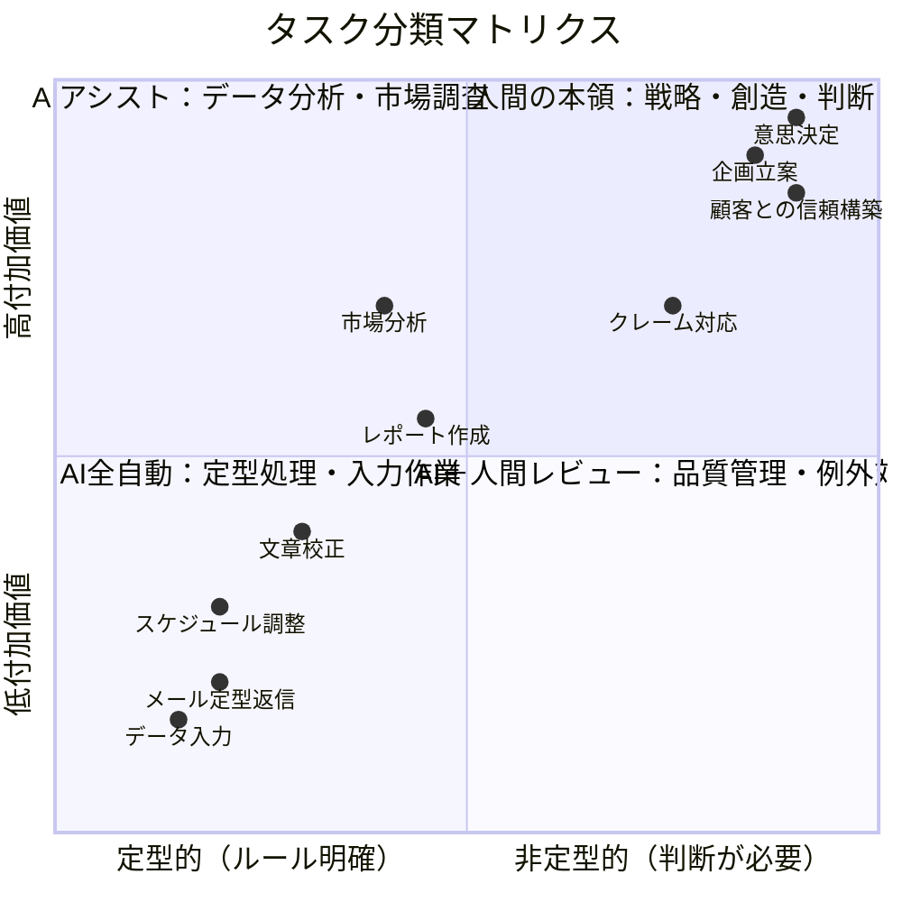
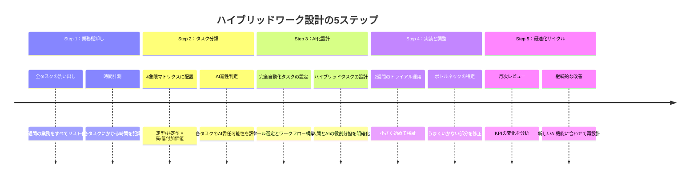
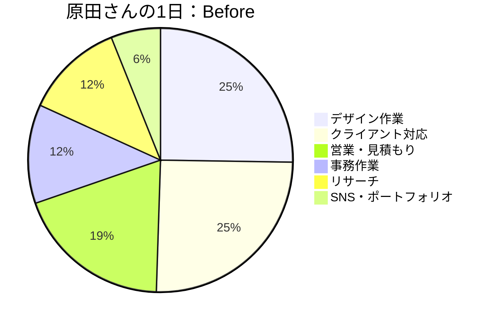

「毎日12時間働いてるのに、成果が出てない気がする」

月曜の朝、吉川さん（35歳・Webメディアの編集長）はそう言った。チーム5人で月間100本の記事を回しているが、PVは伸び悩み、残業は増える一方。AIツールは導入したが、「AIに任せる仕事」と「人間がやる仕事」の線引きが曖昧で、結局全部自分で確認している。

「AIを入れたら楽になると思ったのに、むしろやることが増えた」。この原因の大半は、**仕事の設計を変えずにAIを追加した**ことにある。

一方、白石さん（33歳・同業の編集長）はチーム4人で月間120本を回しながら全員が定時退社。仕事の設計そのものをAI前提で再構築した「ハイブリッドワーク設計」の成果だ。

## 「AIを足す」のではなく「仕事を再設計する」

多くの組織がAIを導入する時、既存の業務フローの「一部をAIに置き換える」アプローチをとる。議事録の作成をAIに任せる、メールの下書きをAIに生成させる、データの集計をAIにやらせる。

このアプローチは間違いではないが、効果は限定的だ。なぜなら、**業務フロー全体の設計が人間中心のまま**だから。人間がすべてのプロセスを管理し、AIは「部分的なアシスタント」にとどまる。

ハイブリッドワーク設計では発想が異なる。**各タスクの本質を分析し、「人間がやるべきこと」と「AIに任せるべきこと」を根本から切り分ける**。

左下のタスクはAIに完全委任。右上のタスクは人間が全力投球。中間のタスクはAIと人間のハイブリッドで処理する。この切り分けが、ハイブリッドワーク設計の核心だ。

## 仕事の再設計：5ステップメソッド

ハイブリッドワーク設計は、以下の5ステップで進める。

### Step 1：業務棚卸し -- 現在地を正確に知る

まず、1週間の業務をすべて書き出す。「こんな細かいことまで？」と思うくらい詳細に。メールを読む時間、会議の移動時間、資料の印刷時間まで含めて記録する。

吉川さんが棚卸しをした結果がこうだった。

| 業務カテゴリ | 週の所要時間 | 全体比率 |
|------------|------------|---------|
| 記事の企画・編集方針 | 8時間 | 13% |
| 記事の校正・修正指示 | 15時間 | 25% |
| ライターとのコミュニケーション | 6時間 | 10% |
| データ分析（PV、SEO） | 5時間 | 8% |
| 会議・報告 | 8時間 | 13% |
| メール・チャット対応 | 7時間 | 12% |
| 原稿の初期チェック | 6時間 | 10% |
| その他（事務、雑務） | 5時間 | 8% |
| **合計** | **60時間** | **100%** |

吉川さんは週60時間働いていた。しかし、「編集長としての本質的な仕事」である企画・編集方針の策定はわずか13%。残りの87%は、AIで効率化できる可能性のある業務だった。

### Step 2：タスク分類 -- AIに任せるべきものを見極める

棚卸しした業務を、「定型的/非定型的」×「高付加価値/低付加価値」の4象限に配置する。この切り分けは[やらないことリスト](/blog/not-to-do-list)の考え方とも通じる。

### Step 3-5：AI化設計から最適化まで

分類結果に基づき、左下象限（定型メール、データ集計、スケジュール調整）は**AI完全自動化**。中間象限（記事校正、市場分析、レポート作成）は**AIアシスト＋人間判断**。右上象限（戦略策定、人材育成、関係構築）は**人間全力投球**。

2週間のトライアルで検証し、70%の精度で始めて反復改善するのがポイントだ。

## ケース1：週60時間を40時間に削減した吉川さん

吉川さんはハイブリッドワーク設計を実践し、3ヶ月で劇的な変化を実現した。

**Before：**
- 週60時間労働
- 記事企画に使える時間：8時間/週
- チームの残業：月平均40時間/人
- 月間PV：150万

**After（3ヶ月後）：**
- 週40時間労働（-33%）
- 記事企画に使える時間：18時間/週（+125%）
- チームの残業：月平均8時間/人（-80%）
- 月間PV：210万（+40%）

「一番変わったのは、自分の仕事の中身です」と吉川さんは言う。

**具体的に変えたこと：**

1. **記事の初期チェック**（週6時間→1時間）：AIに「編集基準チェックリスト」を読み込ませ、投稿された原稿を自動チェック。「要確認」フラグが立った箇所だけ人間が確認する仕組みに変更。

2. **校正・修正指示**（週15時間→5時間）：AIが誤字脱字・表記ゆれ・論理の飛躍を検出し、修正案まで提示。吉川さんは「AIが見落とした質的な部分」だけに集中。

3. **データ分析**（週5時間→1時間）：SEOデータの収集と初期分析をAIに自動化。吉川さんは「だからどうするか」の意思決定に集中。

4. **メール・チャット対応**（週7時間→3時間）：定型的な返信はAIテンプレートで対応。「判断が必要なもの」だけ吉川さんに回る仕組みに変更。

「浮いた20時間で何をしているかというと、ライターとの1on1を増やしたんです。記事の質はAIでは上げられない。でもライターの成長を支援すれば、記事の質は根本から上がる。これが編集長の本当の仕事だった」

## ケース2：営業チームを再設計した永井さん

永井さん（40歳・法人営業チームリーダー）は、6人チームの営業プロセスをハイブリッドワーク設計で再構築した。

「営業って、どうしても"経験と勘"に頼りがちなんです。でも、データ分析やリサーチの部分はAIの方が速くて正確だと気づいた」

永井さんのチームの営業プロセスを分析すると、こうなった。

**営業プロセスの分解と再設計：**

| プロセス | Before（人間100%） | After（ハイブリッド） |
|---------|-------------------|---------------------|
| 見込み客リサーチ | 1件あたり45分 | AI自動リサーチ＋人間5分確認 |
| 提案資料作成 | 1件あたり3時間 | AIドラフト＋人間1時間カスタマイズ |
| 商談準備 | 1件あたり1時間 | AI想定Q&A生成＋人間30分戦略設計 |
| 商談（対面/オンライン） | 人間100% | 人間100%（ここは変えない） |
| フォローアップメール | 1件30分 | AI下書き＋人間5分調整 |
| 週次レポート | 3時間 | AI自動生成＋人間15分レビュー |

**3ヶ月後の成果：**
- 1人あたりの商談件数：月12件 → 月20件（+67%）
- 成約率：22% → 28%（+27%）
- 営業1人あたりの月間売上：平均380万円 → 平均580万円（+53%）
- 残業時間：月平均35時間 → 月平均12時間（-66%）

「商談件数が増えたのに成約率も上がった理由は、AIが提案資料の質を底上げしてくれたから。でもそれ以上に大きいのは、営業マンが"人間にしかできないこと"に集中できるようになったこと。顧客との雑談、微妙な表情の変化を読む、信頼関係を深める。これはAIには絶対にできない」と永井さんは語る。

## ケース3：個人のワークデザインを最適化した原田さん

原田さん（28歳・フリーランスのWebデザイナー）は、一人で仕事をしている。チームの設計ではなく、**自分自身のワークデザイン**をハイブリッド化した事例だ。

「フリーランスだと全部自分でやらなきゃいけない。デザインだけじゃなく、営業、経理、契約書、メール......クリエイティブに集中できる時間が1日2時間もなかった」

原田さんの1日を分析した。

**Before（1日8時間の内訳）：**
- デザイン作業：2時間（25%）
- クライアント対応（メール・チャット）：2時間（25%）
- 営業・見積もり作成：1.5時間（19%）
- 事務作業（請求書・経理）：1時間（12%）
- リサーチ（トレンド・参考デザイン）：1時間（12%）
- SNS更新・ポートフォリオ管理：0.5時間（6%）

**After（ハイブリッドワーク設計後）：**
- デザイン作業：5時間（62%）
- クライアント対応（AIアシスト）：0.5時間（6%）
- 営業・見積もり（AI自動化）：0.5時間（6%）
- 事務作業（完全自動化）：0.5時間（6%）
- リサーチ（AIキュレーション）：0.5時間（6%）
- SNS更新（AI下書き＋確認）：0.5時間（6%）
- 空き時間（スキルアップ・休息）：0.5時間（6%）

「デザインに使える時間が2時間から5時間になった。これは2.5倍じゃなくて、体感的には10倍の差がある」と原田さんは言う。「2時間だと"こなす"しかできない。5時間あると"探求"できる。クオリティが根本的に変わった」

原田さんの月収は、ハイブリッドワーク設計導入後6ヶ月で**1.8倍**になった。受注件数はほぼ変わっていないが、1件あたりの単価が上がった。理由は、デザインの質が上がり、リピート率と紹介率が上がったから。[ディープワーク](/blog/deep-work)の時間を確保することが、アウトプットの質に直結した好例だ。

## 時間の使い方を再設計する「ハイブリッド時間割」

ハイブリッドワーク設計では、タスクだけでなく**時間の使い方**も再設計する。人間の集中力のリズムとAIの特性を組み合わせることで、1日の生産性を最大化できる。

```mermaid
gantt
    title ハイブリッド時間割（1日モデル）
    dateFormat HH:mm
    axisFormat %H:%M

    section 朝：創造タイム
    AI壁打ちで今日の優先事項を整理    :a1, 08:00, 15min
    ディープワーク（人間の創造性全開）  :a2, 08:15, 105min
    休憩                               :a3, 10:00, 15min

    section 午前：ハイブリッドタイム
    AIアシスト業務（分析・執筆など）    :b1, 10:15, 105min
    昼休憩                             :b2, 12:00, 60min

    section 午後：コミュニケーション
    会議・ミーティング                 :c1, 13:00, 120min
    AIで議事録・ネクストアクション整理  :c2, 15:00, 15min
    休憩                               :c3, 15:15, 15min

    section 夕方：仕上げタイム
    AI自動化タスクの確認・承認          :d1, 15:30, 30min
    明日の準備（AIに事前リサーチ依頼）  :d2, 16:00, 30min
    振り返り・改善メモ                 :d3, 16:30, 30min
```

**朝（8:00-10:00）：創造タイム**
人間の認知機能は朝が最も高い。[朝の習慣](/blog/morning-routine)を活用し、最も重要な創造的タスクをこの時間に配置する。AIには前日のうちに「朝の壁打ち用の情報収集」を依頼しておく。

**午前（10:15-12:00）：ハイブリッドタイム**
AIと協力して進める分析・執筆・企画の作業。人間の判断力がまだ高い時間帯に、AIの出力に対する質の高いレビューを行う。

**午後（13:00-15:00）：コミュニケーション**
人間同士の対面コミュニケーションは、午後の「やや集中力が落ちた」時間帯に配置する。会議は人間にしかできない仕事だが、議事録作成やネクストアクション整理はAIに任せる。

**夕方（15:30-17:00）：仕上げタイム**
AI自動化タスクの確認・承認と、翌日の準備。この時間帯は判断力が低下しているので、新しい創造的タスクは入れない。代わりに、AIに翌日のための事前リサーチを依頼しておく。

## スキルの最適化：何を磨き、何をAIに任せるか

ハイブリッドワーク設計は、**スキル開発の方向性**にも影響する。データ集計、定型ライティング、情報収集の初期段階は維持レベルでOK。代わりに、[問いを立てる力](/blog/ai-era-question-power)、対人コミュニケーション、判断力、創造的思考、リーダーシップに積極投資すべきだ。[ポモドーロ・テクニック](/blog/pomodoro-technique)で毎日25分ブロックを確保するのも効果的だ。

## よくある落とし穴と対策

**落とし穴1：「AI化できるはず」の罠。** AIに30分かけて指示するより自分で15分でやった方が速い業務もある。判断基準は「この業務は今後も繰り返し発生するか」だ。

**落とし穴2：品質チェックの省略。** AI完全自動化でも月1回はサンプリング確認する習慣をつけよう。

**落とし穴3：人間同士のコミュニケーション軽視。** 効率化して浮いた時間で人間関係に投資するのがハイブリッドワーク設計の本質だ。

**落とし穴4：変化への抵抗。** [成長マインドセット](/blog/growth-mindset)の考え方を共有し、小さな成功体験を積み重ねることで、自然と変化を受け入れてもらえる。

## 明日から始めるハイブリッドワーク設計

ハイブリッドワーク設計は、大がかりな改革ではない。まずは自分一人のワークデザインから始めて、効果を実感してからチームに展開するのがおすすめだ。

**今日のアクション：**

1. **業務棚卸し**：明日1日の全タスクを30分単位で記録する。何にどれだけ時間を使っているか、正確に把握する

2. **最も非効率なタスクを1つ特定**：記録を見て、「これはAIに任せられるのでは？」と感じるタスクを1つ選ぶ

3. **小さく試す**：選んだタスクについて、[プロンプト実践ガイド](/blog/prompt-practice-guide)のテンプレートを参考に、AIに任せてみる

吉川さんは言った。「仕事の量を減らしたんじゃない。仕事の"質"を変えたんです。AIがやれることをAIに任せて、人間にしかできないことに全力を注ぐ。それだけで、仕事も人生も変わりました」

ハイブリッドワーク設計は、AIに仕事を奪われる話ではない。AIとの協働で、あなたの仕事の価値を最大化する話だ。[AIネイティブの考え方](/blog/ai-native-mindset)をOSとして、ハイブリッドワーク設計をアプリケーションとしてインストールしよう。

---

## あなたの「ハイブリッドワーク」を一緒に設計しませんか？

「自分の業務のどこをAI化すべきか分からない」「チームへの導入方法に悩んでいる」という方へ。**体験セッション（無料）**では、あなたの1週間の業務を一緒に棚卸しし、最もインパクトの大きいハイブリッドワーク設計を提案します。「こんなに時間が浮くのか」という驚きを、ぜひ体験してください。

[→ 体験セッションに申し込む](/sessions)
