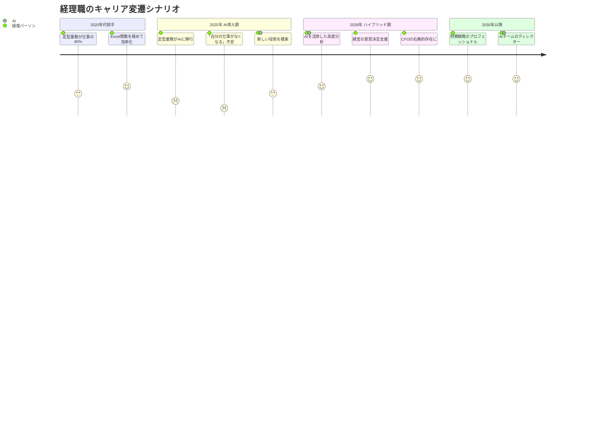
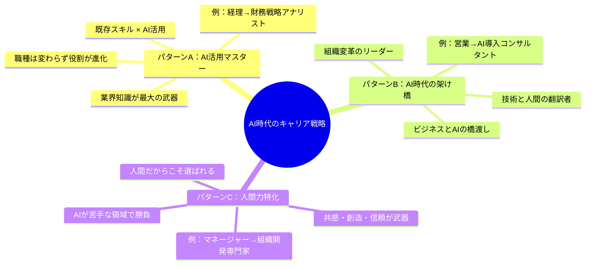
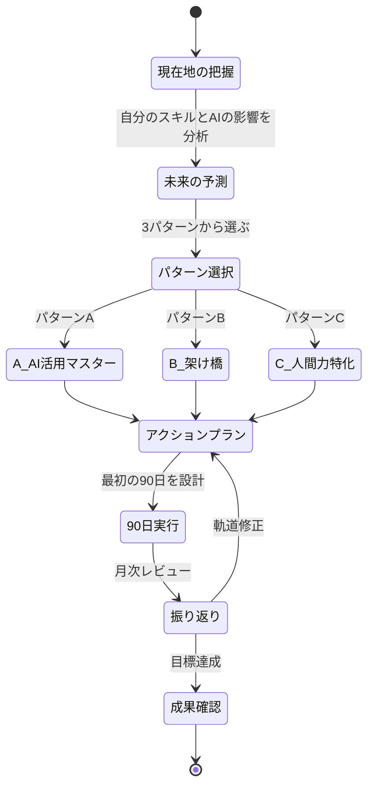

「10年後、私の仕事ってまだありますかね」

金曜日の18時、退勤直後にオンラインセッションに繋いだ村上さん（32歳・経理部主任）は、開口一番そう聞いた。大手メーカーに新卒入社して10年。仕訳、月次決算、予算管理。経理の実務には自信がある。しかし先月、社内にAI経理システムが導入された。村上さんが3日かけていた月次決算の仕訳チェックを、AIが2時間で終わらせた。しかもミスはゼロだった。

「自分が10年かけて磨いたスキルが、AIに2時間で代替された。正直、足元が崩れるような感覚でした」

一方、同じ経理部の後輩・川口さん（26歳）は、AI導入後むしろ活き活きと働いている。AIが仕訳チェックを引き受けたことで浮いた時間を使って、経営企画部と連携した財務分析レポートを自主的に作成。それが経営会議で採用され、CFOから「こういう分析がほしかった」と直接声をかけられた。

村上さんと川口さんの違いは、スキルの高低ではない。**AI時代のキャリアをどう設計するか**という視点の有無だ。

## 「AIに仕事を奪われる」は半分正解で半分間違い

世界経済フォーラムの2025年レポートによると、2030年までに現在の仕事の**23%**が大幅に変容するとされている。しかし、「なくなる」のではなく「変わる」のがポイントだ。

経理の仕事で考えてみよう。AIが代替するのは「仕訳入力」「数字の照合」「定型レポートの作成」だ。つまり、ルールが明確で、正確性が求められる定型業務。しかし、「この数字の異常値はなぜ発生したのか」「来期の予算配分をどう変えるべきか」「経営陣にどう報告すれば意思決定を促せるか」は、AIには判断できない。



この流れは経理に限らない。[AIと人間の仕事の未来](/blog/ai-career-future)でも解説したが、ほぼすべての職種で同様の変容が起きている。

## AI時代の3つのキャリアパターン

私のセッションでは、AI時代のキャリア戦略を3つのパターンに分類している。どれが正解というわけではなく、自分の強み・価値観・市場環境に応じて選ぶものだ。



### パターンA：AI活用マスター -- 既存スキルをAIで増幅する

自分の専門分野を維持しながら、AIを「増幅装置」として使いこなすキャリアパターン。最も多くの人に適用できる戦略だ。

**このパターンに向いている人：**
- 特定の業界・職種で5年以上の経験がある
- 業界特有の暗黙知を豊富に持っている
- テクノロジーへの抵抗感が少ない

**具体例：**
- 経理担当 → AIを使った財務戦略アナリスト
- ライター → AIアシスト型のコンテンツストラテジスト
- マーケター → AIデータ分析を武器にした戦略マーケター
- 人事担当 → AIを活用した人材開発スペシャリスト

**アクションプラン：**

| 期間 | やること | 目標 |
|------|---------|------|
| 1ヶ月目 | AI活用の基礎を身につける | [AIネイティブOS](/blog/ai-native-mindset)の5原則を実践 |
| 2-3ヶ月目 | 自分の業務でAIを活用 | 定型業務の50%をAI化 |
| 4-6ヶ月目 | 高度な活用に挑戦 | AIを使った分析・企画力で成果を出す |
| 7-12ヶ月目 | チームにAI活用を展開 | 部署のAI活用リーダーになる |

### パターンB：AI時代の架け橋 -- ビジネスとテクノロジーの翻訳者になる

AIの技術を深く理解しつつ、ビジネスサイドの言葉で説明できる「翻訳者」のキャリアパターン。需要が急増しているが、人材が圧倒的に不足している領域だ。

**このパターンに向いている人：**
- ビジネスとテクノロジーの両方に興味がある
- 複雑なことを分かりやすく説明するのが得意
- 組織の変革や新しい仕組みの導入に関わってきた経験がある

**具体例：**
- 営業 → AI導入コンサルタント
- プロジェクトマネージャー → AI活用推進室長
- 企画 → AIプロダクトマネージャー

**アクションプラン：**

| 期間 | やること | 目標 |
|------|---------|------|
| 1-3ヶ月目 | AIの基礎技術を学ぶ | プロンプトエンジニアリング、AI各サービスの特性理解 |
| 4-6ヶ月目 | 社内のAI活用事例を作る | 小さなプロジェクトでAI導入を成功させる |
| 7-9ヶ月目 | AI活用の成果を発信 | 社内外での実績を可視化 |
| 10-12ヶ月目 | AI導入支援の仕事を獲得 | 副業・兼業でコンサル案件を1つ受注 |

### パターンC：人間力特化 -- AIが逆立ちしてもできない領域で勝負する

AIが進化するほど、**人間にしかできないこと**の価値が上がる。共感、信頼構築、身体性、文化理解。これらの領域に特化するキャリアパターンだ。[AI時代に人間にしかできない仕事](/blog/human-only-work-ai-era)で解説した通り、人間固有の能力への需要はむしろ高まっている。

**このパターンに向いている人：**
- 人と接する仕事が好きで得意
- 共感力やコミュニケーション力に自信がある
- テクノロジーよりも人間に興味がある

**具体例：**
- マネージャー → 組織開発・チームビルディング専門家
- 営業 → ハイタッチ営業のスペシャリスト
- 人事 → エンプロイーエクスペリエンス設計者
- 教師 → メンタリング・コーチング型教育者

**アクションプラン：**

| 期間 | やること | 目標 |
|------|---------|------|
| 1-3ヶ月目 | 自分の「人間力」を棚卸し | 強みの特定と言語化 |
| 4-6ヶ月目 | 専門性を深める学習 | コーチング、ファシリテーションなどのスキル習得 |
| 7-9ヶ月目 | 実践と実績づくり | 社内外でスキルを発揮する機会を作る |
| 10-12ヶ月目 | ポジションを確立 | 「この人に頼みたい」と思われる存在になる |

## ケース1：経理の村上さんが「財務戦略パートナー」に変わるまで

冒頭の村上さん（32歳・経理部主任）は、パターンAを選択した。10年間の経理経験は、AIに代替されるものではなく、**AIと組み合わせることで10倍の価値を生む資産**だと位置づけ直した。

**3ヶ月間のアクション：**

**Month 1：AIとの協働を開始**
AIが仕訳チェックを担当してくれたことで浮いた時間を使い、まず[プロンプト実践ガイド](/blog/prompt-practice-guide)のテンプレートを参考にしながら、財務データの分析にAIを活用し始めた。

「最初は、AIに『この数字の異常値を分析して』と聞くだけだった。でも、10年の経験があるから、AIの分析結果を見て"これは季節要因じゃなくて、取引先A社の支払いサイト変更が原因だ"と気づける。AIだけでは絶対に出てこないインサイトだった」

**Month 2：経営企画部との連携**
AIで生成した財務分析レポートを持って、経営企画部にアプローチ。「来期の事業計画に、こんな財務視点のシナリオ分析を入れませんか」と提案した。

「経営企画部は数字の分析には詳しいけど、経理の実務から見える"地に足のついた分析"は持っていなかった。私の分析が歓迎された」

**Month 3：CFOへの直接報告**
月次のCFOレポートに、AIを活用した「財務リスク早期警報レポート」を自主的に追加。取引先の信用情報、為替リスク、キャッシュフローの予測を組み合わせた分析だ。

CFOからの評価：「村上さんのレポートは、経営判断に直結する分析になっている。経理部にこういう人材がいるとは思わなかった」

**Before → After：**
- 業務内容：仕訳チェック80%＋その他20% → 財務戦略分析60%＋AI管理20%＋仕訳レビュー20%
- 社内評価：「正確な実務者」 → 「経営に貢献する戦略パートナー」
- 年収：520万円 → 650万円（翌年度の人事評価で等級アップ）
- 仕事の満足度（自己評価）：3/10 → 8/10

「AIに仕事を奪われるのが怖かった。でも実際は、AIが"作業"を引き受けてくれたおかげで、初めて"仕事"ができるようになった」と村上さんは言う。

## ケース2：営業の坂本さんが「AI活用コンサルタント」に転身した話

坂本さん（34歳）は人材業界で法人営業8年の後、パターンBを選択。「AIが提案書を作るようになったら、"足で稼ぐ営業"の価値はどんどん下がる」と危機感を持った。

**6ヶ月のキャリアチェンジ：** まず自チームにAI導入し成約率25%向上の実績を作り（Month 1-2）、社内他部署に横展開（Month 3-4）。副業でAI導入コンサルを開始し（Month 5、[30代のキャリアチェンジ](/blog/30s-career-change-guide)の「スモールステップ」戦略）、Month 6に独立。初月から3社のクライアントを獲得した。

「AIの技術的知識ならエンジニアが上。でも"AIをビジネス成果に結びつける"現場感覚は、営業出身の自分しかなかった」。現在の月商150万円、前職の年収600万円を半年で超えた。

## ケース3：管理職の谷口さんが「人間力」で勝負する決断

谷口さん（45歳・IT企業の部長）はパターンCを選択。「テクノロジーは得意じゃない。でも25年のマネジメント経験、100人以上の部下育成、3回の部署統合を成功させた組織開発力がある」

**1年後の変化：** IT部門の部長から全社AI推進プロジェクトのチェンジマネジメント責任者に。さらに社外2社の顧問（AI導入時の組織変革アドバイザー）も兼任。年収は850万円から1,100万円に。

「AI導入で必ず起きる"人の問題"——抵抗感、不安、スキルギャップ——を解決できるのは、修羅場をくぐった管理職だけだ」。[人間にしかできない仕事](/blog/human-only-work-ai-era)に特化することで、AI時代に高い価値を発揮できることを示す好例だ。

## 10年後に価値を発揮し続けるための「スキルポートフォリオ」

株式投資で分散投資が重要なように、キャリアでもスキルの分散投資が重要だ。一つのスキルに全振りするのはリスクが高い。

```mermaid
xychart-beta
    title スキルポートフォリオの推奨配分（2026年版）
    x-axis ["専門スキル", "AI活用力", "対人スキル", "思考力", "変化適応力"]
    y-axis "投資配分（%）" 0 --> 40
    bar [30, 25, 20, 15, 10]
```

**専門スキル（30%）** は判断・応用・創造に集中投資。**AI活用力（25%）** はプロンプト設計やAI出力の品質管理（[プロンプト実践ガイド](/blog/prompt-practice-guide)参照）。**対人スキル（20%）** はAI進化で希少価値が高まる領域。**思考力（15%）** は[問いを立てる力](/blog/ai-era-question-power)や[意思決定疲れ対策](/blog/decision-fatigue)を含む。**変化適応力（10%）** は[成長マインドセット](/blog/growth-mindset)が土台になる。

## 「10年後の自分」を設計する4ステップ



**Step 1（現在地）：** AIに代替される業務、AIに代替されにくい自分の強み、現在の市場価値を把握する。**Step 2（未来予測）：** 3年後の職種変化、5年後の求められるスキル、10年後のなりたい姿を描く。**Step 3（パターン選択）：** A・B・Cから自分に合うものを選ぶ。**Step 4（90日計画）：** 最初の30日は1つだけ、次の30日で2つ、残りの30日で成果を出す。

[フィードバック・マインドセット](/blog/feedback-mindset)の考え方を取り入れて、月1回は振り返り、軌道修正することが重要だ。

## よくある質問

**Q. 3つのパターンを組み合わせられるか？** できる。メインを1つ選び、サブとして他の要素を取り入れるのが現実的だ。

**Q. 転職すべきか？** 不安だけで転職するのはおすすめしない。まず今の会社で実績を作ってからの方が、選択肢も年収も大きく変わる。[転職の前に考えるべきこと](/blog/before-job-change)も参考にしてほしい。

**Q. 文系出身でも大丈夫か？** AI活用マスターに必要なのはプログラミングではなく「良い問いを立てる力」と「業界知識」だ。文系出身者の方がAIを武器にしやすいケースは多い。

**Q. 年齢的に遅すぎることはあるか？** ない。谷口さん（45歳）のように、経験と判断力はむしろ年齢とともに価値が上がる資産だ。

## 明日から始めるキャリア戦略

10年後のキャリアを考えるのは大げさに思えるかもしれない。しかし、AI技術の進化スピードを考えると、**今日始めるか、3年後に焦るか**の二択だ。

**今日のアクション：**

1. **15分で自己診断**：自分の業務の中で、AIに代替される可能性の高いものを3つ書き出す
2. **パターンを仮選択**：A・B・Cのどれが自分に合いそうか、直感で選ぶ（後で変えてOK）
3. **最初の一歩を決める**：選んだパターンの「Month 1」のアクションを1つだけ、今週やると決める

村上さんは、最後にこう言った。

「10年前、"Excel VBAを覚えないと経理の仕事はなくなる"と言われていた。結局なくならなかった。でも、Excel VBAを覚えた人は、キャリアの選択肢が広がった。AIも同じだと思う。"仕事がなくなる"んじゃなくて、"AIと上手く付き合えた人のキャリアが広がる"んです」

AI時代のキャリア戦略に、唯一の正解はない。しかし、**何もしないことだけは、確実に間違い**だ。小さな一歩を、今日踏み出そう。

---

## あなたのAI時代のキャリア戦略を一緒に設計しませんか？

「3つのパターンのどれが自分に合うか分からない」「具体的なアクションプランを一緒に作りたい」という方へ。**体験セッション（無料）**では、あなたのスキル・経験・価値観を棚卸しした上で、AI時代のキャリア戦略をオーダーメイドで設計します。10年後の自分に自信を持てるキャリアプランを、一緒に描きましょう。

[→ 体験セッションに申し込む](/sessions)
