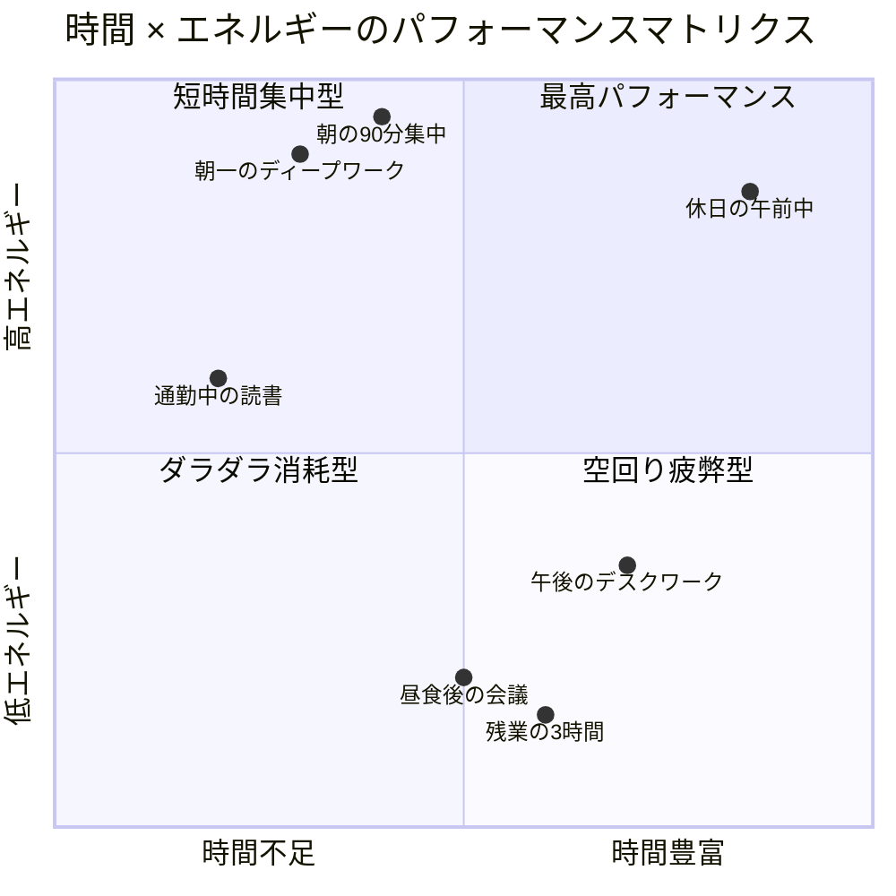
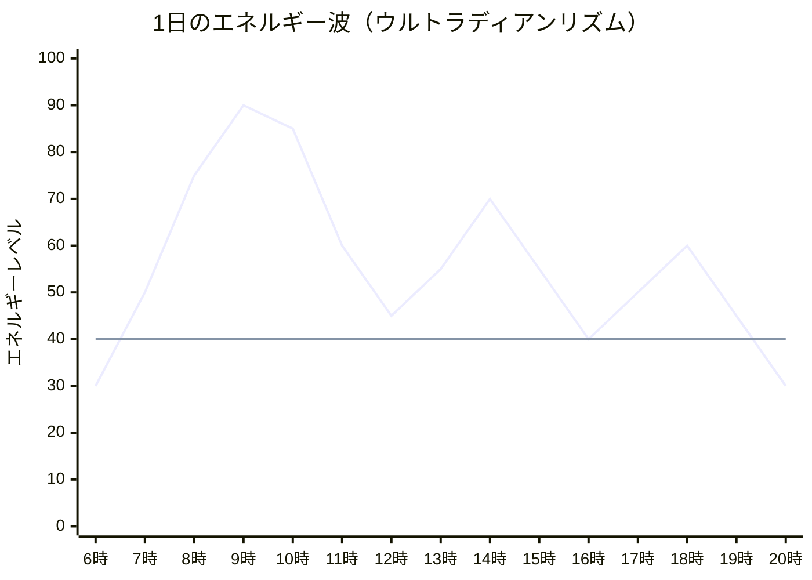
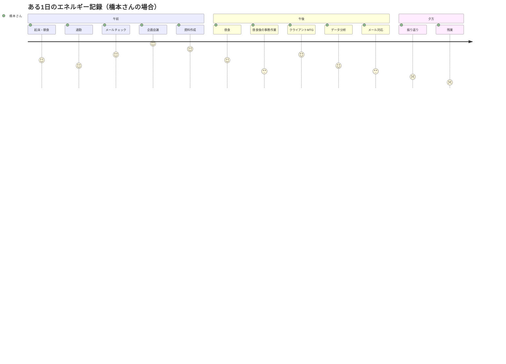
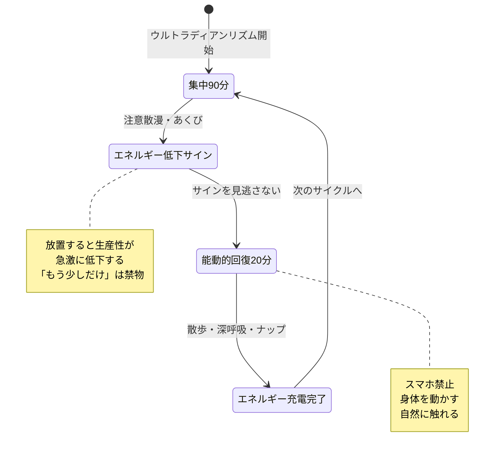
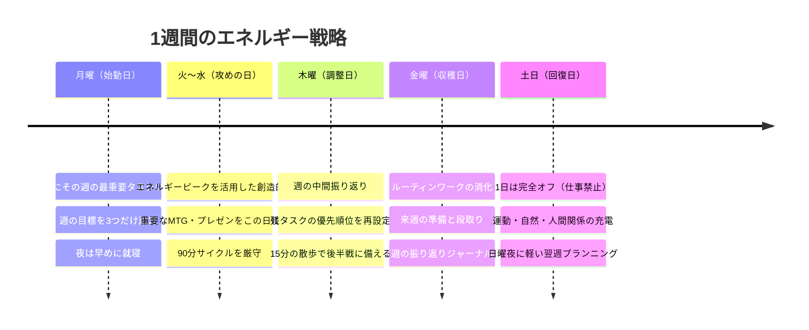

「今日は時間があったのに、何もできなかった」

金曜の夜、パソコンを閉じながら橋本さん（32歳・Webマーケター）はため息をついた。手帳を開くと、午前中に2時間、午後に3時間のブロック時間がきちんと確保されていた。なのに、企画書は2ページ目で止まっている。SNSの投稿案は手つかず。振り返れば、午前中は「なんとなくメールチェック」で過ぎ、午後は「眠気と戦いながらExcelをいじる」だけで終わった。

「時間管理はちゃんとやっているのに、なぜ成果が出ないんだろう」

答えは明快だった。橋本さんに足りなかったのは**時間**ではなく、**エネルギー**だった。

---

## 時間管理の限界 — なぜ「時間があるのに動けない」のか

多くのビジネスパーソンが時間管理に取り組んでいる。スケジュール帳にタスクを詰め込み、[ポモドーロ・テクニック](/blog/pomodoro-technique)でタイマーを回す。しかし、時間管理だけでは根本的な問題が解決しない。

人間のパフォーマンスを決定するのは「どれだけの時間があるか」ではなく、「その時間にどれだけのエネルギーがあるか」だ。

右下の「ダラダラ消耗型」にいる時間が多い人は、時間はあるのに成果が出ない典型パターンだ。橋本さんはまさにこの象限にいた。

### エネルギーの4つの次元

パフォーマンス心理学者ジム・レーヤーの研究によれば、人間のエネルギーには4つの次元がある。

| 次元 | 内容 | 枯渇すると |
|------|------|-----------|
| **身体的エネルギー** | 体力、睡眠、栄養 | 集中力の崩壊、眠気 |
| **感情的エネルギー** | ポジティブ感情、安心感 | イライラ、不安、やる気の喪失 |
| **知的エネルギー** | 集中力、思考力 | 判断ミス、先延ばし |
| **精神的エネルギー** | 目的意識、価値観 | 虚無感、「何のためにやっているのか」 |

時間管理は「知的エネルギー」の配分しか扱わない。残りの3つの次元が枯渇していれば、いくら時間を確保しても成果は出ない。

---

## ウルトラディアンリズム — 90分周期の波を乗りこなす

### 脳には「集中の波」がある

人間の脳は、90〜120分の周期で覚醒と休息を繰り返している。これを**ウルトラディアンリズム**と呼ぶ。睡眠研究者ナサニエル・クライトマンが発見したこのリズムは、睡眠中だけでなく、日中の活動にも影響を与える。

グラフの波を見てほしい。エネルギーは直線ではなく、**波**として上下する。この波のピークでディープワークを行い、谷で回復する。これがエネルギーマネジメントの核心だ。

### 「90分集中 → 20分回復」が黄金比

研究によると、ピークパフォーマーたち（アスリート、音楽家、チェスプレイヤー）は共通して**90分以内**の集中セッションで最高の成果を出し、その後に意図的な休息を挟む。

このリズムに逆らい、4〜5時間ぶっ通しで働くと何が起こるか。コルチゾール（ストレスホルモン）が上昇し、前頭前野の機能が低下する。つまり、「長く働くほどバカになる」という残酷な事実がある。

---

## エネルギーを「設計」する — 1日の波を味方にする方法

### ステップ1：自分のエネルギーパターンを知る

まず1週間、30分ごとの「エネルギーレベル」を1〜10で記録してほしい。

橋本さんが記録を取ってわかったのは、午前10時〜12時が自分のゴールデンタイムであること、そして13時〜14時が「エネルギーの谷」であること。それまで彼は午前中をメール処理に使い、午後に企画書を書いていた。**最も重要な仕事を、最もエネルギーが低い時間帯に当てていた**のだ。

### ステップ2：タスクをエネルギーレベル別に分類する

すべてのタスクが同じエネルギーを必要とするわけではない。

| エネルギーレベル | タスクの種類 | 具体例 |
|:---:|------|------|
| **高** | 創造的・戦略的思考 | 企画書の骨子、新規戦略立案、文章執筆 |
| **中** | 分析・整理・コミュニケーション | データ分析、1on1、プレゼン準備 |
| **低** | ルーティン・事務処理 | メール返信、経費精算、ファイル整理 |

### ステップ3：波に合わせてタスクを配置する

```mermaid
gantt
    title エネルギー波に沿った1日のタスク設計
    dateFormat HH:mm
    axisFormat %H:%M

    section 高エネルギー帯
    ディープワーク（企画・戦略）    :done, a1, 09:00, 90min
    回復タイム                      :crit, r1, 10:30, 20min

    section 中エネルギー帯
    MTG・1on1                       :active, a2, 10:50, 60min
    回復タイム                      :crit, r2, 11:50, 10min
    資料作成・分析                  :active, a3, 12:00, 60min
    昼食・散歩                      :crit, lunch, 13:00, 60min

    section 第2の波
    クリエイティブ作業              :done, a4, 14:00, 90min
    回復タイム                      :crit, r3, 15:30, 20min

    section 低エネルギー帯
    メール・事務処理                :a5, 15:50, 40min
    翌日の準備・振り返り            :a6, 16:30, 30min
```

**鉄則：ゴールデンタイムに最重要タスクを当て、エネルギーの谷ではルーティンワークを回す。**

---

## ケーススタディ：エネルギー設計で人生が変わった3人

### ケース1：橋本さん（32歳・Webマーケター）— 同じ8時間で成果が2倍に

**Before：**
- 午前中をメール処理に使い、午後に企画書を書く
- 毎日20時まで残業。月の残業時間は50時間超
- 「時間はあるのに成果が出ない」が口癖

「朝のゴールデンタイムにメールを開くのが当たり前だと思っていました。でも、それが最大のミスだったんです」

**実践した3つの変更：**
1. 午前9時〜10時30分を「メール禁止のディープワークタイム」に設定
2. メール処理を16時以降に集約
3. 13時〜14時のエネルギーの谷で昼食後の15分パワーナップを導入

**After（2ヶ月後）：**
- 企画書の作成時間が平均4時間→1.5時間に短縮
- 月の残業時間が50時間→15時間に激減
- 上司から「企画の質が上がった」と評価
- 「同じ8時間でも、エネルギーの使い方で成果がここまで変わるとは思わなかった」

### ケース2：田中さん（27歳・エンジニア）— 午後の「脳死タイム」を克服

**Before：**
- 午後になるとコードが書けなくなり、StackOverflowを眺めるだけ
- エナジードリンクを1日3本飲んで無理やり集中
- 週末は疲労で何もできず、日曜の夜に絶望する

「午後2時から4時の間、画面を見つめてるだけで何も進まない日が週の半分以上ありました」

**実践した変更：**
1. 午前中にコアなコーディング（新機能開発、難しいバグ修正）を集中投入
2. 午後は[コードレビュー、ドキュメント整理、設計の壁打ち](/blog/pomodoro-technique)などの「中エネルギータスク」に切り替え
3. 14時に5分間の階段昇降を習慣化（身体的エネルギーの即時充電）
4. エナジードリンクをやめ、代わりに水を1日2リットル飲む

**After（1ヶ月後）：**
- コードの生産性が体感で1.8倍に
- バグ発生率が30%低下（午後の判断ミスが減った）
- エナジードリンク代が月9,000円→0円
- 「体力が仕事の質を決めてたなんて、もっと早く気づきたかった」

### ケース3：山口さん（41歳・管理職）— 「感情的エネルギー」の管理で部下との関係が改善

**Before：**
- 朝一で問題報告のメールを読み、ネガティブ感情のまま1日がスタート
- 午後のミーティングでイライラして部下にきつい言い方をしてしまう
- 「自分は感情コントロールが下手だ」と自己嫌悪

「部下の報告にカチンとくることが増えていました。冷静になれば大したことじゃないのに、その瞬間は我慢できない」

**実践した変更：**
1. 朝一のメールチェックをやめ、9時30分まで自分のタスクに集中
2. 問題報告は昼食後のエネルギーが低い時間帯を避け、15時以降に対応
3. 難しい面談の前に5分間の深呼吸（感情的エネルギーの充電）
4. 毎朝「今日感謝していること3つ」を書く習慣を開始

**After（3ヶ月後）：**
- 部下へのネガティブな反応が激減
- チームの心理的安全性スコアが4.2→7.8（10点満点）に向上
- 「エネルギー管理は自分のためだけじゃなく、周りの人のためでもある」
- 1on1で部下から「最近、課長と話しやすくなりました」と言われた

---

## 「回復」の技術 — 休息こそ最高の投資

### なぜ「ただ休む」では回復しないのか

多くの人が「休息 = 何もしないこと」だと思っている。しかし、ソファでスマホを眺め続ける「受動的休息」では、エネルギーはほとんど回復しない。

回復には**能動的休息**が必要だ。

| 回復法 | 時間 | 回復するエネルギー | 効果 |
|------|:---:|------|------|
| パワーナップ | 15-20分 | 身体的 + 知的 | 集中力が34%回復（NASA研究） |
| 散歩（できれば緑の中） | 10-15分 | 身体的 + 感情的 | 創造性が60%向上（スタンフォード研究） |
| 深呼吸・瞑想 | 5分 | 感情的 + 精神的 | コルチゾール25%低下 |
| 軽いストレッチ | 5分 | 身体的 | 血流改善、肩こり解消 |
| 雑談・笑い | 5-10分 | 感情的 | オキシトシン分泌、ストレス軽減 |
| スマホでSNS | 15分 | ほぼゼロ | むしろ注意力を消耗 |

### 回復のタイミングを「仕組み化」する

「疲れたら休む」では遅い。疲れを感じる前に、定期的に回復タイムを入れることがポイントだ。

---

## 感情的エネルギーと精神的エネルギーの管理

### 見落とされがちな「心のエネルギー」

身体的エネルギーと知的エネルギーは比較的わかりやすい。問題は、感情的エネルギーと精神的エネルギーだ。これらが枯渇すると、体力があっても「やる気が出ない」「何のためにやっているかわからない」という状態に陥る。

**感情的エネルギーを消耗する5大要因：**
1. **人間関係のストレス** — 苦手な人との長時間の接触
2. **ネガティブニュースの過剰摂取** — 朝のニュースで気分が沈む
3. **自己否定** — 「自分はダメだ」という[内なる声](/blog/self-talk)
4. **未解決の感情** — モヤモヤを抱えたまま仕事をする
5. **過剰な共感** — 他人の問題を引き受けすぎる

**精神的エネルギーを充電する方法：**
- 自分の[価値観と目的](/blog/first-principles-thinking)を定期的に確認する
- 小さな「意味のある行動」を毎日1つ実行する
- 感謝日記をつける（1日3行でOK）
- [レジリエンス](/blog/resilience)を高める習慣を持つ

---

## 1週間のエネルギーデザイン

1日単位だけでなく、**1週間単位**でもエネルギーの波を設計しよう。

**重要なのは「回復日」を必ず設けること。** 週7日フルパワーで働くのは、スマホを充電せずに使い続けるようなもの。いつかバッテリーは切れる。

---

## エネルギーマネジメントを始める3ステップ

**ステップ1（今日・10分）：**
明日のスケジュールを見て、「ゴールデンタイム」（自分が最も元気な時間帯）に入っているタスクを確認する。もしその時間にメールチェックや定例会議が入っていたら、可能な限り移動する。

**ステップ2（今週・毎日3分）：**
30分ごとのエネルギーレベル（1〜10）を3日間記録する。自分のエネルギーパターンを数値で把握する。

**ステップ3（来週から・習慣化）：**
90分集中→20分回復のサイクルを1日2回だけ実践する。最初から完璧を目指さず、まずは[朝のルーティン](/blog/morning-routine)にこのサイクルを1つ組み込むところから始めよう。

---

時間は平等に24時間与えられている。しかし、エネルギーは人によって、そして時間帯によって大きく異なる。同じ1時間でも、エネルギーが充満した1時間は、枯渇した3時間に匹敵する。

橋本さんは今、こう語る。「時間管理が"器"だとしたら、エネルギー管理は"中身"。器だけ立派にしても、中身がスカスカなら意味がなかった」

あなたの1日を変えるのは、新しいタスク管理ツールではない。**自分のエネルギーの波を知り、その波に乗ること**だ。

---

## エネルギーマネジメントを本格的に始めたい方へ

「自分のエネルギーパターンがわからない」「何から手をつければいいか迷う」――そんな方のために、体験セッションではあなたの1日のエネルギーを一緒に分析し、仕事の配置を再設計します。たった90分のセッションで、明日からの働き方が変わります。

[体験セッションの詳細を見る](/sessions)
