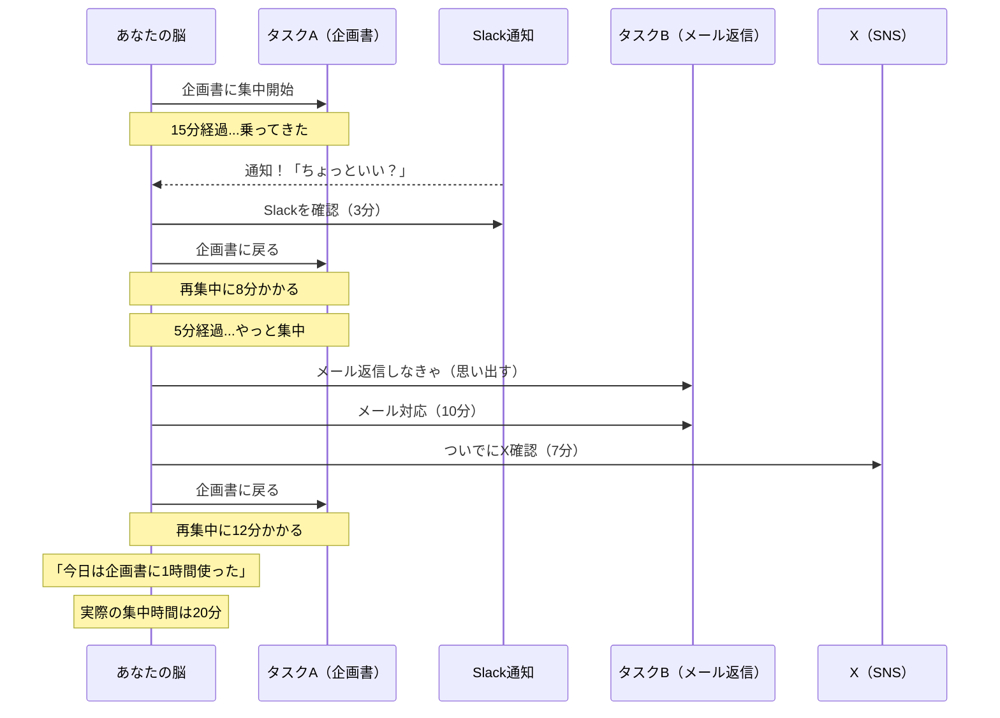
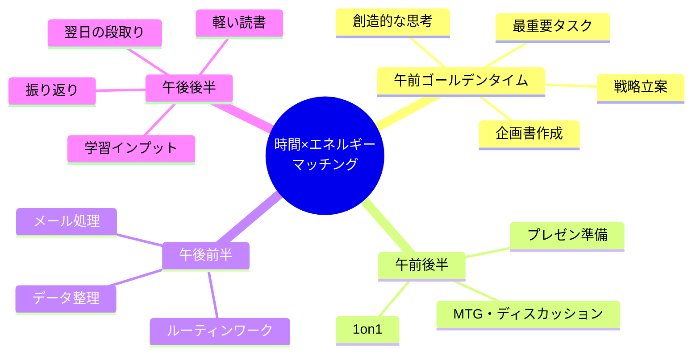
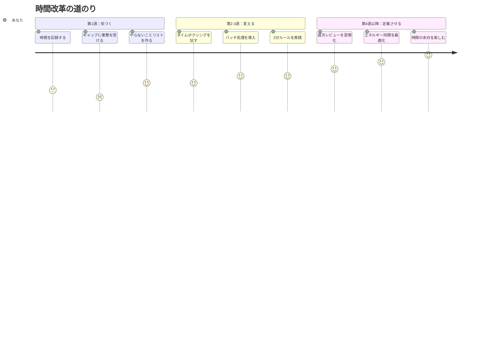

「忙しい」が口癖の松本さん（35歳・営業マネージャー）は、ある土曜日の午後、衝撃を受けた。

妻に頼まれて、先週1週間の「時間の使い方」を30分刻みで記録してみたのだ。結果を見て絶句した。

「仕事に使った時間」だと思っていた週50時間のうち、本当に成果につながる作業に費やしていたのは**たった12時間**。残り38時間の内訳は、惰性の定例会議（8時間）、即レス不要のメール対応（6時間）、SNSチェック（4時間）、「何をしようか考える時間」（5時間）、人から頼まれた本来の担当外の仕事（10時間）、その他の空白時間（5時間）だった。

「忙しいと思っていたのは幻想だった。忙しく"感じていた"だけで、実際には時間を垂れ流していた」

この記事では、松本さんのような「忙しさの錯覚」から抜け出し、時間の認知そのものを改革する7つの科学的戦略を解説する。

---

## なぜ人は「忙しい」と錯覚するのか

### 忙しさの正体 — パーキンソンの法則と時間の膨張

パーキンソンの法則をご存じだろうか。「仕事は、与えられた時間いっぱいに膨張する」という法則だ。30分で終わる報告書に2時間の枠を設定すれば、脳は自動的に2時間かけて仕上げようとする。

さらに厄介なのが**タスクスイッチングコスト**。カリフォルニア大学の研究によると、一つのタスクから別のタスクへ切り替えるたびに、元の作業に戻るまで平均**23分15秒**かかる。つまり、5つのタスクを行ったり来たりしていると、純粋な作業時間よりも「切り替えのロス」の方が大きくなることがある。

松本さんは「仕事に8時間使った」と認識していたが、実際の**集中的作業時間**は2時間程度だった。残りの6時間は「タスク間の移動コスト」と「なんとなく画面を見ている時間」で消えていた。

---

## 7つの時間改革戦略

### 戦略1：時間を「記録」する — 現実と認知のギャップを知る

最初にやるべきことは、時間の使い方を**事実として記録**すること。松本さんがやったように、30分ごとに何をしていたかを3日間記録する。

多くの人がこの段階で衝撃を受ける。「思っていたより会議に時間を使っている」「SNSに1日2時間も使っていた」「"すぐ終わる"と思っていたメールに90分かかっている」。

認知と現実のギャップを知ることが、時間改革の出発点だ。

### 戦略2：[やらないことリスト](/blog/not-to-do-list)を作る — 引き算の威力

足し算の時間管理（もっとやる、もっと詰め込む）には限界がある。本当に効くのは**引き算**だ。

松本さんが作った「やらないことリスト」：
- 即レスしない（メール確認は1日3回に限定）
- 議題のない会議には出ない
- 他部署の「なんとなく参加してほしい」に応じない
- 完璧な資料を作らない（80%で提出する）
- 作業中にSlackを開かない

このリストだけで、松本さんは週12時間を取り戻した。

### 戦略3：タイムボクシング — 「いつやるか」ではなく「いつまでにやるか」

タスクリストではなく、**カレンダーにタスクの実行時間を予約する**方法。ハーバード・ビジネス・レビューが「最も効果的な生産性テクニック」と評価した手法だ。

```mermaid
gantt
    title タスクリスト vs タイムボクシング
    dateFormat HH:mm
    axisFormat %H:%M

    section タスクリスト式（従来）
    いつやるか不明のタスク群    :a1, 09:00, 480min

    section タイムボクシング式
    企画書ドラフト              :done, b1, 09:00, 60min
    メール処理                  :active, b2, 10:00, 30min
    チームMTG                   :b3, 10:30, 60min
    提案資料修正                :done, b4, 11:30, 45min
    昼食                        :crit, b5, 12:15, 45min
    クライアント電話            :b6, 13:00, 30min
    データ分析                  :done, b7, 13:30, 90min
    振り返り・翌日準備          :active, b8, 15:00, 30min
```

タイムボクシングのルール：
1. すべてのタスクに**終了時刻**を設定する
2. 時間が来たら、途中でも手を止める
3. 「バッファ」として1日30分の空白をカレンダーに入れておく

### 戦略4：バッチ処理 — 同種のタスクをまとめる

メールを受信するたびに返信する。Slackの通知が来るたびに確認する。この「リアルタイム対応」が時間を破壊する。

同種のタスクを**まとめて処理する（バッチ処理）**ことで、タスクスイッチングコストを最小化できる。

| タスク | リアルタイム処理 | バッチ処理 |
|------|:---:|:---:|
| メール | 1日30回チェック（各3分） | 1日3回（各20分） |
| Slack | 常時チェック | 1時間ごとに5分 |
| 電話返し | 着信ごと | 午後にまとめて |
| 経費精算 | 都度処理 | 週1回金曜にまとめて |
| **1日の総消費時間** | **約4時間** | **約1.5時間** |

バッチ処理だけで、松本さんは1日2.5時間を節約した。

### 戦略5：2分ルール — 小さなタスクを溜めない

デビッド・アレン（GTD創始者）の「2分ルール」。**2分以内で終わるタスクは、今すぐやる**。リストに書く手間、思い出す手間、取りかかる手間を合算すると、2分以上かかるからだ。

ただし注意が必要。このルールは「ディープワーク中」には適用しない。集中しているときに2分タスクが割り込むと、[マルチタスクの罠](/blog/multitasking-myth)にはまる。バッチ処理の時間帯に2分ルールを適用するのが正解だ。

### 戦略6：エネルギー同期 — 時間帯と仕事を一致させる

同じ1時間でも、午前10時の1時間と午後3時の1時間では価値が違う。脳のゴールデンタイムに[ディープワーク](/blog/deep-work)を配置し、エネルギーが下がる時間帯にルーティンワークを回す。

### 戦略7：週次レビュー — 時間の使い方を定期的に監査する

毎週金曜の15分間で「時間の監査」を行う。

**チェック項目：**
1. 今週のゴールデンタイムに最重要タスクを当てられたか？
2. 「やらなくてよかった」タスクはなかったか？
3. [決断疲れ](/blog/decision-fatigue)を感じた場面はいつだったか？
4. 来週、改善できる時間の使い方は何か？

この15分間の振り返りが、翌週の50時間のパフォーマンスを左右する。

---

## ケーススタディ：時間改革の実践者たち

### ケース1：松本さん（35歳・営業マネージャー）— 週50時間労働を38時間に

冒頭の松本さんは、7つの戦略を段階的に導入した。

「一番効果があったのは、時間を記録したこと。記録するだけで、『この会議、本当に必要？』『このメール、明日でよくない？』と自然に考えるようになった」

**Before：**
- 週50時間労働（うち成果につながる時間12時間）
- 毎日20時退社、週末もメール確認
- 「忙しい」が口癖

**After（3ヶ月後）：**
- 週38時間労働（うち成果につながる時間22時間）
- 18時退社が標準に
- チームの売上は前期比115%（時間が減ったのに成果は増えた）
- 「忙しいと言わなくなった。代わりに『今日は何に集中する？』と聞くようになった」

### ケース2：小林さん（28歳・デザイナー）— 「いつも締め切りギリギリ」からの脱出

**Before：**
- 締め切り3日前まで手がつかない
- 直前の徹夜で品質が低下
- 修正依頼が多く、結果的にさらに時間がかかる

「締め切りが遠いと、脳が『まだ大丈夫』と判断して先延ばしにしちゃうんです。そして直前にパニック」

**実践した戦略：**
- タイムボクシングで「毎日30分だけデザインする」枠をカレンダーに予約
- 大きなプロジェクトを「3日ごとのマイルストーン」に分割
- 「80%の完成度で一度提出→フィードバック→仕上げ」のフローに変更

**After（2ヶ月後）：**
- 締め切り2日前にはほぼ完成している状態に
- 修正依頼が7割減（早めに方向性を確認できるため）
- クライアントから「仕事が早くなりましたね」と驚かれた
- 「30分のタイムボクシングが、先延ばし脳を騙すのに最適だった」

### ケース3：中島さん（44歳・経営企画部長）— 会議を半分にしたら業績が上がった

**Before：**
- 週に22時間を会議に費やしていた
- 自分の仕事は「会議の隙間」でやるしかない
- 部下からの相談対応に追われ、戦略的思考の時間がゼロ

「カレンダーを見ると、白い部分（空き時間）がほとんどない。詰まっているのに、何も前に進んでいない」

**実践した改革：**
1. 全ての定例会議を「本当に必要か？」で再評価 → 22件中8件を廃止
2. 残りの会議を30分→15分に短縮（アジェンダ事前共有を徹底）
3. 火曜と木曜の午前中を「会議ゼロブロック」として死守
4. 部下の相談は「15時〜16時のオフィスアワー」に集約

**After（2ヶ月後）：**
- 週の会議時間が22時間→9時間に削減
- 空いた13時間で戦略立案と部門横断プロジェクトを推進
- 四半期の部門業績が過去3年で最高に
- 「会議を減らしたら仕事が回らなくなるかと心配したが、逆だった。むしろ意思決定が速くなった」

---

## 「忙しい」からの脱出マップ

---

## 今日から始める時間改革

**今日できること（5分）：**
スマホのスクリーンタイムを確認する。「思っていたより使っている」という事実に向き合うだけでいい。

**明日できること（15分）：**
明日のカレンダーを開き、1つだけ「やらない」を決める。出なくていい会議、即レスしなくていいメール、完璧にしなくていい資料。

**今週末できること（30分）：**
この1週間の時間の使い方を振り返り、[やらないことリスト](/blog/not-to-do-list)の草案を書く。

「忙しい」は、あなたの人生の質を奪う呪文だ。その呪文を解くのは、新しいテクニックではなく、**時間に対する認知を変えること**。

松本さんは今、こう言う。「時間は管理するものじゃなくて、設計するもの。そして最高の設計は、"やらないこと"を決めるところから始まる」

---

## 時間の使い方を根本から見直したい方へ

忙しさから抜け出せない原因は、一人ではなかなか見つけられません。セッションでは、あなたの1週間の時間を一緒に分析し、「捨てるべきもの」と「集中すべきもの」を明確にします。たった60分で、来週からの時間の感覚が変わります。

[セッションの詳細を見る](/sessions)
