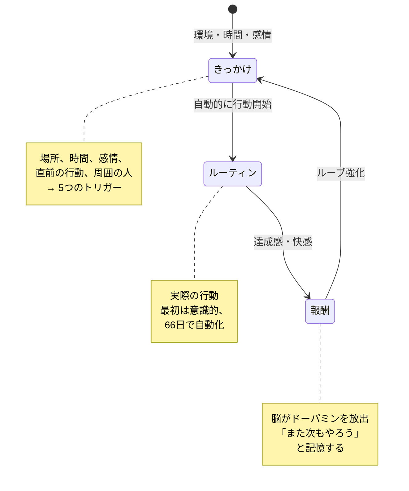
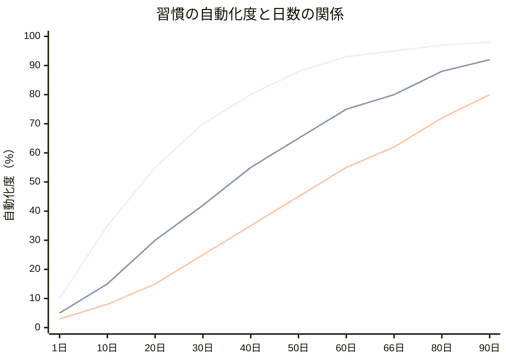
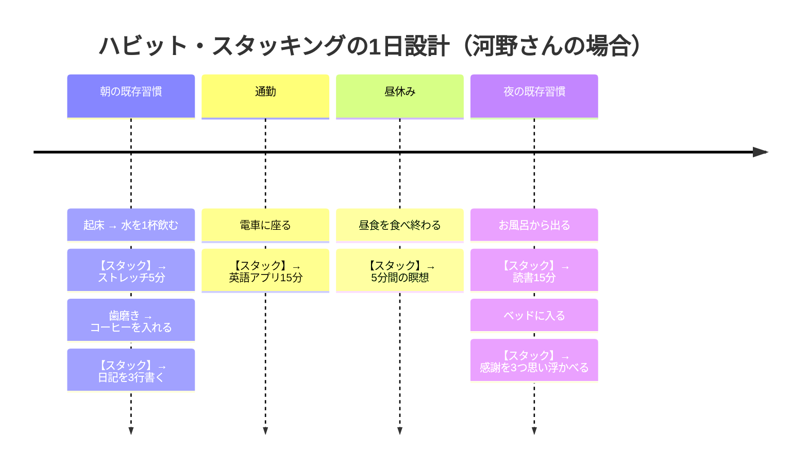
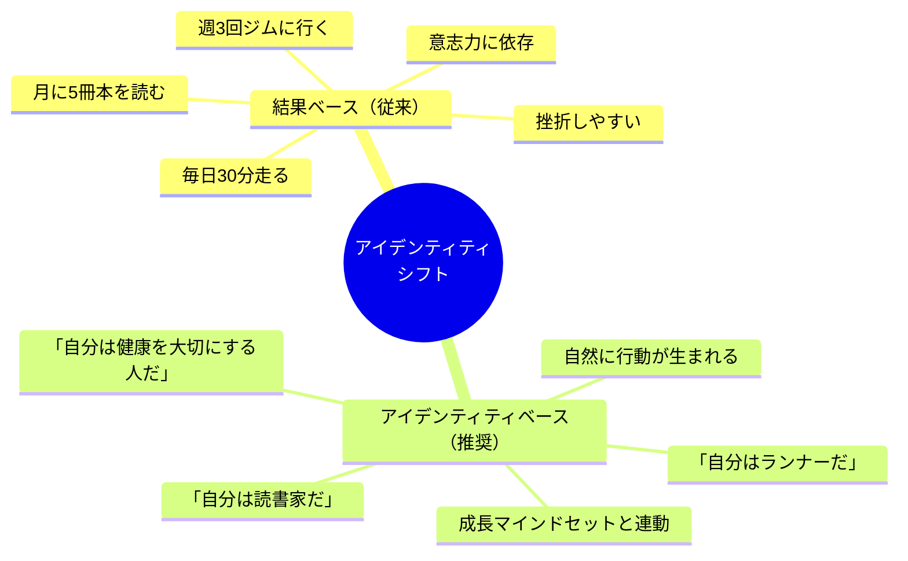

「ジム、英語、読書、日記、瞑想。今年こそ全部やる」

元旦にそう宣言した河野さん（29歳・人事担当）のスマホには、1月2日にダウンロードした5つの習慣トラッカーアプリが入っていた。1月中は順調だった。ジムに12回行った。英語アプリを毎日開いた。しかし2月の第2週、残業が続いた3日間で全てが崩れた。ジムに行けなかった罪悪感が、英語をサボる言い訳になり、読書も日記も瞑想も連鎖的に消えた。

3月1日。5つの習慣トラッカーは、すべて最終記録日が「2月11日」で止まっていた。

「自分は意志が弱いんだ」と河野さんは思った。しかし、これは意志の問題ではない。**習慣の設計**の問題だ。

---

## 習慣の科学 — 脳は「自動化」を渇望している

### なぜ習慣は脳にとって必要なのか

人間の脳は、1日に約35,000回の判断を下す。もしすべての行動を意識的に判断していたら、脳のエネルギーは午前中で枯渇する。

そこで脳は、繰り返し行う行動を**自動化**する。歯磨きのとき「まず歯ブラシに歯磨き粉をつけて、口を開けて、奥歯から磨いて...」と考える人はいない。それが「習慣」だ。

デューク大学の研究によると、人間の日常行動の**約45%は習慣**（無意識の行動）で構成されている。つまり、良い習慣を設計できれば、人生の半分が自動的に良い方向に進む。

### 習慣ループの3要素

MIT の研究者が発見した「習慣ループ」は、すべての習慣に共通する3つの要素で構成される。

**きっかけ（Cue）：** 行動を引き起こすトリガー。「朝7時になったら」「デスクに座ったら」「コーヒーを入れたら」

**ルーティン（Routine）：** 実際の行動。「10分間ストレッチする」「英語アプリを開く」「日記を3行書く」

**報酬（Reward）：** 行動後の快感。「身体がスッキリした」「達成マークがついた」「自分を褒めた」

河野さんの失敗は、この3要素のうち**きっかけと報酬の設計が不十分**だったことにある。5つの習慣を「やると決めた」だけで、いつ・どのタイミングで・何をきっかけに行うかを設計していなかった。

---

## 66日の真実 — 習慣はいつ「自動化」されるのか

### 21日は神話。科学的な答えは「66日」

「習慣化には21日かかる」という通説は、1960年代の形成外科医マクスウェル・マルツの著書が元だが、これは科学的なエビデンスに基づいていない。

ロンドン大学の心理学者フィリッパ・ラリーが96人を対象に行った研究では、新しい習慣が「自動的」と感じられるまでに平均**66日**かかることが判明した。ただし、個人差は18日〜254日と大きく、習慣の難易度によっても変わる。

**重要な発見：** ラリーの研究では、**1〜2日サボっても習慣化の進行にはほぼ影響がなかった**。つまり、河野さんが「3日サボったから全部リセット」と感じたのは錯覚で、実際にはそのまま再開すれば大きな問題はなかったのだ。

---

## 5つの習慣設計テクニック

### テクニック1：ハビット・スタッキング — 既存の習慣に「くっつける」

最も強力な習慣化テクニックが**ハビット・スタッキング**だ。すでに定着している習慣の直後に、新しい習慣を「スタック（積み重ね）」する。

**公式：「[既存の習慣]をしたら、[新しい習慣]をする」**

例：
- 「コーヒーを入れたら、日記を3行書く」
- 「歯を磨いたら、スクワットを10回する」
- 「デスクに座ったら、今日の最重要タスクを1つ書き出す」

既存の習慣が「きっかけ」の役割を果たすため、新しい習慣のトリガーを探す必要がない。

### テクニック2：2分ルール — 「小さすぎて失敗できない」から始める

新しい習慣は、最初の2分間だけ実行すればOK。

- 「毎日30分読書する」→「毎日1ページだけ読む」
- 「毎朝ジョギングする」→「毎朝ランニングシューズを履く」
- 「毎日瞑想する」→「毎日目を閉じて3回呼吸する」

バカバカしいと感じるかもしれない。しかしこの「小ささ」こそが重要だ。脳の抵抗をゼロにし、「行動を開始する」というハードルだけをクリアする。そして一度始めれば、多くの場合「もう少しやろう」となる。

### テクニック3：環境設計 — 意志力に頼らない仕組みを作る

意志力は有限の資源だ。[決断疲れ](/blog/decision-fatigue)が蓄積すると、どんなに強い意志を持っていても行動が止まる。

だから、意志力を使わなくても行動できる**環境**を設計する。

| 習慣 | 環境設計の例 |
|------|------------|
| 朝のストレッチ | ヨガマットを寝室に敷きっぱなしにする |
| 読書 | 本をスマホの横に置く（スマホの代わりに手に取る） |
| ジム | ジムバッグを玄関に置いておく |
| 水を飲む | デスクに2リットルのボトルを常備 |
| 瞑想 | アプリのアイコンをホーム画面の一等地に置く |

逆に、やめたい習慣は**環境から消す**。

| やめたい習慣 | 環境設計の例 |
|------|------------|
| SNS依存 | アプリをホーム画面から削除（探さないと開けない） |
| お菓子の食べすぎ | 家にお菓子を置かない |
| 夜更かし | 寝室にスマホを持ち込まない |

### テクニック4：報酬の即時化 — 脳が「またやりたい」と思う仕掛け

習慣の効果は長期的だが、脳は**即時的な報酬**を好む。「3ヶ月後に5kg痩せる」という報酬では、今日のジムに行くモチベーションにはならない。

即時報酬の設計例：
- 習慣を実行したら、カレンダーに「X」をつける（連続記録の快感）
- 1週間続いたら、好きなカフェのコーヒーを1杯（ご褒美）
- 完了後に「よくやった」と声に出す（自己承認）
- 友人や家族に宣言し、実行報告する（社会的報酬）

### テクニック5：アイデンティティ・シフト — 「何をするか」より「何者になるか」

最も深いレベルの習慣変容は、**アイデンティティ（自己認識）**の変化から起きる。

行動ベースの目標：「毎日走る」→ 意志力が必要
アイデンティティベースの目標：「自分はランナーだ」→ ランナーとして自然に走る

河野さんが変えたのは目標ではなく、自己認識だった。「習慣を頑張る人」から「健康と成長を大切にする人」へ。この[マインドセットの転換](/blog/growth-mindset)が、習慣を「努力」から「当たり前」に変えた。

---

## ケーススタディ：習慣設計で人生が変わった3人

### ケース1：河野さん（29歳・人事担当）— 5つの挫折から1つの成功へ

**Before：**
- 5つの習慣を同時に始めて、すべて2月に挫折
- 「自分は意志が弱い」と自己否定
- 習慣化の成功体験がゼロ

「5つ全部やらないと意味がないと思っていたんです。だから1つサボると全部やめてしまう」

**実践した設計変更：**
1. 5つの習慣を**1つに絞る**（まず朝のストレッチ5分だけ）
2. きっかけ：「目覚ましを止めたら」ストレッチマットに立つ
3. 報酬：ストレッチ後にお気に入りのコーヒーを入れる
4. 2分ルール：最初の2週間は「マットに立って伸びをする」だけでOK

**After（3ヶ月後）：**
- 朝のストレッチが完全に習慣化（66日目で「やらないと気持ち悪い」感覚に）
- ストレッチの後に日記3行を追加（ハビット・スタッキング）
- さらに通勤時の英語アプリを追加
- 3つの習慣が自然に定着
- 「1つずつ積み上げたら、結果的に以前より多くのことが続いている」

### ケース2：佐々木さん（36歳・営業）— 読書ゼロ→年間52冊

**Before：**
- 「本を読みたい」と3年間言い続けて、年間の読書量は2冊
- 通勤時間はずっとスマホでSNSを見ていた
- 「時間がない」が口癖

「読書が大事なのはわかっている。でも、電車に座った瞬間にスマホを開いてしまう。無意識なんです」

**実践した設計変更：**
1. 環境設計：通勤カバンのポケットに文庫本を入れる（スマホより先に手に触れる位置）
2. きっかけ：「電車の席に座ったら」本を開く
3. 2分ルール：「1ページだけ読めばOK」
4. 報酬：読んだページ数を手帳にメモ（数字が増える快感）
5. アイデンティティ：「自分は読書家だ」と手帳の表紙に書いた

**After（1年後）：**
- 年間52冊を達成（週1冊ペース）
- 通勤時間の片道25分が「読書タイム」として完全に定着
- SNSの使用時間が1日2時間→30分に自然減少
- 「読書が自分のアイデンティティの一部になった。電車で本を開かないと落ち着かない」
- 読書で得た知識が営業トークに活き、成績が向上

### ケース3：吉田さん（42歳・管理職）— 「瞑想なんて」と笑っていた自分が毎朝続けている

**Before：**
- 慢性的なストレスで睡眠の質が低下
- 部下の報告にイライラすることが増えていた
- 「瞑想はスピリチュアルなもの」という偏見があった

「正直、最初はバカにしていました。目を閉じて何が変わるんだと」

**実践した設計変更：**
1. きっかけ：朝、デスクのPCの電源を入れたら（起動待ちの間に）
2. 2分ルール：「目を閉じて3回深呼吸するだけ」から開始
3. ハビット・スタッキング：「PCの起動」→「3回呼吸」→「今日の最重要タスクを1つ決める」
4. 報酬：呼吸後の「頭がスッキリした感覚」を意識的に味わう
5. 段階的拡張：2週間ごとに30秒ずつ延長

**After（6ヶ月後）：**
- 毎朝10分間の瞑想が完全に習慣化
- 睡眠スコア（スマートウォッチ計測）が62点→78点に改善
- 部下との1on1で「最近の課長、余裕がありますね」と言われた
- 「瞑想は[自分の内面と向き合う](/blog/resilience)時間。忙しいからこそ必要だった」

---

## 習慣を「壊さない」ための3つの保険

### 保険1：Never Miss Twice（2回連続でサボらない）

完璧主義が習慣の最大の敵だ。1日サボった瞬間に「もうダメだ」と全部やめてしまう。

ルール：**1回サボるのはOK。でも2回連続は絶対にNG。** 研究が示すように、1〜2日のミスは習慣化の進行にほぼ影響しない。

### 保険2：最低バージョンを用意する

「今日はジムに行く気力がない」→ 最低バージョン：「スクワット10回だけ」
「今日は読書する元気がない」→ 最低バージョン：「目次だけ読む」

**0と1の差は、1と100の差より大きい。** やらない日をゼロにすることが、習慣を守る鍵だ。

### 保険3：環境のリセットポイントを作る

旅行、出張、引っ越し、転職。環境が変わると習慣が崩れやすい。

事前に「環境が変わった初日にやること」を決めておく。出張先でも「朝起きたらまず水を1杯飲む」だけは実行する。この1つの行動が、他の習慣の復帰を助ける「アンカー習慣」になる。

---

## 習慣設計を始める3ステップ

**ステップ1（今日・5分）：**
習慣にしたいことを1つだけ選ぶ。「何でも良いから1つ」が重要。[朝のルーティン](/blog/morning-routine)に組み込めるものが理想的だ。

**ステップ2（今日・5分）：**
その習慣の「きっかけ」「ルーティン（2分バージョン）」「報酬」を紙に書く。

例：
- きっかけ：朝、顔を洗ったら
- ルーティン：スクワット5回
- 報酬：カレンダーに丸をつける

**ステップ3（66日間・毎日2分）：**
毎日実行する。サボった日は翌日に必ず再開する。66日後、あなたは「やらないと気持ち悪い」状態になっている。

---

河野さんは今、5つの習慣のうち4つが定着している。ただし、最初の1年で全部をやったわけではない。1つずつ、3ヶ月かけて積み重ねた結果だ。

「意志の力で習慣を続けようとしていた頃は、何もうまくいかなかった。設計の力に切り替えた瞬間、すべてが変わり始めた」

習慣は、あなたの人生の45%を自動操縦する。その自動操縦のプログラムを、意志ではなく設計で書き換える。それが、66日で人生を変える技術だ。

---

## 習慣設計を一緒に始めませんか？

「何から始めればいいかわからない」「何度も挫折して自信がない」――そんな方こそ、セッションで一緒に習慣の設計図を描きましょう。あなたの生活パターン、性格、過去の挫折パターンを分析し、「今度こそ続く」仕組みをオーダーメイドで作ります。

[セッションの詳細を見る](/sessions)
