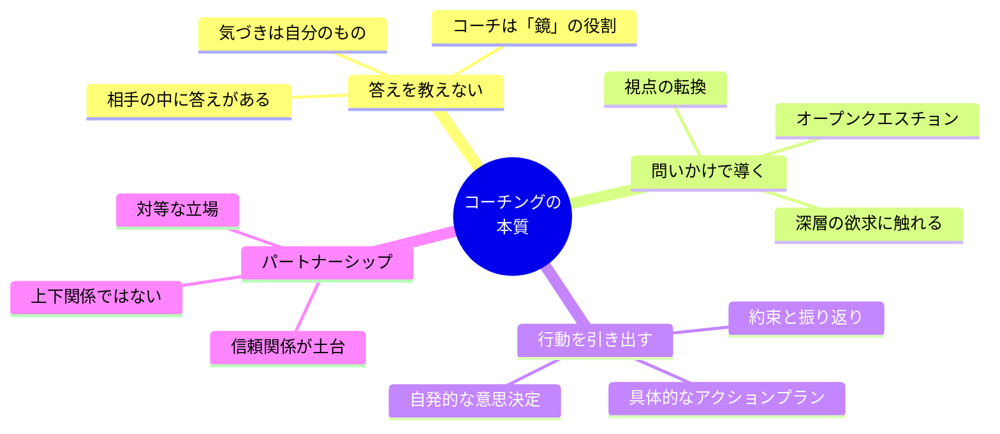
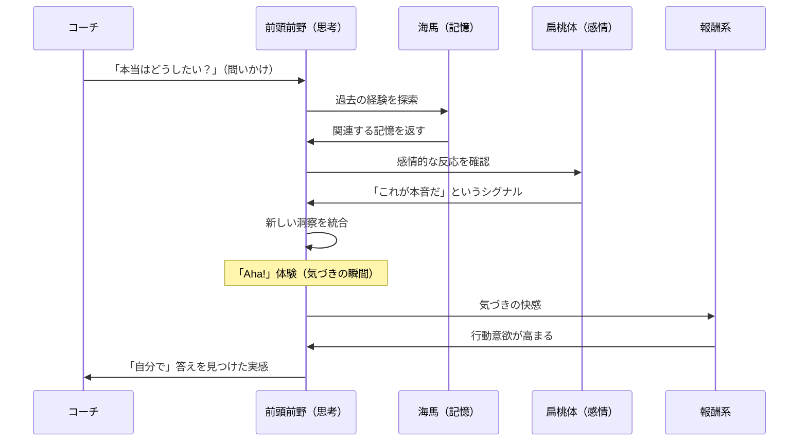
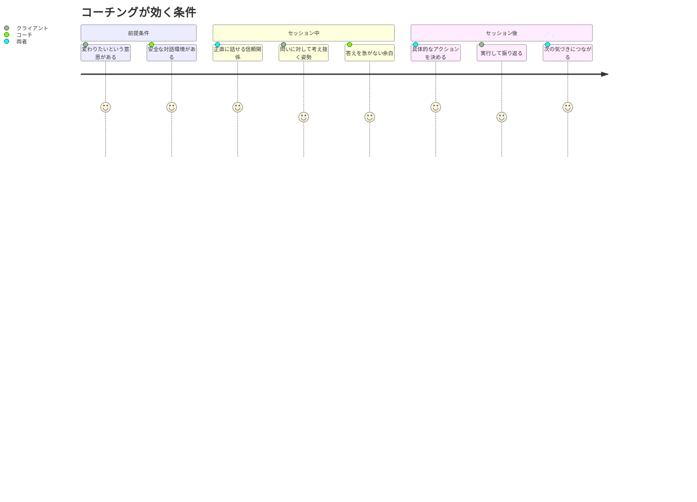

「もっと積極的に行動しなさい」

上司にそう言われた長谷川さん（31歳・企画職）は、わかっている、と思った。積極的に行動した方がいいのは百も承知だ。でも、それができないから困っている。「どうすれば積極的になれるんですか？」と聞いても、「意識の問題だよ」と返ってくるだけ。

ある日、社内研修でコーチングを受ける機会があった。コーチは長谷川さんに、こう問いかけた。

「長谷川さんが "積極的に動けている" と感じた瞬間って、過去にありますか？」

長谷川さんは少し考えて、答えた。「去年の社内プロジェクトで、自分がリーダーをやったとき。あのときは自分から動けていました」

「そのとき、何が違ったんですか？」

「......自分で決められる裁量があったから、かもしれません」

「なるほど。今の仕事に、その "自分で決められる" 要素を増やすとしたら、何ができそうですか？」

15分間の対話で、長谷川さんの中に明確な「次のアクション」が生まれた。上司の「もっと積極的に」という指示は、半年間何も変えなかった。しかし、コーチのたった3つの問いが、行動を生んだ。

**コーチングは、答えを教えない。問いで、相手の中にある答えを引き出す。** この記事では、コーチングの本質とその科学的メカニズムを解説する。

---

## コーチングの定義 — 「教える」の対極にあるもの

### コーチングとは何か

国際コーチング連盟（ICF）の定義では、コーチングとは「クライアントの個人的・職業的な可能性を最大化するための、思考を刺激し続けるクリエイティブなプロセスにおけるパートナーシップ」とされている。

噛み砕くと、こうなる。

**コーチングとは、「問いかけ」と「対話」を通じて、相手の中にある答えを引き出し、自発的な行動を促すプロセス。**

### コーチングと似て非なるもの

コーチングと混同されやすい4つの支援方法との違いを明確にしよう。

| 支援方法 | 主な手法 | 方向性 | 適した場面 |
|---------|---------|:---:|---------|
| **コーチング** | 問いかけ、傾聴 | 相手 → 答え | 目標達成、自己成長、行動変容 |
| **コンサルティング** | 分析、助言 | 専門家 → 答え | 専門知識が必要な課題解決 |
| **カウンセリング** | 傾聴、共感 | 過去 → 癒し | 心理的な問題、トラウマ |
| **ティーチング** | 知識伝達 | 教師 → 生徒 | スキル習得、知識のインプット |
| **メンタリング** | 経験共有、助言 | 先輩 → 後輩 | キャリア支援、業界知識 |

コーチングの最大の特徴は、**コーチが答えを持っていない**こと。コーチが持っているのは「問い」であり、答えは常にクライアントの中にある。

---

## 「問い」が人を動かす科学的メカニズム

### なぜアドバイスは効かないのか

上司の「もっと積極的に」が長谷川さんに響かなかったのは、心理的リアクタンスが働いたからだ。

**心理的リアクタンス**とは、自分の自由が制限されると感じたとき、その制限に抵抗する心理的反応のこと。「こうしなさい」と言われると、それが正しくても、無意識に「言われたくない」と感じる。

一方、問いかけは異なる。「どうしたいですか？」と聞かれると、脳は自分の意志で答えを探し始める。そこで生まれた行動計画は「自分で決めたこと」になるため、実行する確率が格段に高くなる。

### 脳の中で何が起きているのか

コーチングの問いかけが脳に与える影響を、神経科学の視点から見てみよう。

ケース・ウエスタン・リザーブ大学のリチャード・ボヤツィスの研究では、コーチングの問いかけによって脳の**デフォルトモードネットワーク（DMN）**が活性化することが確認されている。DMNは「自分自身について考える」ときに活発になる脳のネットワークで、自己認識、内省、未来の計画に関わっている。

つまり、良い問いかけは、文字通り**脳の自己探索エンジンのスイッチを入れる**のだ。

---

## コーチングの問いかけ — 5つのレベル

すべての問いかけが同じ効果を持つわけではない。問いにはレベルがある。

### レベル1：事実の確認

「今、何に取り組んでいますか？」「いつまでに終わらせる必要がありますか？」

現状把握のための問い。ここから始めて、徐々に深い問いへ進む。

### レベル2：思考の整理

「それはなぜ重要だと思いますか？」「優先順位をつけるとしたら？」

散らかった考えを構造化する問い。

### レベル3：視点の転換

「もし制約がなかったら、何をしたいですか？」「10年後の自分が今の自分にアドバイスするなら？」

固定された思考パターンを揺さぶる問い。ここから気づきが生まれやすい。

### レベル4：価値観への接続

「それは、あなたにとってなぜ大切なのですか？」「本当はどうしたいですか？」

行動の奥にある[価値観や信念](/blog/first-principles-thinking)に触れる問い。長谷川さんが「裁量があるから動けた」と気づいた瞬間は、このレベルの問いによるものだった。

### レベル5：存在そのものへの問い

「あなたはどんな人でありたいですか？」「人生の最後に、何を成し遂げた自分でいたいですか？」

人生の根幹に触れる問い。コーチングの最も深い対話は、ここで行われる。

---

## ケーススタディ：コーチングで何が変わったのか

### ケース1：長谷川さん（31歳・企画職）— 「積極性がない」の本当の原因

**Before：**
- 上司から「積極性が足りない」と評価され続けて2年
- 自己啓発本を読んでも行動が変わらない
- 「自分は消極的な性格なんだ」と諦めかけていた

「コーチに聞かれて初めて気づいたんです。消極的なんじゃなくて、"自分で決められない環境" に消極的になっていただけだった」

**コーチングで見つけた気づき：**
- 性格の問題ではなく、環境（裁量の有無）の問題だった
- 自分は「指示される」と動けないが、「自分で決める」と驚くほど動ける
- 上司に「提案してから確認を取る」スタイルを提案する、という具体的アクション

**After（3ヶ月後）：**
- 上司に「企画の方向性を自分で決めて、確認だけ取る形にさせてほしい」と直談判
- 承認され、自分起点で3つの企画を立ち上げ
- 半期の評価で初めて「A」を獲得
- 「自分の取扱説明書がわかった。それだけで仕事が楽しくなった」

### ケース2：木村さん（38歳・エンジニアリーダー）— 「全部自分でやる」からの卒業

**Before：**
- チームリーダーなのに、メンバーの仕事を巻き取ってしまう
- 月の残業時間が80時間超
- 「任せたら品質が落ちる」という恐れ

「コーチに『メンバーに任せられないのはなぜですか？』と聞かれたとき、答えに詰まりました。技術力の問題じゃなかったんです」

**コーチングで見つけた気づき：**
- 「任せられない」の根底には「自分の存在価値がなくなる恐れ」があった
- 「手を動かす人」としての価値から「チームを成長させる人」としての価値への転換が必要
- [ティーチングからコーチングへ](/blog/shift-teaching-to-coaching)のシフトがリーダーとしての成長

**After（6ヶ月後）：**
- メンバーへの業務委譲を段階的に実施
- 残業時間が80時間→30時間に削減
- チーム全体の開発速度が1.4倍に向上
- 「自分がコードを書くより、チームが成長する方がずっと嬉しい。コーチングで価値観が変わった」

### ケース3：藤井さん（26歳・営業）— 「やりたいことがわからない」の解消

**Before：**
- 「やりたいことがわからない」が3年間の悩み
- 自己分析を何度やっても答えが出ない
- 転職サイトを眺めるが、どの求人にもピンとこない

「友達は『これがやりたい！』って言えるのに、自分には何もない。焦りと劣等感でいっぱいでした」

**コーチングでの対話の一部：**
コーチ：「"やりたいこと" がないのは、困りますか？」
藤井さん：「困ります。みんな持っているので」
コーチ：「みんなが持っているから困る。もし、やりたいことがなくても幸せに生きている人がいたら？」
藤井さん：「......それならいいのかもしれません」
コーチ：「藤井さんにとって "幸せ" ってどんな状態ですか？」
藤井さん：「好きな人たちと、穏やかに過ごせること......ああ、私は "やりたいこと" じゃなくて "どう生きたいか" の方が大事なのか」

**After（4ヶ月後）：**
- 「やりたいこと」を探すのをやめ、「どう在りたいか」を軸にキャリアを再考
- 「穏やかに人と関わる仕事」として社内のカスタマーサクセス部門に異動
- [インポスター症候群](/blog/imposter-syndrome)も軽減し、自信を持って仕事に取り組めるように
- 「やりたいことがない自分を責めていた。でも "在り方" から逆算したら、自然と道が見えた」

---

## コーチングが効果を発揮する5つの条件

すべての人にコーチングが効くわけではない。効果を最大化するには条件がある。

1. **変化への意思** — 「変わりたくない」人には効かない
2. **心理的安全性** — [本音を引き出せる関係性](/blog/icebreak-draw-out-honest-thoughts)が土台
3. **内省の習慣** — 問いに対して考える力があること
4. **行動する意思** — 気づきだけでは変わらない。行動して初めて変化が起きる
5. **継続性** — 1回のセッションで人生は変わらない。数ヶ月の継続が必要

---

## コーチングへの3つの誤解を解く

### 誤解1：「弱い人が受けるもの」

世界のトップ経営者の70%以上がコーチを持っている（ICF調査）。Googleのエリック・シュミットは「すべてのCEOにコーチが必要だ」と公言している。コーチングは「弱さの証」ではなく、「成長への投資」だ。

### 誤解2：「高いだけで効果が見えない」

ICFの調査によると、コーチングを受けた個人の80%が「自己信頼の向上」を報告し、70%が「仕事のパフォーマンス向上」を実感している。企業におけるコーチング投資のROIは、平均**7倍**という研究結果もある。

### 誤解3：「アドバイスをくれるのがいいコーチ」

逆だ。優れたコーチほど、アドバイスをしない。なぜなら、他人のアドバイスに従って成功しても、「自分で決めた」という感覚が育たないからだ。本当の成長は、自分の力で答えを見つけたときに起きる。

---

## 今日からできる「問いの力」の体験

コーチングの問いの力を、まず自分自身で体験してみよう。

**問い1（今日・3分）：**
「今、自分が一番 "もやもや" していることは何だろう？」——答えを紙に書き出す。

**問い2（明日・5分）：**
「そのもやもやの奥にある、本当の願いは何だろう？」——表面的な答えの先にある本音を探す。

**問い3（今週中・10分）：**
「もし何の制約もなかったら、自分はどうしたいだろう？」——[レジリエンス](/blog/resilience)を発揮して、制約を外した未来を想像する。

3つの問いに答えるだけでも、自分の中に思いがけない答えが見つかることがある。

---

コーチングは魔法ではない。しかし、正しい「問い」が正しい「気づき」を生み、その気づきが行動を変え、行動が人生を変える。

長谷川さんは今、後輩の育成で「教える」よりも「問いかける」ことを意識している。

「『もっとこうしろ』と言っても人は動かない。でも『どうしたい？』と聞くと、自分で考えて、自分で動き出す。これがコーチングの力だと、身をもって理解した」

---

## 「問い」の力を体験してみませんか？

コーチングに興味はあるけど、自分に合うかわからない。そんな方のために、初回体験セッションをご用意しています。60分の対話で、あなたの中にある「本当の答え」に触れる体験をしてみてください。

[体験セッションに申し込む](/sessions)
