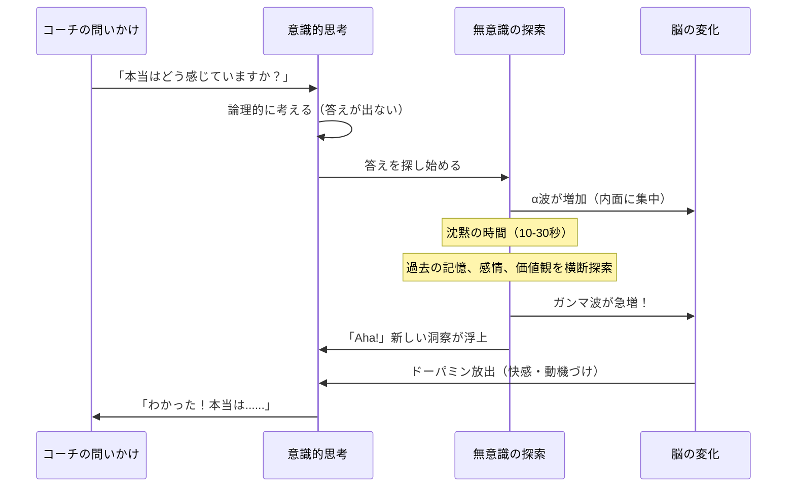
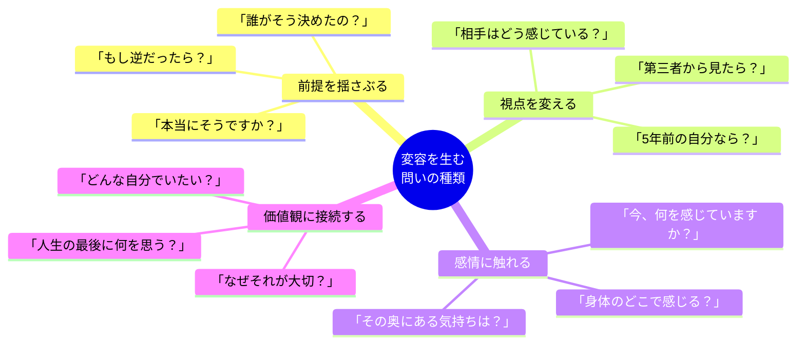
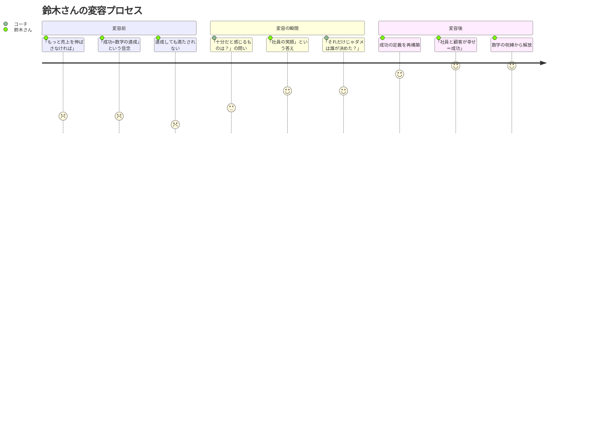

セッション開始から42分。沈黙が続いていた。

加藤さん（34歳・マーケティングマネージャー）は、コーチの問いかけに対して、目を閉じたまま何かを探していた。

5秒。10秒。15秒。

「......あ」

加藤さんの目が開いた。少し潤んでいた。

「わかりました。私が本当に怖いのは、転職に失敗することじゃなかった。"この会社にいる自分を正当化できなくなること" が怖かったんです。今の会社を辞める決断をしたら、"なぜもっと早く辞めなかった？" という問いに向き合わないといけない。その後悔が怖かったんだ」

コーチは何も教えていない。ただ問いかけ、沈黙を守り、加藤さんが自分の深層にたどり着くのを待っていただけだ。

この瞬間——クライアントの中で何かが「カチッ」とつながり、世界の見え方が変わる瞬間。コーチングでは、これを**「変容の瞬間（Transformative Moment）」**と呼ぶ。

この記事では、コーチングセッションで起こる「変化の瞬間」の正体を、脳科学とポジティブ心理学の知見から解き明かす。

---

## 変容の瞬間 — 脳の中で何が起きているのか

### 「Aha!」体験の神経科学

コーチングで気づきが生まれる瞬間、脳ではドラマチックな変化が起きている。

ノースウェスタン大学のマーク・ビーマンの研究によると、「Aha!体験」（突然の洞察）の瞬間、脳の右半球の上側頭回（anterior superior temporal gyrus）でガンマ波と呼ばれる高周波の脳波が急増する。

さらに興味深いのは、この「Aha!」の直前に、脳のα波が増加すること。α波は「内向きの注意」——つまり外界を遮断して自分の内面に集中している状態を示す。

つまり、コーチングの沈黙の時間は「何も起きていない」のではない。脳が全力で内面を探索している**最も重要な時間**なのだ。

### なぜ「自分で見つけた答え」は強いのか

脳科学者デイヴィッド・ロックの研究（SCARF モデル）によると、人間の脳は「自律性（Autonomy）」を非常に重視する。自分で選択し、自分で答えを見つけた場合、脳の報酬系が強く活性化する。

他人から与えられた答えと、自分で見つけた答え。内容が同じでも、脳はまったく異なる処理をする。

| | 他人からの答え | 自分で見つけた答え |
|---|---|---|
| 脳の反応 | 前頭前野の表層で処理 | 前頭前野 + 海馬 + 扁桃体が統合的に活性化 |
| 記憶の定着 | 短期記憶にとどまりやすい | 長期記憶に統合されやすい |
| 行動への影響 | 「わかったけどできない」 | 「腑に落ちたから動ける」 |
| 感情 | 依存感、時に反発 | 自己効力感、達成感 |
| 持続性 | 外的動機（言われたから） | 内的動機（自分で決めたから） |

加藤さんが42分の沈黙の末に見つけた答えは、おそらくコーチが5分で「指摘」することもできた。しかし指摘された答えは、加藤さんの行動を変えなかっただろう。

---

## 変容が起きるための4つの条件

### 条件1：心理的安全性 — 「何を言っても大丈夫」という確信

変容の瞬間は、脆弱な瞬間でもある。自分の深層にある恐れや本音をさらけ出すには、**絶対的な安全性**が必要だ。

ハーバード・ビジネス・スクールのエイミー・エドモンドソンが提唱した「心理的安全性」は、チームの概念として有名だが、コーチングにも同様に当てはまる。

「この人の前では、弱さを見せても大丈夫だ」——この確信がなければ、クライアントは表面的な答えしか出さない。[本音を引き出す技術](/blog/icebreak-draw-out-honest-thoughts)は、コーチングの土台を作る最も重要なスキルだ。

### 条件2：沈黙 — 答えが浮上するための「余白」

多くの人は沈黙を恐れる。会話が途切れると、何か話さなければならないと感じる。

しかしコーチングでは、沈黙こそが最も価値ある瞬間だ。前述の神経科学の研究が示すように、脳が深い探索を行うには「内向きの集中」が必要であり、それは沈黙の中でしか起こらない。

優れたコーチは沈黙を守る。10秒、20秒、時には1分以上。その沈黙の中で、クライアントの脳は猛烈に働いている。

### 条件3：正しい問い — 思考の枠組みを揺さぶる

変容を引き起こす問いには共通する特徴がある。

**変容を生む問いの特徴：**
- 相手の「前提」を問い直す（「本当にそうですか？」）
- 視点を変える（「相手の立場から見たら？」）
- 時間軸を変える（「10年後の自分なら何と言う？」）
- 感情に触れる（「そのとき、どう感じましたか？」）
- 本質に迫る（「それはなぜ大切なのですか？」）

### 条件4：準備性 — クライアントの内側で「何かが動き始めている」

変容の瞬間は、突然やってくるように見えて、実は長い準備期間がある。

加藤さんの場合も、42分目の「Aha!」の前に、以下のプロセスがあった：
- 3回のセッションで「転職したい理由」を掘り下げてきた
- 前回のセッションで「怖い」という感情が初めて言語化された
- 今回のセッション冒頭で「前回のことをずっと考えていた」と話した

つまり、変容の瞬間は**積み重ねの結果**だ。1回のセッションで劇的な変化を期待するのは、映画の見すぎかもしれない。

---

## ケーススタディ：変容の瞬間が訪れた3つの場面

### ケース1：加藤さん（34歳・マーケティングマネージャー）— 「転職できない本当の理由」

**状況：**
2年間「転職したい」と言い続けながら、一度も行動に移せなかった。

**セッション前の自己認識：**
「条件に合う求人がないから」「今の年収を維持できるか不安だから」「家族に反対されそうだから」

**変容の瞬間（4回目のセッション、42分目）：**
コーチの「転職に失敗したら、何を失いますか？」という問いに長い沈黙が訪れ、やがて——

「失うのはキャリアやお金じゃない。"今の会社にいた7年間は正しかった" という自己正当化を失うんです」

**その後の変化：**
- 「過去を後悔する恐れ」が行動のブレーキだったと理解
- 「過去の7年間も意味があった」と再定義する内的作業を経て、転職活動を開始
- 3ヶ月後、志望企業から内定を獲得
- 「ブレーキの正体がわかった瞬間、もう怖くなかった」

### ケース2：西村さん（28歳・デザイナー）— 「自信がない」の奥にあった声

**状況：**
実力はあるのにプレゼンで声が小さくなり、提案が通らないことが続いていた。

**セッション前の自己認識：**
「自分に自信がないから」「人前で話すのが苦手だから」

**変容の瞬間（3回目のセッション、25分目）：**
コーチ：「自信がないとき、頭の中でどんな声が聞こえていますか？」
西村さん：「......『お前の意見なんて誰も聞きたくない』って」
コーチ：「その声、誰の声に似ていますか？」
西村さん：「......父親の声です。中学生のとき、部活の試合で負けて帰ったら、『だから言っただろう。お前は何をやってもダメだ』って。あの声がずっと頭にある」

**その後の変化：**
- [セルフトーク](/blog/self-talk)の書き換えワークに取り組む
- 「お前はダメだ」→「このデザインには価値がある」という新しい内なる声を育てる
- 3ヶ月後、社内コンペでプレゼンし、提案が採用された
- 「父親の声に支配されていたことに気づいた瞬間、少しだけ自由になれた」

### ケース3：鈴木さん（45歳・経営者）— 「成功しているのに幸せじゃない」

**状況：**
年商3億円の会社を経営。客観的には成功者。しかし「何か足りない」感覚が消えない。

**セッション前の自己認識：**
「もっと売上を伸ばせば満足するはず」「まだ努力が足りない」

**変容の瞬間（5回目のセッション、38分目）：**
コーチ：「鈴木さんが "十分だ" と感じるのは、どんな状態ですか？」
鈴木さん：「年商10億になったら......いや、そうなっても多分同じことを言っている気がする」
コーチ：「では、今この瞬間、"十分だ" と感じるものはありますか？」
鈴木さん：「......社員が笑って働いている日は、すごく幸せです。でも、それだけじゃダメだと思ってた」
コーチ：「"それだけじゃダメ" は、誰が決めましたか？」
鈴木さん：「......自分が、勝手に決めてました」

**その後の変化：**
- 「成功＝売上」から「成功＝関わる人の幸福」に定義を転換
- 売上目標の追求をやめ、社員の満足度と顧客の成果にフォーカス
- 結果として離職率が低下し、紹介による新規顧客が増加
- 1年後、年商は3億→3.8億に成長（数字を追わなくなった方が伸びた）
- 「"足りない"と感じていたのは、自分が自分に課した基準が間違っていたから。[成長マインドセット](/blog/growth-mindset)は "もっと" ではなく "何を" 成長させるかが大事だった」

---

## 変容を阻むもの — 3つの抵抗パターン

変容の瞬間が近づくと、心理的な抵抗が生まれる。これは自然な反応であり、防衛機制の一種だ。

### 抵抗1：知性化（Intellectualization）

感情的な問いに対して、理屈で答えようとする。「なぜ怖いのですか？」→「統計的に転職は……」。頭で理解しようとすることで、感情に触れることを避ける。

### 抵抗2：話題の転換（Deflection）

核心に迫る問いが来ると、別の話題に逸れる。「本当はどうしたいですか？」→「そういえば先週のプロジェクトで……」。無意識に痛みのある場所から逃げている。

### 抵抗3：「わかりません」の壁

「わかりません」は、本当にわからない場合と、知りたくない場合がある。優れたコーチはこの2つを見分ける。後者の場合、「もしわかるとしたら？」という問いが壁を突破することがある。

---

## 変容を受け入れるための心構え

コーチングを受ける方へ、3つのアドバイス。

**1. 沈黙を恐れない**
答えがすぐに出なくても焦らなくていい。脳が深い探索をしている証拠だ。「考える時間をください」と言えるようになるだけで、セッションの質が変わる。

**2. 感情を言葉にする練習をする**
「嬉しい」「悲しい」「怖い」「腹が立つ」——感情を正確に言語化する力が、変容の土台になる。日常生活の中で「今、自分は何を感じているか」を意識する習慣を持つだけでいい。

**3. 変化には時間がかかると受け入れる**
1回のセッションで人生は変わらない。しかし、1回のセッションで**見え方**は変わることがある。その小さな変化が、やがて大きな行動変容につながる。[レジリエンス](/blog/resilience)を持って、プロセスを信じること。

---

変容の瞬間は、コーチが作るものではない。クライアントの内側で、長い時間をかけて熟成された洞察が、問いかけをきっかけに浮上する瞬間だ。

加藤さんはこう振り返る。「あの42分間の沈黙は、人生で最も長い沈黙だった。でも、あの沈黙がなければ、今も "転職したい" と言い続けるだけの自分だったと思う」

変容は、沈黙の中で起きる。

---

## あなたの「変容の瞬間」を見つけに来ませんか？

何かが変わりそうで変わらない。その「もう少し」を超えるのに必要なのは、努力ではなく、正しい問いかけかもしれません。セッションでは、あなたの内側にある答えが浮上する瞬間を、一緒に待ちます。

[セッションの詳細を見る](/sessions)
