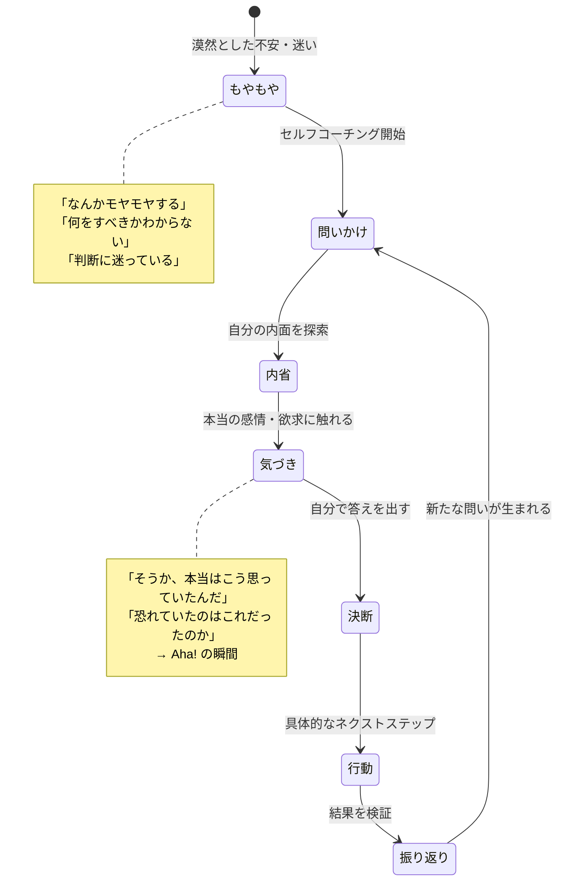
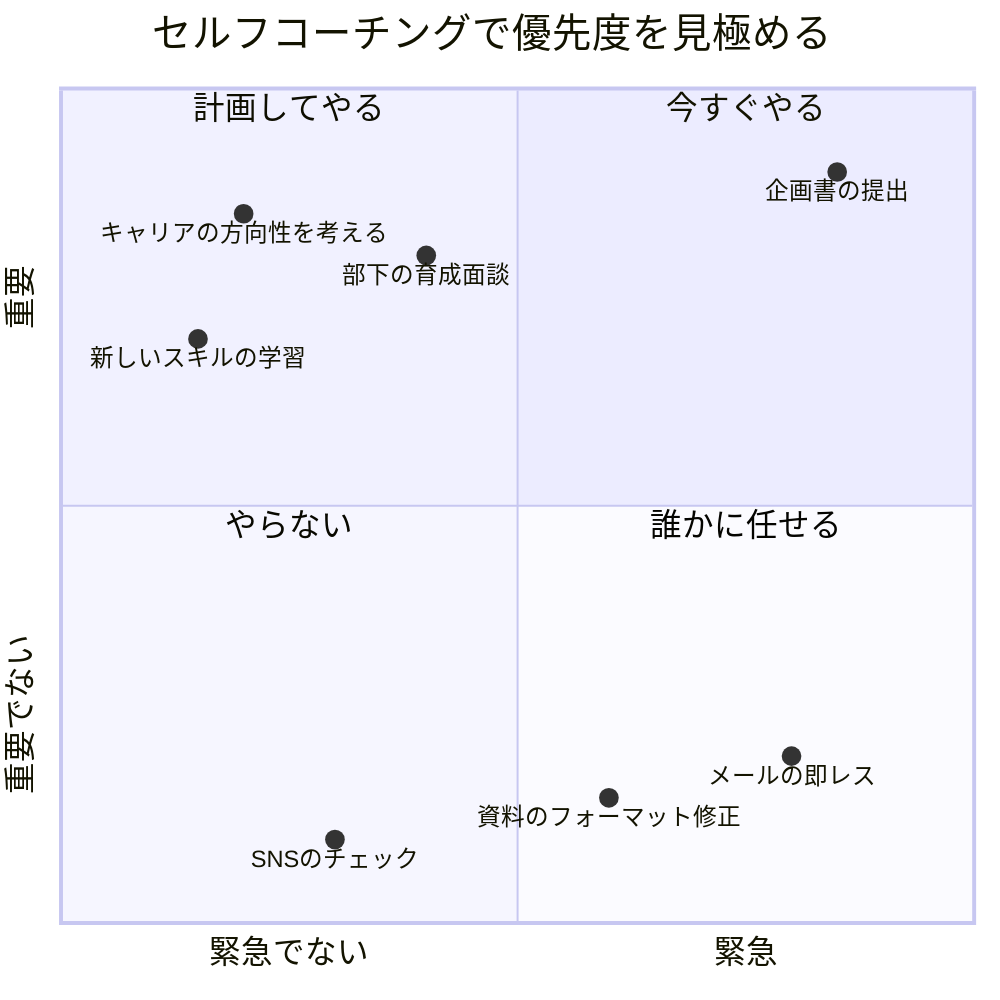
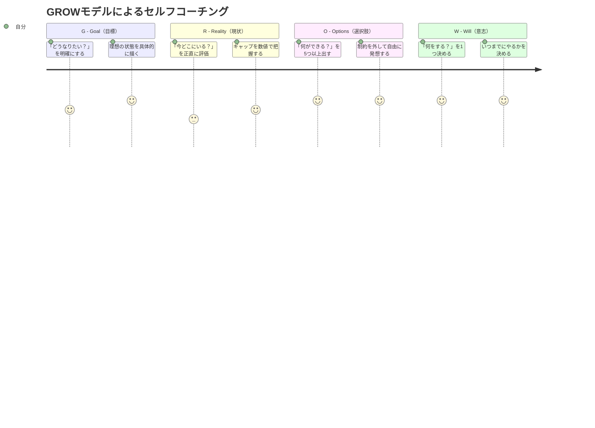
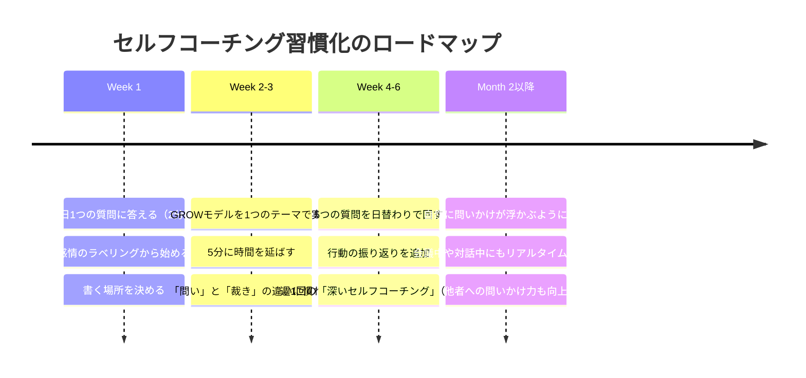

木曜の夜、帰りの電車の中。

安藤さん（33歳・プロダクトマネージャー）は、スマホのメモアプリにこう打ち込んだ。

「今日の会議で、なぜ自分の意見を言えなかったのか。部長の企画に違和感があったのに、なぜ黙っていた？」

安藤さんは自分に問いかけた。「黙っていた本当の理由は何だ？」

——反対意見を言うと面倒になるから？ いや、それだけじゃない。

「本当は何を恐れていた？」

——「お前の意見はまだ早い」と言われること。つまり、否定されることだ。

「否定されたら、何を失う？」

——......何も失わない。意見を言わなかった方が、"自分の成長の機会" を失っている。

安藤さんはメモの最後にこう書き加えた。「来週の会議では、最初の10分以内に1つ発言する。完璧な意見じゃなくていい。"こういう視点もありませんか？" で十分だ」

この5分間の内的対話——これが**セルフコーチング**だ。

プロのコーチに毎日セッションを受けることはできない。しかし、コーチの「問いかけの技術」を自分自身に応用すれば、毎日5分で思考のクオリティを劇的に高められる。

---

## セルフコーチングとは何か

### プロの問いかけを「自分用」にカスタマイズする

セルフコーチングとは、[コーチングの技法](/blog/what-is-coaching)を自分自身に適用するスキルだ。コーチが問いかけるように自分に問いかけ、自分の中にある答えを引き出す。

### セルフコーチングが必要な理由

人は1日に約6,000〜7,000の思考を行う（カナダ・クイーンズ大学の研究）。しかし、その大半は**無意識の反復思考**だ。昨日と同じ心配、先週と同じ不満、先月と同じ「やらなきゃ」。

セルフコーチングは、この自動操縦モードの思考に**意識的に介入**する技術。同じ思考のループを回り続ける代わりに、「今、本当に考えるべきことは何か」を問いかける。

---

## 5つの質問 — 毎日5分のセルフコーチング

### 質問1：「今日、自分は何を感じているか？」

最もシンプルで最も強力な問い。感情を言語化するだけで、脳の扁桃体（感情の中枢）の過活動が抑制されることが研究で示されている。これを**「感情のラベリング効果」**と呼ぶ。

**やり方：**
- 朝起きたとき、または仕事が始まる前に30秒間、自分の感情を1〜3語で表現する
- 「ちょっと不安」「わくわくしている」「疲れている」「なんとなくモヤモヤ」
- 正しい答えは必要ない。感じていることをそのまま言葉にするだけ

**安藤さんの実践例：**
月曜：「やる気あり。週末にゆっくり休めたから」
水曜：「焦り。プロジェクトの締め切りが近い」
金曜：「達成感。今週やり切った感覚がある」

[セルフトーク](/blog/self-talk)の質を変えるだけで、1日の行動の質が変わる。

### 質問2：「今、最も重要なことは何か？」

タスクリストが20個あっても、本当に今日やるべきことは1〜3個。この問いは、緊急と重要を区別し、[判断疲れ](/blog/decision-fatigue)を防ぐ。

**やり方：**
- 朝のルーティンの中で、「今日、これだけは終わらせる」を1つ決める
- 「もし今日が人生最後の日だったら、これをやるか？」という極端な問いで優先度を確認
- 「やらなかったらどうなるか？」で緊急度を検証

### 質問3：「何が自分を止めているのか？」

行動できないとき、「なぜやらないのか」ではなく「何が止めているのか」と問いかける。主語が変わることで、自分を責める代わりに、障害を客観視できる。

**やり方：**
- 先延ばしにしているタスクを1つ選ぶ
- 「これに取りかかれないのは、何が止めているから？」と自分に問う
- 答えを3つ以上出す（「面倒だから」の先にある本当の理由を掘る）

**安藤さんの実践例：**
Q：新規プロジェクトの提案書を出せないのは、何が止めている？
A1：「完璧な提案書を書きたいから」→ 完璧主義
A2：「否定されるのが怖いから」→ 拒絶への恐れ
A3：「そもそも自分にその資格があるのか不安だから」→ [インポスター症候群](/blog/imposter-syndrome)

「完璧じゃなくていい。60%の完成度で出して、フィードバックをもらう方が100倍早い」——この結論は、3つの答えを掘り下げた結果、自然に出てきた。

### 質問4：「もし制約がなかったら、どうしたいか？」

「お金がない」「時間がない」「能力がない」——こうした制約が思考を狭める。一度、すべての制約を取り払って考えることで、自分の本当の願望が見える。

**やり方：**
- 「もし絶対に失敗しないとしたら、何に挑戦する？」
- 「もしお金が無限にあったら、どんな仕事をしている？」
- 「もし誰にも批判されないとしたら、何をやめる？」
- 出てきた答えの中に、「制約があっても実は始められること」が隠れている

**安藤さんの実践例：**
Q：絶対に失敗しないなら？
A：「自分のプロダクトを作りたい。ユーザーの声を直接聞いて、課題を解決するサービスを」

→ 現在の仕事の中でも「小さなプロダクト的な企画」を提案することは可能だと気づいた。社内ハッカソンに応募する、という具体的なアクションが生まれた。

### 質問5：「明日の自分に感謝されるために、今日できることは何か？」

1日の終わりに問いかける最後の質問。「未来の自分」という視点を持つことで、目先の楽に流されず、長期的に価値のある行動を選べる。

**やり方：**
- 寝る前に30秒だけ、この問いを考える
- 「明日の自分が "昨日の自分ありがとう" と言ってくれる行動は何か？」
- 大きなことでなくていい。「明日の服を用意する」「弁当のおかずを作っておく」「メールの下書きを1通書いておく」

---

## セルフコーチングの実践フレームワーク — GROWモデル

プロのコーチが実際に使うフレームワークを、セルフコーチングに応用する。

**G（Goal）：** 「このテーマについて、どうなりたい？」
- 理想の状態を具体的に言語化する
- 「いつまでに」「どんな状態に」

**R（Reality）：** 「今、どんな状態にある？」
- 現状を正直に評価する（美化しない）
- 理想と現状のギャップを明確にする

**O（Options）：** 「何ができる？」
- 選択肢を最低5つ出す（質より量）
- 「他には？」「もし制約がなかったら？」で幅を広げる

**W（Will）：** 「何をする？いつやる？」
- 選択肢の中から1つ選ぶ
- 具体的な行動と期限を決める
- 「明日の朝9時に、○○をする」レベルまで落とし込む

---

## ケーススタディ：セルフコーチングで変わった3人

### ケース1：安藤さん（33歳・プロダクトマネージャー）— 会議で発言できるようになった

**Before：**
- 会議で自分の意見を言えない
- 「もっと発言しろ」と上司から何度も言われている
- 帰宅後に「なぜ言えなかった」と自己嫌悪

「帰りの電車で自分を責めるのがルーティンになっていました。でもそれは "コーチング" じゃなくて "裁判" だった」

**セルフコーチングの実践：**
毎晩5分間、メモアプリで5つの質問に答える習慣を開始。特に「何が自分を止めているか？」の問いが効果的だった。

- 止めているもの：「否定されることへの恐れ」
- 制約を外したら：「本当は、自分の視点には価値があると思っている」
- 明日の自分への贈り物：「会議の最初の10分で1つ発言する。内容の完璧さより "声を出す" ことが目標」

**After（2ヶ月後）：**
- 会議での発言が月2回→週3回に増加
- 「安藤さんの視点って独特で面白い」と評価される場面が出てきた
- 上司から「最近変わったな。何かあった？」と言われた
- 「変えたのは、自分への問いかけの質だけ。自分を裁くのをやめて、自分にコーチングするようにした」

### ケース2：渡部さん（40歳・営業部長）— 「忙しい」から脱出した

**Before：**
- 毎日12時間労働。週末も仕事が頭から離れない
- 部下に仕事を任せられず、全部抱え込む
- 家族から「もう少し家にいて」と言われ、罪悪感

「"忙しい" が自分のアイデンティティになっていた。忙しくないと不安になるんです」

**セルフコーチングの実践（GROWモデル）：**
- **G（Goal）：** 「平日は19時に帰宅し、週末は家族と過ごす状態」
- **R（Reality）：** 「毎日21時退社。週末も半日は仕事。家族との時間は週に5時間以下」
- **O（Options）：** 「業務を委譲する／会議を減らす／完璧主義をやめる／[やらないことリストを作る](/blog/not-to-do-list)／朝に集中して午後は軽い作業にする」
- **W（Will）：** 「まず今週、自分がやっている仕事のうち3つを部下に引き継ぐ」

**After（3ヶ月後）：**
- 退社時間が21時→19時に（週4日達成）
- 部下3人に業務を委譲。部下の成長にもつながった
- 週末の家族時間が5時間→15時間に
- 「"忙しい=頑張っている" という等式を、セルフコーチングで壊せた」

### ケース3：池田さん（27歳・エンジニア）— キャリアの迷いに自分で答えを出した

**Before：**
- エンジニア3年目。このまま技術を深めるか、マネジメントに進むか迷っている
- 先輩に相談しても「好きな方を選べ」と言われるだけ
- 3ヶ月間、同じ悩みをグルグル考え続けている

「毎晩ベッドの中で "どっちがいいんだろう" と考えて、答えが出ないまま朝を迎える日が続いていました」

**セルフコーチングの実践：**
「もし制約がなかったら？」の質問を深掘り。

Q：「もし100%成功するなら、どちらを選ぶ？」
A：「......マネジメント。人の成長を助けることに、技術以上のワクワクを感じるから」

Q：「じゃあ何が止めている？」
A：「技術力がまだ不十分だという不安。マネージャーになるには、もっと技術を磨くべきだという "べき論"」

Q：「その "べき" は誰のルール？」
A：「......自分が勝手に作ったルールだ」

**After（4ヶ月後）：**
- 上司にマネジメント志向を伝え、チームリーダーの補佐に手を挙げた
- 技術は「学び続ければいい」と割り切り、不安が激減
- 「セルフコーチングで "自分のべき論" を見つけられた。それが外れた瞬間、迷いが消えた」
- [成長マインドセット](/blog/growth-mindset)の記事を読んで「完璧を待たなくていい」とさらに確信

---

## セルフコーチングを習慣にする3つのコツ

### コツ1：時間と場所を固定する

「気が向いたらやる」では続かない。[朝のルーティン](/blog/morning-routine)に組み込むか、通勤時間を活用する。安藤さんは「帰りの電車」、渡部さんは「朝のコーヒータイム」をセルフコーチングの時間にした。

### コツ2：書く

頭の中だけで考えると、同じ思考がループする。必ず**書く**こと。ノートでもスマホのメモでもいい。書くことで思考が外在化され、客観的に見つめ直せる。

### コツ3：「自分を裁かない」をルールにする

セルフコーチングは自己批判とは違う。「なぜできなかったんだ！」は裁判。「何が自分を止めていたんだろう？」はコーチング。この違いを常に意識する。

---

## 今日から始めるセルフコーチング

**ステップ1（今日・2分）：**
スマホのメモを開き、「今日、自分は何を感じているか？」と書いて、答えを1行だけ書く。

**ステップ2（明日・3分）：**
「今、自分を一番止めているものは何か？」に答える。答えが3つ出るまで掘り下げる。

**ステップ3（今週中・5分）：**
寝る前に「明日の自分に感謝されるために、今日できることは？」に答え、実行する。

---

プロのコーチは、あなたの人生に常に伴走できるわけではない。しかし、コーチの「問いかけの技術」を身につければ、あなた自身が自分の最高のコーチになれる。

安藤さんは今、帰りの電車でスマホを開くとき、SNSではなくメモアプリを開く。

「5分間のセルフコーチングが、翌日の8時間を変える。これがわかってから、"自分の時間" の質がまるで変わった」

最高のコーチは、いつもあなたの中にいる。

---

## セルフコーチングをもっと深めたい方へ

「自分への問いかけが浅い気がする」「セルフコーチングだけでは行き詰まる」――そんな方は、プロのコーチングで「問いの質」を体験してみてください。プロの問いかけを受けることで、セルフコーチングの精度も格段に上がります。

[体験セッションに申し込む](/sessions)
