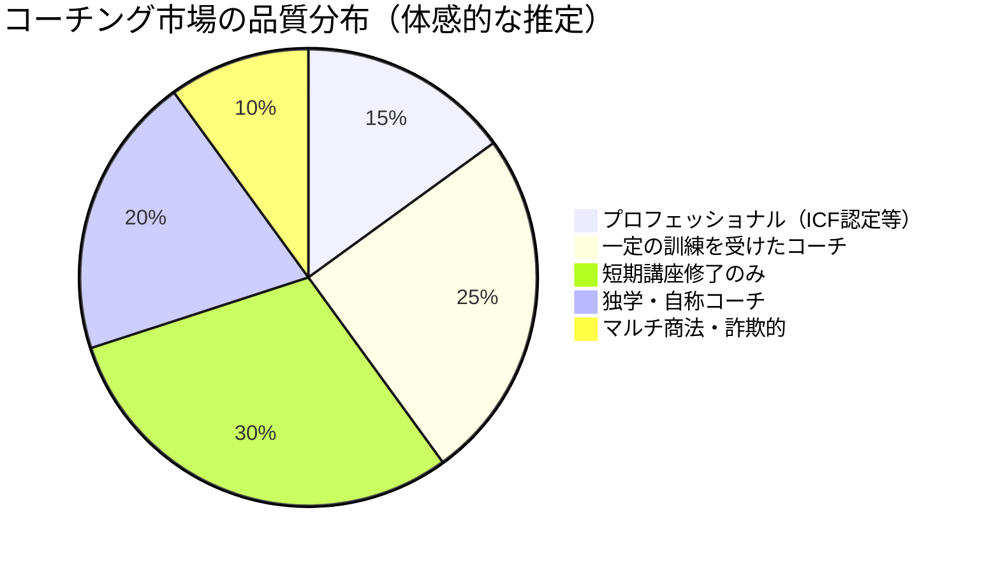
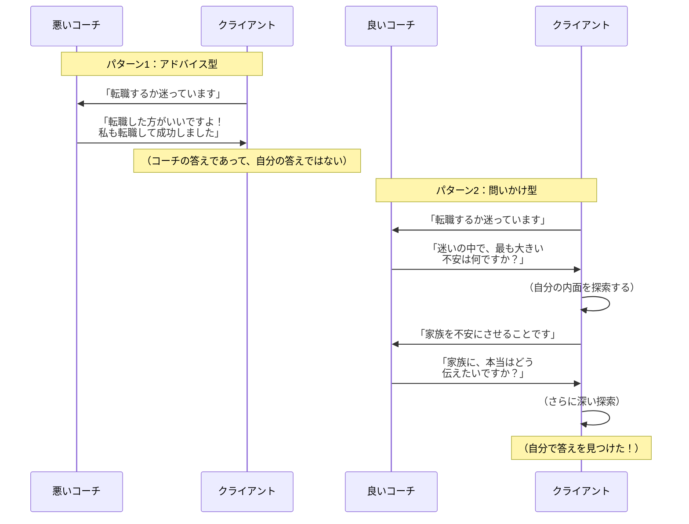
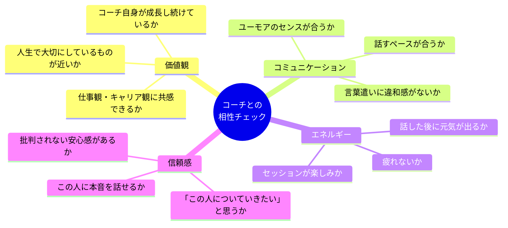
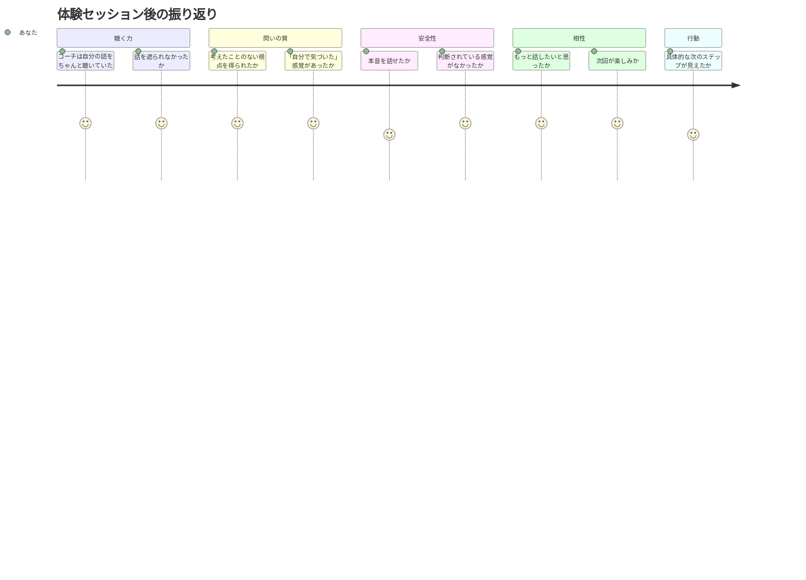

「コーチングって、結局ぼったくりじゃないの？」

同僚にそう言われたとき、宮田さん（30歳・人事）は反論できなかった。なぜなら、宮田さん自身が1年前にコーチングを受けて、**大失敗した経験**があったからだ。

SNSで見つけたコーチ。フォロワー5万人。「3ヶ月で人生が変わる」という魅力的なキャッチコピー。月額5万円×3ヶ月、合計15万円。決して安くはないが、「自己投資だ」と思い切って申し込んだ。

結果は散々だった。セッションの内容は、コーチの自慢話が3割、「ポジティブに考えましょう」という精神論が4割、残り3割は宮田さんが話す時間だが、コーチはスマホをチラチラ見ていた。

「質問されることもなく、ただ "大丈夫、あなたならできる！" と繰り返されるだけ。3ヶ月後、変わったのは15万円が減った貯金残高だけでした」

宮田さんはその経験から、「コーチングは効果がない」と思い込んだ。しかし半年後、信頼する上司の紹介で別のコーチに出会い、**今度は人生が本当に変わった**。

違いは何だったのか。コーチングの効果を決めるのは「コーチングという手法」ではなく、**「どのコーチを選ぶか」**だった。

この記事では、玉石混交のコーチング市場で本当に成果を出せるコーチを見極める7つの基準を解説する。

---

## コーチング市場の現実 — なぜ「ハズレ」が多いのか

### 参入障壁の低さ

日本のコーチング市場は年々拡大しているが、大きな問題がある。**コーチを名乗るのに、法的な資格が不要**なのだ。

極端に言えば、昨日まで何の訓練も受けていない人が、今日から「コーチ」と名乗って営業できる。この参入障壁の低さが、質のばらつきを生んでいる。

もちろん、資格がなくても優れたコーチはいる。逆に資格があっても相性が悪いこともある。しかし、初めてコーチを選ぶ人にとっては、**品質を見極める基準**がなければ、宮田さんのように「ハズレ」を引くリスクが高い。

---

## 良いコーチを見極める7つの基準

### 基準1：「聴く力」があるか — 話す割合を観察する

最もシンプルで最も重要な基準。体験セッションで、**コーチが話している時間とあなたが話している時間の割合**を観察しよう。

| コーチの種類 | コーチ：クライアントの話す割合 |
|:---:|:---:|
| 優れたコーチ | 20：80 |
| 平均的なコーチ | 40：60 |
| 危険なコーチ | 60：40 |
| コーチではない（ただの自慢話） | 80：20 |

宮田さんが最初に出会ったコーチは80：20だった。コーチングではなく、単なるセミナーだった。

**チェックポイント：**
- コーチがあなたの話を最後まで聴いているか
- 途中で遮って自分の意見を挟んでいないか
- あなたの言葉を正確に受け止めているか（オウム返しや要約ができているか）

### 基準2：「問いの質」が高いか — 答えが自分の中から出てくるか

良いコーチの問いかけには、あなたの[内面を探索する力](/blog/what-is-coaching)がある。

**チェックポイント：**
- セッション後に「自分で気づいた」感覚があるか
- コーチの問いかけが、考えたことのない角度からの視点を提供しているか
- 「この人は答えを教えてくれない、でもなぜか答えが見つかる」という感覚があるか

### 基準3：「安全な空間」を作れるか — 弱さを見せられるか

コーチングの効果は、どれだけ本音を話せるかに比例する。そして本音を話せるかどうかは、コーチが作る**心理的安全性**に依存する。

**チェックポイント：**
- 体験セッションで、普段は言わないようなことを話せたか
- コーチが判断や評価をせず、あなたの言葉を受け入れたか
- 「この人になら、恥ずかしいことも話せる」と感じたか
- 沈黙の時間を急かさず、待ってくれたか

### 基準4：「資格・訓練歴」が確認できるか — 最低限のフィルター

資格は万能ではないが、**最低限の品質保証**にはなる。

| 資格・認定 | 概要 | 信頼度 |
|---------|------|:---:|
| **ICF（国際コーチング連盟）ACC/PCC/MCC** | 世界標準のコーチング資格。実技試験あり | 高 |
| **（一財）生涯学習開発財団認定コーチ** | 日本で実績のある認定制度 | 高 |
| **民間スクールの修了証** | スクールにより質が大きく異なる | 中 |
| **独自の○○メソッド認定** | 独自体系。内容の精査が必要 | 要確認 |
| **資格記載なし** | 実力はあるかもしれないが判断が難しい | 要注意 |

**チェックポイント：**
- コーチのプロフィールに訓練歴が明記されているか
- 何時間のトレーニングを受けたか（ICF認定は最低60時間〜）
- スーパーバイザー（コーチのコーチ）がいるか

### 基準5：「相性」が合うか — 言語化しにくいが最も重要

技術的に優れたコーチでも、相性が合わなければ効果は限定的。

**チェックポイント：**
- 体験セッション後、「もっと話したい」と思ったか
- コーチの言葉が自分の中にスッと入ってくるか
- 「この人に弱みを見せても大丈夫」と直感的に感じるか

### 基準6：「成果にコミット」しているか — 行動を促す仕組みがあるか

良いコーチは「気持ちよく話して終わり」にしない。[コーチングで変容が起きる](/blog/coaching-transformation-moment)のは、気づきと行動がセットになったときだ。

**チェックポイント：**
- セッションの最後に具体的なアクションプランを一緒に考えてくれるか
- 次回のセッションで前回のアクションの振り返りがあるか
- 「いい話を聞いた」だけでなく「次にやること」が明確になるか
- 成果を測定する仕組みがあるか（目標設定、進捗確認など）

### 基準7：「透明性」があるか — 料金・プロセス・限界を正直に伝えるか

信頼できるコーチは、自分のコーチングの「限界」を正直に伝える。

**チェックポイント：**
- 料金体系が明確か（「初回は無料、2回目から月○万円」など）
- 解約条件が明示されているか
- 「コーチングで解決できない問題」について正直に説明があるか
- 必要に応じてカウンセラーや医療機関への紹介を行うか
- 「必ず変わります」「100%結果が出ます」と断言していないか（断言するコーチは危険）

---

## ケーススタディ：コーチ選びの成功と失敗

### ケース1：宮田さん（30歳・人事）— 失敗から学んだコーチ選びの基準

**失敗体験：**
- SNSのフォロワー数だけで選んだ
- 体験セッションなしでいきなり3ヶ月契約
- セッション中、コーチの自慢話が7割
- 15万円を費やして得たものは「コーチングへの不信感」だけ

「最初のコーチは "自分の成功体験を売る人" だった。でも私が必要としていたのは "私の答えを引き出す人" だった」

**成功体験（2人目のコーチ）：**
- 信頼する上司の紹介でコーチに出会う
- 体験セッション（30分・無料）で「この人は違う」と直感
- セッション中、宮田さんが8割話していた
- コーチは3つしか質問しなかったが、その3つで考えたことのない視点が開けた

**After（6ヶ月後）：**
- キャリアの方向性が明確になり、社内異動に成功
- 人事から[キャリア支援のスペシャリスト](/blog/30s-career-change-guide)として新設部門へ
- 「良いコーチに出会えたことが、この2年で最大の転機だった」

### ケース2：原田さん（37歳・起業準備中）— 3人のコーチを比較して選んだ

**Before：**
- 起業を考えているが、何から始めればいいかわからない
- コーチングを受けたいが、誰を選べばいいかわからない
- 「失敗したくない」という気持ちが強い

「コーチ選びで失敗したら、コーチング自体に失望して、結局何もしない人生になりそうだった」

**原田さんの比較プロセス：**

| 項目 | コーチA | コーチB | コーチC（選択） |
|------|:---:|:---:|:---:|
| 体験セッション | なし | 30分無料 | 60分無料 |
| 聴く：話す比率 | — | 50:50 | 20:80 |
| 資格 | なし | 民間スクール修了 | ICF-PCC |
| 問いの質 | — | 表面的 | 深層に届いた |
| 安全性 | — | 普通 | 本音を話せた |
| 料金 | 月3万 | 月4万 | 月5万 |
| 行動プラン | 不明 | あり | 詳細にあり |
| 直感 | 不安 | 普通 | 「この人だ」 |

**After（4ヶ月後）：**
- 起業の方向性が明確になり、副業として最初のクライアントを獲得
- 「3人比較して正解だった。最も安いコーチを選んでいたら、今の結果はなかった」
- 「体験セッションで "自分で気づいた" という感覚があったコーチCを選んで本当に良かった」

### ケース3：高橋さん（45歳・管理職）— 「合わないコーチ」を途中で変えた勇気

**状況：**
- 会社の福利厚生でコーチングが提供されたが、担当コーチが合わなかった
- セッション後に「なんかモヤモヤする」が続く
- コーチの意見を押し付けられている感覚

「コーチングは良いものだと信じていたし、会社が選んだコーチだから失礼かもと思って、3回我慢しました」

**高橋さんが感じた違和感：**
1. コーチが自分の答えを誘導している感覚がある
2. 沈黙の時間がなく、次々と質問が飛んでくる
3. 「もっとこうすべきです」というアドバイスが多い
4. セッション後に「自分で決めた」感覚がない

**転機：**
4回目のセッションの前に、人事に「コーチの変更は可能ですか？」と相談。別のコーチを紹介してもらった。

**新しいコーチとの違い：**
- 初回セッションで「合わなかったら遠慮なく言ってください」と言ってくれた
- 沈黙を大切にしてくれた
- アドバイスは一切なし。すべて問いかけ
- セッション後に「自分で考え、自分で決めた」感覚

**After：**
- コーチ変更後、リーダーシップに関する自分の課題が明確に
- 「合わないコーチに我慢し続けるのは、合わない薬を飲み続けるようなもの。変えていい」
- 「"良いコーチング" を知らないと、"悪いコーチング" もわからない。だからこそ体験セッションで比較することが大事」

---

## 体験セッションで使える「7つの質問」チェックリスト

コーチの体験セッションを受ける際、以下の質問を意識してほしい。

**体験セッション後に自問する7つの質問：**

1. セッション中、自分は何割話していたか？（7割以上が理想）
2. 「自分で気づいた」という感覚が1つ以上あったか？
3. コーチに本音を話せたか？
4. コーチのアドバイスではなく、コーチの問いかけが印象に残ったか？
5. セッション後、具体的な「次にやること」が見えているか？
6. 「この人にまた話したい」と感じるか？
7. 料金に対して「この体験なら納得できる」と思えるか？

7つのうち5つ以上が「Yes」なら、そのコーチは試してみる価値がある。

---

## コーチ選びでよくある間違い

### 間違い1：「有名だから」で選ぶ

フォロワー数や知名度は、コーチングの質とは無関係。SNSでの発信力とセッションの実力は別物だ。

### 間違い2：「安いから」で選ぶ

コーチングは安くはない。しかし、安さで選んで効果がなければ、その費用は完全な無駄になる。「最も安いコーチ」ではなく「最も効果が出そうなコーチ」で選ぶ。投資のリターンで考えよう。

### 間違い3：「相性が合わなくても我慢する」

相性が合わないまま続けても、効果は限定的。高橋さんのように、途中で変える勇気も必要だ。良いコーチは「合わなかったら変えてOK」と言ってくれる。

### 間違い4：「体験セッションを受けない」

宮田さんの最大の失敗は、体験セッションなしで3ヶ月契約をしたこと。必ず体験セッションを受け、できれば**2〜3人を比較する**のが理想だ。

---

## 良いコーチに出会うための3ステップ

**ステップ1（今日・10分）：**
「自分がコーチングで解決したいテーマ」を1つ書き出す。キャリア、人間関係、リーダーシップ、セルフマネジメントなど。テーマが明確だと、適切なコーチを絞り込みやすい。

**ステップ2（今週中・30分）：**
信頼できる人（上司、友人、同僚）に「良いコーチを知りませんか？」と聞いてみる。紹介は最も信頼性の高い情報源だ。紹介がなければ、ICFの[コーチ検索ページ](https://coachfederation.org/find-a-coach)を活用する。

**ステップ3（2週間以内）：**
2〜3人のコーチの体験セッションを受け、この記事の7つの基準で比較する。直感と基準の両方で「この人だ」と思えたコーチを選ぶ。

---

コーチングの効果は、手法ではなく**コーチの質**で決まる。そして良いコーチとの出会いは、人生を変えるほどの価値がある。

宮田さんは今、2人目のコーチとの出会いを「人生のターニングポイント」と呼ぶ。

「最初の失敗で "コーチングは詐欺だ" と決めつけなくて本当に良かった。悪いのはコーチングではなく、コーチの選び方だった。良いコーチに出会えたことで、仕事もキャリアも、自分自身への理解も、すべてが変わった」

あなたの人生を変えるパートナーは、必ずどこかにいる。大切なのは、正しい基準を持って探すことだ。

---

## まずは「問いの力」を体験してみませんか？

コーチ選びの第一歩は、良いコーチングを体験すること。初回の体験セッションでは、あなたのテーマに合わせた問いかけを通じて、「自分で気づく」感覚を味わっていただけます。もちろん、合わなければ続ける必要はありません。

[体験セッションの詳細を見る](/sessions)
