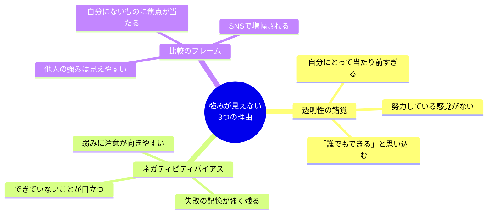
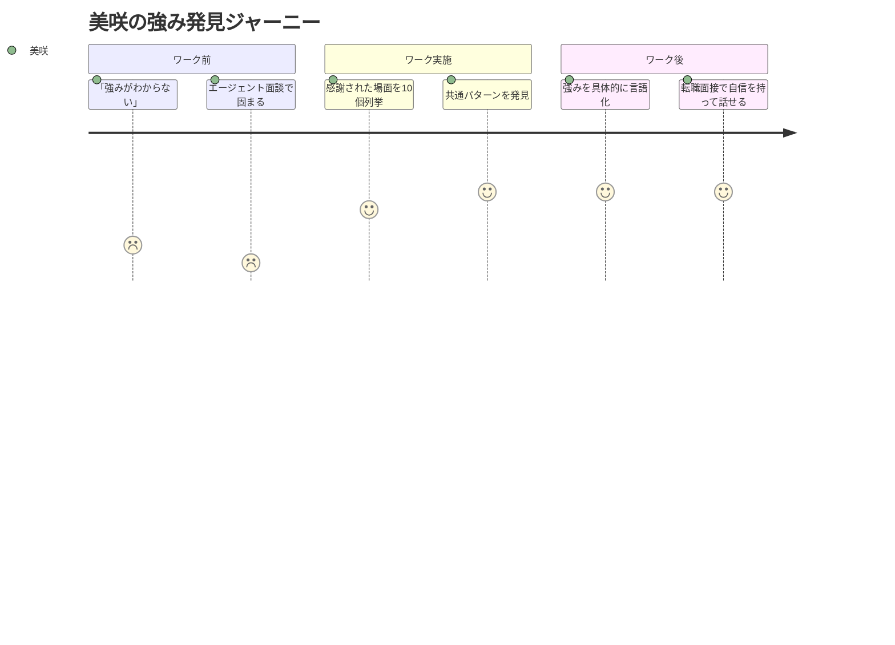
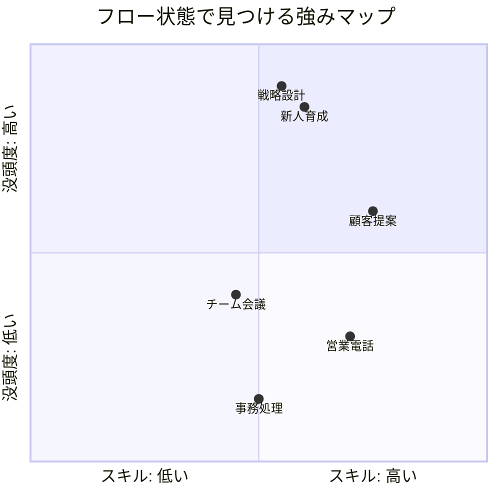
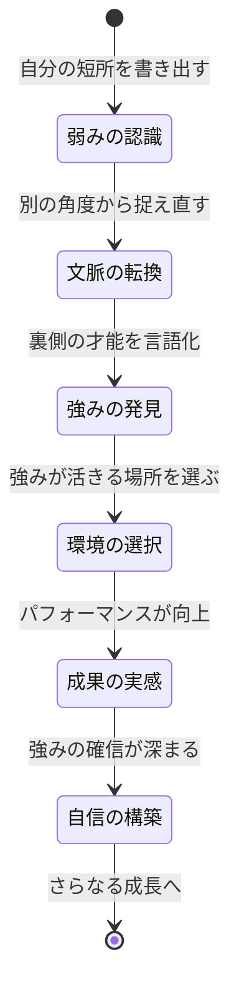
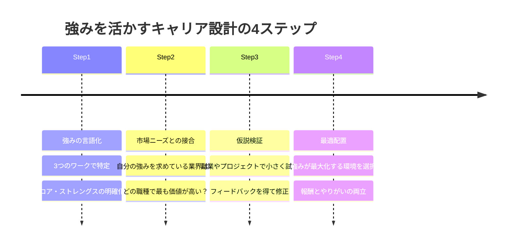

## 「私には強みなんてありません」

佐藤美咲（29歳・人事）は、転職エージェントとの面談で固まっていた。

「佐藤さんの強みは何ですか？」

この質問に答えられなかった。いや、正確に言えば、答えが浮かばなかった。人事として採用面接で同じ質問を何百回も聞いてきたのに、いざ自分のこととなると言葉が出てこない。

「コミュニケーション力……ですかね」

そう答えた瞬間、自分でも「薄い」と思った。エージェントの表情も微妙だった。

帰りの電車の中で考えた。5年間も働いてきて、自分の強みがわからないなんて。でも、振り返ってみると、これまで「強み」について真剣に考えたことがなかった。学校では弱点を克服することばかり求められた。会社では目の前の業務をこなすことに精一杯だった。

もしあなたも「自分の強みがわからない」と感じているなら、それは当然のことです。日本の教育も企業文化も、強みを発見する仕組みを持っていません。しかし、科学的な手法を使えば、誰でも自分の強みを言語化できます。

## 強みが「見えない」3つの科学的理由

なぜ、自分の強みは自分で認識しにくいのか。これには明確な心理学的メカニズムがあります。

**理由1：透明性の錯覚**

ギャラップ社の調査によると、人の強みの約70%は「無意識的有能」の状態にあります。つまり、自分にとって自然にできることは、本人が「強み」として認識しにくい。美咲の場合、採用面接で候補者の本音を引き出す力は社内でもトップクラスだったのですが、彼女自身は「普通にやっているだけ」と思っていました。

**理由2：ネガティビティバイアス**

人間の脳は、ポジティブな情報よりネガティブな情報に3〜5倍強く反応します。できていることよりも、できていないことの方が記憶に残りやすい。年間100件の採用を成功させていても、3件の早期離職の方が記憶に焼きついてしまう。

**理由3：比較のフレーム**

[比較の罠から抜け出す](/blog/comparison-trap)の記事でも詳しく解説していますが、SNSで他人の強みばかりが目に入ると、「自分にはあれがない」という欠乏感が強まります。しかし、他人が持っていない「あなただけの強み」は、比較からは見えてきません。

## ワーク1：「感謝の逆算法」で他者から見た強みを発見する

最初のワークは、他者の視点を借りて自分の強みを発見する方法です。マーティン・セリグマン教授のポジティブ心理学に基づいたアプローチです。

**手順：**

1. 過去2年間に、誰かから「ありがとう」「助かった」と言われた場面を10個書き出す
2. それぞれの場面で、具体的に何をしたのかを記述する
3. 共通するパターンを3つ抽出する

美咲がこのワークをやった結果、次のような発見がありました。

| 感謝された場面 | 具体的な行動 | 抽出されたパターン |
|---|---|---|
| 新入社員が相談しに来た | 30分かけて話を聞き、本当の悩みを引き出した | 傾聴・本質的ニーズの発掘 |
| 部署間の調整を任された | 双方の主張を整理し、落としどころを提案した | 構造化・調停力 |
| 経営会議の資料を褒められた | 複雑なデータを3枚のスライドに集約した | 情報の整理・要約力 |
| 退職を考えていた同僚を引き留めた | 週1回のランチで不満と希望を聞き続けた | 継続的な関係構築 |
| 採用面接の評価が的確だと言われた | 候補者の言葉の裏にある本音を読み取っていた | 洞察力・非言語情報の読解 |

この5つから浮かび上がった美咲の強みは「人の本音を引き出し、複雑な情報を構造化して伝える力」でした。「コミュニケーション力」という曖昧な表現とは、解像度がまったく違います。

## ワーク2：「フロー状態分析」で内側から強みを掘り起こす

2つ目のワークは、ミハイ・チクセントミハイ教授が提唱した「フロー理論」に基づく自己分析です。

フロー状態とは、時間を忘れるほど没頭している状態のことです。人はフロー状態にあるとき、自分の強みを使っている可能性が非常に高い。なぜなら、強みを発揮している活動は、スキルとチャレンジのバランスが最適になり、自然とフロー状態に入りやすいからです。

**手順：**

1. 過去1ヶ月の業務を1時間単位で振り返る
2. 「時間を忘れて没頭した」瞬間にマーカーを引く
3. その活動に共通する要素を分析する

田中洋介（32歳・営業マネージャー）のケースを紹介します。

田中は「自分はただの営業マンだ」と思っていました。しかし、フロー状態分析を行った結果、意外な発見がありました。

「営業活動そのものでフロー状態になることは少ないんです。でも、新人の営業ロープレにフィードバックしている時間は、気づくと1時間が経っていた。あと、チームの営業戦略を考えている時間も没頭していました」

田中のフロー状態が発生する条件を分析すると、「人の成長を支援すること」と「戦略を設計すること」の2つが浮かびました。営業という「手段」ではなく、育成と戦略設計という「本質的な強み」が見えてきたのです。

この気づきは、田中のキャリア選択を大きく変えました。「営業を続けるか、別の職種に移るか」という二択ではなく、「育成と戦略設計の力を活かせる場所はどこか」という問いに変わったのです。[キャリアの仮説思考](/blog/career-hypothesis)でも解説しているように、「自分は何が得意か」ではなく「何をしているとき最も力を発揮するか」で考えると、選択肢が広がります。

右上に位置する活動が、あなたの強みが最も活きる領域です。田中の場合、「新人育成」と「戦略設計」が明確に右上にプロットされました。

## ワーク3：「弱みの裏返しマッピング」で隠れた才能を見つける

3つ目のワークは、逆説的ですが「弱み」から強みを発見する手法です。ピーター・ドラッカーは「強みの裏側には必ず弱みがある」と述べましたが、その逆もまた真です。あなたが「弱み」だと思っていることの裏側に、強みが隠れている可能性があります。

**手順：**

1. 自分の「弱み」や「短所」を5つ書き出す
2. 各弱みを「別の文脈に置いたらどう見えるか」を考える
3. 弱みの裏側にある強みを言語化する

具体例を見てみましょう。

| 弱み（自己認識） | 裏返した強み | 活かせる場面 |
|---|---|---|
| 細かいことが気になりすぎる | 品質への高い感度 | 品質管理、校正、リスク分析 |
| 決断が遅い | 慎重で多角的に検討できる | 重要な意思決定、リスクマネジメント |
| 人に合わせすぎる | 共感力が高く調整できる | 交渉、カウンセリング、チーム運営 |
| 飽きっぽい | 新しいことへの適応が速い | 新規事業、トレンド分析、企画 |
| 理屈っぽい | 論理的に構造化できる | 戦略立案、データ分析、プレゼン |

鈴木理恵（27歳・マーケティング）は、上司から「考えすぎ」「もっとスピード感を」と言われ続けていました。自分の「決断の遅さ」をコンプレックスに感じていた彼女ですが、ワーク3を通じて見え方が変わりました。

「『決断が遅い』の裏返しは『多角的に検討する力』なんですね。確かに、私が時間をかけて作った企画書は、手戻りが少ないと言われます。慎重さは弱みじゃなくて、活かし方の問題だったんだ」

理恵はその後、スピードが求められるSNS運用の担当から、中長期のブランド戦略の担当に移り、成果を上げるようになりました。弱みが消えたのではなく、強みが活きる環境に移ったのです。

## 3つのワークを統合する：「強みの三角測量」

ここまでの3つのワークは、それぞれ異なる角度から強みを照らしています。

- **ワーク1（感謝の逆算法）**：他者の視点から見た強み
- **ワーク2（フロー状態分析）**：内的体験から見た強み
- **ワーク3（弱みの裏返し）**：弱みの裏側に隠れた強み

この3つで共通して浮かび上がるものが、あなたの「コア・ストレングス」です。測量において、3つの地点から位置を特定する「三角測量」と同じ原理です。

実際に美咲のケースで統合してみましょう。

- ワーク1の結果：「人の本音を引き出し、情報を構造化する力」
- ワーク2の結果：「候補者との面談と、採用戦略の設計にフロー状態」
- ワーク3の結果：「気を遣いすぎる → 高い共感力と察知能力」

3つに共通するのは「人を深く理解し、その理解を形にする力」。これが美咲のコア・ストレングスです。

この発見により、美咲の転職活動は一変しました。「人事からの転職」という漠然とした方向性が、「組織コンサルタント」「キャリアアドバイザー」「HRBPリーダー」という具体的な選択肢に変わったのです。

## 強みを「活かす場所」を見つけるキャリア設計

強みを発見しただけでは、まだ道半ばです。重要なのは、その強みを「最も高く評価してもらえる場所」に置くことです。

ここでは、強みとキャリアを結びつけるためのフレームワークを紹介します。

**Step1** で強みを言語化したら、**Step2** でその強みがビジネスの文脈でどう価値を持つかを考えます。田中の「育成力×戦略設計力」は、マネージャー職や研修企画、コンサルティングなど複数の市場で価値があります。

**Step3** では、いきなり転職するのではなく、小さく仮説検証をします。田中は会社の新人研修プログラムの設計を自主的に引き受け、そこで手応えを確認しました。[ポモドーロ・テクニック](/blog/pomodoro-technique)で集中時間を確保しながら、週末の2時間を仮説検証に充てたそうです。

**Step4** で、検証結果をもとに最適な環境を選択します。田中は最終的に、営業部門のマネージャーから人事部門の研修企画チームへ異動し、「育成×戦略」の強みを存分に発揮するポジションを手に入れました。

## 強みを発見した3人のその後

最後に、ワークを実践した3人のその後を紹介します。

**美咲（29歳・人事→組織コンサルタント）**

「『コミュニケーション力が強みです』と言っていた自分が恥ずかしい（笑）。今は面接でも『人の言語化されていないニーズを構造化し、組織の意思決定に変換する力』と伝えています。面接官の反応がまるで違います」

転職先の組織コンサルティングファームでは、入社半年で主要クライアントの担当を任されるまでになりました。

**田中（32歳・営業マネージャー→研修企画）**

「営業成績は中の上でした。でも、新人を育てることと戦略を練ることには、自分でも驚くほどのエネルギーが湧くんです。異動後、チームの新人定着率が前年比で42%改善しました。数字が出ると、やっぱり強みを使っているんだと実感します」

**理恵（27歳・マーケティング担当→ブランド戦略担当）**

「『考えすぎ』が『慎重で多角的な分析力』に変わっただけで、仕事への向き合い方が180度変わりました。同じ能力なのに、評価される場所が違うだけでこんなに変わるんですね」

理恵が手がけた3年間のブランド戦略は、売上を年間18%押し上げる成果を出しました。

## 強みは「発見」するものであり「作る」ものではない

この記事の最も重要なメッセージは、強みは「今から新しく身につけるもの」ではなく「すでにあなたの中にあるもの」だということです。

[インポスター症候群](/blog/imposter-syndrome)に陥っている人ほど、「自分には何の取り柄もない」と思いがちです。しかし、3つのワークを真剣にやれば、必ず何かが見つかります。なぜなら、30年近く生きてきた中で、強みを一つも発揮したことがない人は、この世に存在しないからです。

[30代のキャリアチェンジ](/blog/30s-career-change-guide)を検討している人も、まずは自分の強みの「棚卸し」から始めてみてください。強みがわかれば、「何をやるか」ではなく「どこでやるか」という、より建設的な問いに変わります。

そして、[やらないことリスト](/blog/not-to-do-list)の考え方を取り入れて、強みでない領域には時間を使わない判断をする。これが、強みを活かすキャリアの本質です。

---

**あなただけの「コア・ストレングス」を一緒に発見しませんか**

ライフ自己決定コーチングでは、3つのワークをコーチと一緒に実施し、あなたの中に眠る強みを科学的に掘り起こします。「自分には強みがない」という思い込みを壊し、強みを軸にしたキャリア戦略を60分で設計する体験セッションです。

[無料セッションに申し込む →](/sessions)
