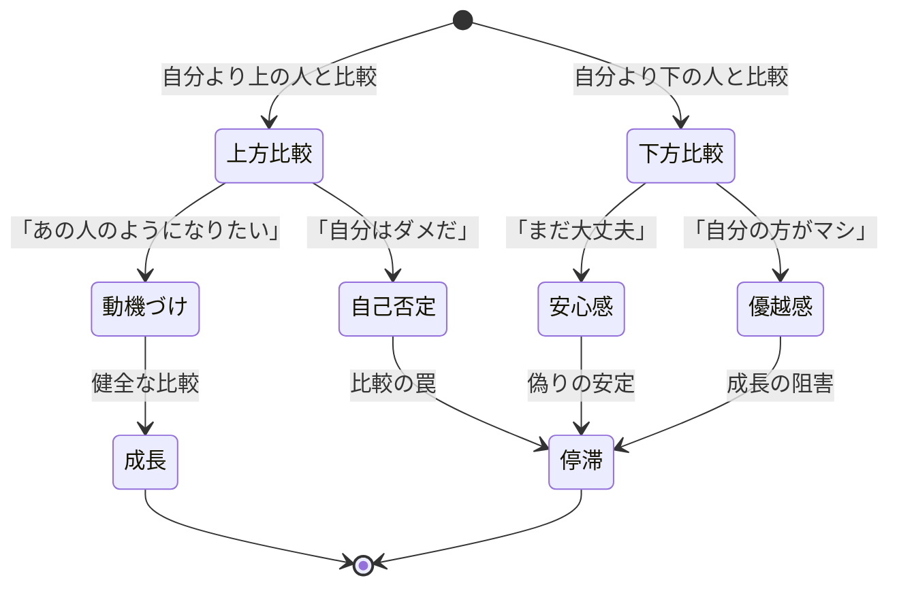
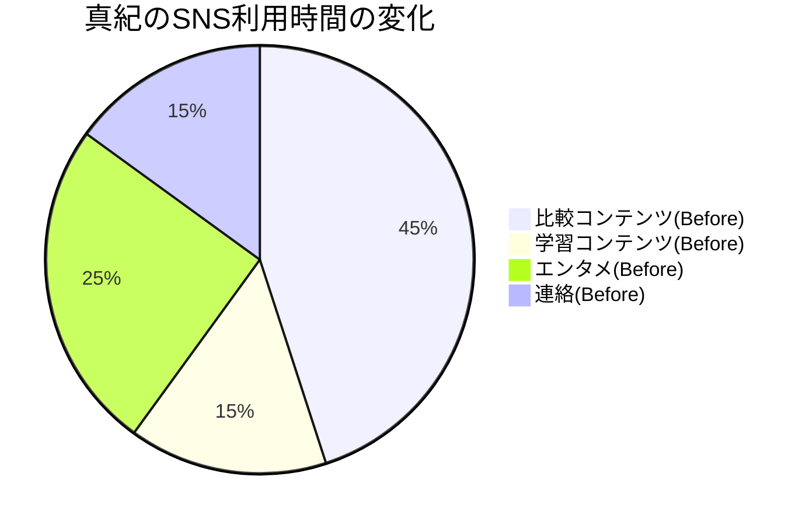
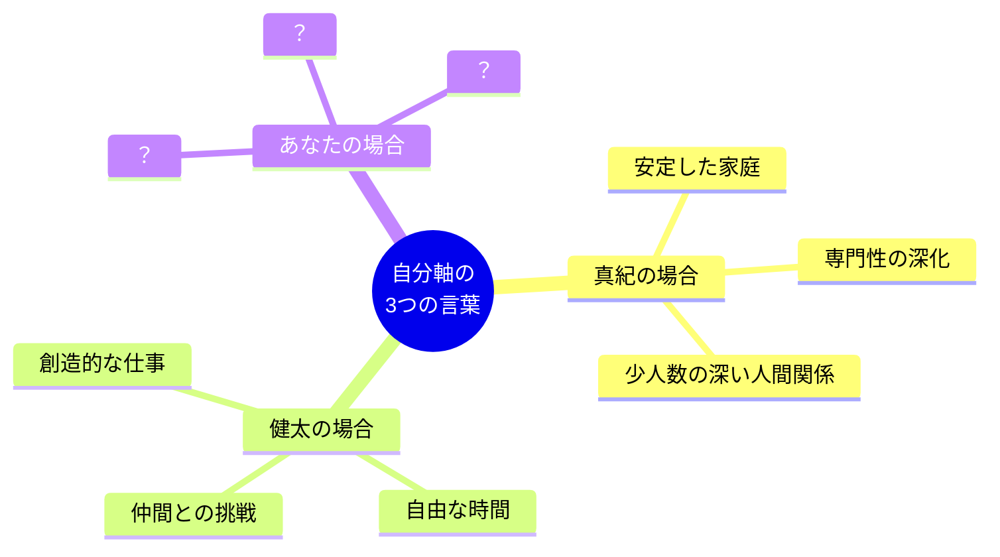
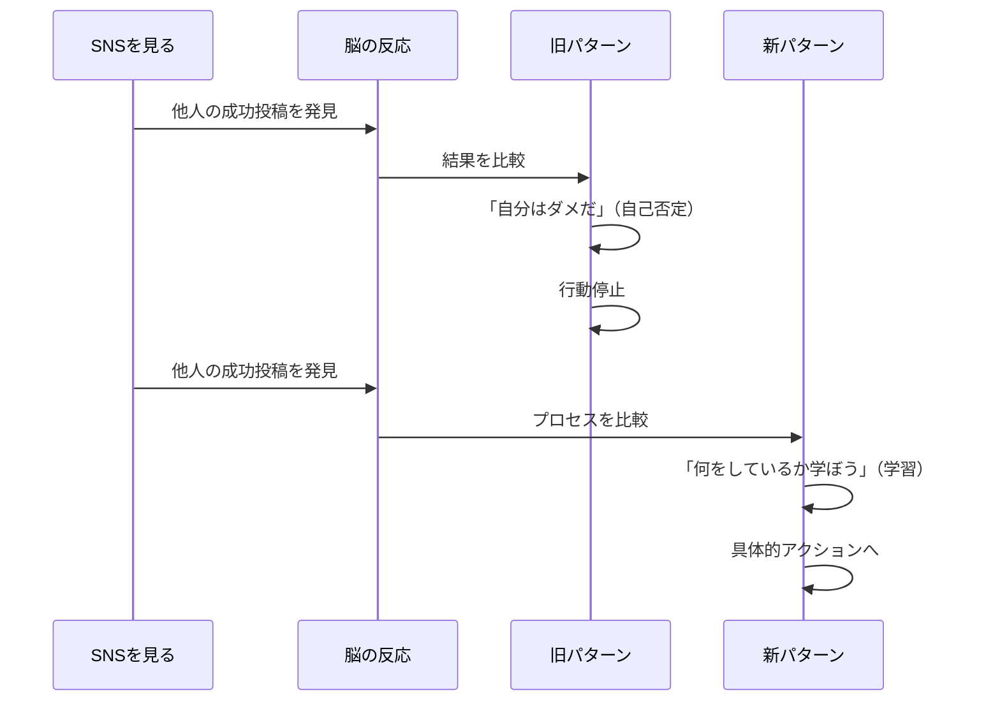

## 「あの人はもう独立してるのに、私はまだ……」

金曜日の夜23時。山田真紀（28歳・メーカー経理）はベッドの中でInstagramを開いていた。

元同期の投稿が目に飛び込んできた。「フリーランス1周年！月収が会社員時代の2倍になりました」。写真にはカフェでMacBookを広げる笑顔の元同期。いいねは400件を超えている。

スクロールすると、大学の友人が「転職して年収150万アップ」と報告。別の友人は「副業で初の10万円」と喜んでいた。

スマホを閉じた瞬間、胸が重くなった。「みんな進んでいるのに、自分は何をやっているんだろう」。翌朝、真紀は寝不足のまま出社した。仕事に集中できない。昼休みにまたSNSを開いて、また落ち込む。そんな日が続いていた。

真紀のような経験は、決して珍しくありません。英国王立公衆衛生協会の調査では、SNS利用者の約70%が「他人との比較で自己評価が低下した」と回答しています。問題はSNSそのものではなく、人間の脳が持つ「比較」の本能的メカニズムにあります。

## 比較の心理メカニズム：なぜ人は比べずにいられないのか

社会心理学者レオン・フェスティンガーが1954年に提唱した「社会的比較理論」によると、人間には自分の能力や意見を、他者との比較を通じて評価しようとする根本的な欲求があります。これは生存戦略として脳に組み込まれた機能であり、意志の力で完全にオフにすることはできません。

比較には「上方比較（自分より上の人と比べる）」と「下方比較（自分より下の人と比べる）」の2種類があります。問題が起きるのは、上方比較が「動機づけ」ではなく「自己否定」に転じたときです。

SNS時代に比較の罠が深刻化しているのは、3つの理由があります。

**理由1：ハイライトリールとの比較**
SNSに投稿されるのは、人生のベストシーンだけです。年収アップの報告はあっても、それまでの3ヶ月間毎晩悩んでいた話は投稿されません。あなたは自分の「裏側」と他人の「表舞台」を比較しています。これはフェアな比較ではありません。

**理由2：比較対象の爆発的増加**
SNS以前は、比較の対象は身近な同僚や友人10〜20人でした。しかし今は、フォロワー数百人、数千人の「成功者」の情報が毎日流れてきます。比較の母数が100倍になった。当然、「自分より上の人」を見つけやすくなります。

**理由3：数値化された比較**
年収、フォロワー数、いいね数、売上。SNSは人生を数値化しました。数字は比較を容易にします。しかし、人生の充実度は数値化できません。数字で比較できるものだけで自分を評価するのは、氷山の一角だけを見て船を操縦するようなものです。

## ケーススタディ1：「比較の罠」から抜け出した真紀の場合

山田真紀は、毎晩のSNSチェックで消耗していることに気づいていました。でも、やめられない。「情報に乗り遅れたくない」「みんなの動向を知っておきたい」という不安がブレーキをかけていたのです。

転機になったのは、コーチングセッションでのある問いかけでした。

「真紀さんが比較している『あの人たち』の成功は、真紀さんの人生にとってどんな意味がありますか？」

この質問に、真紀は答えられなかった。元同期の月収が2倍になったことは、真紀自身のキャリアとは何の関係もない。大学の友人の年収アップも、真紀の経理としてのスキルとは無関係だ。

「関係ない人の数字を見て、自分を否定していたんですね」

真紀はその後、3つの行動を取りました。

1. **SNSの利用時間を1日15分に制限した**（スクリーンタイム機能を活用）
2. **「比較日記」をつけ始めた**（比較した瞬間とその感情を記録）
3. **自分の「1年前との比較」に切り替えた**（他人ではなく過去の自分が基準）

3ヶ月後、真紀のメンタルスコア（自己評価）は10段階で3から7に改善。仕事のパフォーマンスも目に見えて上がりました。「比較に使っていた脳のエネルギーが、仕事に向くようになったんだと思います」と真紀は振り返っています。

## 5つの習慣：比較の罠から抜け出す実践メソッド

ここからは、比較の罠から抜け出すための具体的な5つの習慣を紹介します。

### 習慣1：「比較ログ」で無意識を可視化する

比較は無意識に起きます。だからこそ、意識化することが第一歩です。

1日の中で「他人と比較した」瞬間を記録します。「いつ」「誰と」「何を」比較して「どう感じたか」の4項目だけ。これを1週間続けると、自分の比較パターンが見えてきます。

実際にやってみると「SNSを開いた直後に比較している」「月曜朝の会議で比較が多い」「特定の1人とばかり比較している」などのパターンが浮かびます。パターンが見えれば対策が打てます。

[セルフトーク](/blog/self-talk)の技法を組み合わせて、比較が起きた瞬間に「今、比較している。これは脳の自動反応だ」と実況中継するのも効果的です。

### 習慣2：「情報ダイエット」でトリガーを減らす

比較の最大のトリガーはSNSです。完全にやめる必要はありませんが、「情報の質」をコントロールすることは重要です。

真紀がSNSの利用内容を分析したところ、利用時間の45%が「他人の成功報告を見ること」に費やされていました。彼女はこの比率を逆転させ、学習コンテンツと自分の記録（アウトプット）に時間を割くように切り替えました。

具体的にやったことは3つです。

- 「成功報告」が多いアカウントのフォローを外す（ミュートでもOK）
- 自分の成長につながる情報発信アカウントに入れ替える
- SNSを開く前に「今、何のために開くのか」を1文で言語化する

### 習慣3：「過去の自分」との比較に切り替える

比較そのものを止めるのは難しい。であれば、比較の対象を変えるのが現実的な戦略です。

他人との比較を「1年前の自分」との比較に変換する。これだけで、比較はネガティブな行為からポジティブな自己評価に変わります。

中村健太（31歳・Webディレクター）は、毎月末に「1年前の自分との比較シート」を作成しています。

「去年の今頃は、クライアントへのプレゼンで毎回緊張して声が震えていました。今は30人の前でも落ち着いて話せる。他人と比べたら全然すごくないけど、過去の自分と比べたら確実に成長している。この感覚がめちゃくちゃ大事なんです」

健太は月末に次の3項目を振り返っています。

1. 1年前にはできなかったけど、今はできること
2. 1年前には知らなかったけど、今は知っていること
3. 1年前の自分にアドバイスするなら何と言うか

この3つ目の項目が特に効果的です。過去の自分にアドバイスできるということは、確実に成長している証拠だからです。

### 習慣4：「自分軸」を3つの言葉で定義する

比較に揺れるのは、自分の判断基準が曖昧だからです。「何をもって自分は成功とするのか」を明確にしておけば、他人の成功は「別の競技の話」になります。

やり方はシンプルです。次の質問に答えてみてください。

「人生の最後に、『これができたから良い人生だった』と思えることは何か？」

この答えを3つの言葉に集約します。

真紀の3つの言葉は「安定した家庭」「専門性の深化」「少人数の深い人間関係」でした。これを基準にすると、元同期の「フリーランスで月収2倍」は真紀の人生の成功基準とはまったく合致しないことがわかります。元同期は元同期の基準で成功しているだけ。真紀は真紀の基準で歩めばいい。

[成長マインドセット](/blog/growth-mindset)の考え方を取り入れると、「自分軸」はさらに強固になります。他人との相対的な位置ではなく、自分自身の成長プロセスに価値を見出す。これが比較の罠から抜け出す本質的な処方箋です。

### 習慣5：「与える側」に回る

比較の罠にはまっている人は、常に「受け取る側」にいます。他人の成果を見て、自分に足りないものを数えている。この構図を逆転させましょう。

「与える側」に回ると、比較のベクトルが変わります。自分の知識や経験を誰かに共有するとき、人は「自分にもできることがある」と実感します。

真紀は、経理の知識を活かして社内で「経費精算の効率化セミナー」を開催しました。たった30分のミニ講座でしたが、参加した10人の同僚から「わかりやすかった」「助かった」という反応をもらい、自分の専門性に自信を取り戻しました。

「他人と比べて落ち込んでいたとき、自分の持っているものを誰かに渡す経験が一番効きました。比較は『足りないもの』に目を向けさせるけど、与えることは『すでにあるもの』に目を向けさせてくれる」

## ケーススタディ2：比較が「燃料」に変わった健太の場合

比較がすべて悪いわけではありません。中村健太は、比較を「自己否定の道具」から「成長の燃料」に変える方法を見つけました。

ポイントは、「結果」ではなく「プロセス」を比較対象にすることです。

「以前は『あの人は月収100万円、自分は30万円』と結果を比べて落ち込んでいました。でも今は『あの人は毎朝5時に起きて2時間アウトプットしている。自分は朝の時間を何に使っているか？』とプロセスを見るようにしています。結果の比較は絶望しか生まないけど、プロセスの比較は具体的なアクションにつながるんです」

健太はこの視点転換を実践した結果、[朝のルーティン](/blog/morning-routine)を見直し、出社前の1時間を自己投資の時間に変えました。半年後、社内で新規プロジェクトのリーダーに抜擢されています。

## ケーススタディ3：夫婦間の比較を乗り越えた真紀のもう一つの話

真紀には、SNS以外にもう一つの「比較の罠」がありました。夫との比較です。

夫は営業職で、真紀より100万円以上年収が高い。共働きで家事も分担しているはずなのに、仕事で忙しいと言って夫の負担は減っていく。「私だって同じくらい働いているのに」という不満が溜まっていました。

しかし、この不満は「年収の比較」が根底にありました。年収が高い方が偉い、忙しい、大変。そんな無意識の前提が、夫婦関係をこじらせていたのです。

真紀は「自分軸の3つの言葉」の最初に「安定した家庭」を掲げていました。それを思い出したとき、「年収で家庭内の序列を決めること」が自分の軸に反していることに気づいたのです。

夫と話し合い、「お互いの仕事を数字で比較しない」「家事は時間ではなく負担感で配分する」というルールを決めました。3ヶ月後、真紀は「家に帰るのが楽しみになった」と話しています。夫婦間の対立解決については、[対立を建設的に解決する技術](/blog/conflict-resolution)でも詳しく紹介しています。

## 比較をやめるのではなく、「比較の相手」を変える

この記事のメッセージをまとめます。

比較そのものは人間の本能であり、完全にやめることはできません。大切なのは「誰と」「何を」比較するかをコントロールすることです。

- 他人の「結果」と比べるのをやめる
- 過去の「自分」と比べる
- 他人の「プロセス」から学ぶ
- 自分の「軸」を言語化して持つ
- 「与える側」に回って視点を変える

[インポスター症候群](/blog/imposter-syndrome)を感じている人は、比較の罠に特にはまりやすい傾向があります。「自分は大したことない」という感覚と、「他人はすごい」という感覚が互いを強化し合うからです。

しかし、5つの習慣を地道に続ければ、比較は「自分を否定する道具」から「自分を成長させる燃料」に変わります。真紀が3ヶ月で変わったように、あなたも変われます。大切なのは、今日から1つだけ始めることです。

[レジリエンス](/blog/resilience)の力を借りながら、他人のハイライトリールではなく、自分自身の物語を紡いでいきましょう。

---

**「比較の罠」を抜け出し、自分だけの道を見つけるために**

ライフ自己決定コーチングでは、あなたが無意識にはまっている「比較のパターン」を特定し、自分軸の3つの言葉を一緒に見つけます。他人の人生ではなく、自分の人生を生きるための起点となる60分です。

[無料セッションに申し込む →](/sessions)
