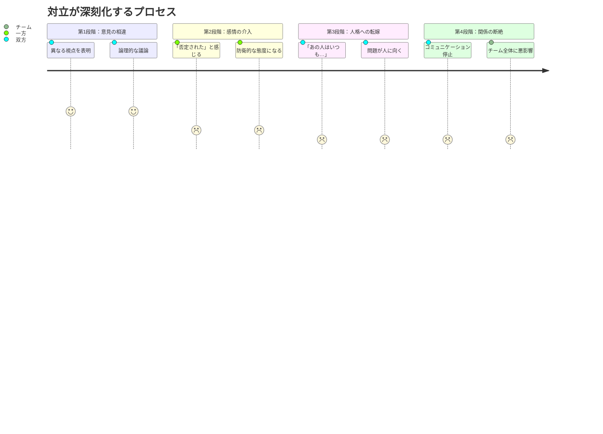
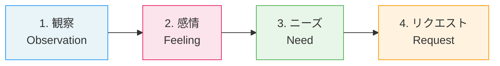
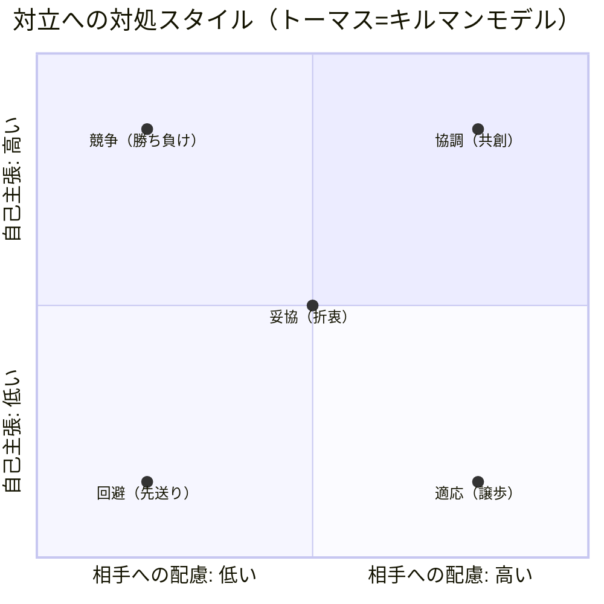
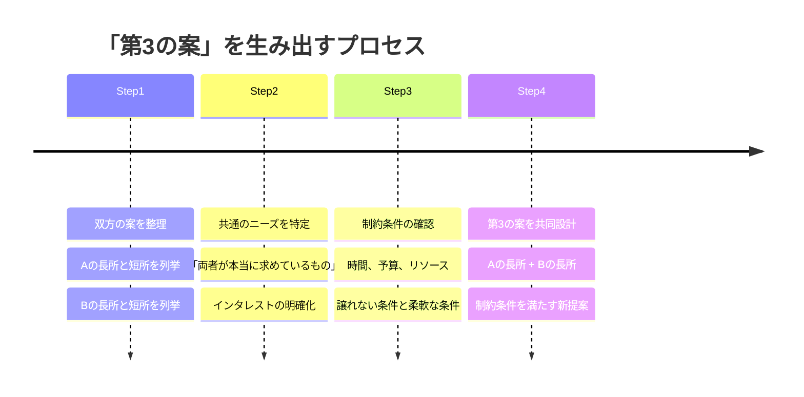

## 「もういい、勝手にすれば」

チームミーティングの終わり際、木村拓也（34歳・プロジェクトマネージャー）はそう言って会議室を出た。

デザイナーの高橋が提出した新機能のUI案に対して、エンジニアの佐々木が「実装コストが高すぎる。もっとシンプルにすべきだ」と反論。高橋は「ユーザー体験を妥協したら意味がない」と譲らない。両者とも正しいことを言っている。だからこそ、木村は板挟みになった。

結局、30分の会議は何も決まらないまま終了。メンバーの表情は険しく、翌日からSlackのやり取りも事務的になった。

木村は思った。「なぜ、優秀なメンバー同士がこうなるんだ」。

この光景に見覚えはありませんか。職場の対立は、能力の問題ではなく「対立の扱い方」の問題です。対立そのものは健全なチームの証拠です。問題は、それを建設的に解決する技術を誰も教わっていないことにあります。

## 対立の正体：なぜ人はぶつかるのか

まず、対立のメカニズムを理解しましょう。対立が起きるとき、表面上は「意見の相違」に見えますが、実際には5つの層があります。

ほとんどの対立は、第1段階では健全です。高橋と佐々木の「UIの品質 vs 実装コスト」という意見の相違は、プロジェクトにとって価値ある議論です。しかし、第2段階で感情が介入すると、議論は対立に変質します。

佐々木が「実装コストが高すぎる」と言ったとき、高橋は「自分のデザインを否定された」と感じた。高橋が「ユーザー体験を妥協したら意味がない」と言ったとき、佐々木は「技術的な制約を理解していない」と感じた。意見への反論が、自分への否定として処理される。これが対立が深刻化する分岐点です。

## NVC（非暴力コミュニケーション）：対立を「共創」に変える4ステップ

マーシャル・ローゼンバーグ博士が開発したNVC（Nonviolent Communication）は、対立解決のための体系的な手法です。世界60ヶ国以上で紛争解決に使われている実績を持ちます。

NVCの4つのステップは以下の通りです。

**ステップ1：観察（Observation）** — 事実を評価なしに述べる

「いつもデザインが複雑すぎる」（これは評価）ではなく、「今回のUI案には、画面遷移が12ステップある」（これは観察）と述べる。

**ステップ2：感情（Feeling）** — 自分の感情を表現する

「お前は無責任だ」（これは相手への攻撃）ではなく、「私は不安を感じている」（これは自分の感情の表現）と伝える。

**ステップ3：ニーズ（Need）** — 感情の背後にあるニーズを明確にする

佐々木の不安の背後にあるニーズは「納期を守りたい」「チームに過度な負担をかけたくない」。高橋の頑なさの背後にあるニーズは「ユーザーに良い体験を届けたい」「プロとしての仕事をしたい」。

**ステップ4：リクエスト（Request）** — 具体的で実行可能な行動を提案する

「もっとシンプルにして」（曖昧）ではなく、「画面遷移を8ステップ以内に収められるか、一緒に検討してほしい」（具体的）と伝える。

## ケーススタディ1：NVCで変わった木村チームの対話

木村拓也は、NVCの4ステップを学んだ後、チームミーティングのやり方を変えました。

まず、対立が起きたときに「一旦止める」ルールを導入しました。感情が高まったと感じたら、誰でも「タイムアウト」を宣言できる。5分間の休憩を挟んでから再開する。

次に、発言のフレームワークをNVCに揃えました。意見を言う前に「私が観察した事実は〇〇で、それについて△△と感じている。なぜなら□□というニーズがあるから。そこで、☆☆をお願いしたい」という構造で話すようにしたのです。

高橋と佐々木の議論は、こう変わりました。

**佐々木（Before）：**「このUIは複雑すぎる。実装に3週間はかかる。もっとシンプルにしてくれ」

**佐々木（After）：**「今回のUI案の画面遷移が12ステップあることを確認しました。正直、不安を感じています。納期の3月末までにQAを含めて完成させるには、現在のチームリソースだと厳しいと見ています。遷移数を減らすか、段階的にリリースする方法を一緒に検討できませんか」

**高橋（Before）：**「ユーザー体験を妥協したら意味がない。これがベストなデザインだ」

**高橋（After）：**「ユーザーテストで離脱率が最も高かったのが現行の登録フローで、今回の案はそれを改善するために設計しました。良い体験を届けたいという気持ちが強い分、削ることに抵抗を感じています。ただ、佐々木さんの懸念もわかるので、どのステップがユーザー体験に最もインパクトがあるか、データで優先順位をつけてみてもいいですか」

木村は振り返ります。「劇的に変わりました。2人とも言っていることの本質は同じなんです。良いプロダクトを作りたい。でも以前は、その『良い』の定義をすり合わせる前に感情がぶつかっていた。NVCの構造があるだけで、議論の質がまるで違います」

導入から2ヶ月で、チームの週次ミーティングの平均時間は45分から30分に短縮。意思決定のスピードが1.5倍になり、チームの心理的安全性スコア（四半期調査）は3.2から4.1に改善しました。

## 対立の5つのスタイルと使い分け

トーマス=キルマンモデルによると、対立への対処スタイルは5つに分類されます。

多くの人は、無意識に1つのスタイルを使い続けています。「いつも我慢する人」は適応スタイル、「いつも議論をふっかける人」は競争スタイル。しかし、すべての対立に同じスタイルが有効なわけではありません。

**競争が有効な場面：** 緊急事態で素早い意思決定が必要なとき。安全に関わる問題で譲れないとき。

**協調が有効な場面：** 両者のニーズが重要で、長期的な関係を維持したいとき。創造的な解決策が求められるとき。

**妥協が有効な場面：** 時間が限られており、部分的な合意でも前に進む必要があるとき。

**回避が有効な場面：** 問題が些細で、エネルギーを使う価値がないとき。冷却期間が必要なとき。

**適応が有効な場面：** 自分にとって重要度が低く、相手にとって重要度が高いとき。関係維持が最優先のとき。

重要なのは、意識的にスタイルを選択できるようになることです。多くの対立が悪化するのは、スタイルの選択が無意識のまま行われているからです。

## ケーススタディ2：「回避」から「協調」に変わった吉田の場合

吉田恵子（38歳・営業部リーダー）は、典型的な「回避スタイル」の持ち主でした。部下同士の意見が対立すると、「まあまあ」と収めてしまう。結果として問題が根本解決されず、同じ対立が繰り返される。

「対立が怖かったんです。人間関係が壊れるのが怖くて、常に和を優先していました」

しかし、回避を続けた結果、チーム内に「言っても無駄」という空気が蔓延。優秀なメンバーが2人立て続けに退職しました。

「退職面談で言われたんです。『吉田さんのチームは居心地がいいけど、成長できない。議論ができないから』って。それがものすごくショックで」

吉田はNVCを学び、対立を「関係破壊のリスク」ではなく「共創のチャンス」として捉え直すことにしました。

最初に変えたのは、チーム会議での自分の振る舞いです。メンバーの意見が食い違ったとき、「まあまあ」ではなく「面白いですね、2つの意見をもう少し深掘りしましょう」と言うようにした。対立を歓迎する姿勢を見せることで、メンバーが意見を出しやすくなりました。

「今では、チーム内で健全な議論が起きることが嬉しいんです。以前は怖かったのが信じられない。対立を避けていたときの方が、実はチームが壊れていたんですよね」

吉田のチームは、その後の半年でチーム内の改善提案数が月平均3件から12件に増加。売上も前年比で23%伸びました。[Win-Win交渉術](/blog/negotiation-win-win-agreement)で紹介している「両者の利益を最大化する」アプローチを日常的な対話に応用した成果です。

## 実践テクニック：対立を建設的に解決する5つのツール

ここからは、明日から使える具体的なテクニックを紹介します。

### ツール1：「ポジションからインタレストへ」の転換質問

対立が起きたとき、双方が主張しているのは「ポジション（立場）」です。その背後にある「インタレスト（利害・関心）」に焦点を移すと、解決策の幅が広がります。

魔法の質問は「それが実現すると、あなたにとって何が嬉しいのですか？」です。

佐々木が「画面遷移を減らしたい」と言ったとき、「それが実現すると何が嬉しいですか？」と聞く。答えは「納期に余裕ができて、テストに十分な時間を取れる。品質が上がる」。これがインタレストです。

高橋が「この遷移数が必要だ」と言ったとき、「それが実現すると何が嬉しいですか？」と聞く。答えは「ユーザーが迷わずに登録を完了できる。離脱率が下がる」。

両者のインタレストを並べると、「品質の高いプロダクトをユーザーに届けたい」という共通点が見えます。ここから「品質を保ちながら遷移数を最適化する」という新しいアプローチが生まれます。

### ツール2：「第3の案」ブレインストーミング

「AかBか」の二項対立に陥ったら、「AでもBでもないCを作ろう」と宣言します。

木村チームのケースでは、「12ステップの完全版UI」でも「シンプルすぎる妥協版UI」でもなく、「コアフロー6ステップ + 段階リリースで残り6ステップを後から追加」という第3の案が生まれました。納期を守りながら、最終的にはフルバージョンのUIを実現するアプローチです。

### ツール3：「合意形成のファシリテーション3ステップ」

チームの対立をファシリテートする立場の人は、以下の3ステップが有効です。

1. **言い換え**：「佐々木さんの意見を私なりに整理すると、〇〇ということですね？」（相手が「そうです」と言うまで確認する）
2. **橋渡し**：「高橋さんの〇〇と、佐々木さんの△△は、実は同じゴールに向かっているように聞こえます」
3. **共同作業化**：「では、そのゴールに向かって、2人で案を出し合いませんか。私がホワイトボードに書きます」

このとき重要なのは、ファシリテーターが「ジャッジしない」ことです。どちらの意見が正しいかを判断するのではなく、両方の意見を対等に扱い、共通のゴールを発見する手助けをする。これが[「教える」から「引き出す」への転換](/blog/shift-teaching-to-coaching)の実践そのものです。

### ツール4：「感情のクールダウン」手法

感情が高まっているときに合理的な議論はできません。以下の3つの手法で感情を落ち着かせてから対話に戻ります。

**4-7-8呼吸法：** 4秒かけて息を吸い、7秒間止め、8秒かけて吐く。これを3回繰り返すだけで、自律神経のバランスが整い、冷静さを取り戻せます。

**6秒ルール：** 怒りのピークは6秒間。反射的に言い返す前に、心の中で6秒数える。この6秒が、後悔する発言を防ぎます。[セルフトーク](/blog/self-talk)のテクニックを使い、「今、感情が反応している。6秒待とう」と内心で実況するのも効果的です。

**書き出し法：** 言いたいことを紙に書き出してから発言する。書くという行為は、思考を整理し、感情的な表現をフィルタリングする効果があります。

### ツール5：「対立の振り返り」テンプレート

対立が解決した後、以下の4項目を振り返ります。

1. **何が起きたか**（事実のみ）
2. **自分は何を感じたか**（感情の確認）
3. **相手のニーズは何だったか**（共感の練習）
4. **次に同じ状況が起きたらどうするか**（学習の定着）

この振り返りを積み重ねることで、対立解決のスキルは確実に向上します。[ジャーナリング](/blog/journaling-inner-voice)の習慣と組み合わせると、日常的な内省の一部として定着しやすくなります。

## 対立は「問題」ではなく「機会」である

この記事で伝えたかったのは、対立を恐れる必要はないということです。

対立は、チームに多様な視点があることの証拠です。全員が同じ意見のチームは、居心地は良いかもしれませんが、盲点だらけです。対立が建設的に解決されたとき、チームは個人の能力の総和を超えた成果を出せます。

必要なのは、対立を避けることではなく、対立を建設的に扱う技術を身につけることです。NVCの4ステップ、ポジションからインタレストへの転換、第3の案の創出。これらの技術は、練習すれば誰でも習得できます。

[フィードバックの技法](/blog/feedback-technique-change-behavior)と組み合わせれば、対立を「改善のきっかけ」に変えることもできます。[レジリエンス](/blog/resilience)を鍛えることで、対立によるストレスへの耐性も高まります。

木村が最後に言った言葉が印象的でした。「対立が起きるたびに、チームが強くなっていく感覚がある。以前は対立が怖かったけど、今は『これを乗り越えたら、もう一段上に行ける』と思えるんです」

---

**チームの対立を「成長の推進力」に変えるために**

ライフ自己決定コーチングでは、職場や人間関係の対立パターンを分析し、NVCを活用した建設的な対話の方法を一緒に設計します。「対立が怖い」から「対立を活かせる」に変わる60分の体験セッションです。

[無料セッションに申し込む →](/sessions)
