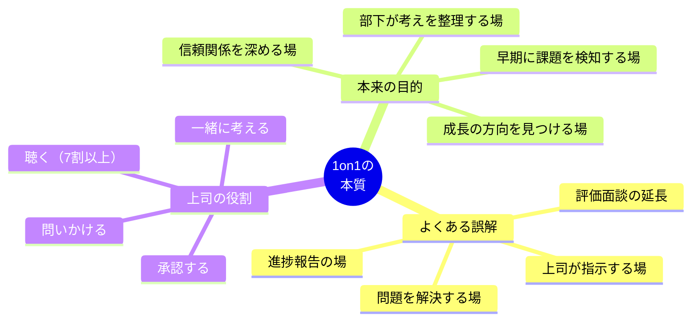
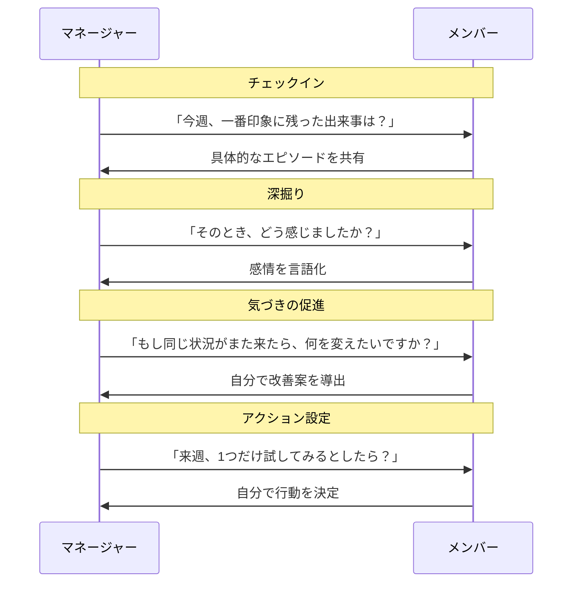
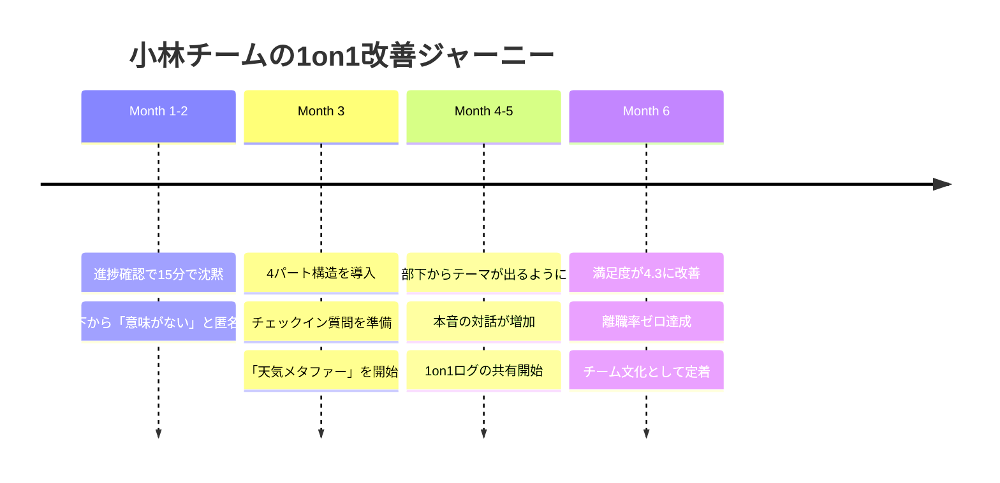

## 「1on1って、何を話せばいいかわからないんです」

小林大輔（35歳・IT企業の課長）は、3ヶ月前にマネージャーに昇進した。

会社の方針で、部下8人と毎週30分の1on1ミーティングを実施することになった。最初の1ヶ月は、何を話せばいいかわからず、気づけば業務の進捗確認で終わっていた。

「先週のタスクの進捗は？」「問題はある？」「来週の予定は？」

部下は「特にないです」と答え、15分で沈黙が訪れる。残り15分をどう埋めるかが苦痛で、小林は1on1の前日から憂鬱になっていた。

3ヶ月が経った頃、部下の1人である鈴木から匿名のフィードバックが届いた。

「1on1が進捗報告の場になっていて、正直あまり意味を感じません。それならSlackで済む話です」

小林はショックを受けた。だが同時に、この指摘が正しいことも痛いほどわかっていた。

もしあなたも1on1に苦手意識を持っているなら、安心してください。マネージャーの72%が「1on1の進め方に自信がない」と回答しているという調査データがあります（ハーバード・ビジネス・レビュー）。問題はあなたの能力ではなく、1on1の「設計図」を持っていないことにあります。

## 1on1の本質：「上司のための会議」ではなく「部下のための時間」

1on1の最も根本的な誤解は、「上司が部下の状況を把握する場」だと思っていることです。

本来の1on1は、部下が自分の考えを整理し、成長の方向性を見つけるための場です。主役は部下であり、上司はファシリテーターです。

この認識転換は、[「教える」から「引き出す」への転換](/blog/shift-teaching-to-coaching)と本質的に同じです。上司が答えを与えるのではなく、部下が自分で答えを見つけるプロセスを支援する。これが1on1の核心です。

## 1on1の構造設計：30分を4つのパートに分ける

小林が犯していた最大の失敗は、1on1に「構造」がなかったことです。構造なしに30分の自由対話をするのは、マネージャーにとってもメンバーにとっても苦痛です。

以下の4パート構造を使えば、毎回の1on1に一定の質が保たれます。

```mermaid
gantt
    title 1on1の30分構造
    dateFormat  X
    axisFormat %M分
    section パート
    チェックイン（体調・気分）   : 0, 5
    メインテーマ（部下が選ぶ）   : 5, 20
    振り返りとネクストアクション : 20, 27
    クロージング（感謝・次回予告）: 27, 30
```

### パート1：チェックイン（5分）

「今日の調子はどうですか？」から始めます。ただし、「元気です」で終わらせないことが重要です。

効果的なチェックインの質問例：

- 「今週、一番エネルギーが高かった瞬間はいつでしたか？」
- 「最近、仕事以外で楽しかったことはありますか？」
- 「今の気分を天気で表すと何ですか？」

3つ目の質問は、感情を直接言語化するのが苦手な人に特に有効です。「曇りですね」「晴れ時々曇りです」という回答から、「何が曇りの原因ですか？」と自然に深掘りできます。

### パート2：メインテーマ（15分）

ここが1on1の核心です。テーマは必ず部下が選びます。

「今日は何について話しましょうか？」と聞いたとき、「特にないです」と返ってくることがあります。これは部下の問題ではなく、心理的安全性がまだ構築されていないサインです。

「特にない」と言われたときの対処法を3つ紹介します。

**対処法1：カードを使う**
「キャリア」「スキル」「人間関係」「業務」「プライベート」と書かれた5枚のカードを用意し、「この中で今一番気になるものを1つ選んでもらえますか？」と聞く。選択肢があるだけで話しやすくなります。

**対処法2：スケーリング質問**
「今の仕事の満足度を10段階で表すと何点ですか？」と聞く。数字を答えてもらったら「なぜその点数で、10点ではないんですか？」と深掘りする。差分に課題が隠れています。

**対処法3：過去の出来事から引き出す**
「先週、一番困ったことは何でしたか？」「最近、嬉しかったフィードバックはありますか？」など、具体的な出来事を起点にする。抽象的な質問より、具体的な質問の方が答えやすい。

### パート3：振り返りとネクストアクション（7分）

メインテーマの対話を踏まえて、次のアクションを明確にします。

「今日の話を踏まえて、来週までにやってみたいことは何かありますか？」

ポイントは、上司が「こうしろ」と指示するのではなく、部下自身に決めてもらうことです。人は自分で決めたことの方が実行率が高い。これは[ポモドーロ・テクニック](/blog/pomodoro-technique)でも[やらないことリスト](/blog/not-to-do-list)でも同じで、自分で設計したルールは守りやすいのです。

### パート4：クロージング（3分）

「今日、話してみてどうでしたか？」と聞きます。この一言が、次回の1on1への期待を作ります。

最後に「話してくれてありがとう」と必ず伝える。感謝の言葉は、1on1が「業務」ではなく「対話」であることを印象づけます。

## ケーススタディ1：4パート構造を導入した小林の変化

小林大輔は、4パート構造を導入して最初の1on1を恐る恐る実施しました。

相手は、匿名フィードバックをくれた鈴木（27歳・エンジニア）。

「今日の調子はどうですか？天気で表すと？」

鈴木は一瞬驚いた表情を見せたあと、少し考えて言った。「曇りですかね。ちょっと最近モチベーションが下がってて」

以前の小林なら「モチベーションが下がっている」と聞いた瞬間に「何が問題だ？」「どうすれば解決する？」と問題解決モードに入っていたでしょう。しかし今回は違いました。

「曇りなんですね。もう少し聞いてもいいですか？」

鈴木はぽつぽつと話し始めた。担当プロジェクトのコードレビューで厳しいフィードバックを受け、自分の技術力に自信をなくしている。でもそれを言うと「弱い」と思われそうで言えなかった。

「そう感じていたんですね。教えてくれてありがとう。鈴木さんが厳しいフィードバックに真剣に向き合っていること自体、成長への姿勢だと思います。そのフィードバックをどう活かすか、一緒に考えてみませんか？」

30分の1on1が終わったとき、鈴木は言った。

「小林さん、正直に言うと、今までの1on1は辛かったです。でも今日は全然違いました。話してよかったです」

小林はその夜、1on1のやり方を根本的に間違えていたことを実感しました。「進捗確認」は1on1でなくてもできる。1on1でしかできないのは「本音を引き出す対話」だったのです。

## 質問テンプレート：場面別の「聞き方」一覧

1on1で使える質問を、場面別に整理しました。すべてを使う必要はありません。相手の状態に合わせて選んでください。

**成長・キャリアに関する質問：**
- 「3ヶ月後に『成長したな』と実感するとしたら、何ができるようになっていたいですか？」
- 「今の仕事で一番楽しいと感じる部分はどこですか？」
- 「将来的にやってみたい仕事やプロジェクトはありますか？」

**課題・悩みに関する質問：**
- 「最近、ストレスを感じていることはありますか？」
- 「今の業務で、一番もったいないと感じている時間の使い方は？」
- 「助けがあるとすれば、どんなサポートが欲しいですか？」

**人間関係に関する質問：**
- 「チームの中で、最近一番コミュニケーションを取っているのは誰ですか？」
- 「もっとこうなったらいいなと思うチームの雰囲気はありますか？」

**フィードバックに関する質問：**
- 「私のマネジメントで、改善してほしいことはありますか？」
- 「チームの仕組みで、変えた方がいいと思うことは？」

最後の質問は、聞く勇気が要ります。しかし、この質問ができるかどうかが、1on1の質を大きく分けます。部下からのフィードバックを受け止められるマネージャーは、信頼を勝ち取ります。[フィードバックの技法](/blog/feedback-technique-change-behavior)の記事で紹介している「フィードバックを贈り物として受け取る」姿勢は、マネージャー側にこそ必要です。

## ケーススタディ2：1on1で部下の退職を防いだ松本の場合

松本由美（40歳・広告代理店のチームリーダー）は、エース社員の加藤（29歳）の異変に気づいていました。

以前は積極的に発言していた加藤が、会議で黙っていることが増えた。残業も増えている。しかし、業務上のパフォーマンスは落ちていないので、周囲は気づいていなかった。

松本は1on1で切り込みました。

「加藤さん、今日の天気は？」
「晴れですね、問題ないです」
「そうですか。私から見ると、最近少し曇りがちに見えるんですが、気のせいかな？」

加藤は3秒ほど黙った後、言った。

「……実は転職を考えています」

松本は驚きを表に出さず、まず聞いた。

「教えてくれてありがとう。どういう経緯でそう思うようになったか、聞いてもいい？」

加藤が語った内容は、松本にとって予想外でした。給与への不満でも、人間関係の問題でもなかった。「自分のキャリアの方向性と、今のプロジェクトの方向性がずれてきた」「もっとブランド戦略の上流に関わりたいが、今のポジションでは難しいと感じている」。

松本は自分の意見を挟まず、45分間ひたすら聞きました（通常30分の枠を延長した）。そして最後にこう伝えました。

「加藤さんの希望はよくわかった。すぐに答えは出せないけど、1週間以内に部長と相談して、社内で可能性があるか確認させてください。転職という選択肢も否定しない。でも、社内にチャンスがあるなら、まずそちらを検討してみない？」

結果として、加藤はブランド戦略室への異動が実現し、退職を撤回しました。半年後、加藤は新しいポジションで大型案件を獲得し、チームの売上に大きく貢献しています。

「あの1on1がなかったら、加藤さんは黙って辞めていたと思います。普段の会議では絶対に出てこない本音でした」と松本は振り返ります。

## 1on1を「形骸化」させないための3つの仕組み

1on1の最大の敵は「マンネリ化」です。始めた当初は新鮮でも、3ヶ月もすると形骸化しがちです。以下の3つの仕組みで、1on1の質を維持しましょう。

### 仕組み1：1on1ログを共有ドキュメントで管理する

毎回の1on1の内容とアクションを、マネージャーとメンバー双方がアクセスできるドキュメントに記録します。フォーマットは「日付 / メンバーの状態 / メインテーマ / 気づき / ネクストアクション」の5項目。次回の冒頭で「前回のアクション、どうでしたか？」と振り返ることで、1on1が「話して終わり」ではなく「行動につながる場」になります。

### 仕組み2：四半期ごとに1on1の「振り返り」をする

3ヶ月に一度、メンバーに1on1の満足度を5段階で評価してもらい、「最も役に立ったこと」と「改善してほしいこと」を聞きます。この振り返り自体が、マネージャーの成長機会になります。

### 仕組み3：マネージャー同士の「1on1の1on1」を行う

自分の1on1の進め方について、他のマネージャーと月1回情報交換する場を設けます。小林はこの仕組みを人事に提案し実現させました。「自分だけで抱え込んでいたときと比べて、引き出しが3倍に増えた感覚です」。

## ケーススタディ3：1on1が「チーム文化」になった小林チームの変化

4パート構造の導入から6ヶ月。小林のチームには目に見える変化が起きていました。

**定量的な変化：**
- メンバーの1on1満足度：2.1（5段階）→ 4.3
- チームの離職率：年間25%（前年）→ 0%（半年間）
- メンバーからの改善提案：月平均2件 → 月平均8件
- チームの心理的安全性スコア：3.0 → 4.2（5段階）

**定性的な変化：**

鈴木（最初にフィードバックをくれたエンジニア）は言った。「以前の1on1は『報告の場』でしたが、今は『考えを整理する場』になっています。小林さんに話すことで、自分でも気づいていなかった課題やアイデアが出てくるんです」

小林自身も変わりました。「以前はマネージャーとして『答えを持っていなければいけない』と思っていました。でも、1on1で一番大切なのは『答えを持たないこと』だと気づきました。答えを持っていると、つい教えてしまう。教えると、部下は自分で考えなくなる。問いかけて待つ。これが一番難しくて、一番効果がありました」

## 1on1は「スキル」であり、練習で上達する

最後に伝えたいのは、1on1は才能ではなくスキルだということです。

小林は最初、1on1が苦痛で仕方なかった。でも6ヶ月間、構造を守り、質問を工夫し、失敗から学び続けた結果、チームで最も信頼されるマネージャーになりました。

[セルフコーチング](/blog/self-coaching-techniques)の記事でも紹介していますが、良い質問を投げかけるスキルは、練習によって確実に向上します。まずは4パート構造を使って、次回の1on1を「少しだけ」変えてみてください。

部下が「話してよかった」と感じた瞬間、あなたのマネジメントは次のステージに進んでいます。[成長マインドセット](/blog/growth-mindset)を持って、マネージャーとしての自分自身の成長を楽しんでほしいと思います。

---

**あなたの「1on1の質」を、プロと一緒にアップグレードしませんか**

ライフ自己決定コーチングでは、マネージャー向けの「1on1力強化セッション」を提供しています。実際の1on1場面をロールプレイし、質問の引き出しを増やし、部下の本音を引き出す対話力を60分で体感できます。

[無料セッションに申し込む →](/sessions)
