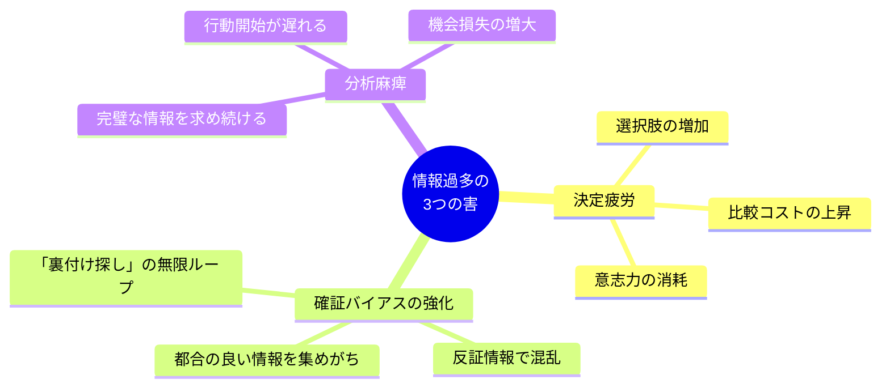
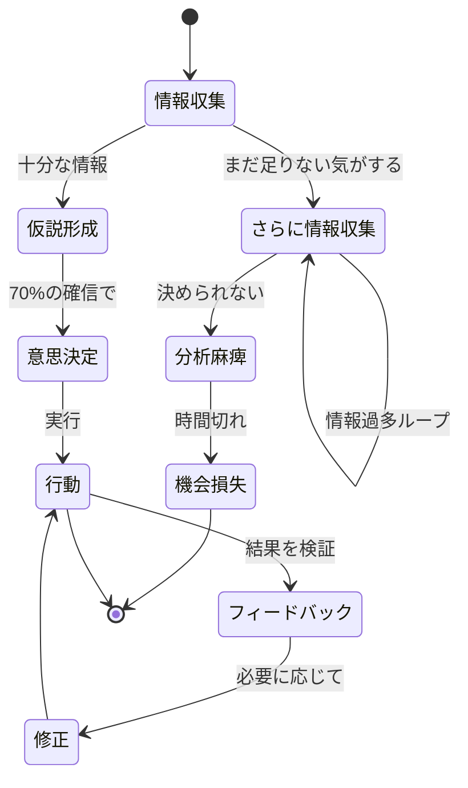
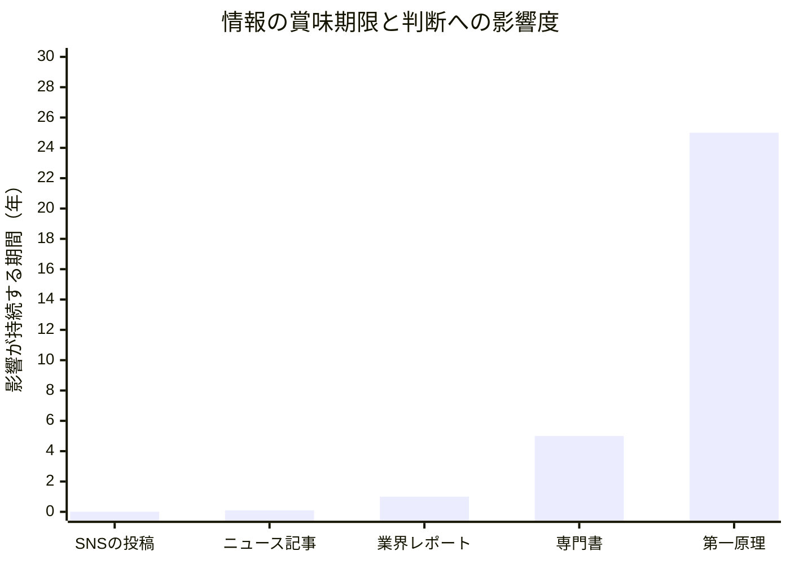
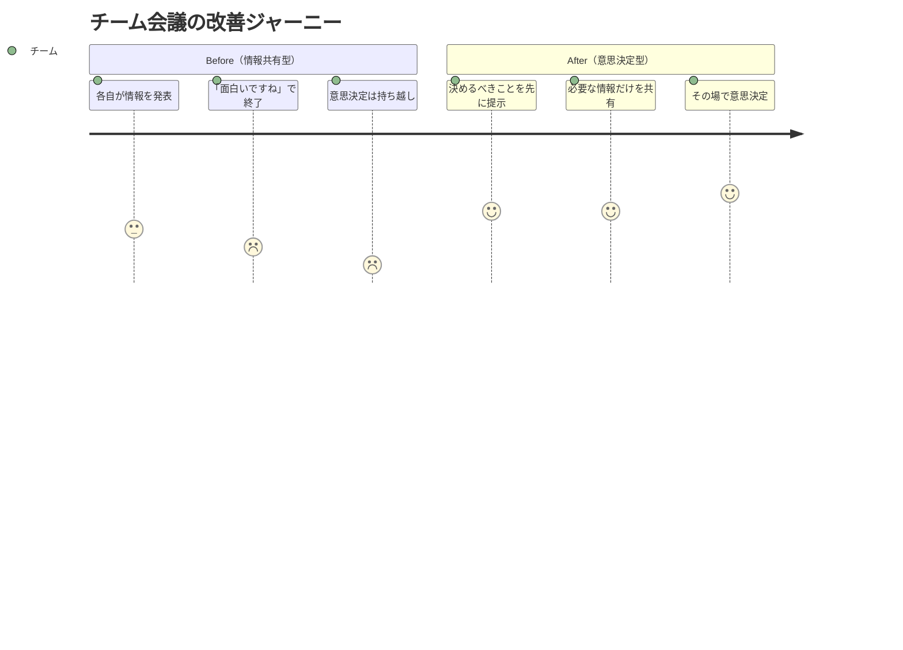

## 「調べれば調べるほど、決められなくなるんです」

藤田翔太（30歳・SaaS企業の事業企画）は、上司との面談でそう打ち明けた。

新規事業の企画書を任されて2ヶ月。市場調査レポートを20本読んだ。競合分析のスプレッドシートは200行を超えた。業界のPodcastを毎日聴き、LinkedInで海外の事例も追い続けた。

それなのに、企画書は白紙のままだった。

「情報は十分すぎるほどあるんです。でも、情報が増えるたびに『こっちの方がいいんじゃないか』『でもこのリスクもある』と新しい選択肢と懸念が増えて、何も決められない」

上司の反応は意外なものだった。

「藤田、お前は情報を集めすぎだ。来週の金曜までに、今ある情報だけで企画書を出せ。追加の調査は禁止だ」

藤田は困惑した。「情報が足りない」のが問題だと思っていたのに、「情報が多すぎる」のが問題だと言われた。

しかし、この上司の指摘は科学的に正しいものでした。コロンビア大学のシーナ・アイエンガー教授の「ジャム実験」で有名になった「選択のパラドックス」は、選択肢が増えるほど意思決定が困難になることを示しています。情報も同じです。情報が増えるほど、判断の質は上がるどころか、むしろ下がるのです。

## 「知りすぎ」が脳を壊すメカニズム

情報過多が判断力を鈍らせるメカニズムは、大きく3つあります。

### メカニズム1：決定疲労（Decision Fatigue）

人間の脳が1日に下せる意思決定の回数には上限があります。スタンフォード大学の研究では、意思決定を繰り返すと、脳の前頭前皮質のグルコースが消耗し、判断の質が低下することが示されています。

情報を1つ取り入れるたびに、脳は「この情報は有用か」「既存の知識とどう関連するか」「判断にどう影響するか」を無意識に処理します。200本のレポートを読んだ藤田の脳は、1本読むたびにマイクロ判断を数十回繰り返していた計算です。企画書を書く前に、すでに脳が疲弊していたのです。

[意思決定疲れ](/blog/decision-fatigue)の記事で詳しく解説していますが、判断力は有限のリソースです。情報収集に判断力を使い切ってしまうと、肝心の意思決定に割くエネルギーが残りません。

### メカニズム2：確証バイアスの強化

人間は無意識に「自分の仮説を裏付ける情報」を選択的に集める傾向があります。これが確証バイアスです。

藤田のケースでは、最初は「市場A」に可能性を感じていたのに、調査を続けるうちに「市場B」を推す情報も見つかり、さらに「市場C」の記事にも説得力があった。気づけば3つの仮説それぞれに「裏付け」が集まり、どれが正しいのかわからなくなっていた。

情報が少ないときの方が、直感と限られたデータで「えいや」と決められる。情報が増えると、各選択肢の根拠が均衡し、決められなくなる。これが確証バイアスと情報過多が組み合わさった結果です。

### メカニズム3：分析麻痺（Analysis Paralysis）

「もう少し情報を集めれば、正解がわかるはず」という信念が行動を止めます。しかし、ビジネスにおいて「正解」が事前にわかることはほぼありません。

ジェフ・ベゾスのAmazonでは、意思決定を「一方通行のドア（取り返しがつかない決定）」と「二方通行のドア（やり直しが利く決定）」に分類しています。そして、ビジネス上の意思決定の約90%は「二方通行のドア」だと言います。つまり、間違えてもやり直せる。

それにもかかわらず、多くの人が「一方通行のドア」のように慎重になりすぎているのです。

藤田が陥っていたのは、「さらに情報収集 → さらに情報収集」の無限ループでした。抜け出すには「70%の確信で動く」という意思決定ルールが必要です。

## ケーススタディ1：情報制限で成果を出した藤田のその後

上司に「追加調査禁止」を言い渡された藤田は、最初は不安でいっぱいでした。

「でも、やるしかなかった。それで、今ある情報だけで『市場A：参入すべき3つの理由』を書いてみたんです。書き始めたら、意外とすらすら進んだ。200本のレポートのうち、企画書に使ったのは結局5本分の情報だけでした」

翌週、藤田は企画書を提出した。上司のフィードバックは「荒削りだが、方向性は良い。ここから磨こう」。

「完璧を目指して2ヶ月止まっていたのが、制限をかけたら1週間で出せた。情報の量じゃなくて、『決める覚悟』が足りなかったんだと気づきました」

藤田は後にこの経験を振り返り、こう言っています。「企画書の質を決めるのは情報の量ではなく、情報を元にした判断力。そして判断力は、情報の量が増えるほど下がるんです。矛盾しているようだけど、これが真実でした」

藤田はその後、[ポモドーロ・テクニック](/blog/pomodoro-technique)を導入して「調査は2ポモドーロ（50分）まで、残りはアウトプットに使う」というルールを自分に課しました。生産性は目に見えて改善し、半年後には事業企画チームのリーダーに昇進しています。

## 情報ダイエットの5つの実践法

ここからは、情報過多を解消するための具体的な方法を紹介します。

### 実践法1：「情報の3層フィルター」を設定する

すべての情報を同じ重要度で扱うのをやめます。情報を3つの層に分け、各層に使う時間を制限します。

**第1層：必須情報（Must Know）**
仕事の意思決定に直接関わる情報。上司からの指示、顧客からのフィードバック、チームの進捗。1日の情報時間の50%をここに使う。

**第2層：有用情報（Nice to Know）**
自分の専門性を高める情報。業界ニュース、専門書、セミナー。1日の情報時間の30%をここに使う。

**第3層：娯楽情報（Fun to Know）**
直接的な業務関連はないが、興味がある情報。SNS、ニュースアプリ、YouTube。1日の情報時間の20%に制限する。

多くの人の問題は、第3層に時間の60%以上を使っていることです。スマートフォンのスクリーンタイムを確認すると、この偏りが数字で見えます。

### 実践法2：「情報の賞味期限」を意識する

すべての情報には賞味期限があります。

SNSのタイムラインは数時間で陳腐化します。ニュース記事は数日から数週間。業界レポートは数ヶ月から1年。専門書は数年。そして[第一原理思考](/blog/first-principles-thinking)で得られる原則的な知識は、10年以上持続します。

「賞味期限の短い情報」に時間を使いすぎていないか。藤田が200本読んだレポートの中で、1年後にも有効なものは20本もなかったはずです。

情報の摂取量を減らすのではなく、「賞味期限の長い情報」の比率を上げる。これが情報ダイエットの本質です。

### 実践法3：「情報断食日」を設ける

週に1日、意図的に情報をシャットアウトする日を設けます。ニュースを見ない。SNSを開かない。メールをチェックしない（緊急連絡は電話のみ）。

東京大学の研究では、情報を遮断した被験者は、24時間後に創造性テストのスコアが平均23%向上したというデータがあります。脳が情報処理から解放され、「考える」ことにリソースを割けるようになるためです。

岡田慎一（33歳・コンサルタント）は、毎週日曜日を「情報断食日」にしています。

「最初は不安でした。『何か大事なニュースを見逃すんじゃないか』って。でも3ヶ月続けてみて、見逃して困った情報は一度もなかった。むしろ、月曜の朝に頭がクリアで、週の立ち上がりが格段に良くなりました」

岡田は情報断食日に[朝のルーティン](/blog/morning-routine)を丁寧に行い、散歩と読書（SNSではなく紙の本）で過ごしています。「情報を入れない日があるから、残りの6日で入れた情報が活きるんです。食事と同じですね。毎日食べ続けたら消化不良になる」

### 実践法4：「2分ルール」で情報の取捨選択を高速化する

新しい情報に出会ったとき、2分以内に「保存する」「行動する」「捨てる」のいずれかを決めます。

- **保存する**：後で深く読む価値がある → 専用フォルダに保存
- **行動する**：今すぐ対応が必要 → 即座に行動
- **捨てる**：今の自分に関係ない → 閉じて忘れる

ポイントは「保留」を選択肢に入れないことです。「あとで読もう」と保留した記事が100本溜まっている人は多いはず。その100本を読む日は永遠に来ません。2分で判断できないなら、それは今の自分にとって重要度が低い情報です。

### 実践法5：「アウトプットファースト」で情報の質を上げる

情報を入れてからアウトプットするのではなく、先にアウトプットの枠を決めてから必要な情報だけを集める。この順番の逆転が、情報ダイエットの最も強力な武器です。

藤田の失敗は「情報を集めてから企画書を書こう」としたことでした。正解は「企画書の骨格を先に作り、足りない情報だけを集める」です。

具体的な手順：

1. アウトプットの構成を先に作る（企画書なら目次、記事なら見出し）
2. 各セクションに必要な情報を洗い出す
3. 不足している情報だけを調査する
4. 調査は時間制限付きで行う

この方法を使うと、必要な情報量は通常の3分の1以下になります。藤田は後にこの手法を取り入れ、「企画書を書くのに必要な調査時間が70%減った」と報告しています。

## ケーススタディ2：ニュース中毒を克服した岡田の場合

岡田慎一は、自分が「ニュース中毒」だと気づいたのは、クライアントとの打ち合わせ中にスマホでニュースをチェックしている自分に気づいたときでした。

「1日にニュースアプリを開く回数を数えたら、47回でした。衝撃的でした。1回3分として、毎日2時間以上をニュースに費やしていた計算です」

スクリーンタイムを計測すると、1日2時間20分。週に約16時間、月に64時間、年間で770時間をニュースに費やしていたことがわかりました。

「770時間。これだけの時間をニュースに使って、何か人生が良くなったかと言われたら、まったく変わっていない」

岡田は以下の3ステップで情報ダイエットを実行しました。

**ステップ1：ニュースアプリの削除**
スマホからニュースアプリをすべて削除。ニュースは1日1回、PCで30分だけ確認する。

**ステップ2：SNSの時間制限**
スクリーンタイム機能でSNSの利用を1日15分に制限。制限を超えるとアプリがロックされる。

**ステップ3：空いた時間の「投資」**
浮いた2時間を「スキルアップの時間」に充てた。オンライン講座の受講と、クライアント向けのナレッジ記事の執筆。

3ヶ月後の変化：

- クライアントへの提案の質が上がり、契約更新率が85%から94%に
- 年間資格取得数が0件から2件に
- 睡眠の質が改善（就寝前のスクリーンタイム削減効果）
- 「焦り」の感情が明らかに減少

「ニュースを減らしても、仕事で困ることは一度もなかった。むしろ、本当に重要なニュースは人から教えてもらえるんです。自分で網を張る必要はなかった」

## ケーススタディ3：情報ダイエットがチームに広がった話

藤田の体験は、チームにも波及しました。

事業企画チームの定例会議は、毎回「情報共有」に45分を費やしていました。各メンバーが見つけた記事やレポートを順番に紹介する。しかし、その情報が意思決定に使われることはほとんどなかった。

藤田は会議の構造を変えることを提案しました。

**Before：**「今週見つけた面白い情報」を各自10分ずつ発表（45分）→ 議論（15分）

**After：**「来週までに決めるべきこと」を先に提示（5分）→ その決定に必要な情報だけを共有（20分）→ 意思決定の議論（35分）

チームリーダーは最初懐疑的でしたが、2週間試した結果、会議の生産性が大幅に改善したことを認めました。

「以前は情報を共有すること自体が目的になっていた。情報は意思決定のための道具なのに、道具を並べて満足していたんです」と藤田は振り返ります。

## 情報ダイエットの究極の目的：「考える時間」を取り戻す

この記事を通じて伝えたいのは、「情報を減らすこと」が目的ではないということです。目的は「考える時間」を取り戻すことです。

現代のビジネスパーソンは、起きている時間の大半を「情報を入れること」に使っています。しかし、価値を生み出すのは「考えること」と「行動すること」です。情報はあくまで、考えるための素材に過ぎません。

[エネルギー管理](/blog/energy-over-time-management)の観点からも、情報の摂取量をコントロールすることは重要です。脳のエネルギーは有限であり、情報処理に使えばその分、創造的な思考に使えるエネルギーが減ります。

藤田は最後にこう言いました。「情報ダイエットを始めてから、通勤電車の中でぼんやり考える時間が増えました。何も見ない、何も聞かない時間。そこでふと企画のアイデアが浮かぶことが増えた。脳に余白がないと、新しいものは生まれないんですね」

[レジリエンス](/blog/resilience)を高めるためにも、情報の洪水から自分を守る力は不可欠です。あなたの脳を「受信機」から「発信機」に切り替える。それが情報ダイエットの本質です。

---

**「知りすぎ」の呪縛を断ち切り、本来の判断力を取り戻すために**

ライフ自己決定コーチングでは、あなたの情報摂取パターンを分析し、「考える時間」を生み出すための具体的な仕組みを一緒に設計します。情報に振り回される日々から、情報を使いこなす日々へ。その転換点となる60分です。

[無料セッションに申し込む →](/sessions)
