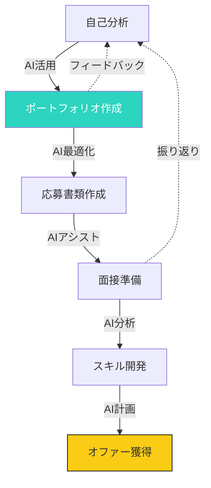
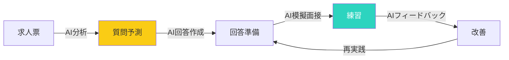

## AIがキャリア戦略を変える

生成AI（ChatGPT、Claude、Geminiなど）の台頭により、キャリア構築のあり方が大きく変わっています。

「AIは仕事を奪うのか？」

答えはNoです。しかし、AIを活用できる人とできない人では、今後大きな差が生まれます。

## AIによるキャリア開発プロセス

### AI活用キャリア開発のフロー



## AIによるポートフォリオ最適化

### ポートフォリオ作成の強化

AIは以下の方法でポートフォリオを強化できます：

**1. タイトルと要約の最適化**

AIに求人票を分析させ、キーワードを抽出：
- 求められるスキルと経験
- 使用頻度の高い用語
- 業界特有の表現

これらをポートフォリオのタイトルや要約に反映させることで、応募通過率が上がります。

**2. 実績の定量化**

AIに「具体的でインパクトのある実績表現」を生成させることができます。

**例**:
- Before: チームマネジメント経験あり
- After: 10名のチームをリードし、プロジェクトの成功率を85%から95%に向上

**3. スキルのマッチング**

AIにポートフォリオと求人票を比較させ、以下を得られます：
- 一致しているスキル
- 強化が必要なスキル
- アピールすべき経験

## 応募書類の自動化

### レジュメの最適化

AIを使ったレジュメ最適化の手順：

**ステップ1**: 求人票の分析
```
以下の求人票を分析し、重要なスキルと要件を抽出してください。
```

**ステップ2**: レジュメの最適化
```
私の現在のレジュメを添付します。上記の求人票に合わせて、最適化してください。
特に以下に注目：
1. キーワードの使用
2. 実績の定量化
3. 一貫性のあるストーリー
```

**ステップ3**: カバーレターの作成
```
求人票とレジュメに基づき、パーソナライズされたカバーレターを作成してください。
企業の価値観と、私の経験・スキルがどのように一致するか強調してください。
```

### 応募書類の品質向上

| 項目 | なし | AI活用あり |
|------|-----|-----------|
| ターゲット適合 | 手作業で確認 | AIが自動分析 |
| キーワード最適化 | 手動 | AIが提案 |
| カバーレター | テンプレート | パーソナライズ |
| 応所要時間 | 30〜60分 | 5〜10分 |
| 通過率 | 平均 | 20〜30%向上 |

## 面接準備の強化

### 面接質問の予測と対策

AIは以下の方法で面接準備を強化できます：

**1. 面接質問の予測**
```
以下の求人票と職種に基づき、面接で聞かれそうな質問をトップ10挙げてください。
```

**2. 回答の作成と練習**
```
上記の質問に対する最適な回答案を作成してください。
STARメソッド（状況、課題、行動、結果）を使用してください。
```

**3. 模擬面接**

AIと模擬面接を行うことも可能です。
```
面接官として振る舞い、私に質問してください。
質問後、フィードバックと改善点を教えてください。
```

### 面接準備のワークフロー



## リモートワークでのキャリア構築

### AI時代のリモートワーク

リモートワークとAIの組み合わせにより、新しいキャリアの可能性が開けています。

**1. 地理的制約の解消**

AIを活用することで、世界中の求人に応募できます：
- 英語面接の練習（AI翻訳付き）
- 文化の違いの理解（AIによる解説）
- 時間帯の調整（AIスケジューリング）

**2. グローバルなスキル開発**

AIを活用した学習：
- 多言語学習（AI翻訳・添削）
- 国際的な業界トレンド（AI要約）
- クロスカルチャルコミュニケーション（AIアドバイス）

**3. 自由な働き方**

リモートワークとAIの組み合わせ：
- 柔軟なスケジューリング（AIアシスト）
- ロケーションに依存しない仕事
- 複数のプロジェクト同時進行（AI管理）

## AIを活用したキャリア戦略の実践

### キャリア開発のステップ

| ステップ | AIの役割 | 具体的なツール |
|---------|-----------|---------------|
| **自己分析** | スキルの可視化、キャリアパス提案 | ChatGPT、Claude |
| **ポートフォリオ** | 最適化、強調ポイント提示 | Notion AI、Claude |
| **応募書類** | 作成、最適化、修正 | ChatGPT、Gemini |
| **面接準備** | 質問予測、回答作成、模擬面接 | ChatGPT、Claude |
| **スキル開発** | 学習プラン、教材推奨 | ChatGPT、Perplexity |
| **ネットワーキング** | メール作成、会話準備 | ChatGPT、Claude |

### AI活用の注意点

**1. 人間味を保つ**

AIの応答をそのまま使用せず、自分の言葉で調整：
- 個人の経験を反映
- 独自の視点を追加
- 感情とストーリーを含める

**2. 個人情報の保護**

AIを使用する際、以下に注意：
- 個人情報を匿名化
- 機密性のあるデータを共有しない
- AIのデータ保持設定を確認

**3. 検証と調整**

AIの応答は常に検証が必要：
- 事実確認
- 文脈に合わせた調整
- ユニークな視点の追加

## 今日から始めるアクション

### アクション1: 求人票のAI分析

興味のある求人票を3つ選び、AIに分析させましょう。

```
以下の求人票を分析し、重要なキーワードとスキルを抽出してください。
```

### アクション2: ポートフォリオの最適化

AIに現在のポートフォリオを最適化させましょう。

```
私のポートフォリオを添付します。より魅力的にするための改善案を提案してください。
```

### アクション3: 面接質問の準備

希望する職種に対する面接質問をAIに予測させましょう。

```
〇〇職の面接で聞かれそうな質問をトップ10挙げてください。
```

## まとめ

AIはキャリア戦略を強化し、より効率的に目標に到達する手助けをしてくれます。

しかし、AIはあくまでツールです。

最も重要なのは、自分の価値を理解し、AIを活用してその価値を最大限に表現すること。

今日から、AIをキャリア戦略の強力なパートナーとして活用しましょう。

AIと協働することで、新しいキャリアの可能性が開けます。

---

## 💬 一歩踏み出したいあなたへ

この記事のテーマについて、もっと深く揘り下げたいと思いませんか？

**体験セッション（無料）**では、あなたの状況に合わせた具体的なアドバイスをお伝えします。

[→ 体験セッションの詳細を見る](/sessions)

