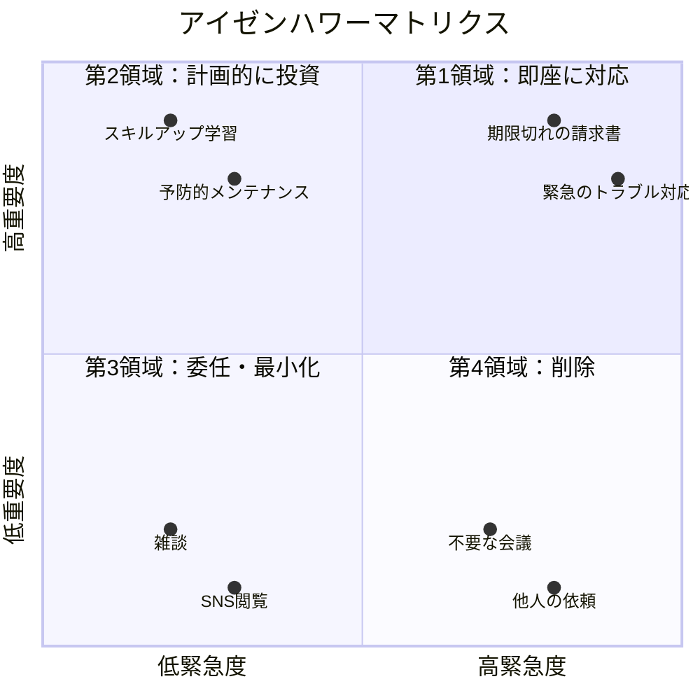

ToDoリストは生産性向上の基本ツールですが、単にタスクを書き出すだけでは効果が半減します。優先順位付けのフレームワークを活用し、本当に重要なタスクに集中する方法を解説します。

## ToDoリストの限界と優先順位付けがもたらす3つの変化

多くの人が経験するのは、ToDoリストは作るけれど、重要なタスクより簡単なタスクを先に片付けてしまい、日の暮れに重要なタスクが残っているという状況です。これは「逃避の達成感」という心理が作用しており、難しいタスクを避けて簡単なタスクを選んでしまいます。

私の友人の営業マンKさんは、毎朝10個のタスクをリストアップしていましたが、期限の迫った重要な提案書の準備より、メールの返信や資料の整理など「すぐ終わる仕事」から手をつけていました。結果、午後5時になって「今日中に絶対出さなきゃいけない提案書」が手付かずで残り、残業してギリギリで提出するという悪循環が続いていました。

優先順位付けのフレームワークを使い始めてから、Kさんの仕事は劇的に変わりました。「逃避の達成感」に流されずに客観的に重要なタスクを選ぶ基準ができたことで、朝のうちに提案書を完成させ、午後は新規開拓の電話に集中できるようになりました。

優先順位付けがもたらす3つの変化：

**1. 意思決定の疲労が減る**：毎回「何から手をつけようか」と悩む時間がなくなり、脳のエネルギーを実際の作業に使えます

**2. 緊急事項への対応力が上がる**：本当に重要なタスクが先に終わっているので、予期せぬトラブルにも余裕を持って対応できます

**3. 仕事の達成感が増す**：「今日やるべきことをやりきった」という確実な達成感を毎日得られます

## ABC分析の実践的な使い方：成功者が選ぶ「たった3つの基準」

ABC分析は、タスクを重要度に応じて3つのグループに分類するシンプルな方法です。

**Aタスク：今日必ず完了させなければならない最重要タスク。最大3つまでに絞ります**。これらは一日のエネルギーが最も高い時間帯（通常は午前中）に取り組みます。

著名な経営コンサルタントのピーター・ドラッカーは、「もし今日やることが一つだけだったら何か」と自問自答することを勧めていました。実際、Aタスクは「絶対に今日中にやらなければ大きな損失が生じるもの」だけを選びます。例えば：

- 今日が締め切りの重要な提案書
- 取引先との決済交渉
- クレーム対応（放置すると事態悪化する）

**Bタスク：重要だが、今日でなくても明日でも良いタスク**。Aタスクが完了して余力がある場合に取り組みます。Bタスクは5つ程度までに抑えます。例えば：

- 来週のミーティング準備
- レポートの作成
- 部下へのフィードバック

**Cタスク：できればやりたいが、緊急でも重要でもないタスク**。時間が余った場合や、気分転換に行うタスクとしてリストに残します。例えば：

- 資料の整理
- 業界ニュースのチェック
- 机の片付け

ABC分析のコツは、朝のうちにAタスクを選び、それ以外のタスクは積極的に延期することです。「今日は無理」という判断も重要な意思決定です。

あるIT企業のプロジェクトマネージャーは、「Aタスクを3つ以上選ばない」ルールを徹底しています。「5つもAタスクを選ぶと、どれも中途半端になる。本当に重要なことだけを厳選することで、質の高い成果を出せるようになった」と語っていました。

## アイゼンハワーマトリクスの4領域：第34代大統領が実践した「重要度重視」の仕事術

第34代アメリカ大統領ドワイト・D・アイゼンハワーが用いたとされるこのマトリクスは、タスクを「緊急度」と「重要度」の2軸で分類します。

**第1領域（緊急かつ重要）：即座に対応すべき課題**

例：期限が迫った重要プロジェクト、緊急のトラブル対応、体調不良時の病院受診。しかしこの領域のタスクが多すぎると、常に火消しに追われる状態になります。あるマネージャーは「第1領域のタスクが週の50%を超えるなら、第2領域を疎かにしているサイン」と言っていました。

**第2領域（重要だが緊急でない）：長期的な成功に最も重要な活動**

例：スキルアップ、予防的なメンテナンス、人間関係の構築、戦略的計画の立案。生産性の高い人はこの領域に時間を投資します。ウォーレン・バフェットは「人は第2領域に十分な時間を投資しないから、第1領域の火消しに追われる生活になる」と指摘しています。

**第3領域（緊急だが重要でない）：他人の緊急事項が多い領域**

例：不要な会議、無関係なメールの即時返信、他部署からの「ちょっと聞きたい」。できるだけ委任するか、断るべきタスクです。多くのサラリーマンは、この領域に時間を奪われています。

**第4領域（緊急でも重要でもない）：時間の無駄になりがちな活動**

例：SNSの漫然とした閲覧、不要な雑談、ミーディアム記事の無限スクロール。意識的に削減すべきです。ただし、適度な休息もこの領域に含まれるため、完全に排除するのではなく「意識的に選ぶ」ことが重要です。

## 日々の実践ワークフロー：朝15分・夜15分で変わる「優先順位リセット法」

朝の最初の15分で、今日のタスクをABC分析またはアイゼンハワーマトリクスで分類します。そして最優先のタスク（Aタスクまたは第2領域）に、一日のエネルギーが最も高い時間帯をあてます。

私が実践している朝のワークフローを紹介します：

**朝の15分（8:45〜9:00）：**
1. 昨日の未完了タスクを確認（2分）
2. 今日やるべきことをすべて書き出し（5分）
3. ABC分析またはアイゼンハワーマトリクスで分類（5分）
4. Aタスクまたは第2領域のタスクを最初の2時間にスケジュール（3分）

夕方には、翌日のタスクを同様に分類し、翌朝の準備をしておきます。

**夜の15分（17:45〜18:00）：**
1. 今日のタスク完了状況を確認（2分）
2. 明日のAタスクを選定（5分）
3. 明日の予定をカレンダーに反映（5分）
4. 今日の達成したことを振り返り（3分）

週に一度は、先週のタスクの分類を振り返り、自分がどの領域に時間を使いすぎているか分析します。あるフリーランスデザイナーはこの週次レビューを始めて以来、「第3領域（緊急だが重要でない）のタスクに週20時間も使っていたことに気づき、月5万円分の時間を第2領域に振り替えられた」と語っていました。

## フレームワークを超えた使いこなし：「問い」を武器にする最終形態

これらのフレームワークは、究極的には「自分の判断を補助する道具」です。毎日厳密に分類しようとすると疲れてしまいます。実務では、朝に「今日最も重要なことは何か」という問いを立て、それに集中するというシンプルな運用でも十分効果があります。

ある経営者は「毎朝、自分にこう問いかける。『もし今日これだけしかできないとしたら、何を選ぶか？』この問いが、真に重要なことに気づかせてくれる」と語っていました。

フレームワークを使いこなす上で大切なのは：

**1. 完璧を求めない**：80%の精度で運用する。完璧な分類より、実際に重要なタスクに時間を使うことの方が重要です

**2. 週次レビューを欠かさない**：週に1回、自分の時間の使い方を振り返り、バランスを調整します

**3. 道具として使う**：フレームワークが自分を縛るものではなく、自分の判断を助ける道具として使います

重要なのは、フレームワークを使うこと自体ではなく、重要なタスクに意識的に時間を割く習慣を身につけることです。フレームワークは手段であり、目的は「自分の人生の優先順位に沿って生きる」ことです。

今日から、朝の15分を投資して、あなたのToDoリストに優先順位をつけてみてください。小さな習慣の変化が、仕事の質と人生の充実度を大きく変えることでしょう。
