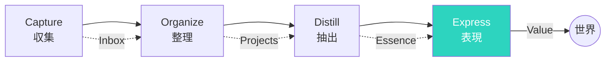

## 脳の限界：なぜ覚えることを諦める時代が来たのか

インターネットの時代、処理すべき情報は爆発的に増えました。1日に受ける情報量は、江戸時代の人が一生かけて得る情報量を超えると言われています。

しかし、人間の脳の容量は変わっていません。作業記憶（一時的に情報を保持できる容量）は7±2個程度。興味深いことに、これは1956年に発表された研究で、現在でもほぼ変わっていません。

ニューヨークタイムズの記者だったクライ・シラキは、毎日50件以上の情報源から記事を収集していました。しかし「読んだ記事の内容をほとんど覚えられない」ことに悩んでいました。「何千もの記事を読んできたのに、必要な時に具体的な情報を思い出せない。これは時間の無駄だ」と感じ、セカンドブレインの構築を始めました。

すべてを覚えようとするのは、もう無理なのです。

## セカンドブレインとは：脳の「外部記憶装置」の概念

ティアゴ・フォルテが提唱した概念。

デジタルツールを使って、自分の知識・アイデア・情報を外部に保存し、必要なときに取り出せる仕組み。

脳の記憶負担を減らし、創造的な思考に集中できるようにします。

セカンドブレインの本質は「記憶する場所を脳からツールに移す」ことではありません。重要なのは「知的生産のためのシステム」を作ることです。

## セカンドブレインの4つの機能（CODE）：情報を価値に変えるサイクル

### 1. Capture（収集）：情報の「漁網」を張る

気になる情報、アイデア、学びを素早くキャプチャする。
とりあえず保存。後で整理する。

ティアゴ・フォルテは「インスピレーションは消えゆくものだ。気づいた瞬間にキャプチャしないと、永遠に失われる」と言っています。

実践のポイント：
- **摩擦を減らす**：キャプチャのハードルを最低に。スマホのロック画面から直接メモれるアプリなどが最適
- **後で整理する前提で**：キャプチャ時に完璧な整理を求めない。後で時間を取って整理する
- **多様な形式で**：文章だけでなく、音声、画像、動画リンクなど、気になったものは何でも

著名な投資家レイ・ダリオは「思いついたら即座にメモする」習慣を50年以上続けています。彼の名著『Principles』は、そのメモの蓄積から生まれました。

### 2. Organize（整理）：「いつか役立つ」ではなく「今のプロジェクトに使える」で分類

集めた情報を、プロジェクト・テーマ別に整理。
「いつか役立つかも」ではなく「今のプロジェクトに使える」で分類。

ティアゴ・フォルテが提唱する「PARAメソッド」：

**P - Projects（プロジェクト）**：
- 明確なゴールと締め切りがあるもの
- 例：「来月のプレゼン資料作成」「ブログ記事10本書く」
- 現在進行形の具体的な作業

**A - Areas（領域）**：
- 継続的にメンテナンスが必要な領域
- 例：「健康」「人間関係」「キャリア」
- 終わりがないが、常に意識している領域

**R - Resources（リソース）**：
- 将来のプロジェクトで使える参考資料
- 例：「AI関連記事」「プレゼン術本」
- 興味のあるトピックの情報ストック

**A - Archives（アーカイブ）**：
- 完了したプロジェクト、不要になった情報
- 検索できる形で保存しておく

### 3. Distill（抽出）：「自分の言葉で」が最も重要

情報を読み返すとき、エッセンスを抽出する。
ハイライト、要約、自分の言葉でメモ。

単にコピペするのではなく、自分の言葉で書き直すことが重要です。これを「プログレッシブ・サマリゼーション」と呼びます。

レイヤー1：初読時に気になった部分をハイライト
レイヤー2：2回目の読み返しで、ハイライトからさらに重要な部分を選択
レイヤー3：3回目で、それを自分の言葉で短くまとめる
レイヤー4：最終的に、そのエッセンスをアウトプットに使う

### 4. Express（表現）：知識は「使ってこそ」価値になる

蓄積した知識を、アウトプットに使う。
記事、プレゼン、企画書、会話など。

「学んだこと」を「教えること」に変えることで、知識が定着します。

ある編集者は「毎週読んだ本の要約をブログに書く」習慣を作りました。「書くために読む」ことで、読書の質が変わったと言います。「教えるために整理する」ことで、本当に理解できたかどうかが明らかになります。

## おすすめのツール：あなたに合った「第二の脳」を選ぶ

- **Notion**: オールインワンのワークスペース
  - データベース機能が強力
  - チームでの共有にも最適
  - テンプレートが豊富

- **Obsidian**: ローカル保存のマークダウンノート
  - あなたの思考をネットワーク化
  - リンク機能が優秀
  - データは自分のPCに残る（プライバシー重視）

- **Evernote**: 老舗のノートアプリ
  - Webクリップ機能が強力
  - 全文検索が速い
  - 手書きメモのOCRも可能

- **Roam Research**: ネットワーク型ノート
  - 双方向リンクが特徴
  - 発見的な思考をサポート
  - 学術研究にも使われる

ツールは何でも構いません。
重要なのは、継続して使うこと。

## 始め方：今日から始める4ステップ

### Step 1: ツールを選ぶ

最初は一つに絞る。
後から移行もできるので、まず始めることが大事。

選ぶ基準：
- 使いやすさ（UIが自分に合うか）
- アクセスしやすさ（スマホ・PC両方使えるか）
- 検索機能の強さ
- 自分のデータの所有権

### Step 2: 収集を始める

気になる記事、本の引用、アイデアをとにかく保存。
最初は整理を気にしなくていい。

「捕まえる」ことを優先。取捨選択は後で。

### Step 3: 週1回整理する

週末に15分、たまったメモを整理。
カテゴリ分け、タグ付け。

この「振り返り」の時間が、セカンドブレインの価値を高めます。

### Step 4: アウトプットに使う

何か作るとき、セカンドブレインを参照する。
使うことで、価値が生まれる。

書く、話す、提案する—どんな形でも「表現」してください。

## 脳を解放する：「覚えること」から「考えること」へ

覚えることから解放されると、考えることに集中できます。

セカンドブレインを構築した作家のAさんはこう語ります。「以前は『あの本で読んだことを思い出せない』というストレスが常にありました。今は『あの本を探せばすぐ見つかる』という安心感があります。脳のメモリが解放されて、本当に創造的な作業に集中できます」

今日から、気になった情報を一つの場所に保存する習慣を始めてみてください。

最初はスマホのメモアプリでも構いません。「後で整理しよう」ではなく、「今すぐ保存する」ことから始めましょう。
