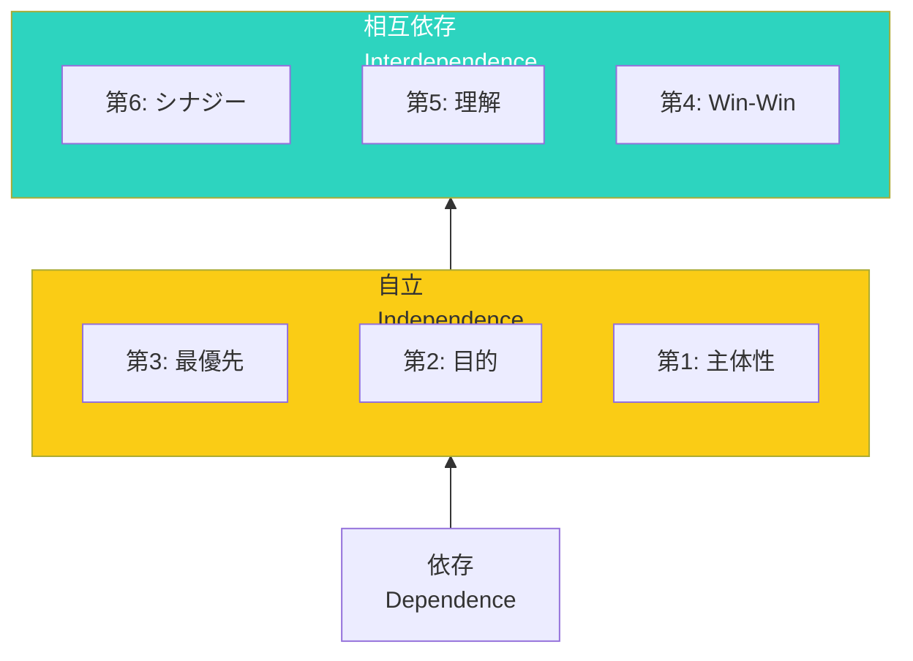

## 7つの習慣とは：原則に基づく成功の道

スティーブン・R・コヴィーによる自己啓発の古典的名著。

テクニックではなく「原則」に基づいた、本質的な成功の習慣を説いています。

コヴィーは「人格のパラダイム」と「人格倫理のパラダイム」を区別します。短期的なテクニック（「どうすれば人を操れるか」）ではなく、普遍的な原則（「誠実さ」「信頼」など）に基づく生き方こそ、長期的な成功と幸福をもたらすと説きます。

フォードモーターのアラン・マルアリーCEOは、「7つの習慣」に基づいて会社を立て直しました。「Win-Winの考え方と、まず理解してから理解されるという姿勢が、会社文化を変えた」と語っています。

## 私的成功の3つの習慣：自分を整える

### 第1の習慣: 主体的である - 反応ではなく選択する

刺激と反応の間には選択の自由がある。
環境や他人のせいにせず、自分の反応は自分で選ぶ。

コヴィーは「プロアクティブ」という言葉を広めました。「環境に反応するのではなく、自分の価値観に基づいて行動する」ということです。

**実践**: 「〜のせいで」という言葉を「私は〜を選ぶ」に変える。

例：
- 「上司がイライラさせるので、仕事が手につかない」→「私はイライラに対する反応として、集中力を下げることを選んでいる。別の反応も選べる」
- 「時間がないので運動できない」→「運動より他のことを優先することを選んでいる」

ビクトル・フランクル（「夜と霧」の著者）は、ナチスの強制収容所で「人間にとって最後の自由は、与えられた状況における態度を選ぶ自由である」と気づきました。極限の状況でも、自分の反応を選ぶ自由は奪えないのです。

### 第2の習慣: 終わりを思い描くことから始める - 未来から逆算する

ゴールを明確にしてから行動を始める。
自分のミッション・ステートメントを作る。

「墓参り思考実験」：自分の葬儀に出席するイメージをし、そこで「どんな人だったか」という話を聞くとしたら、どんなことを言ってほしいか？

**実践**: 「10年後の自分」「葬式で何と言われたいか」を考える。

ステファン・スピルバーグは「終わりを見据えて脚本を書く」と言います。映画の最後のシーンを決めてから、そこに至る物語を作るのです。人生も同じです。

### 第3の習慣: 最優先事項を優先する - 大切なことに時間を使う

緊急性ではなく重要性で行動を選ぶ。
第2領域（重要だが緊急でない）に時間を使う。

コヴィーは「重要なことは seldom 緊急で、緊急なことは seldom 重要だ」と言いました。

**実践**: 週の始めに「最も重要なこと」を3つ決める。

ある企業の経営者は毎週日曜夜に「今週のビッグ3」を決めています。「週の初めに最重要事項を3つだけ選び、それ以外は脇に置く。これで重要なことに必ず時間が取れるようになった」と語っています。

## 公的成功の3つの習慣：他者との関係を築く

### 第4の習慣: Win-Winを考える - 双方が勝つ解を探す

自分も勝ち、相手も勝つ解決策を探す。
Win-Loseでもなく、Lose-Winでもない。

Win-Winは「妥協」ではありません。創造的な第三の解を見つけることです。

**実践**: 次の交渉で「双方が満足する方法は？」と問う。

ビル・ゲイツは「Microsoftの成功は、パートナー企業とのWin-Win関係にあった」と語っています。自分だけが儲かる関係は長続きしません。

### 第5の習慣: まず理解に徹し、そして理解される - 傾聴の力

話す前に聴く。
相手を理解することが、理解してもらう近道。

「共感的傾聴」と呼ばれる技術です。相手の言葉を聴き、自分の言葉で繰り返し、感情を確認することで、本当に理解していることを伝えます。

**実践**: 相手の話を最後まで聞いてから、自分の意見を言う。

心理学者カール・ロジャーズは「人は、本当に理解されていると感じた時にだけ、成長し、変化する」と言いました。理解することは、相手に変化の力を与えることです。

### 第6の習慣: シナジーを創り出す - 1+1が3以上になる

1+1が3以上になる相乗効果を生み出す。
違いを尊重し、強みを活かし合う。

シナジーは「妥協」ではありません。違いを組み合わせて、どちらか一方では得られない新しい価値を生み出すことです。

**実践**: 異なる意見を「問題」ではなく「機会」と捉える。

ピクサーの「プラスメンティング」はシナジーの良い例です。意見の対立を「相手を否定」ではなく「アイデアを高める」ために使います。

## 再新再生の習慣：自分を磨き続ける

### 第7の習慣: 刃を研ぐ - 持続可能な成長のために

4つの側面（肉体、精神、知性、社会・情緒）を継続的に改善する。

鋸で木を切る人が、切れ味が落ちたら鋸を研ぐのと同じように、自分自身も定期的に「研ぐ」必要があります。

**実践**: 日々の時間を、自己投資に使う習慣を持つ。

肉体：運動、睡眠、食事
精神：瞑想、自然との触れ合い、音楽
知性：読書、学習、執筆
社会・情緒：人間関係、サービス、共感

## まず自分から：内から外へのアプローチ

7つの習慣は、外から内へではなく、内から外へのアプローチ。

まず自分が変わることで、周囲との関係、そして世界が変わります。

コヴィーは「変化を求めるなら、まず鏡を見ろ」と言いました。他人を変えようとする前に、自分の内面から変えること。

一つの習慣から、始めてみてください。

習慣を身につける上で大切なのは「すべて同時に」ではなく「一つずつ」です。第1の習慣を1ヶ月実践し、定着してから次に進む。そうやって7つの習慣を順に取り入れていくことで、本当の変化が起こります。
