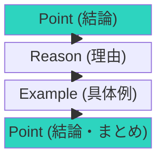

## 文章力は最強のスキル：リモート時代の必須能力

リモートワークが増え、テキストコミュニケーションの重要性は増しています。

メール、Slack、報告書、企画書、ブログ。
文章力があれば、あらゆる場面で力を発揮できます。

ある調査によると、ビジネスパーソンの1日の仕事時間の約30%が「文章を書くこと」に費やされています。メール、報告書、プレゼン資料...文章力が仕事の生産性を大きく左右します。

大手IT企業の部長であるM氏は「採用面接で最も重視するのは文章力」と語ります。「論理的で、相手の立場に立った文章が書ける人は、仕事もできる。逆に文章がまとまらない人は、仕事も整理できていないことが多い」とのことです。

## 伝わらない文章の6つの特徴

- **長すぎる**：読む気を失わせる
- **何が言いたいかわからない**：結論が不明確
- **専門用語が多い**：読み手を排除する
- **主語と述語がねじれている**：論理的でない
- **一文が長すぎる**：読みにくい
- **自分本位**：読み手の視点を無視している

ある会社の新人が書いた報告書を見せてもらいました。「〜について検討した。〜についても確認した。〜についても調査した。」結局「何が言いたいのか」が分かりませんでした。上司に「結論は？」と聞かれ、「あ、そうでした」と気づいたそうです。

### 伝わる型：PREP法

PREP法はプレゼンテーションの基本構造で、文章にも応用できます。

## 伝わる文章の5つの原則

### 原則1: 結論ファースト - 先に答えを言う

最初に結論を書く。
読み手は忙しい。何を言いたいか、先に知りたい。

「結論ありき」の構造：
- 悪い例：「〜について検討しました。〜について調査しました。〜を確認しました。結論として〜が良いと考えます。」（結論が最後）
- 良い例：「〜を推奨します。理由は〜です。具体的には〜です。」（結論が最初）

マッキンゼー流の「ピラミッドストラクチャー」も同じ考え方です。結論を先に述べ、その後に根拠を積み上げていくのです。

### 原則2: 一文一義 - 一文に一つだけのメッセージ

一つの文に、一つのメッセージだけ。
複数のことを詰め込まない。

悪い例：「今回の会議では新製品の発売時期と価格と販売戦略について議論し、発売時期は来月に決定したが価格については来週までに再度検討することになった。」（一文に情報が多すぎる）

良い例：
「今回の会議では3つのテーマを議論しました。
- 発売時期：来月に決定
- 価格：来週までに再検討
- 販売戦略：引き続き検討を続ける」

### 原則3: 短く書く - 一文は40〜60文字程度に

一文は40〜60文字程度に。
長くなったら分割する。

ある編集者は「一文が長い文章は、書き手自身が考えが整理できていない証拠」と言います。短く書くことで、自分の思考も整理されます。

テクニック：
- 「〜ということです」を削除
- 「〜である」→「〜だ」にする
- 「〜に関して」→「〜について」など、簡潔な表現にする

### 原則4: 具体的に書く - 数字と具体例を使う

抽象的な表現より、具体的な例や数字を使う。
「かなり多い」→「300件以上」

抽象的：「売上が大幅に向上しました」
具体的：「売上は前年比25%増の1億2000万円となりました」

具体性が信頼性を生みます。

### 原則5: シンプルな言葉を使う - 難しい言葉ほど伝わらない

難しい言葉より、やさしい言葉。
専門用語は必要最小限に。

アインシュタインは「ものごとを6歳児にでも説明できなければ、自分自身もそれを理解していないのだ」と言いました。

専門用語を使うときは、必ず説明を添えましょう。

## 推敲のチェックリスト：書き終わった後の6つの確認

1. **結論が最初に来ているか** - 上の3行で結論が分かるか
2. **主語と述語が対応しているか** - 誰が何をしたか明確か
3. **一文が長すぎないか** - 40〜60文字を超えていないか
4. **不要な言葉を削れないか** - 「〜ということです」など
5. **誤字脱字はないか** - 特に相手の名前や会社名
6. **読み手にとって必要な情報か** - 自分本位になっていないか

あるプロライターは「推敲の時間を、書く時間の倍取る」と言います。書くことと推敲は別の作業です。一度書き終えたら、少し時間を置いてから読み直しましょう。

## 文章力を高める4つの方法

### 1. たくさん読む - 良い文章に触れる

良い文章を読むことで、感覚が養われる。

おすすめのビジネス書：
- 『コンサル一年目が学ぶこと』
- 『マッキンゼー流 プレゼンの武器』
- 『 issueから始めよ』

### 2. たくさん書く - 実践が最も効果的

実践が最も効果的。毎日何かを書く。

「毎日書く」ハードルが高ければ、「毎日3行書く」から始めてもOK。SNSへの投稿でも良いです。習慣化が大切です。

### 3. フィードバックをもらう - 他者の目で改善

他者の目で見てもらい、改善点を知る。

書いた文章を同僚に読んでもらい、「何が言いたいか分かりましたか」と聞くのが良いです。分からなければ、伝わっていない証拠です。

### 4. 推敲する - 書きっぱなしにしない

書きっぱなしにせず、必ず見直す。
できれば時間を置いてから読み直す。

時間を置くことで、客観的な目で読めます。推敲のコツは「削除」です。削っても意味が通じるなら、削りましょう。

## 文章はスキル：才能ではなく練習で伸びる

文章力は才能ではなく、練習で伸びるスキルです。

今日から、書くものを少しだけ意識してみてください。
「これ、もっと短くできないかな？」と問うだけで変わります。

文章力の向上は「急がば回れ」です。焦らず、毎日少しずつ練習してください。1年後には、今とは別人のような文章力を身につけているはずです。
