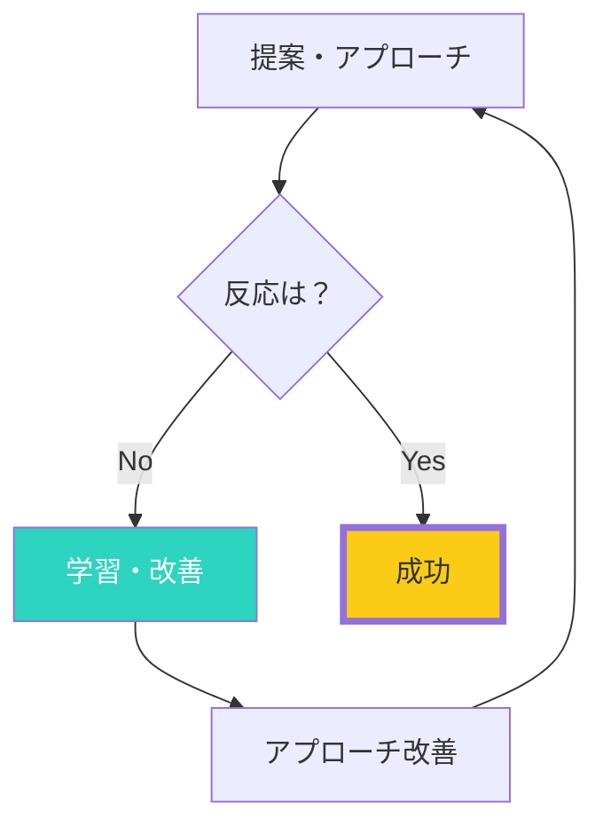

## 「No」が怖くて動けない：拒絶への恐怖が行動を止める

提案するのが怖い。
断られたらどうしよう。
恥ずかしい思いをしたくない。

多くの人が、拒絶を恐れて行動できずにいます。

新入営業マンのTさんは、電話営業が怖くて朝のダイヤルができませんでした。「断られたらどうしよう」「迷惑かけたらどうしよう」という思いが頭を離れません。結果、営業成績は常に最下位でした。

ところが、ある先輩から「Noは始まりだ」と教わってから意識が変わりました。最初の3ヶ月で200件の営業電話をかけ、198件断られました。しかし2件の成約が生まれ、それが自信になりました。「10回に1回しか成功しない」という確率を知ったTさんは、「Noをもらう回数」を目標にするようになりました。1年後には営業成績トップ3に入るようになりました。

## なぜ「No」を恐れるのか：進化的な脳のメカニズム

進化的に、拒絶は危険のサイン。
群れから排除されることは、かつて死を意味しました。

だから脳は、拒絶を避けようとします。

神経科学者の研究によると、拒絶を経験すると、脳は身体的な痛みと同じ領域（前帯皮質）を活性化します。つまり、「断られること」は脳にとって「痛み」なのです。

しかし現代社会では、断られることは死に直結しません。営業で断られても、提案が通らなくても、生きていけなくなるわけではありません。進化的な脳の反応が、現代では過剰反応になっているのです。

### Noは成功への通過点

成功への道には、Noが必ずあります。
Noを避けようとすれば、成功も避けることになります。

## 「No」への新しい見方：4つの視点転換

### 1. Noはフィードバック - 「今のやり方では響かなかった」という情報

「今のやり方では響かなかった」という情報がもらえた。
次に活かすデータです。

あるベンチャー起業家は「最初の20社に断られて、21社目で初めて投資を得ました。断られた20社から『なぜNoなのか』をフィードバックとしてもらい、提案を改善していきました」と語っています。

### 2. Noは選別 - Yesをくれる人を見つけるためのフィルター

全員にYesと言われることはない。
Noと言う人がいるからこそ、Yesと言う人を見つけられます。

保険外交員の世界記録保持者は「Noをもらう回数」を目標にしています。「1日に10回Noをもらえれば良い日。10回話せば、必ず1回はYesが来るから」と。

### 3. Noの数が成功を決める - Noを重ねるほど近づく成功

多くの成功者は、人一倍多くのNoを経験しています。
Noの数と成功は、正の相関があります。

作家のステファン・キングは、最初の小説が出版されるまで、何十回もの拒絶状を受け取りました。彼はそれらの拒絶状を釘で壁に打ち付けていました。「あと数センチで壁が埋まる。その時には出版されるだろう」という気持ちで。結果、出版され、世界的ベストセラー作家になりました。

### 4. Noはまだ交渉の途中 - 「今、この条件ではNo」かもしれない

「今すぐはNo」かもしれない。
「この条件ではNo」かもしれない。
聞いてみれば、条件次第でYesになることも。

営業のプロは「Noは交渉の始まり」と言います。「なぜNoなのか」を聞けば、相手の本当のニーズが見えてきます。それに応じた提案をすれば、Yesに変わることもあります。

## 拒絶への耐性を高める5つの方法

### 1. 拒絶に慣れる - 意図的にNoをもらう練習

意図的に「No」をもらう練習をする。
カフェで値引き交渉をしてみる、など。

「拒絶セラピー」という方法があります。意図的に断られる経験を積むことで、拒絶への恐怖が減少します。「今日は1回断られることをしよう」と決めて行動するのです。

### 2. 数字で考える - 確率のゲームとして捉える

「10回中1回成功すればいい」と割り切る。
確率のゲームと捉える。

営業マンのKさんは「断られるのは仕事の半分」と考えています。「10回電話すれば5回は出ない。出たうちの4回は断られる。1回は興味を持ってくれる。それを積み重ねれば、数字は必ず上がる」と。

### 3. 自己と提案を分離する - 「提案」が拒絶されただけ

「私」が拒絶されたのではなく、「この提案」が合わなかっただけ。
自尊心と切り離す。

心理学者の研究では、拒絶を「自分自身の価値の否定」ではなく「その場の状況の不一致」として捉えられる人は、回復が早く、継続して行動できます。

### 4. 学びに変える - 「なぜNoだったか」を分析

「なぜNoだったか」を分析する。
次の提案に活かす。

断られた後に「率直な意見を聞かせてほしい」と聞くことは有効です。相手から具体的なフィードバックをもらえれば、次の改善に繋がります。

### 5. 成功体験を思い出す - 過去のNo乗り越えを回想

過去に「No」を乗り越えて成功した経験を振り返る。

「以前もこんなに怖かったのに、今は普通にできている」ことを思い出すことで、成長を実感できます。

## 最後まで立っていた者が勝つ：継続こそが最大の武器

成功するのは、最も才能がある人ではありません。
諦めずに続けた人です。

ウォルト・ディズニーは銀行から300回以上融資を断られました。スターバックスのハワード・シュルツは242人の投資家に断られました。エイブラハム・リンカーンは数々の選挙で落選し、事業も失敗しました。しかし彼らは続けました。

今日、何か一つ「断られるかもしれないこと」を試してみてください。
それが、成功への第一歩です。

「No」を恐れないマインドセットは、営業だけでなく、恋愛、人間関係、新しい挑戦—あらゆる場面で役立ちます。Noは終わりではなく、始まりなのです。
