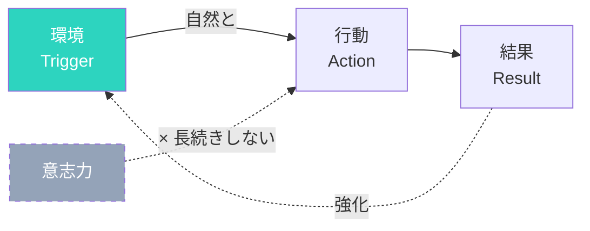

## 意志力では続かない：決意だけでは変われない現実

「明日から毎日運動する」
「お菓子はもう食べない」
「SNSを見る時間を減らす」

決意だけでは、長続きしない。
なぜなら、意志力には限界があるからです。

ロイ・バウマイスター教授の「エゴ消耗」研究によると、意志力は筋肉のようなもので、使えば使うほど疲れていきます。1日の終わりには、朝より意志力が低下しています。

ダイエットを決意したAさんの例。朝は「今日は絶対に夜ごはんを我慢する」と意気込んでいました。でも、仕事でトラブルがあり、帰宅は21時。疲れきった脳は「もう無理、何か食べたい」と悲鳴を上げます。冷蔵庫を開けると、目の前にケーキが。意志力が残っていないため、抵抗できずに食べてしまいました。

問題は「意志力が弱い」ことではありません。「意志力に頼る環境」を作っていることです。

## 環境が行動を決める：研究が示す驚きの事実

研究によると、人の行動の多くは環境によって左右されます。

お菓子が目に見える場所にあると、つい手が伸びる。
ジムが近いと、運動頻度が上がる。

コーネル大学の研究では、自宅のキッチンカウンターに菓子が置いてある人は、置いていない人に比べて平均5kg体重が重いことが分かりました。「食べようと思ったわけではない」けれど、目に入れば手が伸びるのです。

### 行動変容のメカニズム

良い習慣を身につけるには「意志力を使う」のではなく「環境を変える」方が効果的です。

## 環境デザインの3つの原則

### 原則1: 摩擦を減らす（良い習慣）

やりたいことは、できるだけ簡単に始められるようにする。

- 運動したい → 運動着を玄関に置く
- 本を読みたい → ベッドサイドに本を置く
- 水を飲みたい → デスクに水筒を置く

ある著者は「毎朝5時に起きて書く」習慣を作りたかったそうです。方法は簡単で、「寝室にコーヒーメーカーを置き、目覚ましと同時にコーヒーを淹れる」こと。部屋にコーヒーの香りが漂うと、自然と目が覚めます。

### 原則2: 摩擦を増やす（悪い習慣）

やめたいことは、できるだけ面倒にする。

- SNSを見すぎる → アプリを削除、ログアウトする
- お菓子を食べすぎる → 買わない、見えない場所に置く
- 夜更かしする → スマホをリビングに置いて寝室へ

ある人は「YouTubeを見すぎる」ことに悩んでいました。対策は簡単で、「見るたびにログアウトする」こと。ログインの手間が friction になり、自然と見る回数が減りました。

### 原則3: きっかけを可視化する

行動のトリガーを目に見える形で設置する。

- 薬を飲み忘れる → 朝食のテーブルに置く
- 瞑想を忘れる → クッションを目立つ場所に
- ストレッチを忘れる → ヨガマットを敷きっぱなしに

「見える化」は強力なトリガーになります。見れば思い出し、思い出せば行動する確率が上がります。

## 環境デザインの例：仕事環境と自宅環境

### 仕事環境

- スマホを引き出しに入れる（集中したいとき）
- 必要なツールだけデスクに置く
- 雑音をブロックするヘッドホン

あるプログラマーは「集中したい時はスマホを別の部屋に置く」そうです。「デスクに置いていると、つい確認したくなる。別の部屋に置けば、その気にならない」

### 自宅環境

- テレビのリモコンを遠くに置く
- 健康的な食べ物を手前に、不健康なものを奥に
- 運動器具をリビングに置く

「行動科学」の研究者であるブライアン・ワンシンクは「キッチンの構造を少し変えるだけで、食習慣が劇的に変わる」と言います。健康食品を目の高さに、菓子は見えない場所に—そのだけで、自然と健康な選択が増えます。

## 一度設定すれば、自動で動く：環境デザインの持続性

環境デザインの良いところは、一度設定すれば継続的に効果があること。

毎回意志力を使う必要がなくなります。

ある人は「毎朝の習慣」を作るのに苦労していました。それを「環境デザイン」で解決しました。
- 目覚まりを離れた場所に置く（起きざるを得ない）
- 隣に水とサプリメントを置く（習慣のきっかけ）
- スマホは別の部屋（最初の1時間はSNSを見ない）

「設定に30分かかったが、その後は自動的に動く。朝の意志力を使わずに済む」とのことです。

今日、一つだけ環境を変えてみてください。
それが新しい習慣のきっかけになります。

環境デザインは「魔法」ではありません。でも、意志力に頼るより、はるかに確実に行動変容を実現できます。あなたの目標に向けて、環境を「味方」に変えてみてください。
