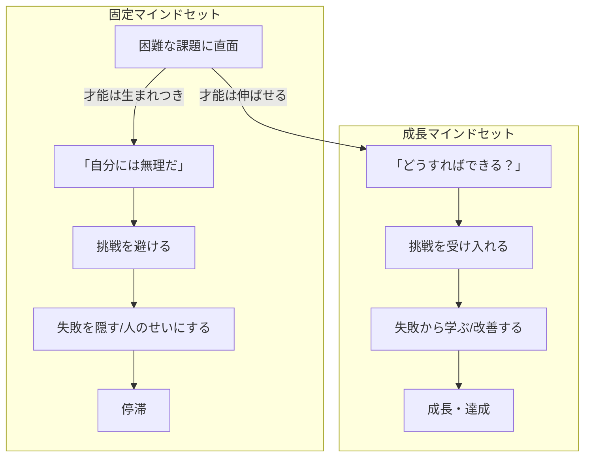

## はじめに：マインドセットが人生を決める

「才能は生まれつき」と思っていませんか？マインドセットを変えるだけで、成長の可能性は無限に広がります。

スタンフォード大学の心理学者キャロル・ドゥエック教授は、「マインドセット（心の持ち方）」が学習や達成に与える影響を研究しました。その結果、人は主に2つのマインドセットを持っていることが分かりました。

**固定マインドセット（Fixed Mindset）**：才能や知性は生まれつきのもので、変えられないと考える。

**成長マインドセット（Growth Mindset）**：才能や知性は努力によって伸ばせると考える。

この違いは、人生のあらゆる面に影響を与えます。

## 概念図解：2つのマインドセットの違い

## なぜこれが重要なのか：マインドセットが生産性を決める

現代社会において、グロースマインドセットというテーマは多くの人が直面する課題です。
情報過多の時代だからこそ、本質を見極め、適切に行動することが求められています。

特に日本のビジネス環境では、効率性と創造性の両立が難しくなっています。
しかし、適切なフレームワークとマインドセットを持つことで、劇的な変化を起こすことが可能です。

> 「重要なのは、何をどれだけやったかではなく、どのようなインパクトを残したかである」

### マインドセットが結果に与える影響

ドゥエック教授の研究によると、成長マインドセットを持つ学生は：
- 困難な課題に挑戦する確率が高い
- 失敗からの回復が早い
- 長期的な成績が向上する

一方、固定マインドセットを持つ学生は：
- 失敗を恐れて挑戦を避ける
- 失敗した時に自己評価を下げる
- 短期的には成功するものの、長期的には停滞する

## 3つの重要なポイント：グロースマインドセットを身につける

### 1. 根本的な原因を理解する：「できない」の本当の意味

多くの人は、表面的な症状に対処しようとします。しかし、根本的な原因はより深い部分にあります。
例えば、時間が足りないと感じる場合、問題は「時間の量」ではなく「選択の質」にあることが多いのです。

「数学ができない」と思っている場合、それは「数学の才能がない」ということではなく、「今の学習方法が自分に合っていない」か「十分な練習をしていない」可能性があります。

### 2. 小さな実践から始める：「知る」と「できる」の溝を埋める

知識を持っているだけでは意味がありません。
「知っている」と「できている」の間には大きな溝があります。
まずは今日からできる1分のアクションを見つけましょう。

例えば：
- 新しいスキルを学ぶ → 毎日5分だけ学習する
- 運動習慣をつける → 毎日2分だけストレッチする
- 英語を学ぶ → 毎日1つ単語を覚える

小さな成功体験が、成長マインドセットを強化します。

### 3. 持続可能なシステムを作る：意志力に頼らない仕組みづくり

意志の力に頼ると、いつか挫折します。
自動的にうまくいくような「仕組み」や「環境」を整えることが、長期的な成功の鍵です。

例えば：
- 運動したい → 運動着をベッドの横に置く
- 本を読みたい → スマホの代わりに本を枕元に置く
- 早起きしたい → 目覚ましを部屋の反対側に置く

## 「まだ」という言葉の力：失敗を成長の機会に変える

ドゥエック教授は「まだ（yet）」という言葉の力を強調します。

「できない」→「まだできない」

この一言が、固定マインドセットを成長マインドセットに変換します。
「できない」は最終的で絶望的ですが、「まだできない」は一時的で希望に満ちています。

## 失敗を学びに変える3つのステップ

成長マインドセットを持つ人は、失敗を以下のように処理します：

**Step 1: 失敗を受け入れる**
「失敗した」という事実を隠さず、受け入れます。

**Step 2: 原因を分析する**
「なぜ失敗したか」を客観的に分析します。

**Step 3: 次に活かす**
「次はどうするか」を具体的に計画します。

## 具体的なアクションプラン：明日から始めるマインドセット変更

明日から実践できる具体的なステップは以下の通りです。

1. **現状の可視化**: まずは自分自身やチームの状況を客観的に記録する。
   - 今のマインドセットを振り返る
   - 「できない」と思っている領域をリストアップする

2. **ボトルネックの特定**: 進捗を阻害している最大の要因を見つける。
   - その「できない」は本当に「才能」なのか？
   - 方法や練習量の問題ではないか？

3. **実験と検証**: 新しい方法を試し、その結果を振り返る。
   - 「まだできない」領域に小さく挑戦する
   - 結果を記録し、改善する

4. **フィードバックループ**: 周囲からのフィードバックを得て、改善を繰り返す。
   - 成長マインドセットを持つ人と交流する
   - フィードバックを「学び」として受け止める

## まとめ：マインドセットは選択である

グロースマインドセットを理解し実践することで、あなたの仕事や生活はより豊かになります。
完璧を目指す必要はありません。まずは一つだけ試してみてください。

マインドセットは生まれつきのものではなく、**選ぶことができるもの**です。今日から「まだできない」という言葉を使い、小さな挑戦を始めてみてください。

その小さな一歩が、やがて大きな変化につながります。
