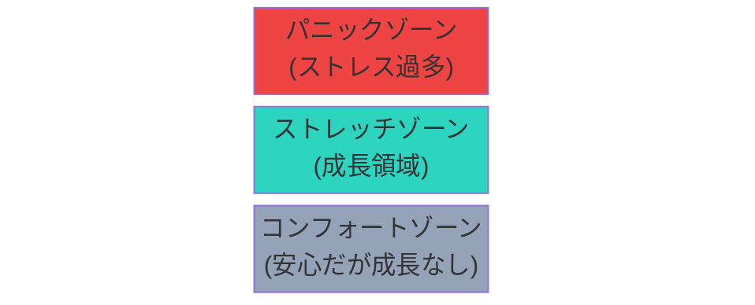

## はじめに：成長は居心地の良い場所の外にある

居心地の良い場所にいると成長は止まる。でも、無謀な挑戦も危険。適切な「ストレッチゾーン」の見つけ方。

人間は本能的に「安全」な場所を求めます。でも、そこに留まり続けると、成長の機会を失います。一方で、無理な挑戦はストレスとバーンアウトを招きます。

## 概念図解：3つのゾーンを理解する

### 3つのゾーン

**コンフォートゾーン（Comfort Zone）**：
- 安心して行動できる領域
- ストレスが少ない
- しかし、成長はない

**ストレッチゾーン（Stretch Zone）**：
- 少し緊張する領域
- 新しいスキルが身につく
- 最も成長が起こる領域

**パニックゾーン（Panic Zone）**：
- 過度なストレスを感じる
- パフォーマンスが低下
- 長期的なダメージのリスク

## なぜこれが重要なのか：適切な挑戦が成長を加速する

現代社会において、コンフォートゾーンを抜け出す方法というテーマは多くの人が直面する課題です。
情報過多の時代だからこそ、本質を見極め、適切に行動することが求められています。

特に日本のビジネス環境では、効率性と創造性の両立が難しくなっています。
しかし、適切なフレームワークとマインドセットを持つことで、劇的な変化を起こすことが可能です。

> 「重要なのは、何をどれだけやったかではなく、どのようなインパクトを残したかである」

### コンフォートゾーンに留まるコスト

コンフォートゾーンに留まり続けると：
- 新しいスキルが身につかない
- 適応力が低下する
- キャリアの機会を失う
- 自信が低下する

一方で、適切なストレッチゾーンで活動すると：
- 新しい能力が開発される
- レジリエンス（回復力）が向上
- 自信が構築される
- 新しい機会が生まれる

## 3つの重要なポイント：安全にゾーンを広げる

### 1. 根本的な原因を理解する：なぜ出られないのか

多くの人は、表面的な症状に対処しようとします。しかし、根本的な原因はより深い部分にあります。
例えば、時間が足りないと感じる場合、問題は「時間の量」ではなく「選択の質」にあることが多いのです。

コンフォートゾーンから出られない場合、それは「能力がない」からではなく、「恐怖」や「習慣」が原因であることが多いです。

### 2. 小さな実践から始める：5%ルール

知識を持っているだけでは意味がありません。
「知っている」と「できている」の間には大きな溝があります。
まずは今日からできる1分のアクションを見つけましょう。

**5%ルール**：今の状態から、5%だけ外に出る。
- プレゼンが苦手 → 会議で1回だけ発言する
- 英語が苦手 → 毎日1つ単語を学ぶ
- 新しい人と話すのが苦手 → 毎日1人に挨拶する

### 3. 持続可能なシステムを作る：ストレッチと回復のリズム

意志の力に頼ると、いつか挫折します。
自動的にうまくいくような「仕組み」や「環境」を整えることが、長期的な成功の鍵です。

ストレッチゾーンで活動した後は、コンフォートゾーンに戻って回復することが重要です。
「常にストレッチ」は持続可能ではありません。

## コンフォートゾーンを広げる4ステップ

### Step 1: 現在のゾーンを特定する

今自分がどのゾーンにいるかを認識します。
- 今の仕事は「楽」ですか「緊張」しますか「パニック」ですか？
- 新しい挑戦をするとき、どのような感情が湧きますか？

### Step 2: 目標のゾーンを設定する

次に向かうべきストレッチゾーンを設定します。
- 何を学びたいですか？
- どんなスキルを身につけたいですか？

### Step 3: 小さな一歩を計画する

5%のステップを計画します。
- 今週、何を新しく試しますか？
- どのくらいの頻度で挑戦しますか？

### Step 4: 振り返りと調整

経験を振り返り、調整します。
- ストレッチすぎましたか？
- もう少し挑戦できますか？

## 具体的なアクションプラン

明日から実践できる具体的なステップは以下の通りです。

1. **現状の可視化**: まずは自分自身やチームの状況を客観的に記録する。
   - 自分のコンフォートゾーンの境界を書き出す
   - 挑戦したい領域をリストアップする

2. **ボトルネックの特定**: 進捗を阻害している最大の要因を見つける。
   - なぜその領域が怖いのか？
   - 最悪のシナリオは何か？

3. **実験と検証**: 新しい方法を試し、その結果を振り返る。
   - 小さく挑戦する
   - 結果を記録する

4. **フィードバックループ**: 周囲からのフィードバックを得て、改善を繰り返す。
   - 信頼できる人に相談する
   - メンターやコーチを探す

## まとめ：成長のために一歩踏み出す

コンフォートゾーンを抜け出す方法を理解し実践することで、あなたの仕事や生活はより豊かになります。
完璧を目指す必要はありません。まずは一つだけ試してみてください。

重要なのは、パニックゾーンに飛び込まないことです。小さな一歩を積み重ね、徐々にコンフォートゾーンを広げていきましょう。

その小さな一歩が、やがて大きな変化につながります。
