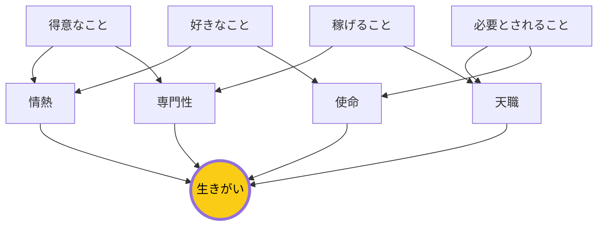

## はじめに：生きがいは4つの要素の交差点にある

好きなこと、得意なこと、稼げること、世界が必要としていること。4つの円が重なる場所に、あなたの生きがいがあります。

「生きがい（Ikigai）」は日本の言葉で、「生きる価値・意味」を指します。近年は世界中で注目され、ウェルビーイングやキャリアデザインの重要な概念となっています。

## 概念図解：生きがいの4要素

## なぜこれが重要なのか：生きがいが人生の質を高める

現代社会において、「生きがい」のフレームワークというテーマは多くの人が直面する課題です。
情報過多の時代だからこそ、本質を見極め、適切に行動することが求められています。

特に日本のビジネス環境では、効率性と創造性の両立が難しくなっています。
しかし、適切なフレームワークとマインドセットを持つことで、劇的な変化を起こすことが可能です。

> 「重要なのは、何をどれだけやったかではなく、どのようなインパクトを残したかである」

### 生きがいを持つことのメリット

研究によると、生きがいを持つ人は：
- 長生きする確率が高い（沖縄の長寿研究）
- 仕事の満足度が高い
- ストレスに強い
- 幸福感が高い

一方、生きがいを見つけられない人は：
- 空虚感を感じやすい
- 燃え尽き症候群になりやすい
- 人生の方向性に迷いやすい

## 3つの重要なポイント：生きがいを見つける

### 1. 根本的な原因を理解する：なぜ今の仕事に満足できないのか

多くの人は、表面的な症状に対処しようとします。しかし、根本的な原因はより深い部分にあります。
例えば、時間が足りないと感じる場合、問題は「時間の量」ではなく「選択の質」にあることが多いのです。

仕事に満足できない場合、4つの要素のどれが欠けているか分析します：
- 好きなこと → 情熱
- 得意なこと → 自信
- 稼げること → 安定
- 必要とされること → 意味

### 2. 小さな実践から始める：4つの要素を探る

知識を持っているだけでは意味がありません。
「知っている」と「できている」の間には大きな溝があります。
まずは今日からできる1分のアクションを見つけましょう。

**4つの質問**：
1. お金をもらわなくてもやりたいことは？（好きなこと）
2. 人から「上手いね」と言われることは？（得意なこと）
3. 人がお金を払ってでも求めることは？（稼げること）
4. 世界が必要としていることは？（必要とされること）

### 3. 持続可能なシステムを作る：生きがいは見つけるものではなく育てるもの

意志の力に頼ると、いつか挫折します。
自動的にうまくいくような「仕組み」や「環境」を整えることが、長期的な成功の鍵です。

生きがいは「見つける」ものではなく、「育てる」ものです。4つの要素を少しずつ重ねていくプロセスです。

## 生きがいを見つけるワーク

### Step 1: 4つのリストを作る

以下の4つのリストを作ってみてください：

**好きなことリスト**：
- お金をもらわなくてもやりたいこと
- 時間を忘れて夢中になれること
- やっていてエネルギーが湧くこと

**得意なことリスト**：
- 人から「上手いね」と言われること
- 苦労せずにできること
- 教えられるレベルにあること

**稼げることリスト**：
- お金を払ってでも求められるスキル
- 市場価値のある能力
- 過去にお金をもらった経験のあること

**世界が必要としていることリスト**：
- 社会課題に関連すること
- 人々の悩みを解決すること
- 世の中に不足しているもの

### Step 2: 重なりを見つける

4つのリストの重なりを探します。
- 好きかつ得意 → 情熱
- 得意かつ稼げる → 専門性
- 稼げるかつ必要 → 天職
- 必要かつ好き → 使命

### Step 3: 中心を探す

4つすべてが重なる場所—それが生きがいです。
最初から完璧な生きがいを見つける必要はありません。小さな重なりから始めましょう。

## 具体的なアクションプラン

明日から実践できる具体的なステップは以下の通りです。

1. **現状の可視化**: まずは自分自身やチームの状況を客観的に記録する。
   - 4つの要素について現在地を確認する
   - どれが欠けているかを特定する

2. **ボトルネックの特定**: 進捗を阻害している最大の要因を見つける。
   - 4つの要素のどれを強化すべきか？
   - 今すぐできることは何か？

3. **実験と検証**: 新しい方法を試し、その結果を振り返る。
   - 小さく試してみる
   - フィードバックを集める

4. **フィードバックループ**: 周囲からのフィードバックを得て、改善を繰り返す。
   - 信頼する人に相談する
   - メンターを見つける

## まとめ：生きがいは旅の途中で見つかる

「生きがい」のフレームワークを理解し実践することで、あなたの仕事や生活はより豊かになります。
完璧を目指す必要はありません。まずは一つだけ試してみてください。

重要なのは、生きがいは「見つける」ものではなく「育てる」ものだということです。4つの要素を少しずつ重ねながら、自分だけの生きがいを紡いでいきましょう。

その小さな一歩が、やがて大きな変化につながります。
