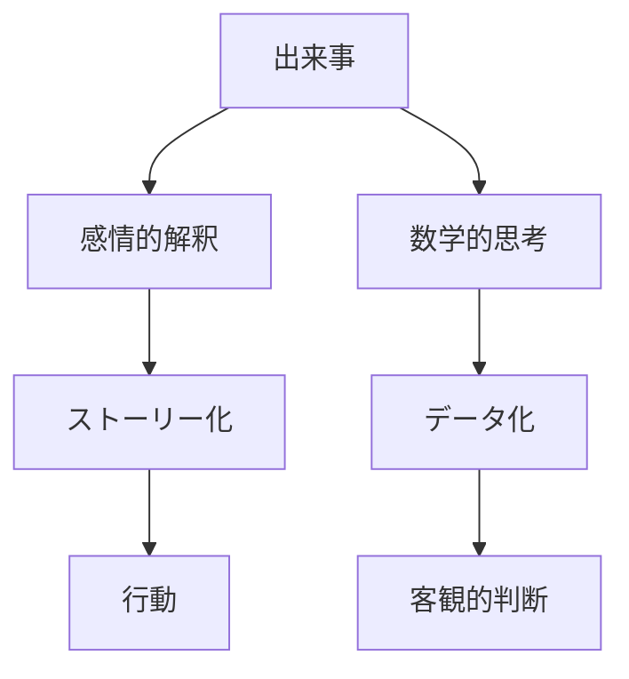
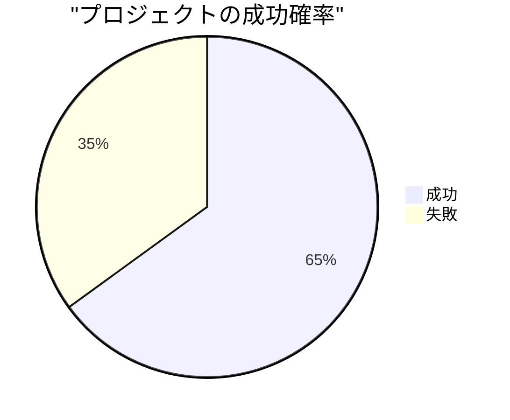
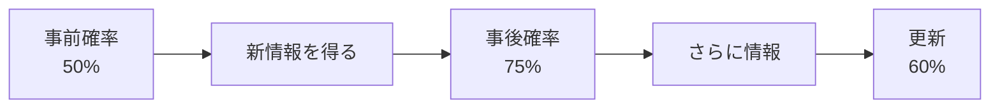
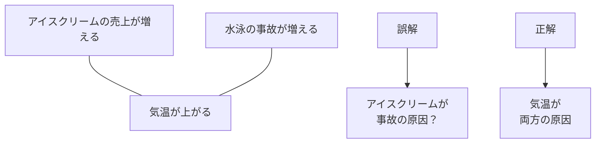
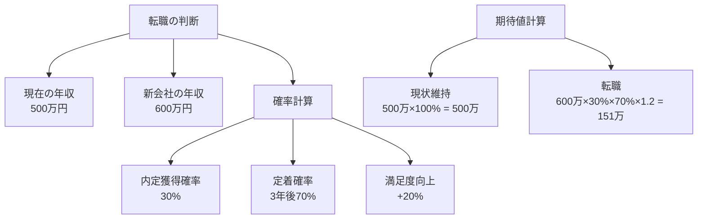
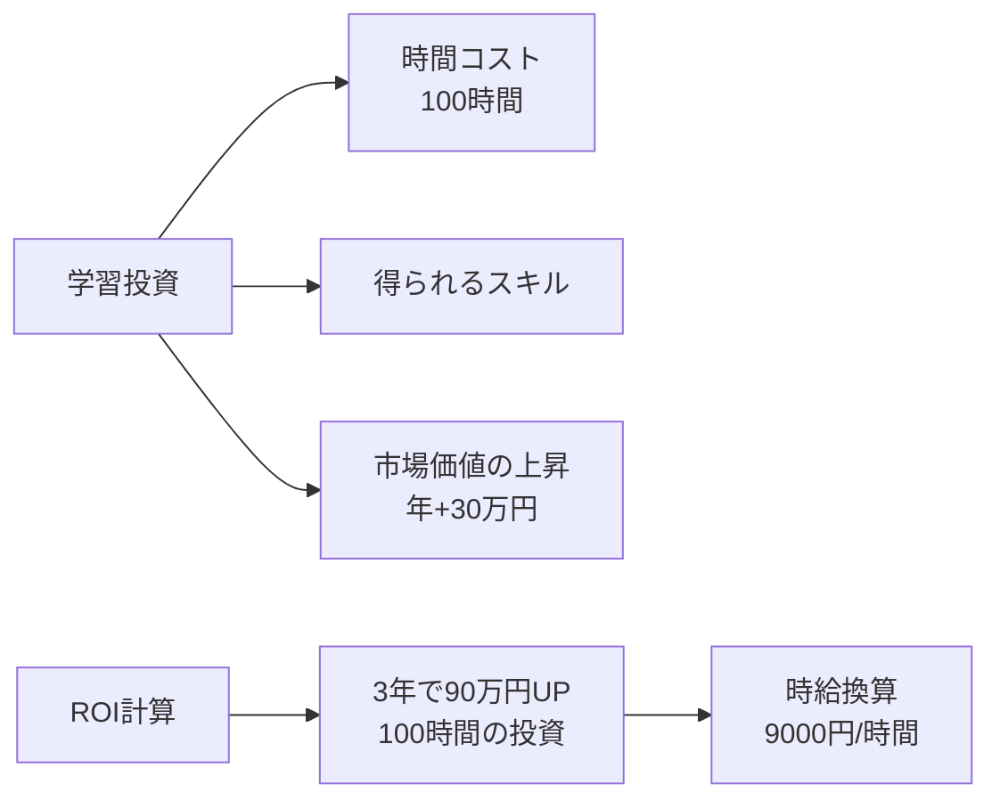

## はじめに

「あの人はすごい」
「最近、調子が悪い」
「これは絶対に成功する」

私たちの日常の会話は、
**曖昧で主観的な表現**に満ちています。

でも、本当に重要な決断をする時、
そのままの感覚で動いていませんか？

数学的思考とは、
**数字で物事を捉え、
論理的に判断する力**です。

難しい計算ができることではなく、
**曖昧さを排除して本質を見抜く力**です。

---

## なぜ数学的思考が必要か

### 感情の罠

人間の脳は、
**感情に大きく左右**されます。

「あの人は私を嫌っている」
→ 実際のデータは？
→ 3回中1回しか会話がなかっただけ

感情が作り出した「ストーリー」が、
現実を歪めていることがあります。

### 確率で捉える

数学的思考の核心は、
**「絶対」ではなく「確率」**で考えること。

「絶対に成功する」ではなく、
「65%の確率で成功し、
　35%の確率で失敗する」

このように捉えると、
**リスク管理が具体的**になります。

---

## 数学的思考の実践テクニック

### 1. 「どのくらい？」を数値化する

曖昧な表現を数字に置き換えます。

| 曖昧な表現 | 数値化 |
|-----------|--------|
| 最近、調子が悪い | 先月比で成果が20%減 |
| あの人はすごい | 年間で3プロジェクト成功、成功率85% |
| 絶対に必要 | なしでも業務は継続可能、効率は30%低下 |
| みんなが言っている | 10人中7人が同意、3人は反対 |

### 2. ベイズ的更新

新しい情報が入ったら、
**確率を更新**します。

最初の印象（50%）を
絶対視せず、
情報が増えるごとに
柔軟に修正する。

### 3. 相関と因果を区別する

「AとBが一緒に起きる」
≠「Aが原因でBが起きる」

数字を見る時、
**「本当に因果関係があるか？」**
を常に問います。

---

## 日常で使える数学的思考

### キャリアの判断

「転職すべきか？」

単純な比較ではなく、
**確率を乗じた期待値**で考える。

### 時間投資の最適化

「この勉強、意味がある？」

---

## 実践できること

**① 「どのくらい？」を習慣化**

日常の会話で、
曖昧な表現を聞いたら
「具体的にどのくらい？」
と問いかける。

**② 日記に数字を入れる**

「今日は良い日だった」
ではなく、
「今日の充実度：8/10」
「対人コミュニケーション：6件」

**③ 重要な決断は「期待値」で**

大きな決断をする前に、
紙に確率と数値を書き出す。

---

## まとめ

数学的思考は、
**冷たい計算ではありません**。

感情を否定するのではなく、
**感情と数字の両方を使って、
より的確な判断**を下す力です。

「なんとなく」ではなく、
「データに基づいて」。

それが、
不確実な時代を生き抜く
**確実な羅針盤**になります。

---

## セッションでできること

コーチングセッションでは、
あなたの「曖昧な悩み」を
**数字で再定義**します。

- キャリア選択の確率論的分析
- 日々のパフォーマンスの数値化
- 感情とデータのバランスの取り方

**「なんとなく不安」という曖昧さを、
「具体的にどう対処するか」という
明確さに変えていきましょう。**

[→ 体験セッションの詳細を見る](/sessions)
