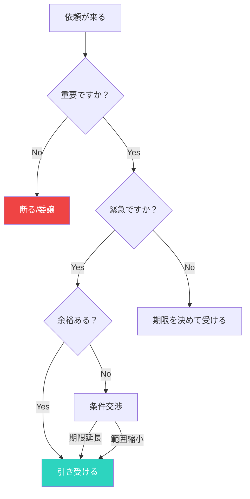

## はじめに：断ることは悪いことではない

上司の頼みは断れない？実は、上手に断ることでむしろ信頼を得られます。

「断ることは失礼だ」「上司には逆らえない」—そう思い込んでいる人は多いです。でも実際には、適切に断ることは専門性の表れであり、自分の仕事の質を守るために必要です。

## 概念図解：断るかどうかの判断フロー

### 断るかどうかの判断フロー

## なぜこれが重要なのか：上手な断り方が生産性を高める

現代社会において、上司からの依頼を断る技術というテーマは多くの人が直面する課題です。
情報過多の時代だからこそ、本質を見極め、適切に行動することが求められています。

特に日本のビジネス環境では、効率性と創造性の両立が難しくなっています。
しかし、適切なフレームワークとマインドセットを持つことで、劇的な変化を起こすことが可能です。

> 「重要なのは、何をどれだけやったかではなく、どのようなインパクトを残したかである」

### 断れない人が陥る罠

すべてを引き受けようとすると：
- 重要な仕事の質が下がる
- 締め切りを遅延させる
- ストレスで燃え尽きる
- 結局、誰も得しない結果になる

一方、適切に断ることで：
- 自分の仕事に集中できる
- 引き受けた仕事の質が上がる
- 上司にも代替案を提供できる
- 専門家としての信頼を得られる

## 3つの重要なポイント：上手に断るための基本

### 1. 根本的な原因を理解する：なぜ断れないのか

多くの人は、表面的な症状に対処しようとします。しかし、根本的な原因はより深い部分にあります。
例えば、時間が足りないと感じる場合、問題は「時間の量」ではなく「選択の質」にあることが多いのです。

断れない場合、以下の心理が働いていることがあります：
- 拒絶を恐れている
- 評価を下げられると思っている
- 「いい人」でいたい
- 自分の価値を仕事の量で測っている

### 2. 小さな実践から始める：「Yes, if」から始める

知識を持っているだけでは意味がありません。
「知っている」と「できている」の間には大きな溝があります。
まずは今日からできる1分のアクションを見つけましょう。

「No」ではなく「Yes, if」を使う：
- 「無理です」→「はい、もし期限を延ばせれば」
- 「できません」→「はい、もし優先順位を変更できるなら」

### 3. 持続可能なシステムを作る：事前に境界線を設定する

意志の力に頼ると、いつか挫折します。
自動的にうまくいくような「仕組み」や「環境」を整えることが、長期的な成功の鍵です。

事前に「現在の優先事項」を明確にしておくことで、断る判断が楽になります。

## 断る技術：実践的なフレーズ集

### 状況別の断り方

**時間がない場合**：
「今手が回っていないのですが、優先順位を見直してもよろしいでしょうか？」
「現在○○に集中していて、それを中断すると影響が出るのですが...」

**スキルが合わない場合**：
「この件は○○さんの方が専門的で、より良い成果が出せると思います」
「私がやるより、○○の方が効率的だと思います」

**予定が入っている場合**：
「○日までに必要とのことですが、現状のスケジュールでは難しいです。期限を△日に延ばせれば対応できます」

**代替案を提示する場合**：
「その件は私ではなく○○に任せるのが最適だと思います。代わりに○○はいかがでしょう？」

## 具体的なアクションプラン

明日から実践できる具体的なステップは以下の通りです。

1. **現状の可視化**: まずは自分自身やチームの状況を客観的に記録する。
   - 現在のタスク一覧を作る
   - 優先順位を明確にする

2. **ボトルネックの特定**: 進捗を阻害している最大の要因を見つける。
   - 何を断るべきか？
   - 断ることで開く時間は何に使うか？

3. **実験と検証**: 新しい方法を試し、その結果を振り返る。
   - 小さな依頼から練習する
   - 相手の反応を観察する

4. **フィードバックループ**: 周囲からのフィードバックを得て、改善を繰り返す。
   - 信頼する同僚に相談する
   - 自分の断り方を振り返る

## まとめ：断ることはプロの仕事

上司からの依頼を断る技術を理解し実践することで、あなたの仕事や生活はより豊かになります。
完璧を目指す必要はありません。まずは一つだけ試してみてください。

重要なのは、断ることは「嫌われること」ではなく「専門性を発揮すること」だということです。適切に断ることで、自分の仕事の質を守り、上司にも最適な解決策を提供できるのです。

その小さな一歩が、やがて大きな変化につながります。
