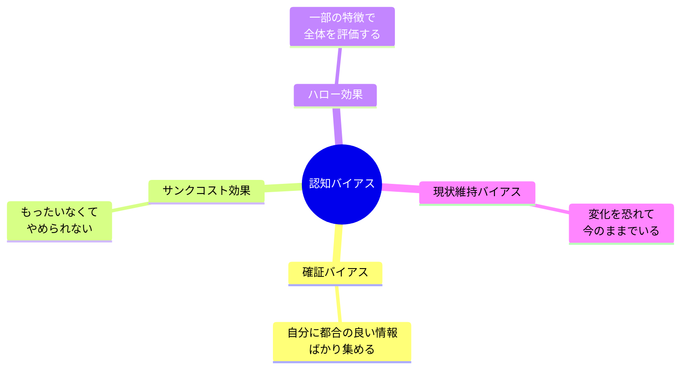

## はじめに

「あの投資、もっと調べればよかった」「あの人の第一印象で判断しちゃった」—こんな後悔、ありませんか？実は、これらは「認知バイアス」という脳の癖によるものです。人間の脳は効率的に働くために、無意識のうちに思考のショートカットを使います。これが時として、私たちを誤った判断へ導いてしまうのです。

この記事では、日常生活やビジネスで頻繁に遭遇する認知バイアスを解説し、それを乗り越えるための実践的な方法を紹介します。バイアスを知ることで、より客観的で質の高い意思決定ができるようになります。

## 概念図解

### 代表的な認知バイアス

## 4つの身近な認知バイアス

### 1. 確証バイアス - 自分の考えを肯定したがる脳

**どんなバイアス？**
自分の信念や仮説を支持する情報を優先的に探し、反証する情報を無視しがちな傾向です。

**日常での例：**
- 欲しい車を決めた後、その車の良い評価ばかり探す
- 自分の政治的主張に合うニュースだけを信じる
- 「やっぱりあの人はダメだ」と決めつけて、否定的な行動だけに注目する

**ビジネスでの痛い目：**
あるスタートアップの創業者は、自社の製品が絶対に売れると確信し、市場調査で否定的な意見を無視しました。結果、ニーズのない製品を大量生産し、在庫を抱えることに。確証バイアスが、冷静な判断を覆した典型的な事例です。

**対策：**
- 「私は間違っているかもしれない」と常に意識する
- 意見の異なる人にあえて話を聞く
- 反証を積極的に探す（ファルシフィケーション）

### 2. サンクコスト効果 - 投資したからやめられない

**どんなバイアス？**
過去に投資した時間やお金を「もったいない」と思い、本来ならやめるべきことを続けてしまう傾向です。

**日常での例：**
- つまらない映画を「お金を払ったから」最後まで見る
- 合わない恋人と「付き合ってきた時間がもったいない」と別れられない
- 資格取得を「勉強してきたのに」やめられない

**ビジネスでの痛い目：**
大手企業のプロジェクトで、明らかに失敗が確定しているのに、「これまでの投資がもったいない」という理由で追加投資を続け、損失を拡大させた事例が多数あります。これを「コンコルド効果」とも呼びます。

**対策：**
- 「過去の投資は関係ない。今から投資する価値があるか？」と問う
- 意思決定の基準を明確にしておく
- 外部の客観的な意見を取り入れる

### 3. ハロー効果 - 一部の印象が全体を覆う

**どんなバイアス？**
人や物の一部の特徴（外見、出身、話し方など）で、全体の評価を決めてしまう傾向です。

**日常での例：**
- ハンサムな人を「性格もいいだろう」と推測する
- 有名大学出身だから「能力も高い」と判断する
- 見た目の良い商品を「中身も良い」と信じる

**ビジネスでの痛い目：**
外資系コンサル出身という肩書きだけで採用した人物が、実務能力がなくチームに迷惑をかけたケース。ハロー効果に騙され、本質的な適性を見誤りました。

**対策：**
- 複数の観点から評価する（構造化された面接）
- 第一印象を疑い、具体的事实を集める
- 客観的なデータに基づいて判断する

### 4. 現状維持バイアス - 変化を恐れる脳

**どんなバイアス？**
現状を変えることのリスクを過大評価し、現状維持を過度に好む傾向です。

**日常での例：**
- 不満のある仕事を「転職はリスク」と続けてしまう
- 使いにくいソフトを「慣れているから」変えない
- 新しい習慣を始めるのが億劫になる

**著名人の例：**
スティーブ・ジョブズは「現状維持バイアスを壊す」ことで革命を起こしました。当時、携帯電話に物理キーボードが当たり前だった時代に、彼は「画面だけ」という破壊的な発想を実現しました。

**対策：**
- 「現状維持も選択の一つ」と意識する
- 変化しないことのコストを計算する
- 小さな実験から始めてリスクを減らす

## 認知バイアスを乗り越える3つの習慣

### 1. デシジョンジャーナルをつける

重要な決断をするとき、その時の考えを記録しておきます。後で振り返ることで、どのバイアスに影響されていたかを学習できます。

**記録項目：**
- 判断した内容
- 判断の根拠
- 感情的な状態
- 期待する結果

### 2. 赤いチームを作る

重要な意思決定の際に、あえて反対意見を唱える人を任命します。「悪魔の代弁者」として機能し、バイアスを浮き彫りにします。

### 3. 事前に判断基準を設定する

感情が入る前に、客観的な判断基準を決めておきます。例えば投資なら「この数値が下回ったら売る」といった具体的なルールを作ります。

## まとめ

認知バイアスは「脳のバグ」ではなく「脳の仕様」です。だからこそ、知ることで対処できます。完璧にバイアスを排除することは不可能ですが、意識することで、その影響を大幅に減らすことができます。

**今日から始めるステップ：**
1. 自分が陥りやすいバイアスを1つ特定する
2. 今日の意思決定でそのバイアスが働いていないか確認する
3. 信頼できる人に意見を聞き、視点を広げる
4. デシジョンジャーナルを始める

脳の癖を知り、それと上手に付き合うことで、より良い判断ができるようになります。完璧を目指すのではなく、「少しでも客観的に」という気持ちで始めてみましょう。
